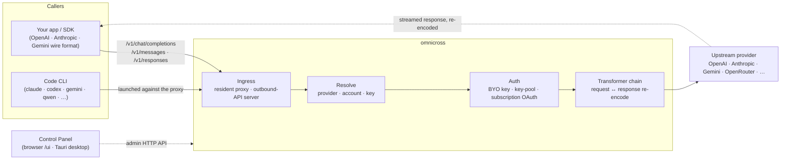

# omnicross

<div align="center">

[](https://opensource.org/licenses/MIT) [](https://nodejs.org/) [](https://www.typescriptlang.org/) [](https://www.npmjs.com/package/@omnicross/core)

**English** · [简体中文](docs/README.zh.md) · [繁體中文](docs/README.zh-Hant.md) · [日本語](docs/README.ja.md) · [한국어](docs/README.ko.md) · [Français](docs/README.fr.md) · [Deutsch](docs/README.de.md) · [Italiano](docs/README.it.md) · [Español (España)](docs/README.es-ES.md) · [Español (Latinoamérica)](docs/README.es-419.md) · [Português (Brasil)](docs/README.pt-BR.md) · [Português (Portugal)](docs/README.pt-PT.md) · [Nederlands](docs/README.nl.md) · [Dansk](docs/README.da.md) · [Svenska](docs/README.sv.md) · [Norsk bokmål](docs/README.nb.md) · [Suomi](docs/README.fi.md) · [Polski](docs/README.pl.md) · [Čeština](docs/README.cs.md) · [Magyar](docs/README.hu.md) · [Română](docs/README.ro.md) · [Български](docs/README.bg.md) · [Русский](docs/README.ru.md) · [Українська](docs/README.uk.md) · [Ελληνικά](docs/README.el.md) · [Türkçe](docs/README.tr.md) · [العربية](docs/README.ar.md) · [ไทย](docs/README.th.md) · [Tiếng Việt](docs/README.vi.md) · [Bahasa Indonesia](docs/README.id.md) · [Bahasa Melayu](docs/README.ms.md)

**A universal LLM serving core — route, transform, and proxy any provider behind one set of APIs.**

</div>

---

**omnicross powers every AI app and coding CLI from one place — with your existing subscriptions or API keys.**

Point Claude Code, Codex, Gemini CLI — or any app that speaks the OpenAI / Anthropic / Gemini API — at omnicross, and it routes each request to the provider and model you pick. What you can do:

- run on a **Claude / ChatGPT / Gemini subscription login**, skipping metered API keys;
- pool many API keys with automatic rotation and failover;
- let a tool that speaks only one API format call a model that speaks another — omnicross translates the request and response on the fly.

All of it managed in a desktop GUI — no hand-editing config files.

It ships in a few forms:

- **🖥️ As a desktop app** — a native Tauri v2 window (`apps/desktop`) that presents the full Control Panel GUI and bundles & manages the daemon for you (tray, autostart, daemon lifecycle). **The main way most people use omnicross** — no terminal, no npm, no CORS setup.
- **🌐 In your browser** — prefer not to install a native app? `omnicross ui` starts the daemon and opens the same GUI in your browser (served by the daemon itself at `/ui` — same origin, no extra setup) for managing providers, keys, accounts, and Code-CLI launches.
- **🚀 As a headless daemon** — the `omnicross` CLI/daemon: a bare-Node process with a local HTTP API, an admin dashboard, and commands for keys, providers, OAuth login, and launching Code CLIs. Perfect for servers and terminal-first workflows; it's also what powers the desktop app and the in-browser Control Panel.
- **📦 As a library** — `npm install @omnicross/core` and embed the serving core directly inside any Node project.

The serving core itself is pure Node — no Electron, no framework lock-in; the UI is a plain web app, and the desktop shell is a thin Tauri layer over it.

## 🏗️ Architecture

An inbound request enters through an **ingress** (the resident in-process proxy, or the standalone outbound-API server), gets resolved to a **provider + identity**, is converted by the **transformer chain**, and is proxied **upstream** — then the response streams back through the same chain, re-encoded into the caller's wire format.



| Building block | Where |
| --- | --- |
| Control Panel frontend (Vite + React) | `@omnicross/ui` (`packages/ui` — publishes its built `dist/`) |
| Desktop shell (Tauri v2) | `apps/desktop` |
| Standalone runtime (HTTP API · dashboard · CLI · serves the UI at `/ui`) | `@omnicross/daemon` |
| Ingress · dispatch · transformer · proxy | `@omnicross/core` |
| Subscription OAuth + auth strategies | `@omnicross/subscriptions` |
| Shared contract types + provider presets | `@omnicross/contracts` |
| Code-CLI launching (proxy-env + supervisor) | `@omnicross/cli-launcher` |

## ✨ Features

- **Control Panel GUI** — a React UI over the daemon's localhost admin API: manage providers, keys, and subscription accounts visually instead of by config file. Ships as a native Tauri v2 desktop app (the everyday way in — tray, autostart, bundled daemon, no Electron), or served in your browser with one command (`omnicross ui`).
- **Any-to-any wire format** — accept OpenAI / Anthropic / Gemini-shaped requests and target a provider that speaks a *different* format; the transformer pipeline converts both the request and the streamed response.
- **BYO keys + multi-key pools** — bind your own provider keys, or pool many keys per provider with weighted round-robin and automatic failover on `429 / 529 / 401 / 403`.
- **Subscription as a provider** — drive requests through a Claude / ChatGPT (Codex) / Gemini subscription via OAuth, or an OpenCodeGo bearer key, instead of a metered API key.
- **Provider presets** — a curated catalog of provider endpoints/templates (OpenAI, Anthropic, Gemini, DeepSeek, OpenRouter, Groq, Mistral, and many more) you can map to a config row in one command.
- **Streaming-native proxy** — a resident in-process proxy relays SSE streams verbatim where formats match, and re-encodes them where they don't.
- **Code CLI launcher** — start `claude` / `codex` / `gemini` / `qwen` / `copilot` / `opencode` against a local proxy so a CLI session can run on **any** provider or subscription you've configured.
- **Host-agnostic & typed** — pure Node + TypeScript, dependency-light contract types published separately, zero coupling to any host app.

## 📦 Layout

This is a single-workspace monorepo: publishable packages in `packages/`, runnable apps in `apps/`. The npm package names keep the `@omnicross/` scope; the directory names drop the `omnicross-` prefix.

| App | What it is |
| --- | --- |
| `apps/desktop` | **omnicross-desktop** — the native Tauri v2 desktop app: wraps the `@omnicross/ui` frontend as a native window and bundles & manages the daemon (tray, autostart, daemon lifecycle). See [`apps/desktop/README.md`](apps/desktop/README.md). |

The published packages:

| Package | npm | What it is |
| --- | --- | --- |
| `packages/contracts` | [`@omnicross/contracts`](https://www.npmjs.com/package/@omnicross/contracts) | Dependency-light contract types + runtime-value helpers (LLM config, completion/chat types, provider presets, thinking config, usage, subscription/account-token types). Consumed via subpaths (`@omnicross/contracts/llm-config`, `/provider-presets`, …). |
| `packages/core` | [`@omnicross/core`](https://www.npmjs.com/package/@omnicross/core) | The serving core — provider dispatch, completion pipeline, transformers, the provider proxy, and the outbound API surface. |
| `packages/subscriptions` | [`@omnicross/subscriptions`](https://www.npmjs.com/package/@omnicross/subscriptions) | Subscription-as-provider auth strategies, OAuth flows (Claude / Codex / Gemini), and the OpenCodeGo scenario dispatcher. |
| `packages/cli-launcher` | [`@omnicross/cli-launcher`](https://www.npmjs.com/package/@omnicross/cli-launcher) | The `ProcessSupervisor` subprocess-lifecycle mechanism + per-CLI proxy-env launch-config builders. |
| `packages/daemon` | [`@omnicross/daemon`](https://www.npmjs.com/package/@omnicross/daemon) | A bare-Node embedder of `@omnicross/core` with an admin HTTP API + dashboard, the `omnicross` CLI, and same-origin serving of the Control Panel at `/ui`. |
| `packages/ui` | [`@omnicross/ui`](https://www.npmjs.com/package/@omnicross/ui) | The Control Panel frontend (Vite + React). Publishes only its built `dist/` (static assets, zero runtime deps); the daemon serves it at `/ui`, the Tauri shell wraps it. |

## 🚀 Quick start

### Option A — Desktop app (recommended for most users)

Download the installer for your OS from the [latest release](https://github.com/Dumoedss/omnicross/releases/latest) and run it:

- **Windows** — `*-setup.exe` (NSIS) or `*.msi`
- **macOS** — `*.dmg` (universal — Apple Silicon + Intel)
- **Linux** — `*.AppImage`, `*.deb`, or `*.rpm`

The app bundles and manages everything for you — the daemon **and** a private Node runtime — so there's nothing else to install. Just download, run the installer, and open it.

> Want to build it yourself instead? See [`apps/desktop/README.md`](apps/desktop/README.md) (`npm run build:app`, requires Rust).

### Option B — Control Panel in your browser

Prefer not to install an app? One command — the daemon serves the same UI itself (same origin as its admin API — no CORS, no `.env`):

```bash
npm install -g @omnicross/daemon
omnicross ui --config ./omnicross.config.json   # boots the daemon + opens http://127.0.0.1:8766/ui/
```

Add `--no-open` to skip the browser launch. Frontend dev workflows live in [`packages/ui/README.md`](packages/ui/README.md).

### Option C — headless daemon

Everything the app does — and more — is available from the terminal:

```bash
npm install -g @omnicross/daemon
```

```bash
# Boot the daemon (BYO-key serving) against a config file
omnicross start --config ./omnicross.config.json

# Map a curated provider preset + your key into the config
omnicross providers presets --config ./omnicross.config.json
omnicross providers add openai --key $OPENAI_API_KEY --config ./omnicross.config.json

# Mint a local API key for your clients (shown once)
omnicross keys add my-app --config ./omnicross.config.json

# Log in to a subscription via browser OAuth (claude | codex | gemini)
omnicross login claude --config ./omnicross.config.json

# Launch a Code CLI against the in-process proxy on any configured provider
omnicross launch claude --provider openai --model gpt-4o --config ./omnicross.config.json
```

Run `omnicross --help` for the full command list.

### Option D — as a library

```bash
npm install @omnicross/core @omnicross/contracts
```

```ts
import type { LLMProvider } from '@omnicross/contracts/llm-config';
// import the serving-core pieces you need from @omnicross/core

// Wire the serving core into your own Node app: supply a provider-config
// source + key store, then route inbound requests through the proxy.
```

> Subpath imports keep the dependency graph tight, e.g.
> `@omnicross/contracts/provider-presets`, `@omnicross/core/provider-proxy`.

## 🛠️ Develop

```bash
git clone https://github.com/Dumoedss/omnicross.git
cd omnicross
npm install          # workspace symlinks for @omnicross/* + external deps
npm run typecheck    # tsc --noEmit per package
npm test             # vitest (tests run against src via aliases)
npm run build        # tsup per package → dist/ (ESM + CJS + .d.ts)
```

Tests and typechecks resolve `@omnicross/*` imports to package **source** via aliases, so no prior build is needed. `npm run build` emits each package's `dist/` for publishing.

For Control Panel development, `npm run dev` (repo root) is the one-command loop: it seeds a gitignored `omnicross.dev.config.json` on first run, starts the daemon on `127.0.0.1:8766`, and starts the UI's Vite dev server on `http://localhost:1430` (Ctrl+C stops both). The dev server proxies `/admin/*` to the daemon server-side, so the browser stays same-origin — the daemon sends no CORS headers by design. The frontend itself is the `@omnicross/ui` workspace package — `npm run build -w @omnicross/ui` refreshes the daemon-served `dist/`. For the native window (requires Rust): `npm run dev:app` runs `tauri dev`, and `npm run build:app` packages the release executable + installers with the daemon runtime **and a private Node binary** bundled in (output under `apps/desktop/src-tauri/target/release/`; target machines need nothing installed — details in [`apps/desktop/README.md`](apps/desktop/README.md)).

## 📄 License

[MIT](LICENSE) 

Portions of `@omnicross/core` and other packages adapt third-party work under their own licenses — see the `NOTICE` files in the respective packages.
