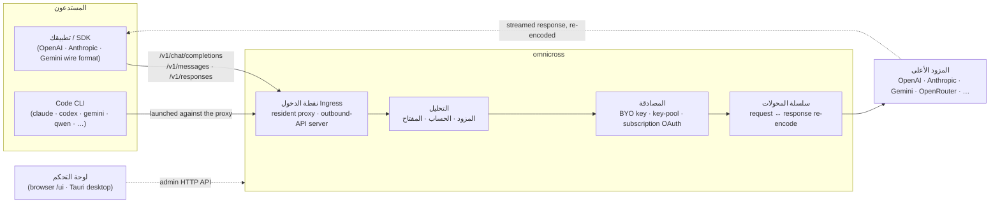

# omnicross

<div align="center">

[](https://opensource.org/licenses/MIT) [](https://nodejs.org/) [](https://www.typescriptlang.org/) [](https://www.npmjs.com/package/@omnicross/core)

[English](../README.md) · [简体中文](README.zh.md) · [繁體中文](README.zh-Hant.md) · [日本語](README.ja.md) · [한국어](README.ko.md) · [Français](README.fr.md) · [Deutsch](README.de.md) · [Italiano](README.it.md) · [Español (España)](README.es-ES.md) · [Español (Latinoamérica)](README.es-419.md) · [Português (Brasil)](README.pt-BR.md) · [Português (Portugal)](README.pt-PT.md) · [Nederlands](README.nl.md) · [Dansk](README.da.md) · [Svenska](README.sv.md) · [Norsk bokmål](README.nb.md) · [Suomi](README.fi.md) · [Polski](README.pl.md) · [Čeština](README.cs.md) · [Magyar](README.hu.md) · [Română](README.ro.md) · [Български](README.bg.md) · [Русский](README.ru.md) · [Українська](README.uk.md) · [Ελληνικά](README.el.md) · [Türkçe](README.tr.md) · **العربية** · [ไทย](README.th.md) · [Tiếng Việt](README.vi.md) · [Bahasa Indonesia](README.id.md) · [Bahasa Melayu](README.ms.md)

**نواة خدمة LLM عالمية — توجيه أي مزود وتحويله والتوسط له خلف مجموعة واحدة من واجهات برمجة التطبيقات.**

</div>

---

يستقبل `omnicross` طلب LLM الوارد — سواء كان OpenAI `/v1/chat/completions` أو Anthropic `/v1/messages` أو Gemini وغيرها — ويحدد **أي مزود وحساب ومفتاح** يجب أن يستجيب له (مفاتيح API الخاصة بك، أو تجمع متعدد المفاتيح، أو هوية OAuth للاشتراك)، ثم يمرره عبر مسار المحول + المصادقة، ويوكله إلى المزود الأعلى — مع إعادة ترميز الاستجابة إلى أي تنسيق سلكي طلبه المستدعي.

يأتي في عدة أشكال:

- **🖥️ كتطبيق سطح مكتب** — نافذة Tauri v2 أصلية (`apps/desktop`) تعرض واجهة لوحة التحكم الكاملة وتضم الخادم وتديره نيابةً عنك (صينية النظام، التشغيل التلقائي، دورة حياة الخادم). **الطريقة الرئيسية التي يستخدم بها معظم الناس omnicross** — لا طرفية، لا npm، لا إعداد CORS.
- **🌐 في المتصفح** — تفضل عدم تثبيت تطبيق أصلي؟ `omnicross ui` يشغّل الخادم ويفتح نفس واجهة المستخدم في متصفحك (يخدمها الخادم نفسه على `/ui` — نفس الأصل، لا إعداد إضافي) لإدارة المزودين والمفاتيح والحسابات وإطلاق Code CLIs.
- **🚀 كخادم بلا رأس** — واجهة سطر الأوامر/الخادم `omnicross`: عملية Node نقية مع واجهة HTTP API محلية ولوحة إدارة وأوامر للمفاتيح والمزودين وتسجيل الدخول عبر OAuth وإطلاق Code CLIs. مثالية للخوادم وسير العمل التي تعتمد على الطرفية؛ وهي أيضاً ما يشغّل تطبيق سطح المكتب ولوحة التحكم في المتصفح.
- **📦 كمكتبة** — `npm install @omnicross/core` وضمّن نواة الخدمة مباشرةً داخل أي مشروع Node.

نواة الخدمة نفسها هي Node نقية — لا Electron، لا ارتباط بأي إطار عمل؛ وواجهة المستخدم تطبيق ويب عادي، وغلاف سطح المكتب طبقة Tauri رفيعة فوقها.

## 🏗️ البنية المعمارية

يدخل الطلب الوارد عبر **نقطة الدخول** (الوكيل الداخلي المقيم في العملية، أو خادم API الخارجي المستقل)، ويُحلَّل إلى **مزود + هوية**، ويُحوَّل بواسطة **سلسلة المحولات**، ثم يُوكَّل إلى **المزود الأعلى** — ثم تتدفق الاستجابة عبر نفس السلسلة، مُعاد ترميزها إلى تنسيق المستدعي السلكي.



| اللبنة الأساسية | الموقع |
| --- | --- |
| واجهة لوحة التحكم الأمامية (Vite + React) | `@omnicross/ui` (`packages/ui` — تنشر `dist/` المبنية فقط) |
| غلاف سطح المكتب (Tauri v2) | `apps/desktop` |
| وقت التشغيل المستقل (HTTP API · لوحة التحكم · CLI · يخدم واجهة المستخدم على `/ui`) | `@omnicross/daemon` |
| نقطة الدخول · التوزيع · المحول · الوكيل | `@omnicross/core` |
| OAuth للاشتراكات + استراتيجيات المصادقة | `@omnicross/subscriptions` |
| أنواع العقود المشتركة + إعدادات المزودين المسبقة | `@omnicross/contracts` |
| إطلاق Code CLI (proxy-env + المشرف) | `@omnicross/cli-launcher` |

## ✨ الميزات

- **واجهة لوحة التحكم GUI** — واجهة React فوق واجهة API الإدارة المحلية للخادم: إدارة المزودين والمفاتيح وحسابات الاشتراك بصرياً بدلاً من ملفات التكوين. تأتي كتطبيق سطح مكتب أصلي Tauri v2 (الطريقة اليومية — صينية النظام، التشغيل التلقائي، الخادم المدمج، لا Electron)، أو تُستخدم في المتصفح بأمر واحد (`omnicross ui`).
- **تحويل أي تنسيق إلى أي تنسيق** — استقبال الطلبات بصيغة OpenAI / Anthropic / Gemini واستهداف مزود يتحدث تنسيقاً *مختلفاً*؛ يحول مسار المحولات كلاً من الطلب والاستجابة المتدفقة.
- **مفاتيحك الخاصة + تجمعات متعددة المفاتيح** — اربط مفاتيح المزود الخاصة بك، أو جمّع مفاتيح كثيرة لكل مزود مع توزيع دوري مرجح وتجاوز تلقائي للأخطاء عند `429 / 529 / 401 / 403`.
- **الاشتراك كمزود** — قم بتوجيه الطلبات عبر اشتراك Claude / ChatGPT (Codex) / Gemini عبر OAuth، أو مفتاح OpenCodeGo bearer، بدلاً من مفتاح API مدفوع بالاستخدام.
- **إعدادات المزودين المسبقة** — كتالوج منتقى من نقاط نهاية/قوالب المزودين (OpenAI، Anthropic، Gemini، DeepSeek، OpenRouter، Groq، Mistral، وغيرها الكثير) يمكنك تعيينها إلى صف تكوين بأمر واحد.
- **وكيل أصلي للبث** — يوكّل الوكيل الداخلي المقيم في العملية دفقات SSE حرفياً حيث تتطابق التنسيقات، ويعيد ترميزها حيث لا تتطابق.
- **مشغّل Code CLI** — ابدأ `claude` / `codex` / `gemini` / `qwen` / `copilot` / `opencode` مقابل وكيل محلي حتى تتمكن جلسة CLI من العمل على **أي** مزود أو اشتراك قمت بتكوينه.
- **مستقل عن المضيف ومكتوب بأنواع محددة** — Node نقية + TypeScript، أنواع العقود خفيفة الاعتماديات منشورة بشكل منفصل، لا ارتباط بأي تطبيق مضيف.

## 📦 التخطيط

هذا مستودع أحادي الفضاء: الحزم القابلة للنشر في `packages/`، والتطبيقات القابلة للتشغيل في `apps/`. تحتفظ أسماء حزم npm بنطاق `@omnicross/`؛ وأسماء المجلدات تسقط البادئة `omnicross-`.

| التطبيق | ما هو |
| --- | --- |
| `apps/desktop` | **omnicross-desktop** — تطبيق سطح المكتب الأصلي Tauri v2: يغلّف واجهة `@omnicross/ui` الأمامية كنافذة أصلية ويضم الخادم ويديره (صينية النظام، التشغيل التلقائي، دورة حياة الخادم). انظر [`apps/desktop/README.md`](../apps/desktop/README.md). |

الحزم المنشورة:

| الحزمة | npm | ما هي |
| --- | --- | --- |
| `packages/contracts` | [`@omnicross/contracts`](https://www.npmjs.com/package/@omnicross/contracts) | أنواع عقود خفيفة الاعتماديات + مساعدات قيم وقت التشغيل (تكوين LLM، أنواع completion/chat، إعدادات المزودين المسبقة، تكوين التفكير، الاستخدام، أنواع رموز الاشتراك/الحساب). تُستهلك عبر مسارات فرعية (`@omnicross/contracts/llm-config`، `/provider-presets`، …). |
| `packages/core` | [`@omnicross/core`](https://www.npmjs.com/package/@omnicross/core) | نواة الخدمة — توزيع المزودين، مسار الإكمال، المحولات، وكيل المزود، وسطح API الخارجي. |
| `packages/subscriptions` | [`@omnicross/subscriptions`](https://www.npmjs.com/package/@omnicross/subscriptions) | استراتيجيات مصادقة الاشتراك كمزود، تدفقات OAuth (Claude / Codex / Gemini)، وموزع سيناريو OpenCodeGo. |
| `packages/cli-launcher` | [`@omnicross/cli-launcher`](https://www.npmjs.com/package/@omnicross/cli-launcher) | آلية دورة حياة العملية الفرعية `ProcessSupervisor` + منشئو تكوين إطلاق proxy-env لكل CLI. |
| `packages/daemon` | [`@omnicross/daemon`](https://www.npmjs.com/package/@omnicross/daemon) | مضيف Node نقي لـ `@omnicross/core` مع HTTP API إدارية + لوحة تحكم، واجهة سطر الأوامر `omnicross`، وتقديم لوحة التحكم بنفس الأصل على `/ui`. |
| `packages/ui` | [`@omnicross/ui`](https://www.npmjs.com/package/@omnicross/ui) | واجهة لوحة التحكم الأمامية (Vite + React). تنشر فقط `dist/` المبنية (أصول ثابتة، لا اعتماديات وقت تشغيل)؛ يخدمها الخادم على `/ui`، ويغلفها غلاف Tauri. |

## 🚀 البداية السريعة

### الخيار أ — تطبيق سطح المكتب (موصى به لمعظم المستخدمين)

قم بتنزيل المثبّت لنظام التشغيل الخاص بك من [أحدث إصدار](https://github.com/Dumoedss/omnicross/releases/latest) وقم بتشغيله:

- **Windows** — `*-setup.exe` (NSIS) أو `*.msi`
- **macOS** — `*.dmg` (عالمي — Apple Silicon + Intel)
- **Linux** — `*.AppImage` أو `*.deb` أو `*.rpm`

يضم التطبيق كل شيء ويديره نيابةً عنك — الخادم **ووقت تشغيل Node خاص** — لذا لا يوجد شيء آخر للتثبيت. فقط قم بالتنزيل، وتشغيل المثبّت، وفتحه.

> هل تريد بناءه بنفسك؟ انظر [`apps/desktop/README.md`](../apps/desktop/README.md) (`npm run build:app`، يتطلب Rust).

### الخيار ب — لوحة التحكم في متصفحك

تفضل عدم تثبيت تطبيق؟ أمر واحد — يخدم الخادم نفس واجهة المستخدم بنفسه (نفس أصل API الإدارة — لا CORS، لا `.env`):

```bash
npm install -g @omnicross/daemon
omnicross ui --config ./omnicross.config.json   # boots the daemon + opens http://127.0.0.1:8766/ui/
```

أضف `--no-open` لتخطي تشغيل المتصفح. سير عمل تطوير الواجهة الأمامية في [`packages/ui/README.md`](../packages/ui/README.md).

### الخيار ج — الخادم بلا رأس

كل ما يفعله التطبيق — والمزيد — متاح من الطرفية:

```bash
npm install -g @omnicross/daemon
```

```bash
# Boot the daemon (BYO-key serving) against a config file
omnicross start --config ./omnicross.config.json

# Map a curated provider preset + your key into the config
omnicross providers presets --config ./omnicross.config.json
omnicross providers add openai --key $OPENAI_API_KEY --config ./omnicross.config.json

# Mint a local API key for your clients (shown once)
omnicross keys add my-app --config ./omnicross.config.json

# Log in to a subscription via browser OAuth (claude | codex | gemini)
omnicross login claude --config ./omnicross.config.json

# Launch a Code CLI against the in-process proxy on any configured provider
omnicross launch claude --provider openai --model gpt-4o --config ./omnicross.config.json
```

شغّل `omnicross --help` للحصول على قائمة الأوامر الكاملة.

### الخيار د — كمكتبة

```bash
npm install @omnicross/core @omnicross/contracts
```

```ts
import type { LLMProvider } from '@omnicross/contracts/llm-config';
// import the serving-core pieces you need from @omnicross/core

// Wire the serving core into your own Node app: supply a provider-config
// source + key store, then route inbound requests through the proxy.
```

> تُبقي الاستيرادات الفرعية الاعتماديات محكمة، مثل
> `@omnicross/contracts/provider-presets`، `@omnicross/core/provider-proxy`.

## 🛠️ التطوير

```bash
git clone https://github.com/Dumoedss/omnicross.git
cd omnicross
npm install          # workspace symlinks for @omnicross/* + external deps
npm run typecheck    # tsc --noEmit per package
npm test             # vitest (tests run against src via aliases)
npm run build        # tsup per package → dist/ (ESM + CJS + .d.ts)
```

تُحلّل الاختبارات وفحوصات الأنواع استيرادات `@omnicross/*` إلى **المصدر** عبر الأسماء المستعارة، لذا لا حاجة لبناء مسبق. `npm run build` يُنتج `dist/` لكل حزمة للنشر.

لتطوير لوحة التحكم، `npm run dev` (جذر المستودع) هو الحلقة ذات الأمر الواحد: يُنشئ `omnicross.dev.config.json` مُضافاً إلى gitignore عند أول تشغيل، ويبدأ الخادم على `127.0.0.1:8766`، ويبدأ خادم Vite للتطوير الخاص بواجهة المستخدم على `http://localhost:1430` (Ctrl+C يوقفهما معاً). يوكّل خادم التطوير `/admin/*` إلى خادم الخادم من جانب الخادم، لذا يبقى المتصفح على نفس الأصل — لا يُرسل الخادم رؤوس CORS حسب التصميم. الواجهة الأمامية نفسها هي حزمة مساحة العمل `@omnicross/ui` — `npm run build -w @omnicross/ui` يُحدّث `dist/` التي يخدمها الخادم. للنافذة الأصلية (يتطلب Rust): `npm run dev:app` يشغّل `tauri dev`، و`npm run build:app` يُحزّم الملف التنفيذي للإصدار + المثبّتات مع وقت تشغيل الخادم **وملف Node ثنائي خاص** مدمجَين (الإخراج تحت `apps/desktop/src-tauri/target/release/`؛ الأجهزة الهدف لا تحتاج أي شيء مثبّت — التفاصيل في [`apps/desktop/README.md`](../apps/desktop/README.md)).

## 📄 الترخيص

[MIT](../LICENSE) 

تُكيّف أجزاء من `@omnicross/core` وحزم أخرى أعمالاً من طرف ثالث تحت تراخيصها الخاصة — انظر ملفات `NOTICE` في الحزم المعنية.
