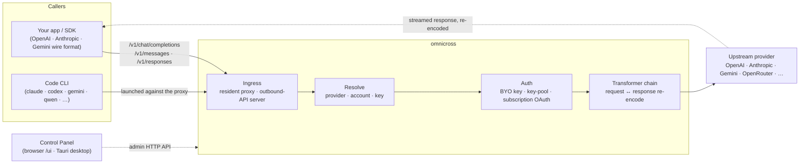

# omnicross

<div align="center">

[](https://opensource.org/licenses/MIT) [](https://nodejs.org/) [](https://www.typescriptlang.org/) [](https://www.npmjs.com/package/@omnicross/core)

[English](../README.md) · [简体中文](README.zh.md) · [繁體中文](README.zh-Hant.md) · [日本語](README.ja.md) · [한국어](README.ko.md) · [Français](README.fr.md) · [Deutsch](README.de.md) · [Italiano](README.it.md) · [Español (España)](README.es-ES.md) · [Español (Latinoamérica)](README.es-419.md) · [Português (Brasil)](README.pt-BR.md) · [Português (Portugal)](README.pt-PT.md) · [Nederlands](README.nl.md) · [Dansk](README.da.md) · [Svenska](README.sv.md) · [Norsk bokmål](README.nb.md) · [Suomi](README.fi.md) · [Polski](README.pl.md) · [Čeština](README.cs.md) · [Magyar](README.hu.md) · [Română](README.ro.md) · **Български** · [Русский](README.ru.md) · [Українська](README.uk.md) · [Ελληνικά](README.el.md) · [Türkçe](README.tr.md) · [العربية](README.ar.md) · [ไทย](README.th.md) · [Tiếng Việt](README.vi.md) · [Bahasa Indonesia](README.id.md) · [Bahasa Melayu](README.ms.md)

**Универсално ядро за LLM услуги — маршрутизирайте, трансформирайте и проксирайте всеки доставчик зад един набор от API-та.**

</div>

---

**omnicross захранва всяко AI приложение и кодиращ CLI от едно място — с вашите съществуващи абонаменти или API ключове.**

Насочете Claude Code, Codex, Gemini CLI — или всяко приложение, което говори OpenAI / Anthropic / Gemini API — към omnicross и то маршрутизира всяка заявка до доставчика и модела, който изберете. Какво можете да правите:

- стартирайте с **абонаментен вход за Claude / ChatGPT / Gemini**, като пропускате платени API ключове;
- обединявайте много API ключове с автоматично ротиране и превключване при отказ;
- нека инструмент, който говори само един API формат, извиква модел, говорещ друг — omnicross превежда заявката и отговора в реално време.

Всичко това управлявано чрез настолен GUI — без ръчно редактиране на конфигурационни файлове.

Предлага се в няколко форми:

- **🖥️ Като настолно приложение** — нативен прозорец Tauri v2 (`apps/desktop`), който представя пълния GUI на контролния панел и пакетира и управлява демона вместо вас (трей, автоматично стартиране, жизнен цикъл на демона). **Основният начин, по който повечето хора използват omnicross** — без терминал, без npm, без CORS настройка.
- **🌐 В браузъра ви** — предпочитате да не инсталирате нативно приложение? `omnicross ui` стартира демона и отваря същия GUI в браузъра ви (обслужван от самия демон на `/ui` — същ произход, без допълнителна настройка) за управление на доставчици, ключове, акаунти и стартиране на Code CLI.
- **🚀 Като headless демон** — `omnicross` CLI/демон: чист Node процес с локален HTTP API, административен панел и команди за ключове, доставчици, OAuth вход и стартиране на Code CLI. Идеален за сървъри и работни процеси, ориентирани към терминала; той също е двигателят зад настолното приложение и уеб-базирания Контролен панел.
- **📦 Като библиотека** — `npm install @omnicross/core` и вградете ядрото за обслужване директно в произволен Node проект.

Самото ядро за обслужване е чист Node — без Electron, без обвързване с фреймуърк; потребителският интерфейс е обикновено уеб приложение, а настолната обвивка е тънък слой Tauri върху него.

## 🏗️ Архитектура

Входящата заявка влиза през **ingress** (постоянният вграден прокси или самостоятелният изходящ API сървър), бива разрешена до **доставчик + идентичност**, преобразува се от **трансформаторната верига** и се проксира **нагоре** — след което отговорът се предава обратно по същата верига, повторно кодиран в клиентския формат.



| Компонент | Местоположение |
| --- | --- |
| Фронтенд на контролния панел (Vite + React) | `@omnicross/ui` (`packages/ui` — публикува само изградения `dist/`) |
| Настолна обвивка (Tauri v2) | `apps/desktop` |
| Самостоятелно изпълнение (HTTP API · панел · CLI · обслужва UI на `/ui`) | `@omnicross/daemon` |
| Ingress · диспечер · трансформатор · прокси | `@omnicross/core` |
| Абонаментен OAuth + стратегии за удостоверяване | `@omnicross/subscriptions` |
| Споделени типове на контракта + предварителни настройки на доставчика | `@omnicross/contracts` |
| Стартиране на Code CLI (proxy-env + супервайзор) | `@omnicross/cli-launcher` |

## ✨ Функции

- **GUI на Контролния панел** — React интерфейс над localhost admin API на демона: управлявайте доставчици, ключове и абонаментни акаунти визуално, вместо чрез конфигурационни файлове. Предлага се като нативно настолно приложение Tauri v2 (основният начин за ежедневна употреба — трей, автоматично стартиране, вграден демон, без Electron) или обслужван в браузъра с една команда (`omnicross ui`).
- **Преобразуване между произволни формати** — приема заявки с формат OpenAI / Anthropic / Gemini и ги насочва към доставчик, използващ *различен* формат; трансформаторният конвейер преобразува едновременно заявката и поточния отговор.
- **Собствени ключове + пулове от множество ключове** — свържете собствените си ключове за доставчик или обединете много ключове на доставчик с претеглено кръгово разпределение и автоматично превключване при `429 / 529 / 401 / 403`.
- **Абонамент като доставчик** — насочвайте заявки чрез абонамент за Claude / ChatGPT (Codex) / Gemini чрез OAuth или чрез OpenCodeGo bearer ключ, вместо да използвате платен API ключ.
- **Предварителни настройки на доставчика** — подбран каталог от крайни точки/шаблони на доставчика (OpenAI, Anthropic, Gemini, DeepSeek, OpenRouter, Groq, Mistral и много други), които можете да съпоставите с конфигурационен запис с една команда.
- **Нативен поточен прокси** — постоянният вграден прокси предава SSE потоци буквално там, където форматите съвпадат, и ги повторно кодира там, където не съвпадат.
- **Стартер на Code CLI** — стартирайте `claude` / `codex` / `gemini` / `qwen` / `copilot` / `opencode` срещу локален прокси, така че сесия на CLI може да работи на **произволен** конфигуриран от вас доставчик или абонамент.
- **Независимо от хоста и типизирано** — чист Node + TypeScript, леки типове на контракта публикувани отделно, нулева връзка с произволно хост приложение.

## 📦 Структура

Това е monorepo с единично работно пространство: публикуемите пакети са в `packages/`, а изпълнимите приложения са в `apps/`. Имената на npm пакетите запазват обхвата `@omnicross/`; имената на директориите премахват префикса `omnicross-`.

| Приложение | Описание |
| --- | --- |
| `apps/desktop` | **omnicross-desktop** — нативното настолно приложение Tauri v2: обвива фронтенда `@omnicross/ui` като нативен прозорец и пакетира и управлява демона (трей, автоматично стартиране, жизнен цикъл на демона). Вижте [`apps/desktop/README.md`](../apps/desktop/README.md). |

Публикуваните пакети:

| Пакет | npm | Описание |
| --- | --- | --- |
| `packages/contracts` | [`@omnicross/contracts`](https://www.npmjs.com/package/@omnicross/contracts) | Леки типове на контракта + помощни функции за стойности по време на изпълнение (LLM конфигурация, типове completion/chat, предварителни настройки на доставчика, конфигурация на thinking, използване, типове на абонаментен/акаунтен токен). Консумира се чрез подпътища (`@omnicross/contracts/llm-config`, `/provider-presets`, …). |
| `packages/core` | [`@omnicross/core`](https://www.npmjs.com/package/@omnicross/core) | Ядрото за обслужване — диспечер на доставчика, конвейер за completion, трансформатори, прокси на доставчика и изходящата API повърхност. |
| `packages/subscriptions` | [`@omnicross/subscriptions`](https://www.npmjs.com/package/@omnicross/subscriptions) | Стратегии за удостоверяване при абонамент-като-доставчик, OAuth потоци (Claude / Codex / Gemini) и диспечерът за сценарий OpenCodeGo. |
| `packages/cli-launcher` | [`@omnicross/cli-launcher`](https://www.npmjs.com/package/@omnicross/cli-launcher) | Механизмът `ProcessSupervisor` за жизнен цикъл на подпроцесите + конструктори на конфигурация за стартиране на proxy-env за всеки CLI. |
| `packages/daemon` | [`@omnicross/daemon`](https://www.npmjs.com/package/@omnicross/daemon) | Чист Node хост на `@omnicross/core` с admin HTTP API + панел, CLI `omnicross` и обслужване на Контролния панел на `/ui` от същ произход. |
| `packages/ui` | [`@omnicross/ui`](https://www.npmjs.com/package/@omnicross/ui) | Фронтендът на Контролния панел (Vite + React). Публикува само изградения `dist/` (статични ресурси, нулеви зависимости по време на изпълнение); демонът го обслужва на `/ui`, обвивката Tauri го обгражда. |

## 🚀 Бърз старт

### Вариант A — Настолно приложение (препоръчително за повечето потребители)

Изтеглете инсталатора за вашата ОС от [последното издание](https://github.com/Dumoedss/omnicross/releases/latest) и го стартирайте:

- **Windows** — `*-setup.exe` (NSIS) или `*.msi`
- **macOS** — `*.dmg` (универсален — Apple Silicon + Intel)
- **Linux** — `*.AppImage`, `*.deb` или `*.rpm`

Приложението пакетира и управлява всичко вместо вас — демона **и** частно Node изпълнение — така че не е необходимо да инсталирате нищо друго. Просто изтеглете, стартирайте инсталатора и го отворете.

> Искате сами да го изградите? Вижте [`apps/desktop/README.md`](../apps/desktop/README.md) (`npm run build:app`, изисква Rust).

### Вариант B — Контролен панел в браузъра

Предпочитате да не инсталирате приложение? Една команда — демонът сам обслужва същия UI (същ произход като неговия admin API — без CORS, без `.env`):

```bash
npm install -g @omnicross/daemon
omnicross ui --config ./omnicross.config.json   # boots the daemon + opens http://127.0.0.1:8766/ui/
```

Добавете `--no-open`, за да пропуснете стартирането на браузъра. Работните процеси за разработка на фронтенда са в [`packages/ui/README.md`](../packages/ui/README.md).

### Вариант C — headless демон

Всичко, което прави приложението — и повече — е достъпно от терминала:

```bash
npm install -g @omnicross/daemon
```

```bash
# Boot the daemon (BYO-key serving) against a config file
omnicross start --config ./omnicross.config.json

# Map a curated provider preset + your key into the config
omnicross providers presets --config ./omnicross.config.json
omnicross providers add openai --key $OPENAI_API_KEY --config ./omnicross.config.json

# Mint a local API key for your clients (shown once)
omnicross keys add my-app --config ./omnicross.config.json

# Log in to a subscription via browser OAuth (claude | codex | gemini)
omnicross login claude --config ./omnicross.config.json

# Launch a Code CLI against the in-process proxy on any configured provider
omnicross launch claude --provider openai --model gpt-4o --config ./omnicross.config.json
```

Изпълнете `omnicross --help` за пълния списък от команди.

### Вариант D — като библиотека

```bash
npm install @omnicross/core @omnicross/contracts
```

```ts
import type { LLMProvider } from '@omnicross/contracts/llm-config';
// import the serving-core pieces you need from @omnicross/core

// Wire the serving core into your own Node app: supply a provider-config
// source + key store, then route inbound requests through the proxy.
```

> Подпътищата за импортиране поддържат граф на зависимостите компактен, например
> `@omnicross/contracts/provider-presets`, `@omnicross/core/provider-proxy`.

## 🛠️ Разработка

```bash
git clone https://github.com/Dumoedss/omnicross.git
cd omnicross
npm install          # workspace symlinks for @omnicross/* + external deps
npm run typecheck    # tsc --noEmit per package
npm test             # vitest (tests run against src via aliases)
npm run build        # tsup per package → dist/ (ESM + CJS + .d.ts)
```

Тестовете и проверките на типовете разрешават импортите `@omnicross/*` към **изходния код** на пакета чрез псевдоними, така че не е необходима предварителна компилация. `npm run build` генерира `dist/` на всеки пакет за публикуване.

За разработка на Контролния панел, `npm run dev` (в корена на хранилището) е комбинираният цикъл с една команда: при първо стартиране генерира gitignored `omnicross.dev.config.json`, стартира демона на `127.0.0.1:8766` и стартира Vite dev сървъра на UI на `http://localhost:1430` (Ctrl+C спира и двата). Dev сървърът проксира `/admin/*` към демона от страна на сървъра, така че браузърът остава на същ произход — демонът по дизайн не изпраща CORS заглавия. Самият фронтенд е пакетът `@omnicross/ui` в работното пространство — `npm run build -w @omnicross/ui` опреснява обслужвания от демона `dist/`. За нативния прозорец (изисква Rust): `npm run dev:app` стартира `tauri dev`, а `npm run build:app` пакетира изпълнимия файл за издаване + инсталатори с **вграден daemon runtime и частен Node бинарен файл** (изход под `apps/desktop/src-tauri/target/release/`; целевите машини не се нуждаят от нищо инсталирано — подробности в [`apps/desktop/README.md`](../apps/desktop/README.md)).

## 📄 Лиценз

[MIT](../LICENSE) 

Части от `@omnicross/core` и други пакети адаптират работа на трети страни под техните собствени лицензи — вижте файловете `NOTICE` в съответните пакети.
