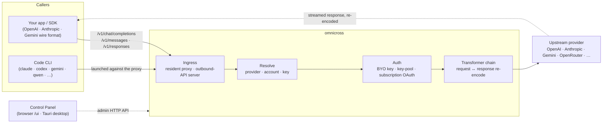

# omnicross

<div align="center">

[](https://opensource.org/licenses/MIT) [](https://nodejs.org/) [](https://www.typescriptlang.org/) [](https://www.npmjs.com/package/@omnicross/core)

[English](../README.md) · [简体中文](README.zh.md) · [繁體中文](README.zh-Hant.md) · [日本語](README.ja.md) · [한국어](README.ko.md) · [Français](README.fr.md) · [Deutsch](README.de.md) · [Italiano](README.it.md) · [Español (España)](README.es-ES.md) · [Español (Latinoamérica)](README.es-419.md) · [Português (Brasil)](README.pt-BR.md) · [Português (Portugal)](README.pt-PT.md) · [Nederlands](README.nl.md) · [Dansk](README.da.md) · [Svenska](README.sv.md) · [Norsk bokmål](README.nb.md) · [Suomi](README.fi.md) · [Polski](README.pl.md) · **Čeština** · [Magyar](README.hu.md) · [Română](README.ro.md) · [Български](README.bg.md) · [Русский](README.ru.md) · [Українська](README.uk.md) · [Ελληνικά](README.el.md) · [Türkçe](README.tr.md) · [العربية](README.ar.md) · [ไทย](README.th.md) · [Tiếng Việt](README.vi.md) · [Bahasa Indonesia](README.id.md) · [Bahasa Melayu](README.ms.md)

**Univerzální jádro pro obsluhu LLM — směrujte, transformujte a proxujte libovolného poskytovatele za jednou sadou API.**

</div>

---

`omnicross` přijme příchozí LLM požadavek — OpenAI `/v1/chat/completions`, Anthropic `/v1/messages`, Gemini a další — zjistí, **který poskytovatel, účet a klíč** by jej měl vyřídit (vaše vlastní API klíče, fond více klíčů nebo přihlašovací identita předplatného OAuth), provede jej transformačním a autentizačním kanálem a přesměruje ho na upstream — přičemž odpověď zpětně překóduje do drátového formátu, jaký volající požadoval.

Je dostupný v několika podobách:

- **🖥️ Jako desktopová aplikace** — nativní okno Tauri v2 (`apps/desktop`), které nabízí kompletní grafické uživatelské rozhraní Ovládacího panelu a za vás zabalí a spravuje démona (systémová lišta, automatické spouštění, životní cyklus démona). **Hlavní způsob, jakým většina lidí omnicross používá** — žádný terminál, žádný npm, žádné nastavování CORS.
- **🌐 V prohlížeči** — nechcete instalovat nativní aplikaci? `omnicross ui` spustí démona a otevře stejné grafické rozhraní ve vašem prohlížeči (obsluhováno samotným démonem na `/ui` — stejný origin, bez dalšího nastavování) pro správu poskytovatelů, klíčů, účtů a spouštění Code CLI.
- **🚀 Jako headless démon** — CLI/démon `omnicross`: čistý Node proces s lokálním HTTP API, administrátorským přehledem a příkazy pro klíče, poskytovatele, přihlášení OAuth a spouštění Code CLI. Ideální pro servery a pracovní postupy orientované na terminál; je to také to, co pohání desktopovou aplikaci a webový Ovládací panel.
- **📦 Jako knihovna** — `npm install @omnicross/core` a vložte jádro pro obsluhu přímo do jakéhokoli Node projektu.

Samotné jádro pro obsluhu je čistý Node — žádný Electron, žádné uzamčení na framework; uživatelské rozhraní je obyčejná webová aplikace a desktopový plášť je tenká vrstva Tauri nad ní.

## 🏗️ Architektura

Příchozí požadavek vstupuje přes **vstupní bod** (rezidentní proxy uvnitř procesu nebo samostatný server odchozího API), je přeložen na **poskytovatele + identitu**, převeden **transformačním řetězcem** a přesměrován **upstream** — poté odpověď proudí zpět stejným řetězcem a je překódována do drátového formátu volajícího.



| Stavební blok | Umístění |
| --- | --- |
| Frontend Ovládacího panelu (Vite + React) | `@omnicross/ui` (`packages/ui` — publikuje svůj sestavený `dist/`) |
| Desktopový plášť (Tauri v2) | `apps/desktop` |
| Samostatný runtime (HTTP API · přehled · CLI · obsluhuje UI na `/ui`) | `@omnicross/daemon` |
| Vstupní bod · dispatch · transformátor · proxy | `@omnicross/core` |
| Předplatné OAuth + autentizační strategie | `@omnicross/subscriptions` |
| Sdílené typy smluv + přednastavení poskytovatelů | `@omnicross/contracts` |
| Spouštění Code CLI (proxy-env + supervisor) | `@omnicross/cli-launcher` |

## ✨ Funkce

- **Grafické rozhraní Ovládacího panelu** — React UI nad lokálním admin API démona: spravujte poskytovatele, klíče a účty předplatného vizuálně místo úpravy konfiguračního souboru. Dodáván jako nativní desktopová aplikace Tauri v2 (každodenní způsob přístupu — systémová lišta, automatické spouštění, zabudovaný démon, bez Electronu) nebo obsluhován v prohlížeči jediným příkazem (`omnicross ui`).
- **Drátový formát libovolný na libovolný** — přijímejte požadavky ve formátu OpenAI / Anthropic / Gemini a cílejte na poskytovatele, který mluví *jiným* formátem; transformační kanál převede jak požadavek, tak streamovanou odpověď.
- **Vlastní klíče + fondy více klíčů** — svažte své vlastní klíče poskytovatele, nebo sdružte více klíčů na poskytovatele s váženým round-robinem a automatickým přepnutím při selhání na `429 / 529 / 401 / 403`.
- **Předplatné jako poskytovatel** — zpracovávejte požadavky prostřednictvím předplatného Claude / ChatGPT (Codex) / Gemini přes OAuth nebo bearer klíče OpenCodeGo, místo průběžně účtovaného API klíče.
- **Přednastavení poskytovatelů** — kurátorský katalog endpointů/šablon poskytovatelů (OpenAI, Anthropic, Gemini, DeepSeek, OpenRouter, Groq, Mistral a mnoho dalších), které lze jedním příkazem namapovat na řádek konfigurace.
- **Proxy nativně streamující** — rezidentní proxy uvnitř procesu přeposílá SSE streamy doslovně, pokud formáty odpovídají, a překóduje je, pokud neodpovídají.
- **Spouštěč Code CLI** — spusťte `claude` / `codex` / `gemini` / `qwen` / `copilot` / `opencode` proti lokální proxy, aby mohla relace CLI běžet na **libovolném** poskytovateli nebo předplatném, které jste nakonfigurovali.
- **Nezávislý na hostiteli a plně typovaný** — čistý Node + TypeScript, typy smluv nezávislé na závislostech publikovány samostatně, nulová vazba na jakoukoli hostitelskou aplikaci.

## 📦 Struktura

Toto je monorepo s jediným workspace: publikovatelné balíčky jsou v `packages/`, spustitelné aplikace v `apps/`. Názvy npm balíčků zachovávají obor `@omnicross/`; názvy adresářů vynechávají předponu `omnicross-`.

| Aplikace | Co to je |
| --- | --- |
| `apps/desktop` | **omnicross-desktop** — nativní desktopová aplikace Tauri v2: zabaluje frontend `@omnicross/ui` jako nativní okno a zabaluje a spravuje démona (systémová lišta, automatické spouštění, životní cyklus démona). Viz [`apps/desktop/README.md`](../apps/desktop/README.md). |

Publikované balíčky:

| Balíček | npm | Co to je |
| --- | --- | --- |
| `packages/contracts` | [`@omnicross/contracts`](https://www.npmjs.com/package/@omnicross/contracts) | Typy smluv nezávislé na závislostech + pomocníci pro runtime hodnoty (konfigurace LLM, typy completion/chat, přednastavení poskytovatelů, konfigurace thinking, využití, typy tokenů předplatného/účtu). Využíváno přes subcesty (`@omnicross/contracts/llm-config`, `/provider-presets`, …). |
| `packages/core` | [`@omnicross/core`](https://www.npmjs.com/package/@omnicross/core) | Jádro pro obsluhu — dispatch poskytovatelů, kanál completion, transformátory, proxy poskytovatele a odchozí API vrstva. |
| `packages/subscriptions` | [`@omnicross/subscriptions`](https://www.npmjs.com/package/@omnicross/subscriptions) | Autentizační strategie předplatného jako poskytovatele, OAuth toky (Claude / Codex / Gemini) a dispatcher scénáře OpenCodeGo. |
| `packages/cli-launcher` | [`@omnicross/cli-launcher`](https://www.npmjs.com/package/@omnicross/cli-launcher) | Mechanismus životního cyklu subprocesů `ProcessSupervisor` + buildery konfigurace spouštění proxy-env pro každé CLI. |
| `packages/daemon` | [`@omnicross/daemon`](https://www.npmjs.com/package/@omnicross/daemon) | Čistý Node embedder `@omnicross/core` s admin HTTP API + přehledem, CLI `omnicross` a obsluhou Ovládacího panelu na `/ui` ze stejného originu. |
| `packages/ui` | [`@omnicross/ui`](https://www.npmjs.com/package/@omnicross/ui) | Frontend Ovládacího panelu (Vite + React). Publikuje pouze svůj sestavený `dist/` (statické assety, nulové runtime závislosti); démon jej obsluhuje na `/ui`, Tauri plášť jej zabaluje. |

## 🚀 Rychlý start

### Možnost A — Desktopová aplikace (doporučeno pro většinu uživatelů)

Stáhněte instalátor pro váš operační systém z [nejnovějšího vydání](https://github.com/Dumoedss/omnicross/releases/latest) a spusťte jej:

- **Windows** — `*-setup.exe` (NSIS) nebo `*.msi`
- **macOS** — `*.dmg` (univerzální — Apple Silicon + Intel)
- **Linux** — `*.AppImage`, `*.deb` nebo `*.rpm`

Aplikace za vás zabalí a spravuje vše — démona **i** privátní Node runtime — takže není třeba nic dalšího instalovat. Stačí stáhnout, spustit instalátor a otevřít.

> Chcete to sestavit sami? Viz [`apps/desktop/README.md`](../apps/desktop/README.md) (`npm run build:app`, vyžaduje Rust).

### Možnost B — Ovládací panel v prohlížeči

Nechcete instalovat aplikaci? Jeden příkaz — démon obsluhuje stejné UI sám (stejný origin jako jeho admin API — bez CORS, bez `.env`):

```bash
npm install -g @omnicross/daemon
omnicross ui --config ./omnicross.config.json   # boots the daemon + opens http://127.0.0.1:8766/ui/
```

Přidejte `--no-open` pro přeskočení otevření prohlížeče. Pracovní postupy pro vývoj frontendu jsou v [`packages/ui/README.md`](../packages/ui/README.md).

### Možnost C — Headless démon

Vše, co aplikace dělá — a více — je dostupné z terminálu:

```bash
npm install -g @omnicross/daemon
```

```bash
# Boot the daemon (BYO-key serving) against a config file
omnicross start --config ./omnicross.config.json

# Map a curated provider preset + your key into the config
omnicross providers presets --config ./omnicross.config.json
omnicross providers add openai --key $OPENAI_API_KEY --config ./omnicross.config.json

# Mint a local API key for your clients (shown once)
omnicross keys add my-app --config ./omnicross.config.json

# Log in to a subscription via browser OAuth (claude | codex | gemini)
omnicross login claude --config ./omnicross.config.json

# Launch a Code CLI against the in-process proxy on any configured provider
omnicross launch claude --provider openai --model gpt-4o --config ./omnicross.config.json
```

Spusťte `omnicross --help` pro úplný seznam příkazů.

### Možnost D — Jako knihovna

```bash
npm install @omnicross/core @omnicross/contracts
```

```ts
import type { LLMProvider } from '@omnicross/contracts/llm-config';
// import the serving-core pieces you need from @omnicross/core

// Wire the serving core into your own Node app: supply a provider-config
// source + key store, then route inbound requests through the proxy.
```

> Importy subcest udržují graf závislostí úzký, např.
> `@omnicross/contracts/provider-presets`, `@omnicross/core/provider-proxy`.

## 🛠️ Vývoj

```bash
git clone https://github.com/Dumoedss/omnicross.git
cd omnicross
npm install          # workspace symlinks for @omnicross/* + external deps
npm run typecheck    # tsc --noEmit per package
npm test             # vitest (tests run against src via aliases)
npm run build        # tsup per package → dist/ (ESM + CJS + .d.ts)
```

Testy a typové kontroly překládají importy `@omnicross/*` na **zdrojový kód** balíčku přes aliasy, takže není třeba předchozího sestavení. `npm run build` vygeneruje `dist/` každého balíčku pro publikování.

Pro vývoj Ovládacího panelu je `npm run dev` (kořen repozitáře) jedním příkazem pro celou smyčku: při prvním spuštění vytvoří gitignorovaný `omnicross.dev.config.json`, spustí démona na `127.0.0.1:8766` a Vite dev server pro UI na `http://localhost:1430` (Ctrl+C zastaví obojí). Dev server na straně serveru proxuje `/admin/*` na démon, takže prohlížeč zůstává na stejném originu — démon záměrně neposílá CORS hlavičky. Samotný frontend je workspace balíček `@omnicross/ui` — `npm run build -w @omnicross/ui` obnoví `dist/` obsluhovaný démonem. Pro nativní okno (vyžaduje Rust): `npm run dev:app` spustí `tauri dev` a `npm run build:app` zabalí vydaný spustitelný soubor + instalátory s runtime démona **a privátním Node binárním souborem** uvnitř (výstup v `apps/desktop/src-tauri/target/release/`; cílové počítače nepotřebují nic nainstalovaného — podrobnosti v [`apps/desktop/README.md`](../apps/desktop/README.md)).

## 📄 Licence

[MIT](../LICENSE) 

Části `@omnicross/core` a dalších balíčků přizpůsobují práci třetích stran pod jejich vlastními licencemi — viz soubory `NOTICE` v příslušných balíčcích.
