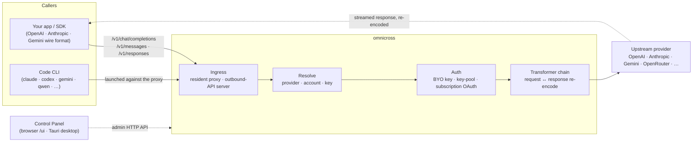

# omnicross

<div align="center">

[](https://opensource.org/licenses/MIT) [](https://nodejs.org/) [](https://www.typescriptlang.org/) [](https://www.npmjs.com/package/@omnicross/core)

[English](../README.md) · [简体中文](README.zh.md) · [繁體中文](README.zh-Hant.md) · [日本語](README.ja.md) · [한국어](README.ko.md) · [Français](README.fr.md) · [Deutsch](README.de.md) · [Italiano](README.it.md) · [Español (España)](README.es-ES.md) · [Español (Latinoamérica)](README.es-419.md) · [Português (Brasil)](README.pt-BR.md) · [Português (Portugal)](README.pt-PT.md) · [Nederlands](README.nl.md) · **Dansk** · [Svenska](README.sv.md) · [Norsk bokmål](README.nb.md) · [Suomi](README.fi.md) · [Polski](README.pl.md) · [Čeština](README.cs.md) · [Magyar](README.hu.md) · [Română](README.ro.md) · [Български](README.bg.md) · [Русский](README.ru.md) · [Українська](README.uk.md) · [Ελληνικά](README.el.md) · [Türkçe](README.tr.md) · [العربية](README.ar.md) · [ไทย](README.th.md) · [Tiếng Việt](README.vi.md) · [Bahasa Indonesia](README.id.md) · [Bahasa Melayu](README.ms.md)

**En universel LLM-serveringskerne — rut, transformer og proxy enhver udbyder bag ét sæt API'er.**

</div>

---

**omnicross driver alle dine AI-apps og kodnings-CLI'er fra ét sted — med dine eksisterende abonnementer eller API-nøgler.**

Peg Claude Code, Codex, Gemini CLI — eller enhver app, der taler OpenAI / Anthropic / Gemini API — mod omnicross, og den ruter hver anmodning til den udbyder og model, du vælger. Det kan du gøre:

- køre på et **Claude / ChatGPT / Gemini-abonnementslogin** og springe forbrugsbaserede API-nøgler over;
- samle mange API-nøgler i en nøglepulje med automatisk rotation og failover;
- lade et værktøj, der kun taler ét API-format, kalde en model, der taler et andet — omnicross oversætter anmodningen og svaret i realtid.

Alt sammen styret i en desktop-GUI — ingen manuel redigering af konfigurationsfiler.

Det leveres i flere former:

- **🖥️ Som en desktopapp** — et native Tauri v2-vindue (`apps/desktop`), der præsenterer den fulde Kontrolpanel-GUI og bundler og administrerer daemonen for dig (bakke, autostart, daemon-livscyklus). **Den vigtigste måde, de fleste bruger omnicross på** — ingen terminal, ingen npm, ingen CORS-opsætning.
- **🌐 I din browser** — foretrækker du ikke at installere en native app? `omnicross ui` starter daemonen og åbner den samme GUI i din browser (serveret af daemonen selv på `/ui` — samme oprindelse, ingen ekstra opsætning) til administration af udbydere, nøgler, konti og Code-CLI-lanceringer.
- **🚀 Som en headless daemon** — `omnicross`-CLI'en/daemonen: en ren Node-proces med en lokal HTTP-API, et administrationsdashboard og kommandoer til nøgler, udbydere, OAuth-login og lancering af Code CLI'er. Perfekt til servere og terminalbaserede workflows; det er også det, der driver desktopappen og det browserbaserede Kontrolpanel.
- **📦 Som et bibliotek** — `npm install @omnicross/core` og integrer serveringskernen direkte i ethvert Node-projekt.

Serveringskernen selv er ren Node — ingen Electron, ingen framework-binding; UI'et er en almindelig webapp, og desktopskallen er et tyndt Tauri-lag over den.

## 🏗️ Arkitektur

En indgående anmodning ankommer via en **ingress** (den resident in-process proxy eller den selvstændige outbound-API-server), løses til en **udbyder + identitet**, konverteres af **transformer-kæden** og proxyes **upstream** — derefter strømmer svaret tilbage igennem den samme kæde, re-enkoderet til kalderens trådformat.



| Byggeklods | Placering |
| --- | --- |
| Kontrolpanel-frontend (Vite + React) | `@omnicross/ui` (`packages/ui` — publicerer kun sin byggede `dist/`) |
| Desktopskal (Tauri v2) | `apps/desktop` |
| Selvstændig runtime (HTTP API · dashboard · CLI · serverer UI på `/ui`) | `@omnicross/daemon` |
| Ingress · dispatch · transformer · proxy | `@omnicross/core` |
| Abonnements-OAuth + auth-strategier | `@omnicross/subscriptions` |
| Delte kontrakttyper + udbyder-forudindstillinger | `@omnicross/contracts` |
| Code-CLI-lancering (proxy-env + supervisor) | `@omnicross/cli-launcher` |

## ✨ Funktioner

- **Kontrolpanel-GUI** — et React-UI over daemonens localhost-admin-API: administrer udbydere, nøgler og abonnementskonti visuelt i stedet for via konfigurationsfil. Leveres som en native Tauri v2-desktopapp (den daglige indgang — bakke, autostart, bundlet daemon, ingen Electron), eller serveret i din browser med én kommando (`omnicross ui`).
- **Vilkårligt-til-vilkårligt trådformat** — accepter OpenAI / Anthropic / Gemini-formede anmodninger og target en udbyder, der taler et *andet* format; transformer-pipelinen konverterer både anmodningen og det streamede svar.
- **BYO-nøgler + multi-nøgle-puljer** — bind dine egne udbydersnøgler, eller pulje mange nøgler per udbyder med vægtet round-robin og automatisk failover ved `429 / 529 / 401 / 403`.
- **Abonnement som udbyder** — drev anmodninger igennem et Claude / ChatGPT (Codex) / Gemini-abonnement via OAuth eller en OpenCodeGo bearer-nøgle i stedet for en forbrugsbaseret API-nøgle.
- **Udbyder-forudindstillinger** — et kurateret katalog over udbyder-endpoints/skabeloner (OpenAI, Anthropic, Gemini, DeepSeek, OpenRouter, Groq, Mistral og mange flere), som du kan kortlægge til en konfigurationsrække med én kommando.
- **Streaming-native proxy** — en resident in-process proxy videresender SSE-streams verbatim, hvor formaterne stemmer overens, og re-enkoder dem, hvor de ikke gør.
- **Code CLI-launcher** — start `claude` / `codex` / `gemini` / `qwen` / `copilot` / `opencode` mod en lokal proxy, så en CLI-session kan køre på **enhver** udbyder eller abonnement, du har konfigureret.
- **Host-agnostisk & typed** — ren Node + TypeScript, afhængighedslet kontrakttyper publiceret separat, nul kobling til enhver host-app.

## 📦 Layout

Dette er et single-workspace monorepo: publicerbare pakker i `packages/`, kørbare apps i `apps/`. npm-pakkenavnene bevarer `@omnicross/`-scopet; mappenavnene dropper `omnicross-`-præfikset.

| App | Hvad det er |
| --- | --- |
| `apps/desktop` | **omnicross-desktop** — den native Tauri v2-desktopapp: pakker `@omnicross/ui`-frontenden ind som et native vindue og bundler og administrerer daemonen (bakke, autostart, daemon-livscyklus). Se [`apps/desktop/README.md`](../apps/desktop/README.md). |

De publicerede pakker:

| Pakke | npm | Hvad det er |
| --- | --- | --- |
| `packages/contracts` | [`@omnicross/contracts`](https://www.npmjs.com/package/@omnicross/contracts) | Afhængighedslet kontrakttyper + runtime-værdishjælpere (LLM-konfiguration, completion/chat-typer, udbyder-forudindstillinger, thinking-konfiguration, forbrug, abonnements-/konto-token-typer). Forbrugt via subpaths (`@omnicross/contracts/llm-config`, `/provider-presets`, …). |
| `packages/core` | [`@omnicross/core`](https://www.npmjs.com/package/@omnicross/core) | Serveringskernen — udbyder-dispatch, completion-pipeline, transformere, udbyder-proxyen og den udgående API-overflade. |
| `packages/subscriptions` | [`@omnicross/subscriptions`](https://www.npmjs.com/package/@omnicross/subscriptions) | Abonnement-som-udbyder auth-strategier, OAuth-flows (Claude / Codex / Gemini) og OpenCodeGo-scenariedispatcheren. |
| `packages/cli-launcher` | [`@omnicross/cli-launcher`](https://www.npmjs.com/package/@omnicross/cli-launcher) | `ProcessSupervisor`-subprocesslivscyklus-mekanismen + per-CLI proxy-env launch-config-buildere. |
| `packages/daemon` | [`@omnicross/daemon`](https://www.npmjs.com/package/@omnicross/daemon) | En ren Node-indlejring af `@omnicross/core` med en admin-HTTP-API + dashboard, `omnicross`-CLI'en og same-origin-servering af Kontrolpanelet på `/ui`. |
| `packages/ui` | [`@omnicross/ui`](https://www.npmjs.com/package/@omnicross/ui) | Kontrolpanel-frontenden (Vite + React). Publicerer kun sin byggede `dist/` (statiske aktiver, nul runtime-afhængigheder); daemonen serverer den på `/ui`, Tauri-skallen pakker den ind. |

## 🚀 Hurtig start

### Mulighed A — Desktopapp (anbefalet til de fleste brugere)

Download installationsprogrammet til dit OS fra den [seneste udgivelse](https://github.com/Dumoedss/omnicross/releases/latest) og kør det:

- **Windows** — `*-setup.exe` (NSIS) eller `*.msi`
- **macOS** — `*.dmg` (universelt — Apple Silicon + Intel)
- **Linux** — `*.AppImage`, `*.deb` eller `*.rpm`

Appen bundler og administrerer alt for dig — daemonen **og** en privat Node-runtime — så der er intet andet at installere. Download bare, kør installationsprogrammet og åbn det.

> Vil du bygge det selv i stedet? Se [`apps/desktop/README.md`](../apps/desktop/README.md) (`npm run build:app`, kræver Rust).

### Mulighed B — Kontrolpanel i din browser

Foretrækker du ikke at installere en app? Én kommando — daemonen serverer den samme UI selv (samme oprindelse som dens admin-API — ingen CORS, ingen `.env`):

```bash
npm install -g @omnicross/daemon
omnicross ui --config ./omnicross.config.json   # boots the daemon + opens http://127.0.0.1:8766/ui/
```

Tilføj `--no-open` for at springe browser-lanceringen over. Frontend-dev-workflows lever i [`packages/ui/README.md`](../packages/ui/README.md).

### Mulighed C — headless daemon

Alt, hvad appen gør — og mere — er tilgængeligt fra terminalen:

```bash
npm install -g @omnicross/daemon
```

```bash
# Boot the daemon (BYO-key serving) against a config file
omnicross start --config ./omnicross.config.json

# Map a curated provider preset + your key into the config
omnicross providers presets --config ./omnicross.config.json
omnicross providers add openai --key $OPENAI_API_KEY --config ./omnicross.config.json

# Mint a local API key for your clients (shown once)
omnicross keys add my-app --config ./omnicross.config.json

# Log in to a subscription via browser OAuth (claude | codex | gemini)
omnicross login claude --config ./omnicross.config.json

# Launch a Code CLI against the in-process proxy on any configured provider
omnicross launch claude --provider openai --model gpt-4o --config ./omnicross.config.json
```

Kør `omnicross --help` for den fulde kommandoliste.

### Mulighed D — som et bibliotek

```bash
npm install @omnicross/core @omnicross/contracts
```

```ts
import type { LLMProvider } from '@omnicross/contracts/llm-config';
// import the serving-core pieces you need from @omnicross/core

// Wire the serving core into your own Node app: supply a provider-config
// source + key store, then route inbound requests through the proxy.
```

> Subpath-imports holder afhængighedsgrafen stram, f.eks.
> `@omnicross/contracts/provider-presets`, `@omnicross/core/provider-proxy`.

## 🛠️ Udvikling

```bash
git clone https://github.com/Dumoedss/omnicross.git
cd omnicross
npm install          # workspace symlinks for @omnicross/* + external deps
npm run typecheck    # tsc --noEmit per package
npm test             # vitest (tests run against src via aliases)
npm run build        # tsup per package → dist/ (ESM + CJS + .d.ts)
```

Tests og typetjek løser `@omnicross/*`-imports til pakke-**kildekoden** via aliases, så ingen forudgående bygning er nødvendig. `npm run build` udsender hver pakkes `dist/` til publicering.

Til Kontrolpanel-udvikling er `npm run dev` (repo-rod) én-kommando-loopet: det opretter en gitignoreret `omnicross.dev.config.json` ved første kørsel, starter daemonen på `127.0.0.1:8766` og starter UI'ets Vite dev-server på `http://localhost:1430` (Ctrl+C stopper begge). Dev-serveren proxyer `/admin/*` til daemon-server-siden, så browseren forbliver same-origin — daemonen sender ingen CORS-headere af design. Frontenden selv er `@omnicross/ui`-workspace-pakken — `npm run build -w @omnicross/ui` opdaterer daemon-serveret `dist/`. For det native vindue (kræver Rust): `npm run dev:app` kører `tauri dev`, og `npm run build:app` pakker den udgive eksekverbare fil + installatorer med daemon-runtime'en **og en privat Node-binær** bundlet ind (output under `apps/desktop/src-tauri/target/release/`; målmaskiner behøver intet installeret — detaljer i [`apps/desktop/README.md`](../apps/desktop/README.md)).

## 📄 Licens

[MIT](../LICENSE) 

Dele af `@omnicross/core` og andre pakker tilpasser tredjepartsarbejde under egne licenser — se `NOTICE`-filerne i de respektive pakker.
