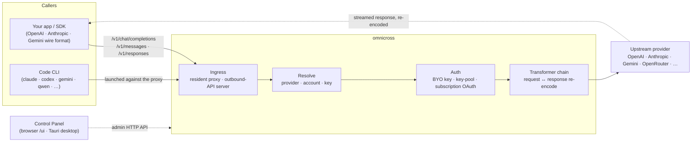

# omnicross

<div align="center">

[](https://opensource.org/licenses/MIT) [](https://nodejs.org/) [](https://www.typescriptlang.org/) [](https://www.npmjs.com/package/@omnicross/core)

[English](../README.md) · [简体中文](README.zh.md) · [繁體中文](README.zh-Hant.md) · [日本語](README.ja.md) · [한국어](README.ko.md) · [Français](README.fr.md) · **Deutsch** · [Italiano](README.it.md) · [Español (España)](README.es-ES.md) · [Español (Latinoamérica)](README.es-419.md) · [Português (Brasil)](README.pt-BR.md) · [Português (Portugal)](README.pt-PT.md) · [Nederlands](README.nl.md) · [Dansk](README.da.md) · [Svenska](README.sv.md) · [Norsk bokmål](README.nb.md) · [Suomi](README.fi.md) · [Polski](README.pl.md) · [Čeština](README.cs.md) · [Magyar](README.hu.md) · [Română](README.ro.md) · [Български](README.bg.md) · [Русский](README.ru.md) · [Українська](README.uk.md) · [Ελληνικά](README.el.md) · [Türkçe](README.tr.md) · [العربية](README.ar.md) · [ไทย](README.th.md) · [Tiếng Việt](README.vi.md) · [Bahasa Indonesia](README.id.md) · [Bahasa Melayu](README.ms.md)

**Ein universeller LLM-Serving-Kern — Anfragen routen, transformieren und proxyen für jeden Anbieter hinter einem einheitlichen API-Satz.**

</div>

---

**omnicross versorgt alle KI-Apps und Coding-CLIs von einem Ort aus — mit deinen bestehenden Abonnements oder API-Schlüsseln.**

Richte Claude Code, Codex, Gemini CLI — oder jede App, die die OpenAI / Anthropic / Gemini API spricht — auf omnicross aus, und es leitet jede Anfrage an den Anbieter und das Modell deiner Wahl weiter. Was du damit tun kannst:

- mit einem **Claude / ChatGPT / Gemini Abonnement-Login** betreiben, ohne mengenabhängige API-Schlüssel;
- viele API-Schlüssel zu einem Schlüssel-Pool zusammenfassen, mit automatischer Rotation und Failover;
- einem Tool, das nur ein API-Format spricht, ermöglichen, ein Modell mit einem anderen Format aufzurufen — omnicross übersetzt Anfrage und Antwort in Echtzeit.

All das wird in einer Desktop-GUI verwaltet — kein manuelles Bearbeiten von Konfigurationsdateien.

Es wird in verschiedenen Formen bereitgestellt:

- **🖥️ Als Desktop-App** — ein natives Tauri-v2-Fenster (`apps/desktop`), das die vollständige Control-Panel-GUI bereitstellt und den Daemon für Sie bündelt und verwaltet (Tray, Autostart, Daemon-Lebenszyklus). **Die hauptsächliche Art, wie die meisten Leute omnicross nutzen** — kein Terminal, kein npm, kein CORS-Setup.
- **🌐 Im Browser** — lieber keine native App installieren? `omnicross ui` startet den Daemon und öffnet dieselbe GUI im Browser (bereitgestellt vom Daemon selbst unter `/ui` — gleicher Ursprung, kein zusätzliches Setup) zur Verwaltung von Anbietern, Schlüsseln, Konten und Code-CLI-Starts.
- **🚀 Als Headless-Daemon** — die `omnicross`-CLI/Daemon: ein reiner Node-Prozess mit einer lokalen HTTP-API, einem Admin-Dashboard und Befehlen für Schlüssel, Anbieter, OAuth-Login und das Starten von Code-CLIs. Ideal für Server und terminalbezogene Workflows; er treibt auch die Desktop-App und das browserbasierte Control Panel an.
- **📦 Als Bibliothek** — `npm install @omnicross/core` und den Serving-Kern direkt in ein beliebiges Node-Projekt einbetten.

Der Serving-Kern selbst ist reines Node — kein Electron, kein Framework-Lock-in; die UI ist eine einfache Web-App, und die Desktop-Shell ist eine schlanke Tauri-Schicht darüber.

## 🏗️ Architektur

Eine eingehende Anfrage gelangt über einen **Ingress** (der resident in-process Proxy oder der eigenständige Outbound-API-Server), wird zu einem **Anbieter + Identität** aufgelöst, von der **Transformer-Kette** konvertiert und **upstream** geproxyt — dann strömt die Antwort durch dieselbe Kette zurück, neu kodiert im Wire-Format des Aufrufers.



| Baustein | Ort |
| --- | --- |
| Control-Panel-Frontend (Vite + React) | `@omnicross/ui` (`packages/ui` — veröffentlicht nur sein erstelltes `dist/`) |
| Desktop-Shell (Tauri v2) | `apps/desktop` |
| Eigenständige Runtime (HTTP API · Dashboard · CLI · stellt die UI unter `/ui` bereit) | `@omnicross/daemon` |
| Ingress · Dispatch · Transformer · Proxy | `@omnicross/core` |
| Abonnement-OAuth + Auth-Strategien | `@omnicross/subscriptions` |
| Gemeinsame Vertragstypen + Anbieter-Presets | `@omnicross/contracts` |
| Code-CLI-Start (proxy-env + Supervisor) | `@omnicross/cli-launcher` |

## ✨ Funktionen

- **Control-Panel-GUI** — eine React-UI über der localhost-Admin-API des Daemons: Anbieter, Schlüssel und Abonnementkonten visuell verwalten statt per Konfigurationsdatei. Wird als native Tauri-v2-Desktop-App geliefert (die alltägliche Einstiegsmöglichkeit — Tray, Autostart, gebündelter Daemon, kein Electron) oder mit einem einzigen Befehl im Browser bereitgestellt (`omnicross ui`).
- **Beliebiges Wire-Format** — nimmt Anfragen im OpenAI-/Anthropic-/Gemini-Format entgegen und richtet sie an einen Anbieter, der ein *anderes* Format spricht; die Transformer-Pipeline konvertiert sowohl die Anfrage als auch die gestreamte Antwort.
- **Eigene Schlüssel + Multi-Key-Pools** — eigene Anbieterschlüssel einbinden oder viele Schlüssel pro Anbieter zu einem Pool zusammenfassen mit gewichtetem Round-Robin und automatischem Failover bei `429 / 529 / 401 / 403`.
- **Abonnement als Anbieter** — Anfragen über ein Claude-/ChatGPT-(Codex)-/Gemini-Abonnement via OAuth oder einen OpenCodeGo-Bearer-Key steuern, anstatt einen mengenabhängigen API-Schlüssel zu verwenden.
- **Anbieter-Presets** — ein kuratierter Katalog von Anbieter-Endpunkten/-Vorlagen (OpenAI, Anthropic, Gemini, DeepSeek, OpenRouter, Groq, Mistral und viele mehr), die sich mit einem einzigen Befehl in eine Konfigurationszeile abbilden lassen.
- **Streaming-nativer Proxy** — ein resident in-process Proxy leitet SSE-Streams wortgetreu weiter, wenn die Formate übereinstimmen, und kodiert sie neu, wenn sie es nicht tun.
- **Code-CLI-Launcher** — `claude` / `codex` / `gemini` / `qwen` / `copilot` / `opencode` gegen einen lokalen Proxy starten, damit eine CLI-Sitzung auf **jedem** konfigurierten Anbieter oder Abonnement laufen kann.
- **Host-agnostisch & typisiert** — reines Node + TypeScript, abhängigkeitsarme Vertragstypen separat veröffentlicht, null Kopplung an eine Host-App.

## 📦 Struktur

Dies ist ein Single-Workspace-Monorepo: veröffentlichbare Pakete in `packages/`, ausführbare Apps in `apps/`. Die npm-Paketnamen behalten den Scope `@omnicross/`; die Verzeichnisnamen lassen das Präfix `omnicross-` weg.

| App | Was es ist |
| --- | --- |
| `apps/desktop` | **omnicross-desktop** — die native Tauri-v2-Desktop-App: umhüllt das `@omnicross/ui`-Frontend als natives Fenster und bündelt & verwaltet den Daemon (Tray, Autostart, Daemon-Lebenszyklus). Siehe [`apps/desktop/README.md`](../apps/desktop/README.md). |

Die veröffentlichten Pakete:

| Paket | npm | Was es ist |
| --- | --- | --- |
| `packages/contracts` | [`@omnicross/contracts`](https://www.npmjs.com/package/@omnicross/contracts) | Abhängigkeitsarme Vertragstypen + Laufzeitwert-Helfer (LLM-Konfiguration, Completion-/Chat-Typen, Anbieter-Presets, Thinking-Konfiguration, Nutzung, Abonnement-/Kontotoken-Typen). Wird über Unterpfade eingebunden (`@omnicross/contracts/llm-config`, `/provider-presets`, …). |
| `packages/core` | [`@omnicross/core`](https://www.npmjs.com/package/@omnicross/core) | Der Serving-Kern — Anbieter-Dispatch, Completion-Pipeline, Transformer, der Anbieter-Proxy und die Outbound-API-Oberfläche. |
| `packages/subscriptions` | [`@omnicross/subscriptions`](https://www.npmjs.com/package/@omnicross/subscriptions) | Abonnement-als-Anbieter-Auth-Strategien, OAuth-Flows (Claude / Codex / Gemini) und der OpenCodeGo-Szenario-Dispatcher. |
| `packages/cli-launcher` | [`@omnicross/cli-launcher`](https://www.npmjs.com/package/@omnicross/cli-launcher) | Der `ProcessSupervisor`-Subprozess-Lebenszyklus-Mechanismus + CLI-spezifische Proxy-Env-Launch-Config-Builder. |
| `packages/daemon` | [`@omnicross/daemon`](https://www.npmjs.com/package/@omnicross/daemon) | Ein reiner Node-Einbetter von `@omnicross/core` mit Admin-HTTP-API + Dashboard, der `omnicross`-CLI und der gleich-originären Bereitstellung des Control Panels unter `/ui`. |
| `packages/ui` | [`@omnicross/ui`](https://www.npmjs.com/package/@omnicross/ui) | Das Control-Panel-Frontend (Vite + React). Veröffentlicht nur sein erstelltes `dist/` (statische Assets, null Laufzeit-Abhängigkeiten); der Daemon stellt es unter `/ui` bereit, die Tauri-Shell umhüllt es. |

## 🚀 Schnellstart

### Option A — Desktop-App (für die meisten Benutzer empfohlen)

Laden Sie den Installer für Ihr Betriebssystem vom [neuesten Release](https://github.com/Dumoedss/omnicross/releases/latest) herunter und führen Sie ihn aus:

- **Windows** — `*-setup.exe` (NSIS) oder `*.msi`
- **macOS** — `*.dmg` (universell — Apple Silicon + Intel)
- **Linux** — `*.AppImage`, `*.deb` oder `*.rpm`

Die App bündelt und verwaltet alles für Sie — den Daemon **und** eine private Node-Runtime — sodass nichts weiter installiert werden muss. Einfach herunterladen, den Installer ausführen und öffnen.

> Möchten Sie es selbst bauen? Siehe [`apps/desktop/README.md`](../apps/desktop/README.md) (`npm run build:app`, erfordert Rust).

### Option B — Control Panel im Browser

Lieber keine App installieren? Ein einziger Befehl — der Daemon stellt dieselbe UI selbst bereit (gleicher Ursprung wie seine Admin-API — kein CORS, kein `.env`):

```bash
npm install -g @omnicross/daemon
omnicross ui --config ./omnicross.config.json   # boots the daemon + opens http://127.0.0.1:8766/ui/
```

Fügen Sie `--no-open` hinzu, um den Browser-Start zu überspringen. Frontend-Entwicklungsworkflows befinden sich in [`packages/ui/README.md`](../packages/ui/README.md).

### Option C — Headless-Daemon

Alles, was die App kann — und mehr — ist über das Terminal verfügbar:

```bash
npm install -g @omnicross/daemon
```

```bash
# Boot the daemon (BYO-key serving) against a config file
omnicross start --config ./omnicross.config.json

# Map a curated provider preset + your key into the config
omnicross providers presets --config ./omnicross.config.json
omnicross providers add openai --key $OPENAI_API_KEY --config ./omnicross.config.json

# Mint a local API key for your clients (shown once)
omnicross keys add my-app --config ./omnicross.config.json

# Log in to a subscription via browser OAuth (claude | codex | gemini)
omnicross login claude --config ./omnicross.config.json

# Launch a Code CLI against the in-process proxy on any configured provider
omnicross launch claude --provider openai --model gpt-4o --config ./omnicross.config.json
```

Führen Sie `omnicross --help` aus, um die vollständige Befehlsliste zu sehen.

### Option D — Als Bibliothek

```bash
npm install @omnicross/core @omnicross/contracts
```

```ts
import type { LLMProvider } from '@omnicross/contracts/llm-config';
// import the serving-core pieces you need from @omnicross/core

// Wire the serving core into your own Node app: supply a provider-config
// source + key store, then route inbound requests through the proxy.
```

> Unterpfad-Importe halten den Abhängigkeitsgraphen schlank, z. B.
> `@omnicross/contracts/provider-presets`, `@omnicross/core/provider-proxy`.

## 🛠️ Entwicklung

```bash
git clone https://github.com/Dumoedss/omnicross.git
cd omnicross
npm install          # workspace symlinks for @omnicross/* + external deps
npm run typecheck    # tsc --noEmit per package
npm test             # vitest (tests run against src via aliases)
npm run build        # tsup per package → dist/ (ESM + CJS + .d.ts)
```

Tests und Typchecks lösen `@omnicross/*`-Importe über Aliase zur **Quelle** des jeweiligen Pakets auf, sodass kein vorheriger Build erforderlich ist. `npm run build` erzeugt das `dist/` jedes Pakets zur Veröffentlichung.

Für die Control-Panel-Entwicklung ist `npm run dev` (Repository-Wurzel) die Ein-Befehl-Schleife: Beim ersten Ausführen wird eine gitignorierte `omnicross.dev.config.json` angelegt, dann werden der Daemon auf `127.0.0.1:8766` und der Vite-Dev-Server der UI auf `http://localhost:1430` gestartet (Strg+C stoppt beide). Der Dev-Server proxyt `/admin/*` serverseitig an den Daemon, sodass der Browser am gleichen Ursprung bleibt — der Daemon sendet by Design keine CORS-Header. Das Frontend selbst ist das `@omnicross/ui`-Workspace-Paket — `npm run build -w @omnicross/ui` aktualisiert das vom Daemon bereitgestellte `dist/`. Für das native Fenster (erfordert Rust): `npm run dev:app` führt `tauri dev` aus, und `npm run build:app` paketiert die Release-Executable + Installer mit der Daemon-Runtime **und einem privaten Node-Binary** gebündelt (Ausgabe unter `apps/desktop/src-tauri/target/release/`; Zielrechner müssen nichts installiert haben — Details in [`apps/desktop/README.md`](../apps/desktop/README.md)).

## 📄 Lizenz

[MIT](../LICENSE) 

Teile von `@omnicross/core` und anderen Paketen adaptieren Drittanbieter-Werke unter deren eigenen Lizenzen — siehe die `NOTICE`-Dateien in den jeweiligen Paketen.
