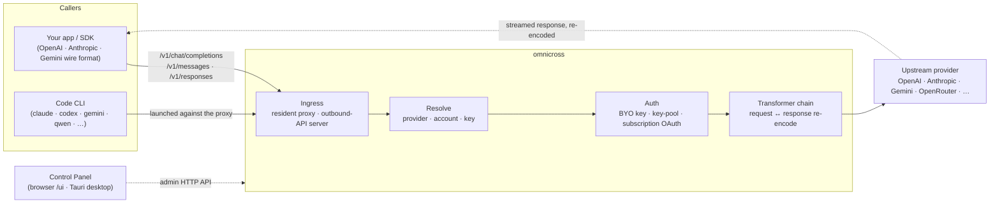

# omnicross

<div align="center">

[](https://opensource.org/licenses/MIT) [](https://nodejs.org/) [](https://www.typescriptlang.org/) [](https://www.npmjs.com/package/@omnicross/core)

[English](../README.md) · [简体中文](README.zh.md) · [繁體中文](README.zh-Hant.md) · [日本語](README.ja.md) · [한국어](README.ko.md) · [Français](README.fr.md) · [Deutsch](README.de.md) · [Italiano](README.it.md) · [Español (España)](README.es-ES.md) · [Español (Latinoamérica)](README.es-419.md) · [Português (Brasil)](README.pt-BR.md) · [Português (Portugal)](README.pt-PT.md) · [Nederlands](README.nl.md) · [Dansk](README.da.md) · [Svenska](README.sv.md) · [Norsk bokmål](README.nb.md) · [Suomi](README.fi.md) · [Polski](README.pl.md) · [Čeština](README.cs.md) · [Magyar](README.hu.md) · [Română](README.ro.md) · [Български](README.bg.md) · [Русский](README.ru.md) · [Українська](README.uk.md) · **Ελληνικά** · [Türkçe](README.tr.md) · [العربية](README.ar.md) · [ไทย](README.th.md) · [Tiếng Việt](README.vi.md) · [Bahasa Indonesia](README.id.md) · [Bahasa Melayu](README.ms.md)

**Ένας καθολικός πυρήνας εξυπηρέτησης LLM — δρομολογήστε, μετασχηματίστε και διαμεσολαβήστε οποιονδήποτε πάροχο πίσω από ένα ενιαίο σύνολο API.**

</div>

---

Το `omnicross` δέχεται ένα εισερχόμενο αίτημα LLM — OpenAI `/v1/chat/completions`, Anthropic `/v1/messages`, Gemini και άλλα — εντοπίζει **ποιος πάροχος, λογαριασμός και κλειδί** πρέπει να το απαντήσει (τα δικά σας API keys, μια ομάδα πολλαπλών κλειδιών ή μια ταυτότητα συνδρομής OAuth), το περνά από ένα pipeline μετασχηματιστή + πιστοποίησης και το διαβιβάζει ανάντη — επαναδιαμορφώνοντας την απόκριση στη μορφή που ζήτησε ο καλών.

Διατίθεται σε διάφορες μορφές:

- **🖥️ Ως εφαρμογή επιφάνειας εργασίας** — ένα εγγενές παράθυρο Tauri v2 (`apps/desktop`) που παρουσιάζει το πλήρες γραφικό περιβάλλον Πίνακα Ελέγχου και συμπεριλαμβάνει και διαχειρίζεται τον δαίμονα για εσάς (δίσκος συστήματος, αυτόματη εκκίνηση, κύκλος ζωής δαίμονα). **Ο κύριος τρόπος που οι περισσότεροι χρησιμοποιούν το omnicross** — χωρίς τερματικό, χωρίς npm, χωρίς ρύθμιση CORS.
- **🌐 Στον περιηγητή σας** — προτιμάτε να μην εγκαταστήσετε εγγενή εφαρμογή; Το `omnicross ui` εκκινεί τον δαίμονα και ανοίγει το ίδιο γραφικό περιβάλλον στον περιηγητή σας (που εξυπηρετείται από τον ίδιο τον δαίμονα στο `/ui` — ίδια προέλευση, χωρίς επιπλέον ρύθμιση) για διαχείριση παρόχων, κλειδιών, λογαριασμών και εκκίνησης Code CLI.
- **🚀 Ως headless δαίμονας** — το CLI/δαίμονας `omnicross`: μια καθαρή διεργασία Node με τοπικό HTTP API, πίνακα διαχείρισης και εντολές για κλειδιά, παρόχους, σύνδεση OAuth και εκκίνηση Code CLI. Ιδανικό για διακομιστές και ροές εργασίας με προτεραιότητα στο τερματικό· είναι επίσης αυτό που τροφοδοτεί την εφαρμογή επιφάνειας εργασίας και τον Πίνακα Ελέγχου στον περιηγητή.
- **📦 Ως βιβλιοθήκη** — `npm install @omnicross/core` και ενσωματώστε τον πυρήνα εξυπηρέτησης απευθείας σε οποιοδήποτε έργο Node.

Ο ίδιος ο πυρήνας εξυπηρέτησης είναι καθαρός Node — χωρίς Electron, χωρίς δέσμευση σε πλαίσιο· το UI είναι μια απλή διαδικτυακή εφαρμογή και το κέλυφος επιφάνειας εργασίας είναι ένα λεπτό επίπεδο Tauri πάνω του.

## 🏗️ Αρχιτεκτονική

Ένα εισερχόμενο αίτημα εισέρχεται μέσω μιας **είσοδος** (ο μόνιμος ενδο-διεργασιακός διαμεσολαβητής ή ο αυτόνομος διακομιστής εξερχόμενου API), επιλύεται σε έναν **πάροχο + ταυτότητα**, μετατρέπεται από την **αλυσίδα μετασχηματιστή** και διαβιβάζεται **ανάντη** — στη συνέχεια η απόκριση ρέει πίσω μέσω της ίδιας αλυσίδας, επαναδιαμορφωμένη στη μορφή μετάδοσης του καλούντος.



| Δομικό στοιχείο | Τοποθεσία |
| --- | --- |
| Frontend Πίνακα Ελέγχου (Vite + React) | `@omnicross/ui` (`packages/ui` — δημοσιεύει μόνο το δομημένο `dist/`) |
| Κέλυφος επιφάνειας εργασίας (Tauri v2) | `apps/desktop` |
| Αυτόνομο runtime (HTTP API · πίνακας · CLI · εξυπηρετεί το UI στο `/ui`) | `@omnicross/daemon` |
| Είσοδος · αποστολή · μετασχηματιστής · διαμεσολαβητής | `@omnicross/core` |
| Συνδρομή OAuth + στρατηγικές πιστοποίησης | `@omnicross/subscriptions` |
| Κοινόχρηστοι τύποι συμβολαίων + προεπιλογές παρόχου | `@omnicross/contracts` |
| Εκκίνηση Code CLI (proxy-env + επιτηρητής) | `@omnicross/cli-launcher` |

## ✨ Χαρακτηριστικά

- **Γραφικό περιβάλλον Πίνακα Ελέγχου** — ένα React UI πάνω από το τοπικό admin API του δαίμονα: διαχειριστείτε παρόχους, κλειδιά και λογαριασμούς συνδρομών οπτικά αντί για αρχείο ρυθμίσεων. Διατίθεται ως εγγενής εφαρμογή επιφάνειας εργασίας Tauri v2 (ο καθημερινός τρόπος εισόδου — δίσκος συστήματος, αυτόματη εκκίνηση, ενσωματωμένος δαίμονας, χωρίς Electron) ή εξυπηρετείται στον περιηγητή σας με μία εντολή (`omnicross ui`).
- **Μετατροπή μεταξύ οποιωνδήποτε μορφών μετάδοσης** — αποδεχτείτε αιτήματα σε μορφή OpenAI / Anthropic / Gemini και στοχεύστε έναν πάροχο που χρησιμοποιεί *διαφορετική* μορφή· το pipeline μετασχηματιστή μετατρέπει τόσο το αίτημα όσο και την απόκριση ροής.
- **BYO keys + ομάδες πολλαπλών κλειδιών** — συνδέστε τα δικά σας κλειδιά παρόχου ή ομαδοποιήστε πολλά κλειδιά ανά πάροχο με σταθμισμένο round-robin και αυτόματη μεταβολή σε `429 / 529 / 401 / 403`.
- **Συνδρομή ως πάροχος** — δρομολογήστε αιτήματα μέσω συνδρομής Claude / ChatGPT (Codex) / Gemini μέσω OAuth ή ενός bearer key OpenCodeGo, αντί για μετρημένο κλειδί API.
- **Προεπιλογές παρόχου** — ένας επιμελημένος κατάλογος τελικών σημείων/προτύπων παρόχου (OpenAI, Anthropic, Gemini, DeepSeek, OpenRouter, Groq, Mistral και πολλά άλλα) που μπορείτε να αντιστοιχίσετε σε μια γραμμή ρυθμίσεων με μία εντολή.
- **Εγγενής διαμεσολάβηση ροής** — ένας μόνιμος ενδο-διεργασιακός διαμεσολαβητής αναμεταδίδει ροές SSE αυτούσιες όπου οι μορφές ταιριάζουν, και τις επαναδιαμορφώνει όπου δεν ταιριάζουν.
- **Εκκινητής Code CLI** — εκκινήστε το `claude` / `codex` / `gemini` / `qwen` / `copilot` / `opencode` έναντι ενός τοπικού διαμεσολαβητή ώστε μια περίοδος CLI να μπορεί να εκτελεστεί σε **οποιονδήποτε** πάροχο ή συνδρομή έχετε ρυθμίσει.
- **Ανεξάρτητο από τον κεντρικό υπολογιστή & τυποποιημένο** — καθαρό Node + TypeScript, τύποι συμβολαίων ελαφριάς εξάρτησης δημοσιευμένοι χωριστά, μηδενική σύζευξη με οποιαδήποτε εφαρμογή κεντρικού υπολογιστή.

## 📦 Διάταξη

Αυτό είναι ένα μονο-workspace monorepo: δημοσιεύσιμα πακέτα στο `packages/`, εκτελέσιμες εφαρμογές στο `apps/`. Τα ονόματα πακέτων npm διατηρούν το scope `@omnicross/`· τα ονόματα καταλόγων αφαιρούν το πρόθεμα `omnicross-`.

| Εφαρμογή | Τι είναι |
| --- | --- |
| `apps/desktop` | **omnicross-desktop** — η εγγενής εφαρμογή επιφάνειας εργασίας Tauri v2: τυλίγει το frontend `@omnicross/ui` ως εγγενές παράθυρο και συμπεριλαμβάνει και διαχειρίζεται τον δαίμονα (δίσκος συστήματος, αυτόματη εκκίνηση, κύκλος ζωής δαίμονα). Δείτε [`apps/desktop/README.md`](../apps/desktop/README.md). |

Τα δημοσιευμένα πακέτα:

| Πακέτο | npm | Τι είναι |
| --- | --- | --- |
| `packages/contracts` | [`@omnicross/contracts`](https://www.npmjs.com/package/@omnicross/contracts) | Τύποι συμβολαίων ελαφριάς εξάρτησης + βοηθοί τιμών runtime (ρύθμιση LLM, τύποι completion/chat, προεπιλογές παρόχου, ρύθμιση thinking, χρήση, τύποι συνδρομής/token λογαριασμού). Καταναλώνεται μέσω υποδιαδρομών (`@omnicross/contracts/llm-config`, `/provider-presets`, …). |
| `packages/core` | [`@omnicross/core`](https://www.npmjs.com/package/@omnicross/core) | Ο πυρήνας εξυπηρέτησης — αποστολή παρόχου, pipeline completion, μετασχηματιστές, ο διαμεσολαβητής παρόχου και η εξερχόμενη επιφάνεια API. |
| `packages/subscriptions` | [`@omnicross/subscriptions`](https://www.npmjs.com/package/@omnicross/subscriptions) | Στρατηγικές πιστοποίησης συνδρομής-ως-παρόχου, ροές OAuth (Claude / Codex / Gemini) και ο αποστολέας σεναρίων OpenCodeGo. |
| `packages/cli-launcher` | [`@omnicross/cli-launcher`](https://www.npmjs.com/package/@omnicross/cli-launcher) | Ο μηχανισμός κύκλου ζωής υποδιεργασίας `ProcessSupervisor` + κατασκευαστές ρύθμισης εκκίνησης proxy-env ανά CLI. |
| `packages/daemon` | [`@omnicross/daemon`](https://www.npmjs.com/package/@omnicross/daemon) | Ένας καθαρός Node embedder του `@omnicross/core` με admin HTTP API + πίνακα, το CLI `omnicross` και εξυπηρέτηση ίδιας προέλευσης του Πίνακα Ελέγχου στο `/ui`. |
| `packages/ui` | [`@omnicross/ui`](https://www.npmjs.com/package/@omnicross/ui) | Το frontend Πίνακα Ελέγχου (Vite + React). Δημοσιεύει μόνο το δομημένο `dist/` (στατικά assets, μηδενικές εξαρτήσεις runtime)· ο δαίμονας το εξυπηρετεί στο `/ui`, το κέλυφος Tauri το τυλίγει. |

## 🚀 Γρήγορη εκκίνηση

### Επιλογή Α — Εφαρμογή επιφάνειας εργασίας (προτεινόμενη για τους περισσότερους χρήστες)

Κατεβάστε το πρόγραμμα εγκατάστασης για το λειτουργικό σύστημά σας από την [τελευταία έκδοση](https://github.com/Dumoedss/omnicross/releases/latest) και εκτελέστε το:

- **Windows** — `*-setup.exe` (NSIS) ή `*.msi`
- **macOS** — `*.dmg` (universal — Apple Silicon + Intel)
- **Linux** — `*.AppImage`, `*.deb` ή `*.rpm`

Η εφαρμογή συμπεριλαμβάνει και διαχειρίζεται τα πάντα για εσάς — τον δαίμονα **και** ένα ιδιωτικό runtime Node — οπότε δεν χρειάζεται να εγκαταστήσετε τίποτα άλλο. Απλώς κατεβάστε, εκτελέστε το πρόγραμμα εγκατάστασης και ανοίξτε το.

> Θέλετε να το δομήσετε μόνοι σας; Δείτε [`apps/desktop/README.md`](../apps/desktop/README.md) (`npm run build:app`, απαιτεί Rust).

### Επιλογή Β — Πίνακας Ελέγχου στον περιηγητή σας

Προτιμάτε να μην εγκαταστήσετε εφαρμογή; Μία εντολή — ο δαίμονας εξυπηρετεί ο ίδιος το ίδιο UI (ίδια προέλευση με το admin API — χωρίς CORS, χωρίς `.env`):

```bash
npm install -g @omnicross/daemon
omnicross ui --config ./omnicross.config.json   # boots the daemon + opens http://127.0.0.1:8766/ui/
```

Προσθέστε `--no-open` για να παραλείψετε την εκκίνηση του περιηγητή. Οι ροές εργασίας ανάπτυξης frontend βρίσκονται στο [`packages/ui/README.md`](../packages/ui/README.md).

### Επιλογή Γ — headless δαίμονας

Όλα όσα κάνει η εφαρμογή — και περισσότερα — είναι διαθέσιμα από το τερματικό:

```bash
npm install -g @omnicross/daemon
```

```bash
# Boot the daemon (BYO-key serving) against a config file
omnicross start --config ./omnicross.config.json

# Map a curated provider preset + your key into the config
omnicross providers presets --config ./omnicross.config.json
omnicross providers add openai --key $OPENAI_API_KEY --config ./omnicross.config.json

# Mint a local API key for your clients (shown once)
omnicross keys add my-app --config ./omnicross.config.json

# Log in to a subscription via browser OAuth (claude | codex | gemini)
omnicross login claude --config ./omnicross.config.json

# Launch a Code CLI against the in-process proxy on any configured provider
omnicross launch claude --provider openai --model gpt-4o --config ./omnicross.config.json
```

Εκτελέστε `omnicross --help` για την πλήρη λίστα εντολών.

### Επιλογή Δ — ως βιβλιοθήκη

```bash
npm install @omnicross/core @omnicross/contracts
```

```ts
import type { LLMProvider } from '@omnicross/contracts/llm-config';
// import the serving-core pieces you need from @omnicross/core

// Wire the serving core into your own Node app: supply a provider-config
// source + key store, then route inbound requests through the proxy.
```

> Οι υποδιαδρομικές εισαγωγές διατηρούν το γράφο εξαρτήσεων συνεκτικό, π.χ.
> `@omnicross/contracts/provider-presets`, `@omnicross/core/provider-proxy`.

## 🛠️ Ανάπτυξη

```bash
git clone https://github.com/Dumoedss/omnicross.git
cd omnicross
npm install          # workspace symlinks for @omnicross/* + external deps
npm run typecheck    # tsc --noEmit per package
npm test             # vitest (tests run against src via aliases)
npm run build        # tsup per package → dist/ (ESM + CJS + .d.ts)
```

Οι δοκιμές και οι έλεγχοι τύπων επιλύουν τις εισαγωγές `@omnicross/*` στον **πηγαίο κώδικα** του πακέτου μέσω ψευδωνύμων, οπότε δεν απαιτείται προηγούμενη δόμηση. Το `npm run build` εκπέμπει το `dist/` κάθε πακέτου για δημοσίευση.

Για ανάπτυξη του Πίνακα Ελέγχου, το `npm run dev` (ρίζα αποθετηρίου) είναι ο βρόχος με μία εντολή: δημιουργεί ένα gitignored `omnicross.dev.config.json` κατά την πρώτη εκτέλεση, εκκινεί τον δαίμονα στο `127.0.0.1:8766` και εκκινεί τον διακομιστή Vite dev του UI στο `http://localhost:1430` (Ctrl+C σταματά και τους δύο). Ο διακομιστής dev μεσολαβεί στο `/admin/*` προς τον διακομιστή δαίμονα από την πλευρά του διακομιστή, ώστε ο περιηγητής να παραμένει στην ίδια προέλευση — ο δαίμονας δεν στέλνει κεφαλίδες CORS κατά σχεδιασμό. Το ίδιο το frontend είναι το πακέτο workspace `@omnicross/ui` — το `npm run build -w @omnicross/ui` ανανεώνει το `dist/` που εξυπηρετείται από τον δαίμονα. Για το εγγενές παράθυρο (απαιτεί Rust): το `npm run dev:app` εκτελεί `tauri dev`, και το `npm run build:app` πακετάρει το εκτελέσιμο έκδοσης + τα προγράμματα εγκατάστασης με το runtime δαίμονα **και ένα ιδιωτικό δυαδικό Node** ενσωματωμένα (έξοδος κάτω από `apps/desktop/src-tauri/target/release/`· τα μηχανήματα-στόχοι δεν χρειάζονται τίποτα εγκατεστημένο — λεπτομέρειες στο [`apps/desktop/README.md`](../apps/desktop/README.md)).

## 📄 Άδεια χρήσης

[MIT](../LICENSE) 

Τμήματα του `@omnicross/core` και άλλων πακέτων προσαρμόζουν έργο τρίτων υπό τις αντίστοιχες άδειές τους — δείτε τα αρχεία `NOTICE` στα αντίστοιχα πακέτα.
