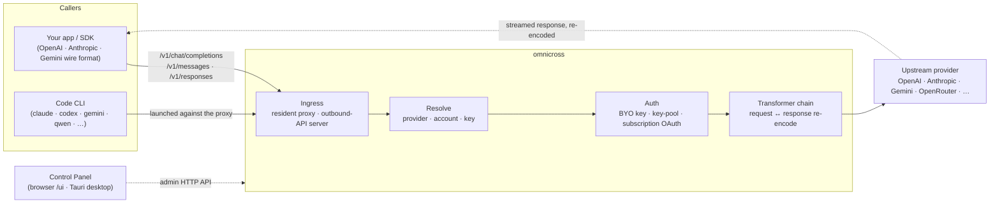

# omnicross

<div align="center">

[](https://opensource.org/licenses/MIT) [](https://nodejs.org/) [](https://www.typescriptlang.org/) [](https://www.npmjs.com/package/@omnicross/core)

[English](../README.md) · [简体中文](README.zh.md) · [繁體中文](README.zh-Hant.md) · [日本語](README.ja.md) · [한국어](README.ko.md) · [Français](README.fr.md) · [Deutsch](README.de.md) · [Italiano](README.it.md) · **Español (España)** · [Español (Latinoamérica)](README.es-419.md) · [Português (Brasil)](README.pt-BR.md) · [Português (Portugal)](README.pt-PT.md) · [Nederlands](README.nl.md) · [Dansk](README.da.md) · [Svenska](README.sv.md) · [Norsk bokmål](README.nb.md) · [Suomi](README.fi.md) · [Polski](README.pl.md) · [Čeština](README.cs.md) · [Magyar](README.hu.md) · [Română](README.ro.md) · [Български](README.bg.md) · [Русский](README.ru.md) · [Українська](README.uk.md) · [Ελληνικά](README.el.md) · [Türkçe](README.tr.md) · [العربية](README.ar.md) · [ไทย](README.th.md) · [Tiếng Việt](README.vi.md) · [Bahasa Indonesia](README.id.md) · [Bahasa Melayu](README.ms.md)

**Un núcleo de servicio LLM universal — enruta, transforma y redirige como proxy cualquier proveedor bajo un único conjunto de APIs.**

</div>

---

**omnicross alimenta todas tus aplicaciones de IA y CLIs de programación desde un único lugar — con tus suscripciones o claves API existentes.**

Apunta Claude Code, Codex, Gemini CLI — o cualquier aplicación que hable la API de OpenAI / Anthropic / Gemini — a omnicross, y este enruta cada petición al proveedor y modelo que elijas. Lo que puedes hacer:

- ejecutar con un **inicio de sesión de suscripción de Claude / ChatGPT / Gemini**, prescindiendo de las claves API de pago por uso;
- agrupar muchas claves API con rotación automática y conmutación por error;
- permitir que una herramienta que solo habla un formato de API llame a un modelo que habla otro — omnicross traduce la petición y la respuesta al vuelo.

Todo ello gestionado desde una interfaz gráfica de escritorio — sin necesidad de editar archivos de configuración a mano.

Se distribuye de varias formas:

- **🖥️ Como aplicación de escritorio** — una ventana nativa Tauri v2 (`apps/desktop`) que presenta la interfaz gráfica completa del Panel de Control y empaqueta y gestiona el daemon por ti (bandeja del sistema, inicio automático, ciclo de vida del daemon). **La forma principal en que la mayoría de las personas usan omnicross** — sin terminal, sin npm, sin configuración CORS.
- **🌐 En tu navegador** — ¿prefieres no instalar una aplicación nativa? `omnicross ui` inicia el daemon y abre la misma interfaz gráfica en tu navegador (servida por el propio daemon en `/ui` — mismo origen, sin configuración adicional) para gestionar proveedores, claves, cuentas y lanzamientos de Code CLI.
- **🚀 Como daemon headless** — el CLI/daemon `omnicross`: un proceso Node puro con una API HTTP local, un panel de administración y comandos para claves, proveedores, inicio de sesión OAuth y lanzamiento de Code CLIs. Perfecto para servidores y flujos de trabajo orientados al terminal; también es lo que impulsa la aplicación de escritorio y el Panel de Control en el navegador.
- **📦 Como librería** — `npm install @omnicross/core` e integra el núcleo de servicio directamente dentro de cualquier proyecto Node.

El propio núcleo de servicio es Node puro — sin Electron, sin dependencia de ningún framework; la interfaz de usuario es una aplicación web sencilla, y la capa de escritorio es una fina capa Tauri sobre ella.

## 🏗️ Arquitectura

Una petición entrante entra a través de un **ingress** (el proxy residente en proceso, o el servidor de API externo independiente), se resuelve a un **proveedor + identidad**, es convertida por la **cadena de transformadores**, y se redirige como proxy al **upstream** — luego la respuesta fluye de vuelta a través de la misma cadena, recodificada en el formato de cable del llamante.



| Bloque de construcción | Ubicación |
| --- | --- |
| Frontend del Panel de Control (Vite + React) | `@omnicross/ui` (`packages/ui` — publica solo su `dist/` compilado) |
| Capa de escritorio (Tauri v2) | `apps/desktop` |
| Runtime independiente (API HTTP · panel · CLI · sirve la interfaz en `/ui`) | `@omnicross/daemon` |
| Ingress · dispatch · transformer · proxy | `@omnicross/core` |
| OAuth de suscripción + estrategias de autenticación | `@omnicross/subscriptions` |
| Tipos de contrato compartidos + presets de proveedor | `@omnicross/contracts` |
| Lanzamiento de Code CLI (proxy-env + supervisor) | `@omnicross/cli-launcher` |

## ✨ Características

- **Interfaz gráfica del Panel de Control** — una interfaz React sobre la API de administración localhost del daemon: gestiona proveedores, claves y cuentas de suscripción visualmente en lugar de mediante archivos de configuración. Se distribuye como aplicación de escritorio nativa Tauri v2 (la forma habitual de acceder — bandeja del sistema, inicio automático, daemon integrado, sin Electron), o se sirve en tu navegador con un solo comando (`omnicross ui`).
- **Formato de cable de cualquiera a cualquiera** — acepta peticiones con formato OpenAI / Anthropic / Gemini y las dirige a un proveedor que habla un formato *diferente*; el pipeline de transformadores convierte tanto la petición como la respuesta en streaming.
- **Claves propias + grupos de múltiples claves** — vincula tus propias claves de proveedor, o agrupa muchas claves por proveedor con round-robin ponderado y conmutación automática por error en `429 / 529 / 401 / 403`.
- **Suscripción como proveedor** — dirige peticiones a través de una suscripción de Claude / ChatGPT (Codex) / Gemini mediante OAuth, o una clave bearer de OpenCodeGo, en lugar de una clave API de pago por uso.
- **Presets de proveedor** — un catálogo curado de endpoints/plantillas de proveedor (OpenAI, Anthropic, Gemini, DeepSeek, OpenRouter, Groq, Mistral y muchos más) que puedes asignar a una fila de configuración con un solo comando.
- **Proxy nativo de streaming** — un proxy residente en proceso retransmite streams SSE literalmente cuando los formatos coinciden, y los recodifica cuando no coinciden.
- **Lanzador de Code CLI** — inicia `claude` / `codex` / `gemini` / `qwen` / `copilot` / `opencode` contra un proxy local para que una sesión de CLI pueda ejecutarse en **cualquier** proveedor o suscripción que hayas configurado.
- **Agnóstico al host y tipado** — Node puro + TypeScript, tipos de contrato de dependencia ligera publicados por separado, sin acoplamiento a ninguna aplicación host.

## 📦 Estructura

Este es un monorepo de un único workspace: los paquetes publicables están en `packages/`, las aplicaciones ejecutables en `apps/`. Los nombres de paquetes npm mantienen el ámbito `@omnicross/`; los nombres de directorio eliminan el prefijo `omnicross-`.

| Aplicación | Qué es |
| --- | --- |
| `apps/desktop` | **omnicross-desktop** — la aplicación de escritorio nativa Tauri v2: envuelve el frontend `@omnicross/ui` como ventana nativa y empaqueta y gestiona el daemon (bandeja del sistema, inicio automático, ciclo de vida del daemon). Ver [`apps/desktop/README.md`](../apps/desktop/README.md). |

Los paquetes publicados:

| Paquete | npm | Qué es |
| --- | --- | --- |
| `packages/contracts` | [`@omnicross/contracts`](https://www.npmjs.com/package/@omnicross/contracts) | Tipos de contrato de dependencia ligera + helpers de valores en tiempo de ejecución (configuración LLM, tipos completion/chat, presets de proveedor, configuración de thinking, uso, tipos de token de suscripción/cuenta). Se consume mediante subpaths (`@omnicross/contracts/llm-config`, `/provider-presets`, …). |
| `packages/core` | [`@omnicross/core`](https://www.npmjs.com/package/@omnicross/core) | El núcleo de servicio — dispatch de proveedor, pipeline de completion, transformadores, el proxy de proveedor y la superficie de API externa. |
| `packages/subscriptions` | [`@omnicross/subscriptions`](https://www.npmjs.com/package/@omnicross/subscriptions) | Estrategias de autenticación de suscripción como proveedor, flujos OAuth (Claude / Codex / Gemini) y el dispatcher de escenario OpenCodeGo. |
| `packages/cli-launcher` | [`@omnicross/cli-launcher`](https://www.npmjs.com/package/@omnicross/cli-launcher) | El mecanismo de ciclo de vida de subprocesos `ProcessSupervisor` + constructores de configuración de lanzamiento proxy-env por CLI. |
| `packages/daemon` | [`@omnicross/daemon`](https://www.npmjs.com/package/@omnicross/daemon) | Un integrador Node puro de `@omnicross/core` con una API HTTP de administración + panel, el CLI `omnicross`, y servicio del Panel de Control en el mismo origen en `/ui`. |
| `packages/ui` | [`@omnicross/ui`](https://www.npmjs.com/package/@omnicross/ui) | El frontend del Panel de Control (Vite + React). Publica solo su `dist/` compilado (activos estáticos, sin dependencias en tiempo de ejecución); el daemon lo sirve en `/ui`, la capa Tauri lo envuelve. |

## 🚀 Inicio rápido

### Opción A — Aplicación de escritorio (recomendada para la mayoría de usuarios)

Descarga el instalador para tu sistema operativo desde la [última versión](https://github.com/Dumoedss/omnicross/releases/latest) y ejecútalo:

- **Windows** — `*-setup.exe` (NSIS) o `*.msi`
- **macOS** — `*.dmg` (universal — Apple Silicon + Intel)
- **Linux** — `*.AppImage`, `*.deb` o `*.rpm`

La aplicación empaqueta y gestiona todo por ti — el daemon **y** un runtime Node privado — así que no hay nada más que instalar. Solo descarga, ejecuta el instalador y ábrelo.

> ¿Quieres compilarlo tú mismo? Ver [`apps/desktop/README.md`](../apps/desktop/README.md) (`npm run build:app`, requiere Rust).

### Opción B — Panel de Control en tu navegador

¿Prefieres no instalar una aplicación? Un solo comando — el daemon sirve la misma interfaz él mismo (mismo origen que su API de administración — sin CORS, sin `.env`):

```bash
npm install -g @omnicross/daemon
omnicross ui --config ./omnicross.config.json   # boots the daemon + opens http://127.0.0.1:8766/ui/
```

Añade `--no-open` para omitir el lanzamiento del navegador. Los flujos de trabajo de desarrollo del frontend están en [`packages/ui/README.md`](../packages/ui/README.md).

### Opción C — Daemon headless

Todo lo que hace la aplicación — y más — está disponible desde el terminal:

```bash
npm install -g @omnicross/daemon
```

```bash
# Boot the daemon (BYO-key serving) against a config file
omnicross start --config ./omnicross.config.json

# Map a curated provider preset + your key into the config
omnicross providers presets --config ./omnicross.config.json
omnicross providers add openai --key $OPENAI_API_KEY --config ./omnicross.config.json

# Mint a local API key for your clients (shown once)
omnicross keys add my-app --config ./omnicross.config.json

# Log in to a subscription via browser OAuth (claude | codex | gemini)
omnicross login claude --config ./omnicross.config.json

# Launch a Code CLI against the in-process proxy on any configured provider
omnicross launch claude --provider openai --model gpt-4o --config ./omnicross.config.json
```

Ejecuta `omnicross --help` para ver la lista completa de comandos.

### Opción D — Como librería

```bash
npm install @omnicross/core @omnicross/contracts
```

```ts
import type { LLMProvider } from '@omnicross/contracts/llm-config';
// import the serving-core pieces you need from @omnicross/core

// Wire the serving core into your own Node app: supply a provider-config
// source + key store, then route inbound requests through the proxy.
```

> Las importaciones de subpath mantienen el grafo de dependencias ajustado, p. ej.
> `@omnicross/contracts/provider-presets`, `@omnicross/core/provider-proxy`.

## 🛠️ Desarrollo

```bash
git clone https://github.com/Dumoedss/omnicross.git
cd omnicross
npm install          # workspace symlinks for @omnicross/* + external deps
npm run typecheck    # tsc --noEmit per package
npm test             # vitest (tests run against src via aliases)
npm run build        # tsup per package → dist/ (ESM + CJS + .d.ts)
```

Los tests y las comprobaciones de tipos resuelven las importaciones `@omnicross/*` al **código fuente** del paquete mediante alias, por lo que no se necesita una compilación previa. `npm run build` emite el `dist/` de cada paquete para su publicación.

Para el desarrollo del Panel de Control, `npm run dev` (raíz del repositorio) es el bucle de un solo comando: genera un `omnicross.dev.config.json` ignorado por git en la primera ejecución, inicia el daemon en `127.0.0.1:8766` y arranca el servidor de desarrollo Vite de la interfaz en `http://localhost:1430` (Ctrl+C detiene ambos). El servidor de desarrollo redirige como proxy `/admin/*` al servidor del daemon, de modo que el navegador permanece en el mismo origen — el daemon no envía cabeceras CORS por diseño. El frontend en sí es el paquete workspace `@omnicross/ui` — `npm run build -w @omnicross/ui` actualiza el `dist/` servido por el daemon. Para la ventana nativa (requiere Rust): `npm run dev:app` ejecuta `tauri dev`, y `npm run build:app` empaqueta el ejecutable de lanzamiento + instaladores con el runtime del daemon **y un binario Node privado** integrados (salida en `apps/desktop/src-tauri/target/release/`; las máquinas de destino no necesitan nada instalado — detalles en [`apps/desktop/README.md`](../apps/desktop/README.md)).

## 📄 Licencia

[MIT](../LICENSE) 

Algunas partes de `@omnicross/core` y otros paquetes adaptan trabajo de terceros bajo sus propias licencias — consulta los archivos `NOTICE` en los paquetes correspondientes.
