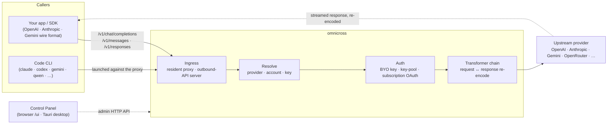

# omnicross

<div align="center">

[](https://opensource.org/licenses/MIT) [](https://nodejs.org/) [](https://www.typescriptlang.org/) [](https://www.npmjs.com/package/@omnicross/core)

[English](../README.md) · [简体中文](README.zh.md) · [繁體中文](README.zh-Hant.md) · [日本語](README.ja.md) · [한국어](README.ko.md) · [Français](README.fr.md) · [Deutsch](README.de.md) · [Italiano](README.it.md) · [Español (España)](README.es-ES.md) · [Español (Latinoamérica)](README.es-419.md) · [Português (Brasil)](README.pt-BR.md) · [Português (Portugal)](README.pt-PT.md) · [Nederlands](README.nl.md) · [Dansk](README.da.md) · [Svenska](README.sv.md) · [Norsk bokmål](README.nb.md) · **Suomi** · [Polski](README.pl.md) · [Čeština](README.cs.md) · [Magyar](README.hu.md) · [Română](README.ro.md) · [Български](README.bg.md) · [Русский](README.ru.md) · [Українська](README.uk.md) · [Ελληνικά](README.el.md) · [Türkçe](README.tr.md) · [العربية](README.ar.md) · [ไทย](README.th.md) · [Tiếng Việt](README.vi.md) · [Bahasa Indonesia](README.id.md) · [Bahasa Melayu](README.ms.md)

**Universaali LLM-palveluydin — reititä, muunna ja välitä mitä tahansa palveluntarjoajaa yhden API-joukon takaa.**

</div>

---

`omnicross` vastaanottaa saapuvan LLM-pyynnön — OpenAI `/v1/chat/completions`, Anthropic `/v1/messages`, Gemini ja muut — selvittää **minkä palveluntarjoajan, tilin ja avaimen** tulisi vastata siihen (omat API-avaimesi, moniavainpooli tai tilauksen OAuth-identiteetti), ajaa sen muuntaja- ja todennusputkilinjan läpi, ja välittää sen ylävirtaan — koodaten vastauksen uudelleen siihen protokollamuotoon, jonka kutsuja pyysi.

Se toimitetaan muutamassa muodossa:

- **🖥️ Työpöytäsovelluksena** — natiivi Tauri v2 -ikkuna (`apps/desktop`), joka tarjoaa täyden ohjauspaneelin graafisen käyttöliittymän ja niputtaa sekä hallitsee daemonin puolestasi (ilmaisinalue, automaattikäynnistys, daemonin elinkaari). **Pääasiallinen tapa, jolla useimmat ihmiset käyttävät omnicrossia** — ei terminaalia, ei npmiä, ei CORS-asetuksia.
- **🌐 Selaimessasi** — etkö halua asentaa natiivisovellusta? `omnicross ui` käynnistää daemonin ja avaa saman graafisen käyttöliittymän selaimessasi (daemonin itsensä tarjoamana osoitteessa `/ui` — sama alkuperä, ei lisäasetuksia) palveluntarjoajien, avainten, tilien ja Code-CLI-käynnistysten hallintaan.
- **🚀 Headless-daemonina** — `omnicross` CLI/daemon: pelkkä Node-prosessi paikallisella HTTP-ohjelmointirajapinnalla, ylläpitopaneelilla ja komennoilla avaimille, palveluntarjoajille, OAuth-kirjautumiselle ja Code CLI:iden käynnistämiselle. Täydellinen palvelimille ja terminaalipohjaisille työnkuluille; se on myös se, mikä käyttää työpöytäsovellusta ja selainpohjaista ohjauspaneelia.
- **📦 Kirjastona** — `npm install @omnicross/core` ja upota palveluytimen suoraan mihin tahansa Node-projektiin.

Palveluydin itsessään on puhdas Node — ei Electronia, ei kehyssidonnaisuutta; käyttöliittymä on tavallinen verkkosovellus, ja työpöytäkuori on ohut Tauri-kerros sen päällä.

## 🏗️ Arkkitehtuuri

Saapuva pyyntö tulee **ingressin** kautta (prosessinsisäinen pysyvä välityspalvelin tai erillinen ulospäin suunnattu API-palvelin), ratkaistaan **palveluntarjoajaksi + identiteetiksi**, muunnetaan **muuntajaketjun** toimesta, ja välitetään **ylävirtaan** — sitten vastaus virtaa takaisin samaa ketjua pitkin, koodattuna uudelleen kutsujan protokollamuotoon.



| Rakennuspalikka | Sijainti |
| --- | --- |
| Ohjauspaneelin käyttöliittymä (Vite + React) | `@omnicross/ui` (`packages/ui` — julkaisee vain rakennetun `dist/`) |
| Työpöytäkuori (Tauri v2) | `apps/desktop` |
| Erillinen ajoympäristö (HTTP-ohjelmointirajapinta · paneeli · CLI · tarjoaa käyttöliittymän osoitteessa `/ui`) | `@omnicross/daemon` |
| Ingress · lähetys · muuntaja · välityspalvelin | `@omnicross/core` |
| Tilauksen OAuth + todennusstrategiat | `@omnicross/subscriptions` |
| Jaetut sopimustyyppit + palveluntarjoajan esiasetukset | `@omnicross/contracts` |
| Code-CLI-käynnistys (proxy-env + valvoja) | `@omnicross/cli-launcher` |

## ✨ Ominaisuudet

- **Ohjauspaneelin graafinen käyttöliittymä** — React-käyttöliittymä daemonin localhost-ylläpito-ohjelmointirajapinnan päälle: hallitse palveluntarjoajia, avaimia ja tilaustilejä visuaalisesti konfigurointitiedoston sijaan. Toimitetaan natiivina Tauri v2 -työpöytäsovelluksena (arkinen tapa käyttää — ilmaisinalue, automaattikäynnistys, niputettu daemon, ei Electronia), tai yhdellä komennolla selaimessa (`omnicross ui`).
- **Mikä tahansa mihin tahansa -protokollamuunto** — vastaanota OpenAI / Anthropic / Gemini-muotoisia pyyntöjä ja kohdista ne palveluntarjoajalle, joka puhuu *eri* muotoa; muuntajaputkilinja muuntaa sekä pyynnön että virtaavan vastauksen.
- **Omat avaimet + moniavainpoolit** — sido omat palveluntarjoajan avaimesi, tai pooli useita avaimia palveluntarjoajaa kohti painotetulla vuorojaolla ja automaattisella vikasiirrolla `429 / 529 / 401 / 403` -virheisiin.
- **Tilaus palveluntarjoajana** — ohjaa pyyntöjä Claude / ChatGPT (Codex) / Gemini -tilauksen kautta OAuth:n avulla, tai OpenCodeGo-bearer-avaimella, mittaroidun API-avaimen sijaan.
- **Palveluntarjoajan esiasetukset** — kuratoitu luettelo palveluntarjoajan päätepisteistä/malleista (OpenAI, Anthropic, Gemini, DeepSeek, OpenRouter, Groq, Mistral ja paljon muuta), jonka voit kartoittaa konfigurointiriville yhdellä komennolla.
- **Suoratoistopohjainen välityspalvelin** — prosessinsisäinen pysyvä välityspalvelin välittää SSE-virtoja sanasta sanaan kun muodot täsmäävät, ja koodaa ne uudelleen kun ne eivät täsmää.
- **Code CLI -käynnistin** — käynnistä `claude` / `codex` / `gemini` / `qwen` / `copilot` / `opencode` paikallista välityspalvelinta vastaan, jotta CLI-istunto voi toimia **millä tahansa** konfiguroimallasi palveluntarjoajalla tai tilauksella.
- **Isäntäriippumaton ja tyypitetty** — puhdas Node + TypeScript, riippuvuusvähäiset sopimustyyppit julkaistu erikseen, nolla kytkentää mihinkään isäntäsovellukseen.

## 📦 Rakenne

Tämä on yksittäinen workspace-monorepository: julkaistavat paketit `packages/`-kansiossa, ajettavat sovellukset `apps/`-kansiossa. npm-pakettien nimet säilyttävät `@omnicross/`-laajuuden; hakemistojen nimet jättävät `omnicross-`-etuliitteen pois.

| Sovellus | Mitä se on |
| --- | --- |
| `apps/desktop` | **omnicross-desktop** — natiivi Tauri v2 -työpöytäsovellus: kietoo `@omnicross/ui`-käyttöliittymän natiiviksi ikkunaksi ja niputtaa sekä hallitsee daemonia (ilmaisinalue, automaattikäynnistys, daemonin elinkaari). Katso [`apps/desktop/README.md`](../apps/desktop/README.md). |

Julkaistut paketit:

| Paketti | npm | Mitä se on |
| --- | --- | --- |
| `packages/contracts` | [`@omnicross/contracts`](https://www.npmjs.com/package/@omnicross/contracts) | Riippuvuusvähäiset sopimustyyppit + ajonaikaiset arvo-apuohjelmat (LLM-konfigurointi, completion/chat-tyyppit, palveluntarjoajan esiasetukset, thinking-konfigurointi, käyttö, tilaus-/tilitunnustyyppit). Kulutetaan alipoluilla (`@omnicross/contracts/llm-config`, `/provider-presets`, …). |
| `packages/core` | [`@omnicross/core`](https://www.npmjs.com/package/@omnicross/core) | Palveluydin — palveluntarjoajan lähetys, completion-putkilinja, muuntajat, palveluntarjoajan välityspalvelin ja ulospäin suunnattu API-pinta. |
| `packages/subscriptions` | [`@omnicross/subscriptions`](https://www.npmjs.com/package/@omnicross/subscriptions) | Tilaus-palveluntarjoaja-todennusstrategiat, OAuth-työnkulut (Claude / Codex / Gemini) ja OpenCodeGo-skenaariolähetin. |
| `packages/cli-launcher` | [`@omnicross/cli-launcher`](https://www.npmjs.com/package/@omnicross/cli-launcher) | `ProcessSupervisor`-aliprosessien elinkaarimekanismi + CLI-kohtaiset proxy-env-käynnistyskonfigurointien rakentajat. |
| `packages/daemon` | [`@omnicross/daemon`](https://www.npmjs.com/package/@omnicross/daemon) | Pelkkä Node-isäntä `@omnicross/corelle` ylläpito-HTTP-ohjelmointirajapinnalla + paneelilla, `omnicross` CLI:llä ja ohjauspaneelin same-origin-tarjoilulla osoitteessa `/ui`. |
| `packages/ui` | [`@omnicross/ui`](https://www.npmjs.com/package/@omnicross/ui) | Ohjauspaneelin käyttöliittymä (Vite + React). Julkaisee vain rakennetun `dist/`-kansion (staattiset resurssit, nolla ajonaikaisia riippuvuuksia); daemon tarjoaa sen osoitteessa `/ui`, Tauri-kuori kietoo sen. |

## 🚀 Pikaopas

### Vaihtoehto A — Työpöytäsovellus (suositeltu useimmille käyttäjille)

Lataa asennusohjelma käyttöjärjestelmällesi [uusimmasta julkaisusta](https://github.com/Dumoedss/omnicross/releases/latest) ja suorita se:

- **Windows** — `*-setup.exe` (NSIS) tai `*.msi`
- **macOS** — `*.dmg` (universaali — Apple Silicon + Intel)
- **Linux** — `*.AppImage`, `*.deb` tai `*.rpm`

Sovellus niputtaa ja hallitsee kaiken puolestasi — daemonin **ja** yksityisen Node-ajoympäristön — joten mitään muuta ei tarvitse asentaa. Lataa vain, suorita asennusohjelma ja avaa se.

> Haluatko rakentaa sen itse? Katso [`apps/desktop/README.md`](../apps/desktop/README.md) (`npm run build:app`, vaatii Rustin).

### Vaihtoehto B — Ohjauspaneeli selaimessasi

Etkö halua asentaa sovellusta? Yksi komento — daemon tarjoaa saman käyttöliittymän itse (sama alkuperä kuin sen ylläpito-ohjelmointirajapinta — ei CORS:ia, ei `.env`:tä):

```bash
npm install -g @omnicross/daemon
omnicross ui --config ./omnicross.config.json   # boots the daemon + opens http://127.0.0.1:8766/ui/
```

Lisää `--no-open` ohittaaksesi selaimen avauksen. Käyttöliittymän kehitystyönkulut löytyvät [`packages/ui/README.md`](../packages/ui/README.md)-tiedostosta.

### Vaihtoehto C — Headless-daemon

Kaikki mitä sovellus tekee — ja enemmänkin — on saatavilla terminaalista:

```bash
npm install -g @omnicross/daemon
```

```bash
# Boot the daemon (BYO-key serving) against a config file
omnicross start --config ./omnicross.config.json

# Map a curated provider preset + your key into the config
omnicross providers presets --config ./omnicross.config.json
omnicross providers add openai --key $OPENAI_API_KEY --config ./omnicross.config.json

# Mint a local API key for your clients (shown once)
omnicross keys add my-app --config ./omnicross.config.json

# Log in to a subscription via browser OAuth (claude | codex | gemini)
omnicross login claude --config ./omnicross.config.json

# Launch a Code CLI against the in-process proxy on any configured provider
omnicross launch claude --provider openai --model gpt-4o --config ./omnicross.config.json
```

Suorita `omnicross --help` saadaksesi täydellisen komentolistauksen.

### Vaihtoehto D — Kirjastona

```bash
npm install @omnicross/core @omnicross/contracts
```

```ts
import type { LLMProvider } from '@omnicross/contracts/llm-config';
// import the serving-core pieces you need from @omnicross/core

// Wire the serving core into your own Node app: supply a provider-config
// source + key store, then route inbound requests through the proxy.
```

> Alipolkutuonnit pitävät riippuvuusgraafin tiiviinä, esim.
> `@omnicross/contracts/provider-presets`, `@omnicross/core/provider-proxy`.

## 🛠️ Kehitys

```bash
git clone https://github.com/Dumoedss/omnicross.git
cd omnicross
npm install          # workspace symlinks for @omnicross/* + external deps
npm run typecheck    # tsc --noEmit per package
npm test             # vitest (tests run against src via aliases)
npm run build        # tsup per package → dist/ (ESM + CJS + .d.ts)
```

Testit ja tyyppitarkistukset ratkaisevat `@omnicross/*`-tuonnit pakettien **lähdekoodiin** aliaksien kautta, joten etukäteisrakentamista ei tarvita. `npm run build` tuottaa kunkin paketin `dist/`-kansion julkaisua varten.

Ohjauspaneelin kehitystä varten `npm run dev` (repositorion juuressa) on yhden komennon kehityssilmukka: se luo gitignore-tiedoston `omnicross.dev.config.json`:n ensimmäisellä ajokerralla, käynnistää daemonin osoitteessa `127.0.0.1:8766` ja käynnistää käyttöliittymän Vite-kehityspalvelimen osoitteessa `http://localhost:1430` (Ctrl+C pysäyttää molemmat). Kehityspalvelin välittää `/admin/*`-pyynnöt daemonille palvelinpuolella, joten selain pysyy aina samassa alkuperässä — daemon ei lähetä CORS-otsikoita suunnitelmallisesti. Käyttöliittymä itsessään on workspace-paketti `@omnicross/ui` — `npm run build -w @omnicross/ui` päivittää daemonin tarjoaman `dist/`-kansion. Natiivi-ikkuna (vaatii Rustin): `npm run dev:app` suorittaa `tauri dev`:n, ja `npm run build:app` pakkaa julkaisun suoritettavan tiedoston + asennusohjelmat, joihin on niputettu daemon-ajoympäristö **ja yksityinen Node-binääri** (tuloste `apps/desktop/src-tauri/target/release/`-kansiossa; kohdekoneisiin ei tarvitse asentaa mitään — lisätietoja [`apps/desktop/README.md`](../apps/desktop/README.md)-tiedostossa).

## 📄 Lisenssi

[MIT](../LICENSE) 

Osat `@omnicross/coresta` ja muista paketeista mukauttavat kolmansien osapuolten työtä omien lisenssien alaisuudessa — katso `NOTICE`-tiedostot vastaavista paketeista.
