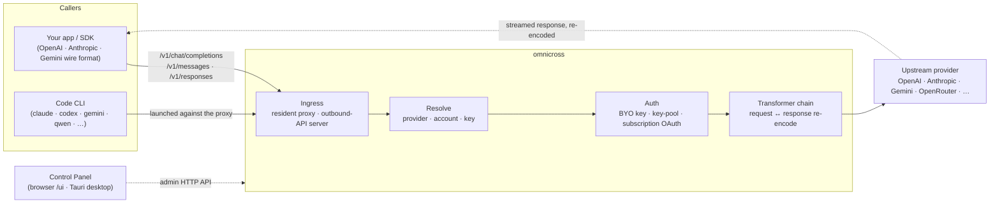

# omnicross

<div align="center">

[](https://opensource.org/licenses/MIT) [](https://nodejs.org/) [](https://www.typescriptlang.org/) [](https://www.npmjs.com/package/@omnicross/core)

[English](../README.md) · [简体中文](README.zh.md) · [繁體中文](README.zh-Hant.md) · [日本語](README.ja.md) · [한국어](README.ko.md) · **Français** · [Deutsch](README.de.md) · [Italiano](README.it.md) · [Español (España)](README.es-ES.md) · [Español (Latinoamérica)](README.es-419.md) · [Português (Brasil)](README.pt-BR.md) · [Português (Portugal)](README.pt-PT.md) · [Nederlands](README.nl.md) · [Dansk](README.da.md) · [Svenska](README.sv.md) · [Norsk bokmål](README.nb.md) · [Suomi](README.fi.md) · [Polski](README.pl.md) · [Čeština](README.cs.md) · [Magyar](README.hu.md) · [Română](README.ro.md) · [Български](README.bg.md) · [Русский](README.ru.md) · [Українська](README.uk.md) · [Ελληνικά](README.el.md) · [Türkçe](README.tr.md) · [العربية](README.ar.md) · [ไทย](README.th.md) · [Tiếng Việt](README.vi.md) · [Bahasa Indonesia](README.id.md) · [Bahasa Melayu](README.ms.md)

**Un noyau de service LLM universel — routez, transformez et proxifiez n'importe quel fournisseur derrière un seul ensemble d'API.**

</div>

---

**omnicross alimente toutes vos applications d'IA et vos CLI de codage depuis un seul endroit — avec vos abonnements existants ou vos clés API.**

Pointez Claude Code, Codex, Gemini CLI — ou n'importe quelle application qui parle l'API OpenAI / Anthropic / Gemini — vers omnicross, et il achemine chaque requête vers le fournisseur et le modèle que vous choisissez. Ce que vous pouvez faire :

- fonctionner avec **un abonnement Claude / ChatGPT / Gemini**, en évitant les API Key facturées à la consommation ;
- regrouper plusieurs API Key dans un pool de clés avec rotation automatique et basculement en cas d'échec ;
- permettre à un outil qui ne parle qu'un seul format d'API d'appeler un modèle qui en parle un autre — omnicross traduit la requête et la réponse à la volée.

Tout cela géré dans une interface graphique de bureau — sans modifier manuellement des fichiers de configuration.

Il se décline sous plusieurs formes :

- **🖥️ En tant qu'application de bureau** — une fenêtre Tauri v2 native (`apps/desktop`) qui présente l'interface graphique complète du panneau de contrôle et gère le daemon pour vous (barre système, démarrage automatique, cycle de vie du daemon). **La façon principale dont la plupart des gens utilisent omnicross** — sans terminal, sans npm, sans configuration CORS.
- **🌐 Dans votre navigateur** — vous préférez ne pas installer une application native ? `omnicross ui` démarre le daemon et ouvre la même interface dans votre navigateur (servie par le daemon lui-même à `/ui` — même origine, aucune configuration supplémentaire) pour gérer les fournisseurs, les clés, les comptes et les lancements de Code CLI.
- **🚀 En tant que daemon headless** — le CLI/daemon `omnicross` : un processus Node pur avec une API HTTP locale, un tableau de bord d'administration et des commandes pour les clés, les fournisseurs, la connexion OAuth et le lancement des Code CLI. Parfait pour les serveurs et les flux de travail orientés terminal ; c'est aussi ce qui alimente l'application de bureau et le panneau de contrôle dans le navigateur.
- **📦 En tant que bibliothèque** — `npm install @omnicross/core` et intégrez le noyau de service directement dans n'importe quel projet Node.

Le noyau de service lui-même est du Node pur — pas d'Electron, pas de dépendance à un framework ; l'interface est une application web ordinaire, et la coque de bureau est une fine couche Tauri par-dessus.

## 🏗️ Architecture

Une requête entrante passe par une **entrée** (le proxy en cours de processus résident, ou le serveur d'API sortant autonome), est résolue vers un **fournisseur + identité**, est convertie par la **chaîne de transformateurs**, et est proxifiée **en amont** — puis la réponse revient en flux à travers la même chaîne, ré-encodée dans le format wire de l'appelant.



| Bloc de construction | Emplacement |
| --- | --- |
| Frontend du panneau de contrôle (Vite + React) | `@omnicross/ui` (`packages/ui` — publie uniquement son `dist/` compilé) |
| Coque de bureau (Tauri v2) | `apps/desktop` |
| Runtime autonome (API HTTP · tableau de bord · CLI · sert l'interface à `/ui`) | `@omnicross/daemon` |
| Entrée · dispatch · transformateur · proxy | `@omnicross/core` |
| OAuth d'abonnement + stratégies d'auth | `@omnicross/subscriptions` |
| Types de contrats partagés + préréglages fournisseurs | `@omnicross/contracts` |
| Lancement de Code CLI (proxy-env + superviseur) | `@omnicross/cli-launcher` |

## ✨ Fonctionnalités

- **Interface graphique du panneau de contrôle** — une interface React sur l'API admin localhost du daemon : gérez visuellement les fournisseurs, les clés et les comptes d'abonnement plutôt que par fichier de configuration. Disponible en tant qu'application de bureau Tauri v2 native (la façon quotidienne de l'utiliser — barre système, démarrage automatique, daemon intégré, pas d'Electron), ou servie dans votre navigateur avec une seule commande (`omnicross ui`).
- **Format wire universel** — acceptez des requêtes au format OpenAI / Anthropic / Gemini et ciblez un fournisseur qui parle un format *différent* ; la pipeline de transformation convertit à la fois la requête et la réponse en flux.
- **Clés personnelles + pools de clés multiples** — associez vos propres clés de fournisseur, ou mettez en commun plusieurs clés par fournisseur avec un tourniquet pondéré et un basculement automatique sur `429 / 529 / 401 / 403`.
- **Abonnement en tant que fournisseur** — faites transiter les requêtes via un abonnement Claude / ChatGPT (Codex) / Gemini via OAuth, ou une clé bearer OpenCodeGo, au lieu d'une clé API à la consommation.
- **Préréglages fournisseurs** — un catalogue de points de terminaison/modèles de fournisseurs soigneusement sélectionnés (OpenAI, Anthropic, Gemini, DeepSeek, OpenRouter, Groq, Mistral, et bien d'autres) que vous pouvez mapper vers une ligne de configuration en une seule commande.
- **Proxy natif au streaming** — un proxy en cours de processus résident relaie les flux SSE verbatim lorsque les formats correspondent, et les ré-encode lorsqu'ils ne correspondent pas.
- **Lanceur de Code CLI** — démarrez `claude` / `codex` / `gemini` / `qwen` / `copilot` / `opencode` contre un proxy local afin qu'une session CLI puisse s'exécuter sur **n'importe quel** fournisseur ou abonnement que vous avez configuré.
- **Indépendant de l'hôte & typé** — Node pur + TypeScript, types de contrats légers publiés séparément, aucun couplage avec une application hôte.

## 📦 Structure

Il s'agit d'un monorepo à espace de travail unique : les packages publiables dans `packages/`, les applications exécutables dans `apps/`. Les noms de packages npm conservent le scope `@omnicross/` ; les noms de répertoires suppriment le préfixe `omnicross-`.

| Application | Description |
| --- | --- |
| `apps/desktop` | **omnicross-desktop** — l'application de bureau Tauri v2 native : encapsule le frontend `@omnicross/ui` dans une fenêtre native et gère le daemon (barre système, démarrage automatique, cycle de vie du daemon). Voir [`apps/desktop/README.md`](../apps/desktop/README.md). |

Les packages publiés :

| Package | npm | Description |
| --- | --- | --- |
| `packages/contracts` | [`@omnicross/contracts`](https://www.npmjs.com/package/@omnicross/contracts) | Types de contrats légers + helpers de valeurs à l'exécution (config LLM, types completion/chat, préréglages fournisseurs, config thinking, utilisation, types de tokens abonnement/compte). Consommés via des sous-chemins (`@omnicross/contracts/llm-config`, `/provider-presets`, …). |
| `packages/core` | [`@omnicross/core`](https://www.npmjs.com/package/@omnicross/core) | Le noyau de service — dispatch fournisseur, pipeline de completion, transformateurs, le proxy fournisseur et la surface d'API sortante. |
| `packages/subscriptions` | [`@omnicross/subscriptions`](https://www.npmjs.com/package/@omnicross/subscriptions) | Stratégies d'auth abonnement-en-tant-que-fournisseur, flux OAuth (Claude / Codex / Gemini) et le dispatcher de scénarios OpenCodeGo. |
| `packages/cli-launcher` | [`@omnicross/cli-launcher`](https://www.npmjs.com/package/@omnicross/cli-launcher) | Le mécanisme de cycle de vie de sous-processus `ProcessSupervisor` + constructeurs de configuration de lancement proxy-env par CLI. |
| `packages/daemon` | [`@omnicross/daemon`](https://www.npmjs.com/package/@omnicross/daemon) | Un intégrateur Node pur de `@omnicross/core` avec une API HTTP admin + tableau de bord, le CLI `omnicross`, et la diffusion en même origine du panneau de contrôle à `/ui`. |
| `packages/ui` | [`@omnicross/ui`](https://www.npmjs.com/package/@omnicross/ui) | Le frontend du panneau de contrôle (Vite + React). Publie uniquement son `dist/` compilé (assets statiques, zéro dépendance à l'exécution) ; le daemon le sert à `/ui`, la coque Tauri l'encapsule. |

## 🚀 Démarrage rapide

### Option A — Application de bureau (recommandée pour la plupart des utilisateurs)

Téléchargez l'installeur pour votre système d'exploitation depuis la [dernière version](https://github.com/Dumoedss/omnicross/releases/latest) et exécutez-le :

- **Windows** — `*-setup.exe` (NSIS) ou `*.msi`
- **macOS** — `*.dmg` (universel — Apple Silicon + Intel)
- **Linux** — `*.AppImage`, `*.deb` ou `*.rpm`

L'application gère tout pour vous — le daemon **et** un runtime Node privé — il n'y a donc rien d'autre à installer. Il suffit de télécharger, d'exécuter l'installeur et de l'ouvrir.

> Vous voulez le compiler vous-même ? Voir [`apps/desktop/README.md`](../apps/desktop/README.md) (`npm run build:app`, nécessite Rust).

### Option B — Panneau de contrôle dans votre navigateur

Vous préférez ne pas installer une application ? Une seule commande — le daemon sert lui-même la même interface (même origine que son API admin — pas de CORS, pas de `.env`) :

```bash
npm install -g @omnicross/daemon
omnicross ui --config ./omnicross.config.json   # boots the daemon + opens http://127.0.0.1:8766/ui/
```

Ajoutez `--no-open` pour ignorer le lancement du navigateur. Les flux de travail de développement frontend se trouvent dans [`packages/ui/README.md`](../packages/ui/README.md).

### Option C — Daemon headless

Tout ce que fait l'application — et plus encore — est disponible depuis le terminal :

```bash
npm install -g @omnicross/daemon
```

```bash
# Boot the daemon (BYO-key serving) against a config file
omnicross start --config ./omnicross.config.json

# Map a curated provider preset + your key into the config
omnicross providers presets --config ./omnicross.config.json
omnicross providers add openai --key $OPENAI_API_KEY --config ./omnicross.config.json

# Mint a local API key for your clients (shown once)
omnicross keys add my-app --config ./omnicross.config.json

# Log in to a subscription via browser OAuth (claude | codex | gemini)
omnicross login claude --config ./omnicross.config.json

# Launch a Code CLI against the in-process proxy on any configured provider
omnicross launch claude --provider openai --model gpt-4o --config ./omnicross.config.json
```

Exécutez `omnicross --help` pour la liste complète des commandes.

### Option D — En tant que bibliothèque

```bash
npm install @omnicross/core @omnicross/contracts
```

```ts
import type { LLMProvider } from '@omnicross/contracts/llm-config';
// import the serving-core pieces you need from @omnicross/core

// Wire the serving core into your own Node app: supply a provider-config
// source + key store, then route inbound requests through the proxy.
```

> Les imports par sous-chemin permettent de maintenir un graphe de dépendances compact, par ex.
> `@omnicross/contracts/provider-presets`, `@omnicross/core/provider-proxy`.

## 🛠️ Développement

```bash
git clone https://github.com/Dumoedss/omnicross.git
cd omnicross
npm install          # workspace symlinks for @omnicross/* + external deps
npm run typecheck    # tsc --noEmit per package
npm test             # vitest (tests run against src via aliases)
npm run build        # tsup per package → dist/ (ESM + CJS + .d.ts)
```

Les tests et les vérifications de types résolvent les imports `@omnicross/*` vers le **code source** des packages via des alias, donc aucune compilation préalable n'est nécessaire. `npm run build` produit le `dist/` de chaque package pour la publication.

Pour le développement du panneau de contrôle, `npm run dev` (racine du dépôt) est la boucle de développement en une commande : il génère un `omnicross.dev.config.json` ignoré par git à la première exécution, démarre le daemon sur `127.0.0.1:8766`, et démarre le serveur de développement Vite de l'interface sur `http://localhost:1430` (Ctrl+C arrête les deux). Le serveur de développement proxifie `/admin/*` vers le daemon côté serveur, de sorte que le navigateur reste sur la même origine — le daemon n'envoie pas d'en-têtes CORS par conception. Le frontend lui-même est le package d'espace de travail `@omnicross/ui` — `npm run build -w @omnicross/ui` rafraîchit le `dist/` servi par le daemon. Pour la fenêtre native (nécessite Rust) : `npm run dev:app` exécute `tauri dev`, et `npm run build:app` package l'exécutable de version finale + les installeurs avec le runtime du daemon **et un binaire Node privé** intégrés (sortie dans `apps/desktop/src-tauri/target/release/` ; les machines cibles n'ont besoin de rien d'installé — détails dans [`apps/desktop/README.md`](../apps/desktop/README.md)).

## 📄 Licence

[MIT](../LICENSE) 

Des portions de `@omnicross/core` et d'autres packages adaptent des travaux tiers sous leurs propres licences — consultez les fichiers `NOTICE` dans les packages respectifs.
