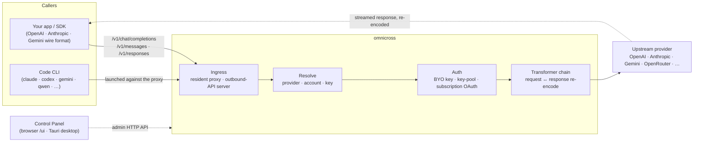

# omnicross

<div align="center">

[](https://opensource.org/licenses/MIT) [](https://nodejs.org/) [](https://www.typescriptlang.org/) [](https://www.npmjs.com/package/@omnicross/core)

[English](../README.md) · [简体中文](README.zh.md) · [繁體中文](README.zh-Hant.md) · [日本語](README.ja.md) · [한국어](README.ko.md) · [Français](README.fr.md) · [Deutsch](README.de.md) · [Italiano](README.it.md) · [Español (España)](README.es-ES.md) · [Español (Latinoamérica)](README.es-419.md) · [Português (Brasil)](README.pt-BR.md) · [Português (Portugal)](README.pt-PT.md) · [Nederlands](README.nl.md) · [Dansk](README.da.md) · [Svenska](README.sv.md) · [Norsk bokmål](README.nb.md) · [Suomi](README.fi.md) · [Polski](README.pl.md) · [Čeština](README.cs.md) · **Magyar** · [Română](README.ro.md) · [Български](README.bg.md) · [Русский](README.ru.md) · [Українська](README.uk.md) · [Ελληνικά](README.el.md) · [Türkçe](README.tr.md) · [العربية](README.ar.md) · [ไทย](README.th.md) · [Tiếng Việt](README.vi.md) · [Bahasa Indonesia](README.id.md) · [Bahasa Melayu](README.ms.md)

**Univerzális LLM-kiszolgáló mag — irányítson, alakítson át és proxyzzon bármely szolgáltatót egyetlen API-készlet mögé.**

</div>

---

**Az omnicross egyetlen helyről táplálja az összes AI-alkalmazást és kódoló CLI-t — meglévő előfizetéseivel vagy API-kulcsaival.**

Irányítsa a Claude Code-ot, a Codex-et, a Gemini CLI-t — vagy bármely alkalmazást, amely az OpenAI / Anthropic / Gemini API-t használja — az omnicross felé, és az minden kérést a kiválasztott szolgáltatóhoz és modellhez irányít. Amit megtehet:

- futtatás **Claude / ChatGPT / Gemini előfizetéses bejelentkezéssel**, a fogyasztásalapú API Key kihagyásával;
- több API Key összevonása automatikus körkörös elosztással és feladatátvétellel;
- egy eszköz, amely csak egy API-formátumot ismer, így is képes egy másik formátumot beszélő modellt hívni — az omnicross menet közben lefordítja a kérést és a választ.

Mindez egy asztali alkalmazás grafikus felületén keresztül kezelhető — nincs szükség konfigurációs fájlok kézi szerkesztésére.

Néhány formában érkezik:

- **🖥️ Asztali alkalmazásként** — egy natív Tauri v2 ablak (`apps/desktop`), amely bemutatja a teljes Vezérlőpult GUI-t, és csomagolja, valamint kezeli a daemona helyetted (tálca, automatikus indítás, daemon életciklus). **A legtöbb ember fő módja az omnicross használatára** — sem terminál, sem npm, sem CORS-beállítás nem szükséges.
- **🌐 A böngészőben** — nem szeretne natív alkalmazást telepíteni? Az `omnicross ui` elindítja a daemona, és ugyanazt a GUI-t nyitja meg a böngészőjében (a daemon saját maga tálalta a `/ui` útvonalon — ugyanaz az eredet, nincs extra beállítás) a szolgáltatók, kulcsok, fiókok és Code CLI-k kezeléséhez.
- **🚀 Headless daemonként** — az `omnicross` CLI/daemon: egy tiszta Node-folyamat helyi HTTP API-val, adminisztrációs irányítópulttal és kulcsok, szolgáltatók, OAuth-bejelentkezés és Code CLI-k indítására szolgáló parancsokkal. Tökéletes szerverekhez és terminál-alapú munkafolyamatokhoz; ez hajtja az asztali alkalmazást és a böngészős Vezérlőpultot is.
- **📦 Könyvtárként** — `npm install @omnicross/core`, és ágyazza be a kiszolgáló magot közvetlenül bármely Node-projektbe.

Maga a kiszolgáló mag tiszta Node — nincs Electron, nincs keretrendszer-kötöttség; a felhasználói felület egy egyszerű webalkalmazás, az asztali héj pedig egy vékony Tauri-réteg fölötte.

## 🏗️ Architektúra

Egy bejövő kérés egy **bemeneti ponton** (ingress) keresztül lép be (a helyben futó folyamaton belüli proxy vagy az önálló kimenő API-szerver), feloldódik egy **szolgáltatóra + identitásra**, a **transzformátorláncton** keresztül konvertálódik, majd proxyzódik az **upstream** felé — ezután a válasz ugyanazon a láncon folyik vissza, visszakódolva a hívó átviteli formátumába.



| Építőelem | Hol található |
| --- | --- |
| Vezérlőpult frontend (Vite + React) | `@omnicross/ui` (`packages/ui` — csak a lefordított `dist/`-t teszi közzé) |
| Asztali héj (Tauri v2) | `apps/desktop` |
| Önálló futtatókörnyezet (HTTP API · irányítópult · CLI · a felhasználói felületet a `/ui`-n tálalta) | `@omnicross/daemon` |
| Ingress · diszpécser · transzformátor · proxy | `@omnicross/core` |
| Előfizetéses OAuth + hitelesítési stratégiák | `@omnicross/subscriptions` |
| Megosztott szerződéstípusok + szolgáltatói előbeállítások | `@omnicross/contracts` |
| Code CLI indítás (proxy-env + felügyelő) | `@omnicross/cli-launcher` |

## ✨ Funkciók

- **Vezérlőpult GUI** — egy React felhasználói felület a daemon helyi adminisztrációs API-ja felett: kezelje a szolgáltatókat, kulcsokat és előfizetéses fiókokat vizuálisan a konfigurációs fájl szerkesztése helyett. Natív Tauri v2 asztali alkalmazásként érhető el (a mindennapi belépési pont — tálca, automatikus indítás, beágyazott daemon, nincs Electron), vagy egyetlen paranccsal (`omnicross ui`) a böngészőben is használható.
- **Bármilyen formátumból bármilyen formátumba** — fogadjon OpenAI / Anthropic / Gemini-alakú kéréseket, és irányítsa egy olyan szolgáltatóhoz, amely *más* formátumot beszél; a transzformátor-csővezeték mindkét irányban konvertálja a kérést és a streamelt választ.
- **Saját kulcsok + többkulcsos készletek** — kösse saját szolgáltatói kulcsait, vagy készletezzen több kulcsot szolgáltatónként súlyozott körkörös elosztással és automatikus feladatátvétellel `429 / 529 / 401 / 403` esetén.
- **Előfizetés mint szolgáltató** — hajtson kéréseket Claude / ChatGPT (Codex) / Gemini előfizetésen keresztül OAuth-szal, vagy OpenCodeGo bearer kulccsal, fogyasztásalapú API-kulcs helyett.
- **Szolgáltatói előbeállítások** — gondosan összeállított katalógus a szolgáltatói végpontokból/sablonokból (OpenAI, Anthropic, Gemini, DeepSeek, OpenRouter, Groq, Mistral és sok más), amelyek egyetlen paranccsal leképezhetők egy konfigurációs sorra.
- **Streaming-natív proxy** — egy helyen futó folyamaton belüli proxy egyenesen továbbítja az SSE streameket, ahol a formátumok egyeznek, és visszakódolja azokat, ahol nem.
- **Code CLI indítója** — indítsa el a `claude` / `codex` / `gemini` / `qwen` / `copilot` / `opencode` eszközöket egy helyi proxy ellen, hogy egy CLI-munkamenet **bármely** konfigurált szolgáltatón vagy előfizetésen futhasson.
- **Gazdagéptől független és típusos** — tiszta Node + TypeScript, könnyű függőségű szerződéstípusok külön közzétéve, nulla kapcsolódás bármely gazdaalkalmazáshoz.

## 📦 Elrendezés

Ez egy egymunkaterületes monorepo: közzétehető csomagok a `packages/`-ben, futtatható alkalmazások az `apps/`-ban. Az npm-csomagnév megtartja az `@omnicross/` hatókört; a könyvtárnevek elhagyják az `omnicross-` előtagot.

| Alkalmazás | Mi ez |
| --- | --- |
| `apps/desktop` | **omnicross-desktop** — a natív Tauri v2 asztali alkalmazás: natív ablakba csomagolja az `@omnicross/ui` frontendet, és csomagolja, valamint kezeli a daemona (tálca, automatikus indítás, daemon életciklus). Lásd: [`apps/desktop/README.md`](../apps/desktop/README.md). |

A közzétett csomagok:

| Csomag | npm | Mi ez |
| --- | --- | --- |
| `packages/contracts` | [`@omnicross/contracts`](https://www.npmjs.com/package/@omnicross/contracts) | Könnyű függőségű szerződéstípusok + futásidejű értéksegédek (LLM-konfiguráció, completion/chat típusok, szolgáltatói előbeállítások, thinking konfiguráció, használat, előfizetés/fiók-token típusok). Alútvonalakon keresztül fogyasztva (`@omnicross/contracts/llm-config`, `/provider-presets`, …). |
| `packages/core` | [`@omnicross/core`](https://www.npmjs.com/package/@omnicross/core) | A kiszolgáló mag — szolgáltató-diszpécser, completion-csővezeték, transzformátorok, a szolgáltatói proxy és a kimenő API-felület. |
| `packages/subscriptions` | [`@omnicross/subscriptions`](https://www.npmjs.com/package/@omnicross/subscriptions) | Előfizetés-mint-szolgáltató hitelesítési stratégiák, OAuth-folyamatok (Claude / Codex / Gemini) és az OpenCodeGo forgatókönyv-diszpécser. |
| `packages/cli-launcher` | [`@omnicross/cli-launcher`](https://www.npmjs.com/package/@omnicross/cli-launcher) | A `ProcessSupervisor` alfolyamat-életciklus mechanizmus + CLI-nkénti proxy-env indítási konfiguráció-készítők. |
| `packages/daemon` | [`@omnicross/daemon`](https://www.npmjs.com/package/@omnicross/daemon) | Az `@omnicross/core` tiszta Node-ba ágyazója adminisztrációs HTTP API-val + irányítópulttal, az `omnicross` CLI-vel és a Vezérlőpult azonos-eredetű tálalásával a `/ui`-n. |
| `packages/ui` | [`@omnicross/ui`](https://www.npmjs.com/package/@omnicross/ui) | A Vezérlőpult frontendje (Vite + React). Csak a lefordított `dist/`-t teszi közzé (statikus eszközök, nulla futásidejű függőség); a daemon a `/ui`-n tálalta, a Tauri héj becsomagolja. |

## 🚀 Gyors kezdés

### A lehetőség — Asztali alkalmazás (a legtöbb felhasználónak ajánlott)

Töltse le az operációs rendszerének megfelelő telepítőt a [legújabb kiadásból](https://github.com/Dumoedss/omnicross/releases/latest), és futtassa:

- **Windows** — `*-setup.exe` (NSIS) vagy `*.msi`
- **macOS** — `*.dmg` (univerzális — Apple Silicon + Intel)
- **Linux** — `*.AppImage`, `*.deb` vagy `*.rpm`

Az alkalmazás mindent csomagol és kezel helyetted — a daemona **és** egy privát Node-futtatókörnyezet —, tehát nincs más telepítendő. Csak töltse le, futtassa a telepítőt, és nyissa meg.

> Saját maga szeretné felépíteni? Lásd: [`apps/desktop/README.md`](../apps/desktop/README.md) (`npm run build:app`, Rust szükséges).

### B lehetőség — Vezérlőpult a böngészőben

Nem szeretne alkalmazást telepíteni? Egyetlen parancs — a daemon maga tálalta ugyanazt a felhasználói felületet (ugyanaz az eredet, mint az adminisztrációs API-ja — nincs CORS, nincs `.env`):

```bash
npm install -g @omnicross/daemon
omnicross ui --config ./omnicross.config.json   # boots the daemon + opens http://127.0.0.1:8766/ui/
```

Adja hozzá a `--no-open` kapcsolót a böngészőindítás kihagyásához. A frontend fejlesztői munkafolyamatok a [`packages/ui/README.md`](../packages/ui/README.md) fájlban találhatók.

### C lehetőség — Headless daemon

Minden, amit az alkalmazás tesz — és még több — elérhető a terminálból:

```bash
npm install -g @omnicross/daemon
```

```bash
# Boot the daemon (BYO-key serving) against a config file
omnicross start --config ./omnicross.config.json

# Map a curated provider preset + your key into the config
omnicross providers presets --config ./omnicross.config.json
omnicross providers add openai --key $OPENAI_API_KEY --config ./omnicross.config.json

# Mint a local API key for your clients (shown once)
omnicross keys add my-app --config ./omnicross.config.json

# Log in to a subscription via browser OAuth (claude | codex | gemini)
omnicross login claude --config ./omnicross.config.json

# Launch a Code CLI against the in-process proxy on any configured provider
omnicross launch claude --provider openai --model gpt-4o --config ./omnicross.config.json
```

Futtassa az `omnicross --help` parancsot a teljes parancslistáért.

### D lehetőség — Könyvtárként

```bash
npm install @omnicross/core @omnicross/contracts
```

```ts
import type { LLMProvider } from '@omnicross/contracts/llm-config';
// import the serving-core pieces you need from @omnicross/core

// Wire the serving core into your own Node app: supply a provider-config
// source + key store, then route inbound requests through the proxy.
```

> Az alútvonalak importálása szűken tartja a függőségi gráfot, pl.
> `@omnicross/contracts/provider-presets`, `@omnicross/core/provider-proxy`.

## 🛠️ Fejlesztés

```bash
git clone https://github.com/Dumoedss/omnicross.git
cd omnicross
npm install          # workspace symlinks for @omnicross/* + external deps
npm run typecheck    # tsc --noEmit per package
npm test             # vitest (tests run against src via aliases)
npm run build        # tsup per package → dist/ (ESM + CJS + .d.ts)
```

A tesztek és típusellenőrzések az aliasok segítségével a csomag **forrásához** oldják fel az `@omnicross/*` importokat, tehát nincs szükség előzetes fordításra. Az `npm run build` minden csomag `dist/`-ját előállítja közzétételre.

A Vezérlőpult fejlesztéséhez az `npm run dev` (a repo gyökerében) az egyparancssos fejlesztői ciklus: első futtatáskor létrehoz egy gitignore-olt `omnicross.dev.config.json`-t, elindítja a daemona a `127.0.0.1:8766`-on, és elindítja a felhasználói felület Vite fejlesztői szerverét a `http://localhost:1430`-on (Ctrl+C mindkettőt leállítja). A fejlesztői szerver a `/admin/*` útvonalakat szerveroldali módon a daemon felé proxyzza, így a böngésző azonos eredetű marad — a daemon tervezésből adódóan nem küld CORS-fejléceket. Maga a frontend az `@omnicross/ui` munkaterületi csomag — az `npm run build -w @omnicross/ui` frissíti a daemon által tálalt `dist/`-t. A natív ablakhoz (Rust szükséges): az `npm run dev:app` futtatja a `tauri dev`-et, az `npm run build:app` pedig csomagolja a kiadási futtathatót + telepítőket, a daemon futtatókörnyezettel **és egy privát Node binárissal** csomagolva (kimenet az `apps/desktop/src-tauri/target/release/` alatt; a célgépeken nincs szükség semmire — részletek a [`apps/desktop/README.md`](../apps/desktop/README.md) fájlban).

## 📄 Licenc

[MIT](../LICENSE) 

Az `@omnicross/core` és más csomagok egyes részei harmadik felek munkáját adaptálják saját licenceik alatt — lásd a `NOTICE` fájlokat a megfelelő csomagokban.
