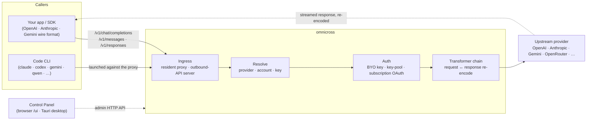

# omnicross

<div align="center">

[](https://opensource.org/licenses/MIT) [](https://nodejs.org/) [](https://www.typescriptlang.org/) [](https://www.npmjs.com/package/@omnicross/core)

[English](../README.md) · [简体中文](README.zh.md) · [繁體中文](README.zh-Hant.md) · [日本語](README.ja.md) · [한국어](README.ko.md) · [Français](README.fr.md) · [Deutsch](README.de.md) · [Italiano](README.it.md) · [Español (España)](README.es-ES.md) · [Español (Latinoamérica)](README.es-419.md) · [Português (Brasil)](README.pt-BR.md) · [Português (Portugal)](README.pt-PT.md) · [Nederlands](README.nl.md) · [Dansk](README.da.md) · [Svenska](README.sv.md) · [Norsk bokmål](README.nb.md) · [Suomi](README.fi.md) · [Polski](README.pl.md) · [Čeština](README.cs.md) · [Magyar](README.hu.md) · [Română](README.ro.md) · [Български](README.bg.md) · [Русский](README.ru.md) · [Українська](README.uk.md) · [Ελληνικά](README.el.md) · [Türkçe](README.tr.md) · [العربية](README.ar.md) · [ไทย](README.th.md) · [Tiếng Việt](README.vi.md) · **Bahasa Indonesia** · [Bahasa Melayu](README.ms.md)

**Inti layanan LLM universal — rute, transformasi, dan proksi semua penyedia di balik satu set API.**

</div>

---

`omnicross` menerima permintaan LLM masuk — OpenAI `/v1/chat/completions`, Anthropic `/v1/messages`, Gemini, dan lainnya — menentukan **penyedia, akun, dan kunci** mana yang harus meresponsnya (kunci API Anda sendiri, kumpulan multi-kunci, atau identitas OAuth langganan), menjalankannya melalui pipeline transformer + autentikasi, dan memproksi ke hulu — mengenkode ulang respons kembali ke format wire yang diminta oleh pemanggil.

Tersedia dalam beberapa bentuk:

- **🖥️ Sebagai aplikasi desktop** — jendela Tauri v2 native (`apps/desktop`) yang menampilkan GUI Control Panel lengkap dan membundel serta mengelola daemon untuk Anda (tray, autostart, siklus hidup daemon). **Cara utama yang digunakan kebanyakan orang untuk omnicross** — tanpa terminal, tanpa npm, tanpa pengaturan CORS.
- **🌐 Di browser Anda** — tidak ingin menginstal aplikasi native? `omnicross ui` menjalankan daemon dan membuka GUI yang sama di browser Anda (dilayani oleh daemon itu sendiri di `/ui` — same origin, tanpa pengaturan tambahan) untuk mengelola penyedia, kunci, akun, dan peluncuran Code CLI.
- **🚀 Sebagai daemon headless** — CLI/daemon `omnicross`: proses Node murni dengan API HTTP lokal, dasbor admin, dan perintah untuk kunci, penyedia, login OAuth, dan meluncurkan Code CLI. Sempurna untuk server dan alur kerja berbasis terminal; ini juga yang menggerakkan aplikasi desktop dan Control Panel di browser.
- **📦 Sebagai pustaka** — `npm install @omnicross/core` dan sematkan inti layanan langsung ke dalam proyek Node apa pun.

Inti layanan itu sendiri adalah Node murni — tanpa Electron, tanpa lock-in framework; UI adalah aplikasi web biasa, dan shell desktop adalah lapisan Tauri tipis di atasnya.

## 🏗️ Arsitektur

Permintaan masuk memasuki melalui **ingress** (proksi in-process yang selalu aktif, atau server API keluar mandiri), diselesaikan ke **penyedia + identitas**, dikonversi oleh **rantai transformer**, dan diproksi ke **hulu** — kemudian respons mengalir kembali melalui rantai yang sama, dikode ulang ke format wire pemanggil.



| Blok bangun | Lokasi |
| --- | --- |
| Frontend Control Panel (Vite + React) | `@omnicross/ui` (`packages/ui` — menerbitkan `dist/` yang telah dibangun) |
| Shell desktop (Tauri v2) | `apps/desktop` |
| Runtime mandiri (API HTTP · dasbor · CLI · melayani UI di `/ui`) | `@omnicross/daemon` |
| Ingress · dispatch · transformer · proksi | `@omnicross/core` |
| OAuth langganan + strategi autentikasi | `@omnicross/subscriptions` |
| Tipe kontrak bersama + preset penyedia | `@omnicross/contracts` |
| Peluncuran Code CLI (proxy-env + supervisor) | `@omnicross/cli-launcher` |

## ✨ Fitur

- **GUI Control Panel** — UI React di atas API admin localhost daemon: kelola penyedia, kunci, dan akun langganan secara visual alih-alih melalui file konfigurasi. Tersedia sebagai aplikasi desktop Tauri v2 native (cara masuk sehari-hari — tray, autostart, daemon terbundel, tanpa Electron), atau dilayani di browser Anda dengan satu perintah (`omnicross ui`).
- **Format wire apa pun ke apa pun** — terima permintaan berbentuk OpenAI / Anthropic / Gemini dan targetkan penyedia yang berbicara format *berbeda*; pipeline transformer mengonversi permintaan maupun respons streaming.
- **Kunci sendiri + kumpulan multi-kunci** — ikat kunci penyedia Anda sendiri, atau gabungkan banyak kunci per penyedia dengan round-robin berbobot dan failover otomatis pada `429 / 529 / 401 / 403`.
- **Langganan sebagai penyedia** — arahkan permintaan melalui langganan Claude / ChatGPT (Codex) / Gemini via OAuth, atau kunci bearer OpenCodeGo, alih-alih kunci API berbasis meteran.
- **Preset penyedia** — katalog endpoint/template penyedia yang dikurasi (OpenAI, Anthropic, Gemini, DeepSeek, OpenRouter, Groq, Mistral, dan banyak lagi) yang dapat Anda petakan ke baris konfigurasi dalam satu perintah.
- **Proksi native streaming** — proksi in-process yang selalu aktif meneruskan aliran SSE secara verbatim bila format cocok, dan mengkode ulang bila tidak cocok.
- **Peluncur Code CLI** — jalankan `claude` / `codex` / `gemini` / `qwen` / `copilot` / `opencode` terhadap proksi lokal sehingga sesi CLI dapat berjalan di penyedia atau langganan **mana pun** yang telah Anda konfigurasi.
- **Tidak terikat host & bertipe penuh** — Node murni + TypeScript, tipe kontrak yang ringan diterbitkan secara terpisah, tanpa ketergantungan pada aplikasi host apa pun.

## 📦 Tata Letak

Ini adalah monorepo single-workspace: paket yang dapat diterbitkan ada di `packages/`, aplikasi yang dapat dijalankan ada di `apps/`. Nama paket npm mempertahankan lingkup `@omnicross/`; nama direktori menghilangkan awalan `omnicross-`.

| Aplikasi | Apa itu |
| --- | --- |
| `apps/desktop` | **omnicross-desktop** — aplikasi desktop Tauri v2 native: membungkus frontend `@omnicross/ui` sebagai jendela native dan membundel serta mengelola daemon (tray, autostart, siklus hidup daemon). Lihat [`apps/desktop/README.md`](../apps/desktop/README.md). |

Paket yang diterbitkan:

| Paket | npm | Apa itu |
| --- | --- | --- |
| `packages/contracts` | [`@omnicross/contracts`](https://www.npmjs.com/package/@omnicross/contracts) | Tipe kontrak ringan + pembantu nilai runtime (konfigurasi LLM, tipe completion/chat, preset penyedia, konfigurasi thinking, penggunaan, tipe token langganan/akun). Dikonsumsi melalui subpath (`@omnicross/contracts/llm-config`, `/provider-presets`, …). |
| `packages/core` | [`@omnicross/core`](https://www.npmjs.com/package/@omnicross/core) | Inti layanan — dispatch penyedia, pipeline completion, transformer, proksi penyedia, dan permukaan API keluar. |
| `packages/subscriptions` | [`@omnicross/subscriptions`](https://www.npmjs.com/package/@omnicross/subscriptions) | Strategi autentikasi langganan-sebagai-penyedia, alur OAuth (Claude / Codex / Gemini), dan dispatcher skenario OpenCodeGo. |
| `packages/cli-launcher` | [`@omnicross/cli-launcher`](https://www.npmjs.com/package/@omnicross/cli-launcher) | Mekanisme siklus hidup subproses `ProcessSupervisor` + pembangun konfigurasi peluncuran proxy-env per CLI. |
| `packages/daemon` | [`@omnicross/daemon`](https://www.npmjs.com/package/@omnicross/daemon) | Penyemat Node murni dari `@omnicross/core` dengan API HTTP admin + dasbor, CLI `omnicross`, dan penyajian Control Panel di `/ui` dengan same-origin. |
| `packages/ui` | [`@omnicross/ui`](https://www.npmjs.com/package/@omnicross/ui) | Frontend Control Panel (Vite + React). Hanya menerbitkan `dist/` yang telah dibangun (aset statis, tanpa dependensi runtime); daemon menyajikannya di `/ui`, shell Tauri membungkusnya. |

## 🚀 Mulai Cepat

### Pilihan A — Aplikasi desktop (direkomendasikan untuk sebagian besar pengguna)

Unduh installer untuk OS Anda dari [rilis terbaru](https://github.com/Dumoedss/omnicross/releases/latest) dan jalankan:

- **Windows** — `*-setup.exe` (NSIS) atau `*.msi`
- **macOS** — `*.dmg` (universal — Apple Silicon + Intel)
- **Linux** — `*.AppImage`, `*.deb`, atau `*.rpm`

Aplikasi membundel dan mengelola segalanya untuk Anda — daemon **dan** runtime Node pribadi — sehingga tidak ada lagi yang perlu diinstal. Cukup unduh, jalankan installer, dan buka.

> Ingin membangunnya sendiri? Lihat [`apps/desktop/README.md`](../apps/desktop/README.md) (`npm run build:app`, memerlukan Rust).

### Pilihan B — Control Panel di browser Anda

Tidak ingin menginstal aplikasi? Satu perintah — daemon menyajikan UI yang sama sendiri (same origin dengan API admin-nya — tanpa CORS, tanpa `.env`):

```bash
npm install -g @omnicross/daemon
omnicross ui --config ./omnicross.config.json   # boots the daemon + opens http://127.0.0.1:8766/ui/
```

Tambahkan `--no-open` untuk melewati pembukaan browser. Alur kerja pengembangan frontend ada di [`packages/ui/README.md`](../packages/ui/README.md).

### Pilihan C — Daemon headless

Semua yang dapat dilakukan aplikasi — dan lebih — tersedia dari terminal:

```bash
npm install -g @omnicross/daemon
```

```bash
# Boot the daemon (BYO-key serving) against a config file
omnicross start --config ./omnicross.config.json

# Map a curated provider preset + your key into the config
omnicross providers presets --config ./omnicross.config.json
omnicross providers add openai --key $OPENAI_API_KEY --config ./omnicross.config.json

# Mint a local API key for your clients (shown once)
omnicross keys add my-app --config ./omnicross.config.json

# Log in to a subscription via browser OAuth (claude | codex | gemini)
omnicross login claude --config ./omnicross.config.json

# Launch a Code CLI against the in-process proxy on any configured provider
omnicross launch claude --provider openai --model gpt-4o --config ./omnicross.config.json
```

Jalankan `omnicross --help` untuk daftar perintah lengkap.

### Pilihan D — Sebagai pustaka

```bash
npm install @omnicross/core @omnicross/contracts
```

```ts
import type { LLMProvider } from '@omnicross/contracts/llm-config';
// import the serving-core pieces you need from @omnicross/core

// Wire the serving core into your own Node app: supply a provider-config
// source + key store, then route inbound requests through the proxy.
```

> Impor subpath menjaga grafik dependensi tetap rapat, misalnya
> `@omnicross/contracts/provider-presets`, `@omnicross/core/provider-proxy`.

## 🛠️ Pengembangan

```bash
git clone https://github.com/Dumoedss/omnicross.git
cd omnicross
npm install          # workspace symlinks for @omnicross/* + external deps
npm run typecheck    # tsc --noEmit per package
npm test             # vitest (tests run against src via aliases)
npm run build        # tsup per package → dist/ (ESM + CJS + .d.ts)
```

Pengujian dan pemeriksaan tipe me-resolve impor `@omnicross/*` ke **sumber** paket melalui alias, sehingga tidak perlu build terlebih dahulu. `npm run build` menghasilkan `dist/` setiap paket untuk penerbitan.

Untuk pengembangan Control Panel, `npm run dev` (root repo) adalah loop satu-perintah: ia menyemai `omnicross.dev.config.json` yang di-gitignore pada jalannya pertama, menjalankan daemon di `127.0.0.1:8766`, dan menjalankan server dev Vite UI di `http://localhost:1430` (Ctrl+C menghentikan keduanya). Server dev mem-proksi `/admin/*` ke server daemon di sisi server, sehingga browser tetap same-origin — daemon tidak mengirim header CORS secara by design. Frontend itu sendiri adalah paket workspace `@omnicross/ui` — `npm run build -w @omnicross/ui` menyegarkan `dist/` yang dilayani daemon. Untuk jendela native (memerlukan Rust): `npm run dev:app` menjalankan `tauri dev`, dan `npm run build:app` mengemas executable rilis + installer dengan runtime daemon **dan biner Node pribadi** yang dibundel (output di bawah `apps/desktop/src-tauri/target/release/`; mesin target tidak perlu menginstal apa pun — detail di [`apps/desktop/README.md`](../apps/desktop/README.md)).

## 📄 Lisensi

[MIT](../LICENSE) 

Sebagian dari `@omnicross/core` dan paket lainnya mengadaptasi karya pihak ketiga di bawah lisensi mereka sendiri — lihat file `NOTICE` di paket masing-masing.
