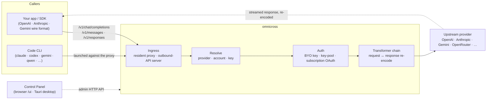

# omnicross

<div align="center">

[](https://opensource.org/licenses/MIT) [](https://nodejs.org/) [](https://www.typescriptlang.org/) [](https://www.npmjs.com/package/@omnicross/core)

[English](../README.md) · [简体中文](README.zh.md) · [繁體中文](README.zh-Hant.md) · [日本語](README.ja.md) · [한국어](README.ko.md) · [Français](README.fr.md) · [Deutsch](README.de.md) · **Italiano** · [Español (España)](README.es-ES.md) · [Español (Latinoamérica)](README.es-419.md) · [Português (Brasil)](README.pt-BR.md) · [Português (Portugal)](README.pt-PT.md) · [Nederlands](README.nl.md) · [Dansk](README.da.md) · [Svenska](README.sv.md) · [Norsk bokmål](README.nb.md) · [Suomi](README.fi.md) · [Polski](README.pl.md) · [Čeština](README.cs.md) · [Magyar](README.hu.md) · [Română](README.ro.md) · [Български](README.bg.md) · [Русский](README.ru.md) · [Українська](README.uk.md) · [Ελληνικά](README.el.md) · [Türkçe](README.tr.md) · [العربية](README.ar.md) · [ไทย](README.th.md) · [Tiếng Việt](README.vi.md) · [Bahasa Indonesia](README.id.md) · [Bahasa Melayu](README.ms.md)

**Un nucleo universale per la distribuzione di LLM — instrada, trasforma e proxy qualsiasi provider dietro un unico set di API.**

</div>

---

`omnicross` riceve una richiesta LLM in ingresso — OpenAI `/v1/chat/completions`, Anthropic `/v1/messages`, Gemini e altri — determina **quale provider, account e chiave** debba rispondere (le proprie chiavi API, un pool multi-chiave o un'identità OAuth da abbonamento), la esegue attraverso una pipeline di trasformazione + autenticazione e la inoltra a monte — ricodificando la risposta nel formato wire richiesto dal chiamante.

È disponibile in diverse forme:

- **🖥️ Come app desktop** — una finestra nativa Tauri v2 (`apps/desktop`) che presenta la GUI completa del Pannello di Controllo e include e gestisce il daemon (area di notifica, avvio automatico, ciclo di vita del daemon). **Il modo principale con cui la maggior parte delle persone usa omnicross** — nessun terminale, nessun npm, nessuna configurazione CORS.
- **🌐 Nel browser** — preferisci non installare un'app nativa? `omnicross ui` avvia il daemon e apre la stessa GUI nel browser (servita dal daemon stesso su `/ui` — stessa origine, nessuna configurazione aggiuntiva) per gestire provider, chiavi, account e avvii di Code CLI.
- **🚀 Come daemon headless** — il CLI/daemon `omnicross`: un processo Node puro con un'API HTTP locale, una dashboard di amministrazione e comandi per chiavi, provider, accesso OAuth e avvio di Code CLI. Perfetto per server e flussi di lavoro orientati al terminale; è anche ciò che alimenta l'app desktop e il Pannello di Controllo nel browser.
- **📦 Come libreria** — `npm install @omnicross/core` e incorpora il nucleo di distribuzione direttamente in qualsiasi progetto Node.

Il nucleo di distribuzione stesso è puro Node — nessun Electron, nessun lock-in su framework; la UI è una semplice web app e la shell desktop è un sottile livello Tauri sopra di essa.

## 🏗️ Architettura

Una richiesta in ingresso entra attraverso un **ingress** (il proxy residente in-process, o il server API standalone outbound), viene risolta in un **provider + identità**, viene convertita dalla **catena di trasformatori** e viene inoltrata a **monte** — poi la risposta fluisce a ritroso attraverso la stessa catena, ricodificata nel formato wire del chiamante.



| Componente | Posizione |
| --- | --- |
| Frontend del Pannello di Controllo (Vite + React) | `@omnicross/ui` (`packages/ui` — pubblica solo il `dist/` compilato) |
| Shell desktop (Tauri v2) | `apps/desktop` |
| Runtime standalone (API HTTP · dashboard · CLI · serve la UI su `/ui`) | `@omnicross/daemon` |
| Ingress · dispatch · trasformatore · proxy | `@omnicross/core` |
| OAuth abbonamento + strategie di autenticazione | `@omnicross/subscriptions` |
| Tipi di contratto condivisi + preset provider | `@omnicross/contracts` |
| Avvio di Code CLI (proxy-env + supervisor) | `@omnicross/cli-launcher` |

## ✨ Funzionalità

- **GUI Pannello di Controllo** — una UI React sull'API admin localhost del daemon: gestisci provider, chiavi e account abbonamento visualmente invece che tramite file di configurazione. Disponibile come app desktop nativa Tauri v2 (il modo abituale di accedere — area di notifica, avvio automatico, daemon incluso, nessun Electron), oppure servita nel browser con un singolo comando (`omnicross ui`).
- **Formato wire universale** — accetta richieste in formato OpenAI / Anthropic / Gemini e le indirizza a un provider che parla un formato *diverso*; la pipeline di trasformatori converte sia la richiesta che la risposta in streaming.
- **Chiavi proprie + pool multi-chiave** — associa le tue chiavi provider oppure crea un pool di molte chiavi per provider con round-robin pesato e failover automatico su `429 / 529 / 401 / 403`.
- **Abbonamento come provider** — instrada le richieste tramite un abbonamento Claude / ChatGPT (Codex) / Gemini via OAuth, o una chiave bearer OpenCodeGo, invece di una chiave API a consumo.
- **Preset provider** — un catalogo curato di endpoint/template provider (OpenAI, Anthropic, Gemini, DeepSeek, OpenRouter, Groq, Mistral e molti altri) che puoi mappare su una riga di configurazione con un singolo comando.
- **Proxy nativo per lo streaming** — un proxy residente in-process trasmette verbatim i flussi SSE dove i formati coincidono, e li ricodifica dove non coincidono.
- **Avvio di Code CLI** — avvia `claude` / `codex` / `gemini` / `qwen` / `copilot` / `opencode` contro un proxy locale in modo che una sessione CLI possa girare su **qualsiasi** provider o abbonamento configurato.
- **Agnostico all'host e tipizzato** — puro Node + TypeScript, tipi di contratto leggeri pubblicati separatamente, zero accoppiamento con qualsiasi app host.

## 📦 Struttura

Questo è un monorepo a workspace singolo: i pacchetti pubblicabili si trovano in `packages/`, le app eseguibili in `apps/`. I nomi dei pacchetti npm mantengono il prefisso `@omnicross/`; i nomi delle directory omettono il prefisso `omnicross-`.

| App | Descrizione |
| --- | --- |
| `apps/desktop` | **omnicross-desktop** — l'app desktop nativa Tauri v2: avvolge il frontend `@omnicross/ui` in una finestra nativa e include e gestisce il daemon (area di notifica, avvio automatico, ciclo di vita del daemon). Vedi [`apps/desktop/README.md`](../apps/desktop/README.md). |

I pacchetti pubblicati:

| Pacchetto | npm | Descrizione |
| --- | --- | --- |
| `packages/contracts` | [`@omnicross/contracts`](https://www.npmjs.com/package/@omnicross/contracts) | Tipi di contratto leggeri + helper per valori a runtime (configurazione LLM, tipi completion/chat, preset provider, configurazione thinking, utilizzo, tipi token abbonamento/account). Consumati tramite subpath (`@omnicross/contracts/llm-config`, `/provider-presets`, …). |
| `packages/core` | [`@omnicross/core`](https://www.npmjs.com/package/@omnicross/core) | Il nucleo di distribuzione — dispatch provider, pipeline completion, trasformatori, proxy provider e superficie API outbound. |
| `packages/subscriptions` | [`@omnicross/subscriptions`](https://www.npmjs.com/package/@omnicross/subscriptions) | Strategie di autenticazione abbonamento-come-provider, flussi OAuth (Claude / Codex / Gemini) e dispatcher dello scenario OpenCodeGo. |
| `packages/cli-launcher` | [`@omnicross/cli-launcher`](https://www.npmjs.com/package/@omnicross/cli-launcher) | Il meccanismo `ProcessSupervisor` per il ciclo di vita dei sottoprocessi + builder di configurazione di avvio proxy-env per ciascun CLI. |
| `packages/daemon` | [`@omnicross/daemon`](https://www.npmjs.com/package/@omnicross/daemon) | Un embedder Node puro di `@omnicross/core` con API HTTP admin + dashboard, il CLI `omnicross` e distribuzione same-origin del Pannello di Controllo su `/ui`. |
| `packages/ui` | [`@omnicross/ui`](https://www.npmjs.com/package/@omnicross/ui) | Il frontend del Pannello di Controllo (Vite + React). Pubblica solo il `dist/` compilato (asset statici, zero dipendenze a runtime); il daemon lo serve su `/ui`, la shell Tauri lo avvolge. |

## 🚀 Avvio rapido

### Opzione A — App desktop (consigliata per la maggior parte degli utenti)

Scarica il programma di installazione per il tuo sistema operativo dall'[ultima release](https://github.com/Dumoedss/omnicross/releases/latest) ed eseguilo:

- **Windows** — `*-setup.exe` (NSIS) oppure `*.msi`
- **macOS** — `*.dmg` (universale — Apple Silicon + Intel)
- **Linux** — `*.AppImage`, `*.deb` oppure `*.rpm`

L'app include e gestisce tutto per te — il daemon **e** un runtime Node privato — quindi non c'è nient'altro da installare. Basta scaricare, eseguire il programma di installazione e aprirlo.

> Vuoi compilarlo tu stesso? Vedi [`apps/desktop/README.md`](../apps/desktop/README.md) (`npm run build:app`, richiede Rust).

### Opzione B — Pannello di Controllo nel browser

Preferisci non installare un'app? Un solo comando — il daemon serve la stessa UI (stessa origine della sua API admin — nessun CORS, nessun `.env`):

```bash
npm install -g @omnicross/daemon
omnicross ui --config ./omnicross.config.json   # avvia il daemon + apre http://127.0.0.1:8766/ui/
```

Aggiungi `--no-open` per saltare l'apertura del browser. I flussi di sviluppo frontend si trovano in [`packages/ui/README.md`](../packages/ui/README.md).

### Opzione C — Daemon headless

Tutto ciò che fa l'app — e altro ancora — è disponibile dal terminale:

```bash
npm install -g @omnicross/daemon
```

```bash
# Avvia il daemon (distribuzione BYO-key) con un file di configurazione
omnicross start --config ./omnicross.config.json

# Mappa un preset provider curato + la tua chiave nella configurazione
omnicross providers presets --config ./omnicross.config.json
omnicross providers add openai --key $OPENAI_API_KEY --config ./omnicross.config.json

# Crea una chiave API locale per i tuoi client (mostrata una sola volta)
omnicross keys add my-app --config ./omnicross.config.json

# Accedi a un abbonamento tramite browser OAuth (claude | codex | gemini)
omnicross login claude --config ./omnicross.config.json

# Avvia un Code CLI contro il proxy in-process su qualsiasi provider configurato
omnicross launch claude --provider openai --model gpt-4o --config ./omnicross.config.json
```

Esegui `omnicross --help` per l'elenco completo dei comandi.

### Opzione D — Come libreria

```bash
npm install @omnicross/core @omnicross/contracts
```

```ts
import type { LLMProvider } from '@omnicross/contracts/llm-config';
// import the serving-core pieces you need from @omnicross/core

// Wire the serving core into your own Node app: supply a provider-config
// source + key store, then route inbound requests through the proxy.
```

> I subpath import mantengono il grafo delle dipendenze compatto, ad es.
> `@omnicross/contracts/provider-presets`, `@omnicross/core/provider-proxy`.

## 🛠️ Sviluppo

```bash
git clone https://github.com/Dumoedss/omnicross.git
cd omnicross
npm install          # workspace symlinks for @omnicross/* + external deps
npm run typecheck    # tsc --noEmit per package
npm test             # vitest (tests run against src via aliases)
npm run build        # tsup per package → dist/ (ESM + CJS + .d.ts)
```

I test e i controlli dei tipi risolvono le importazioni `@omnicross/*` al **sorgente** del pacchetto tramite alias, quindi non è necessaria nessuna compilazione preliminare. `npm run build` emette il `dist/` di ciascun pacchetto per la pubblicazione.

Per lo sviluppo del Pannello di Controllo, `npm run dev` (dalla radice del repository) è il ciclo one-command: al primo avvio genera un `omnicross.dev.config.json` ignorato da git, avvia il daemon su `127.0.0.1:8766` e avvia il server di sviluppo Vite della UI su `http://localhost:1430` (Ctrl+C arresta entrambi). Il server di sviluppo fa il proxy di `/admin/*` verso il daemon lato server, così il browser rimane sempre sulla stessa origine — il daemon non invia intestazioni CORS per design. Il frontend stesso è il pacchetto workspace `@omnicross/ui` — `npm run build -w @omnicross/ui` aggiorna il `dist/` servito dal daemon. Per la finestra nativa (richiede Rust): `npm run dev:app` esegue `tauri dev`, e `npm run build:app` pacchettizza l'eseguibile di rilascio + i programmi di installazione con il runtime del daemon **e un binario Node privato** inclusi (output sotto `apps/desktop/src-tauri/target/release/`; i computer di destinazione non necessitano di nulla installato — dettagli in [`apps/desktop/README.md`](../apps/desktop/README.md)).

## 📄 Licenza

[MIT](../LICENSE) 

Porzioni di `@omnicross/core` e di altri pacchetti adattano lavori di terze parti sotto le rispettive licenze — vedi i file `NOTICE` nei rispettivi pacchetti.
