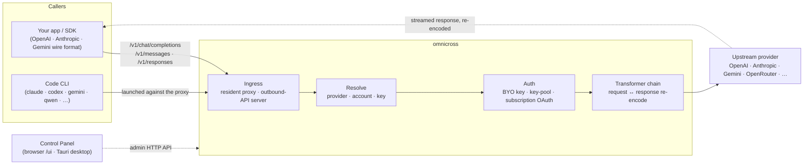

# omnicross

<div align="center">

[](https://opensource.org/licenses/MIT) [](https://nodejs.org/) [](https://www.typescriptlang.org/) [](https://www.npmjs.com/package/@omnicross/core)

[English](../README.md) · [简体中文](README.zh.md) · [繁體中文](README.zh-Hant.md) · **日本語** · [한국어](README.ko.md) · [Français](README.fr.md) · [Deutsch](README.de.md) · [Italiano](README.it.md) · [Español (España)](README.es-ES.md) · [Español (Latinoamérica)](README.es-419.md) · [Português (Brasil)](README.pt-BR.md) · [Português (Portugal)](README.pt-PT.md) · [Nederlands](README.nl.md) · [Dansk](README.da.md) · [Svenska](README.sv.md) · [Norsk bokmål](README.nb.md) · [Suomi](README.fi.md) · [Polski](README.pl.md) · [Čeština](README.cs.md) · [Magyar](README.hu.md) · [Română](README.ro.md) · [Български](README.bg.md) · [Русский](README.ru.md) · [Українська](README.uk.md) · [Ελληνικά](README.el.md) · [Türkçe](README.tr.md) · [العربية](README.ar.md) · [ไทย](README.th.md) · [Tiếng Việt](README.vi.md) · [Bahasa Indonesia](README.id.md) · [Bahasa Melayu](README.ms.md)

**汎用 LLM サービングコア — 単一の API セットの背後で任意のプロバイダーをルーティング、変換、プロキシ。**

</div>

---

`omnicross` は受信した LLM リクエスト — OpenAI `/v1/chat/completions`、Anthropic `/v1/messages`、Gemini など — を受け取り、**どのプロバイダー、アカウント、キー**が応答すべきか（自前の API キー、マルチキープール、またはサブスクリプション OAuth アイデンティティ）を判断し、トランスフォーマー + 認証パイプラインを通じて処理した上でアップストリームへプロキシし、レスポンスを呼び出し側が要求したワイヤーフォーマットに再エンコードして返します。

いくつかの形態で提供されます。

- **🖥️ デスクトップアプリとして** — ネイティブの Tauri v2 ウィンドウ（`apps/desktop`）として、完全なコントロールパネル GUI を提供し、デーモンのバンドルと管理（トレイ、自動起動、デーモンライフサイクル）を行います。**ほとんどのユーザーが omnicross を使う主な方法** — ターミナル不要、npm 不要、CORS 設定不要。
- **🌐 ブラウザで** — ネイティブアプリをインストールしたくない場合は、`omnicross ui` でデーモンを起動し、同一の GUI をブラウザで開きます（デーモン自身が `/ui` で配信 — 同一オリジン、追加設定不要）。プロバイダー、キー、アカウント、Code CLI の起動を視覚的に管理できます。
- **🚀 ヘッドレスデーモンとして** — `omnicross` CLI/デーモン: ローカル HTTP API、管理ダッシュボード、キー・プロバイダー・OAuth ログイン・Code CLI 起動のためのコマンドを備えた純粋な Node プロセス。サーバーやターミナル優先のワークフローに最適で、デスクトップアプリとブラウザコントロールパネルを動かすエンジンでもあります。
- **📦 ライブラリとして** — `npm install @omnicross/core` で、サービングコアを任意の Node プロジェクトに直接組み込みます。

サービングコア自体は純粋な Node — Electron なし、フレームワーク依存なし。UI は普通の Web アプリで、デスクトップシェルはその上に被せた薄い Tauri レイヤーです。

## 🏗️ アーキテクチャ

受信リクエストは **インgresss**（常駐インプロセスプロキシ、またはスタンドアロンのアウトバウンド API サーバー）を通じて入り、**プロバイダー + アイデンティティ**に解決され、**トランスフォーマーチェーン**で変換された後、**アップストリーム**へプロキシされます — そしてレスポンスが同じチェーンを逆方向にストリームし、呼び出し側のワイヤーフォーマットに再エンコードされます。



| 構成要素 | 場所 |
| --- | --- |
| コントロールパネルフロントエンド（Vite + React） | `@omnicross/ui`（`packages/ui` — ビルド済み `dist/` のみ公開） |
| デスクトップシェル（Tauri v2） | `apps/desktop` |
| スタンドアロンランタイム（HTTP API · ダッシュボード · CLI · `/ui` で UI を配信） | `@omnicross/daemon` |
| インgresss · ディスパッチ · トランスフォーマー · プロキシ | `@omnicross/core` |
| サブスクリプション OAuth + 認証ストラテジー | `@omnicross/subscriptions` |
| 共有コントラクト型 + プロバイダープリセット | `@omnicross/contracts` |
| Code CLI 起動（proxy-env + スーパーバイザー） | `@omnicross/cli-launcher` |

## ✨ 機能

- **コントロールパネル GUI** — デーモンのローカル admin API 上の React UI: 設定ファイルを手動編集する代わりに、プロバイダー、キー、サブスクリプションアカウントを視覚的に管理できます。ネイティブの Tauri v2 デスクトップアプリ（日常的な入口 — トレイ、自動起動、バンドル済みデーモン、Electron なし）として、またはコマンド一発（`omnicross ui`）でブラウザから利用できます。
- **任意形式間の変換** — OpenAI / Anthropic / Gemini 形式のリクエストを受け付け、*異なる*形式を話すプロバイダーをターゲットにできます。トランスフォーマーパイプラインがリクエストとストリームレスポンスの両方を変換します。
- **BYO キー + マルチキープール** — 自前のプロバイダーキーをバインドするか、プロバイダーごとに複数キーをプールして重み付きラウンドロビンと `429 / 529 / 401 / 403` 時の自動フェイルオーバーを利用できます。
- **サブスクリプションをプロバイダーとして** — 従量課金の API キーの代わりに、OAuth 経由で Claude / ChatGPT (Codex) / Gemini サブスクリプションを通じてリクエストを処理するか、OpenCodeGo ベアラーキーを使用します。
- **プロバイダープリセット** — 厳選されたプロバイダーエンドポイント/テンプレートのカタログ（OpenAI、Anthropic、Gemini、DeepSeek、OpenRouter、Groq、Mistral など多数）をコマンド一発で設定行にマッピングできます。
- **ストリーミングネイティブプロキシ** — 常駐インプロセスプロキシはフォーマットが一致する場合は SSE ストリームをそのまま中継し、一致しない場合は再エンコードします。
- **Code CLI ランチャー** — `claude` / `codex` / `gemini` / `qwen` / `copilot` / `opencode` をローカルプロキシに対して起動し、CLI セッションを設定した**任意の**プロバイダーまたはサブスクリプションで実行できます。
- **ホスト非依存 & 型付き** — 純粋な Node + TypeScript、依存関係が軽量なコントラクト型を別途公開、あらゆるホストアプリへのゼロ結合。

## 📦 レイアウト

これは単一ワークスペースのモノレポです。公開可能なパッケージは `packages/` に、実行可能なアプリは `apps/` にあります。npm パッケージ名は `@omnicross/` スコープを保持し、ディレクトリ名から `omnicross-` プレフィックスは取り除かれています。

| アプリ | 内容 |
| --- | --- |
| `apps/desktop` | **omnicross-desktop** — ネイティブ Tauri v2 デスクトップアプリ: `@omnicross/ui` フロントエンドをネイティブウィンドウでラップし、デーモンをバンドル・管理します（トレイ、自動起動、デーモンライフサイクル）。[`apps/desktop/README.md`](../apps/desktop/README.md) を参照。 |

公開パッケージ:

| パッケージ | npm | 内容 |
| --- | --- | --- |
| `packages/contracts` | [`@omnicross/contracts`](https://www.npmjs.com/package/@omnicross/contracts) | 依存関係が軽量なコントラクト型 + ランタイム値ヘルパー（LLM 設定、completion/chat 型、プロバイダープリセット、thinking 設定、使用量、サブスクリプション/アカウントトークン型）。サブパス経由でインポート（`@omnicross/contracts/llm-config`、`/provider-presets` など）。 |
| `packages/core` | [`@omnicross/core`](https://www.npmjs.com/package/@omnicross/core) | サービングコア — プロバイダーディスパッチ、completion パイプライン、トランスフォーマー、プロバイダープロキシ、およびアウトバウンド API サーフェス。 |
| `packages/subscriptions` | [`@omnicross/subscriptions`](https://www.npmjs.com/package/@omnicross/subscriptions) | サブスクリプション as プロバイダー認証ストラテジー、OAuth フロー（Claude / Codex / Gemini）、および OpenCodeGo シナリオディスパッチャー。 |
| `packages/cli-launcher` | [`@omnicross/cli-launcher`](https://www.npmjs.com/package/@omnicross/cli-launcher) | `ProcessSupervisor` サブプロセスライフサイクル機構 + CLI ごとの proxy-env 起動設定ビルダー。 |
| `packages/daemon` | [`@omnicross/daemon`](https://www.npmjs.com/package/@omnicross/daemon) | admin HTTP API + ダッシュボード、`omnicross` CLI を備えた `@omnicross/core` の純粋 Node エンベッダー。`/ui` でコントロールパネルを同一オリジン配信します。 |
| `packages/ui` | [`@omnicross/ui`](https://www.npmjs.com/package/@omnicross/ui) | コントロールパネルフロントエンド（Vite + React）。ビルド済み `dist/` のみ公開（静的アセット、ランタイム依存ゼロ）。デーモンが `/ui` で配信し、Tauri シェルがラップします。 |

## 🚀 クイックスタート

### オプション A — デスクトップアプリ（ほとんどのユーザーにお勧め）

[最新リリース](https://github.com/Dumoedss/omnicross/releases/latest) から OS 用のインストーラーをダウンロードして実行します。

- **Windows** — `*-setup.exe`（NSIS）または `*.msi`
- **macOS** — `*.dmg`（ユニバーサル — Apple Silicon + Intel）
- **Linux** — `*.AppImage`、`*.deb`、または `*.rpm`

アプリはデーモン**と**プライベート Node ランタイムをすべてバンドルして管理するため、他に何もインストールする必要はありません。ダウンロードして、インストーラーを実行し、開くだけです。

> 自分でビルドしたい場合は [`apps/desktop/README.md`](../apps/desktop/README.md) を参照してください（`npm run build:app`、Rust が必要）。

### オプション B — ブラウザでコントロールパネル

アプリをインストールしたくない場合は、コマンド一発 — デーモン自身が同じ UI を配信します（admin API と同一オリジン — CORS なし、`.env` 不要）:

```bash
npm install -g @omnicross/daemon
omnicross ui --config ./omnicross.config.json   # boots the daemon + opens http://127.0.0.1:8766/ui/
```

`--no-open` を追加するとブラウザの起動をスキップできます。フロントエンド開発ワークフローは [`packages/ui/README.md`](../packages/ui/README.md) を参照してください。

### オプション C — ヘッドレスデーモン

アプリが行うすべてのこと — それ以上のことも — ターミナルから利用できます:

```bash
npm install -g @omnicross/daemon
```

```bash
# Boot the daemon (BYO-key serving) against a config file
omnicross start --config ./omnicross.config.json

# Map a curated provider preset + your key into the config
omnicross providers presets --config ./omnicross.config.json
omnicross providers add openai --key $OPENAI_API_KEY --config ./omnicross.config.json

# Mint a local API key for your clients (shown once)
omnicross keys add my-app --config ./omnicross.config.json

# Log in to a subscription via browser OAuth (claude | codex | gemini)
omnicross login claude --config ./omnicross.config.json

# Launch a Code CLI against the in-process proxy on any configured provider
omnicross launch claude --provider openai --model gpt-4o --config ./omnicross.config.json
```

完全なコマンドリストは `omnicross --help` を実行してください。

### オプション D — ライブラリとして

```bash
npm install @omnicross/core @omnicross/contracts
```

```ts
import type { LLMProvider } from '@omnicross/contracts/llm-config';
// import the serving-core pieces you need from @omnicross/core

// Wire the serving core into your own Node app: supply a provider-config
// source + key store, then route inbound requests through the proxy.
```

> サブパスインポートにより依存グラフをコンパクトに保てます。例:
> `@omnicross/contracts/provider-presets`、`@omnicross/core/provider-proxy`。

## 🛠️ 開発

```bash
git clone https://github.com/Dumoedss/omnicross.git
cd omnicross
npm install          # workspace symlinks for @omnicross/* + external deps
npm run typecheck    # tsc --noEmit per package
npm test             # vitest (tests run against src via aliases)
npm run build        # tsup per package → dist/ (ESM + CJS + .d.ts)
```

テストと型チェックはエイリアス経由で `@omnicross/*` インポートをパッケージの**ソース**に解決するため、事前ビルドは不要です。`npm run build` で各パッケージの公開用 `dist/` が生成されます。

コントロールパネルの開発では、リポジトリルートの `npm run dev` が一発起動のコマンドです。初回実行時に gitignore された `omnicross.dev.config.json` を生成し、`127.0.0.1:8766` でデーモンを起動し、`http://localhost:1430` で UI の Vite 開発サーバーを起動します（Ctrl+C で両方停止）。開発サーバーはサーバー側で `/admin/*` をデーモンにプロキシするため、ブラウザは常に同一オリジン — デーモンは設計上 CORS ヘッダーを送りません。フロントエンド自体は `@omnicross/ui` ワークスペースパッケージ — `npm run build -w @omnicross/ui` でデーモンが配信する `dist/` を更新します。ネイティブウィンドウ（Rust 必須）: `npm run dev:app` で `tauri dev` を実行し、`npm run build:app` でリリース実行ファイル + インストーラーをパッケージングします（デーモンランタイム**とプライベート Node バイナリ**がバンドルされており、出力は `apps/desktop/src-tauri/target/release/` 以下。ターゲットマシンには何もインストール不要 — 詳細は [`apps/desktop/README.md`](../apps/desktop/README.md) を参照）。

## 📄 ライセンス

[MIT](../LICENSE) 

`@omnicross/core` およびその他のパッケージの一部は、それぞれ独自のライセンスのもとでサードパーティの成果物を改変して利用しています — 各パッケージ内の `NOTICE` ファイルを参照してください。
