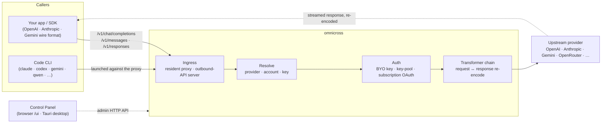

# omnicross

<div align="center">

[](https://opensource.org/licenses/MIT) [](https://nodejs.org/) [](https://www.typescriptlang.org/) [](https://www.npmjs.com/package/@omnicross/core)

[English](../README.md) · [简体中文](README.zh.md) · [繁體中文](README.zh-Hant.md) · [日本語](README.ja.md) · **한국어** · [Français](README.fr.md) · [Deutsch](README.de.md) · [Italiano](README.it.md) · [Español (España)](README.es-ES.md) · [Español (Latinoamérica)](README.es-419.md) · [Português (Brasil)](README.pt-BR.md) · [Português (Portugal)](README.pt-PT.md) · [Nederlands](README.nl.md) · [Dansk](README.da.md) · [Svenska](README.sv.md) · [Norsk bokmål](README.nb.md) · [Suomi](README.fi.md) · [Polski](README.pl.md) · [Čeština](README.cs.md) · [Magyar](README.hu.md) · [Română](README.ro.md) · [Български](README.bg.md) · [Русский](README.ru.md) · [Українська](README.uk.md) · [Ελληνικά](README.el.md) · [Türkçe](README.tr.md) · [العربية](README.ar.md) · [ไทย](README.th.md) · [Tiếng Việt](README.vi.md) · [Bahasa Indonesia](README.id.md) · [Bahasa Melayu](README.ms.md)

**범용 LLM 서빙 코어 — 하나의 API 세트로 모든 제공업체를 라우팅, 변환, 프록시합니다.**

</div>

---

**omnicross는 기존 구독이나 API Key 하나로 모든 AI 앱과 코딩 CLI를 한 곳에서 운용합니다.**

Claude Code, Codex, Gemini CLI — 또는 OpenAI / Anthropic / Gemini API를 사용하는 어떤 앱이든 — 을 omnicross에 연결하면, 각 요청을 사용자가 선택한 제공업체와 모델로 라우팅합니다. 할 수 있는 것:

- **Claude / ChatGPT / Gemini 구독 로그인**으로 실행하여 종량제 API Key 없이 사용;
- 여러 API Key를 **키 풀**로 묶어 자동 순환 및 페일오버;
- 한 가지 API 형식만 지원하는 도구로도 다른 형식의 모델을 호출 — omnicross가 요청과 응답을 실시간으로 변환.

이 모든 것을 데스크톱 GUI에서 관리 — 설정 파일을 직접 편집할 필요 없음.

몇 가지 형태로 제공됩니다:

- **🖥️ 데스크톱 앱** — 완전한 컨트롤 패널 GUI를 제공하고 데몬을 번들링하여 관리하는 네이티브 Tauri v2 윈도우(`apps/desktop`)입니다(트레이, 자동 시작, 데몬 생명주기). **대부분의 사람들이 omnicross를 사용하는 주요 방법** — 터미널 없이, npm 없이, CORS 설정 없이.
- **🌐 브라우저에서** — 네이티브 앱을 설치하고 싶지 않으신가요? `omnicross ui`는 데몬을 시작하고 동일한 GUI를 브라우저에서 엽니다(데몬 자체가 `/ui`에서 제공 — 동일 출처, 추가 설정 없음). 제공업체, 키, 계정, Code CLI 실행을 시각적으로 관리할 수 있습니다.
- **🚀 헤드리스 데몬으로** — `omnicross` CLI/데몬: 로컬 HTTP API, 관리 대시보드, 그리고 키, 제공업체, OAuth 로그인, Code CLI 실행을 위한 명령어를 갖춘 순수 Node 프로세스입니다. 서버 및 터미널 중심 워크플로에 최적이며, 데스크톱 앱과 인브라우저 컨트롤 패널을 구동하는 엔진이기도 합니다.
- **📦 라이브러리로** — `npm install @omnicross/core`로 서빙 코어를 임의의 Node 프로젝트에 직접 임베드합니다.

서빙 코어 자체는 순수 Node입니다 — Electron 없이, 프레임워크 종속성 없이; UI는 평범한 웹 앱이며, 데스크톱 셸은 그 위에 얹힌 얇은 Tauri 레이어입니다.

## 🏗️ 아키텍처

인바운드 요청은 **인그레스**(상주 인프로세스 프록시 또는 독립형 아웃바운드 API 서버)를 통해 진입하고, **제공업체 + 아이덴티티**로 해석된 후, **트랜스포머 체인**에 의해 변환되어 **업스트림**으로 프록시됩니다 — 그런 다음 응답이 동일한 체인을 통해 스트리밍되어 호출자의 와이어 형식으로 다시 인코딩됩니다.



| 구성 요소 | 위치 |
| --- | --- |
| 컨트롤 패널 프론트엔드 (Vite + React) | `@omnicross/ui` (`packages/ui` — 빌드된 `dist/`만 배포) |
| 데스크톱 셸 (Tauri v2) | `apps/desktop` |
| 독립형 런타임 (HTTP API · 대시보드 · CLI · `/ui`에서 UI 제공) | `@omnicross/daemon` |
| 인그레스 · 디스패치 · 트랜스포머 · 프록시 | `@omnicross/core` |
| 구독 OAuth + 인증 전략 | `@omnicross/subscriptions` |
| 공유 컨트랙트 타입 + 제공업체 프리셋 | `@omnicross/contracts` |
| Code CLI 실행 (proxy-env + 슈퍼바이저) | `@omnicross/cli-launcher` |

## ✨ 기능

- **컨트롤 패널 GUI** — 데몬의 localhost 관리 API를 통한 React UI: 설정 파일 대신 시각적으로 제공업체, 키, 구독 계정을 관리합니다. 네이티브 Tauri v2 데스크톱 앱(일상적인 사용 방법 — 트레이, 자동 시작, 번들 데몬, Electron 없음)으로 제공되거나, 한 가지 명령(`omnicross ui`)으로 브라우저에서 사용할 수 있습니다.
- **임의 형식 간 변환** — OpenAI / Anthropic / Gemini 형식의 요청을 수신하고 *다른* 형식을 사용하는 제공업체로 전달합니다; 트랜스포머 파이프라인이 요청과 스트리밍 응답 모두를 변환합니다.
- **직접 보유 키 + 다중 키 풀** — 자신의 제공업체 키를 바인딩하거나, 제공업체당 여러 키를 풀링하여 가중치 라운드로빈 및 `429 / 529 / 401 / 403` 발생 시 자동 페일오버를 지원합니다.
- **구독을 제공업체로** — 종량제 API 키 대신 OAuth를 통해 Claude / ChatGPT (Codex) / Gemini 구독으로 요청을 처리하거나, OpenCodeGo 베어러 키를 사용합니다.
- **제공업체 프리셋** — 엄선된 제공업체 엔드포인트/템플릿 카탈로그(OpenAI, Anthropic, Gemini, DeepSeek, OpenRouter, Groq, Mistral 등 다수)를 한 가지 명령으로 설정 항목에 매핑할 수 있습니다.
- **스트리밍 네이티브 프록시** — 상주 인프로세스 프록시는 형식이 일치하면 SSE 스트림을 그대로 릴레이하고, 일치하지 않으면 재인코딩합니다.
- **Code CLI 런처** — `claude` / `codex` / `gemini` / `qwen` / `copilot` / `opencode`를 로컬 프록시에 연결하여 CLI 세션이 설정된 **모든** 제공업체나 구독에서 실행될 수 있게 합니다.
- **호스트 독립적 & 타입 안전** — 순수 Node + TypeScript, 컨트랙트 타입은 별도의 경량 패키지로 배포, 어떤 호스트 앱에도 종속되지 않습니다.

## 📦 구조

이것은 단일 워크스페이스 모노레포입니다: 배포 가능한 패키지는 `packages/`에, 실행 가능한 앱은 `apps/`에 있습니다. npm 패키지 이름은 `@omnicross/` 스코프를 유지하고, 디렉토리 이름에서는 `omnicross-` 접두사를 제거합니다.

| 앱 | 설명 |
| --- | --- |
| `apps/desktop` | **omnicross-desktop** — 네이티브 Tauri v2 데스크톱 앱: `@omnicross/ui` 프론트엔드를 네이티브 윈도우로 감싸고 데몬을 번들링하여 관리합니다(트레이, 자동 시작, 데몬 생명주기). [`apps/desktop/README.md`](../apps/desktop/README.md)를 참조하세요. |

배포된 패키지:

| 패키지 | npm | 설명 |
| --- | --- | --- |
| `packages/contracts` | [`@omnicross/contracts`](https://www.npmjs.com/package/@omnicross/contracts) | 경량 컨트랙트 타입 + 런타임 값 헬퍼(LLM 설정, completion/chat 타입, 제공업체 프리셋, thinking 설정, 사용량, 구독/계정 토큰 타입). 서브패스로 사용됩니다(`@omnicross/contracts/llm-config`, `/provider-presets`, …). |
| `packages/core` | [`@omnicross/core`](https://www.npmjs.com/package/@omnicross/core) | 서빙 코어 — 제공업체 디스패치, completion 파이프라인, 트랜스포머, 제공업체 프록시, 아웃바운드 API 표면. |
| `packages/subscriptions` | [`@omnicross/subscriptions`](https://www.npmjs.com/package/@omnicross/subscriptions) | 구독을 제공업체로 사용하는 인증 전략, OAuth 플로우(Claude / Codex / Gemini), OpenCodeGo 시나리오 디스패처. |
| `packages/cli-launcher` | [`@omnicross/cli-launcher`](https://www.npmjs.com/package/@omnicross/cli-launcher) | `ProcessSupervisor` 서브프로세스 생명주기 메커니즘 + CLI별 proxy-env 실행 설정 빌더. |
| `packages/daemon` | [`@omnicross/daemon`](https://www.npmjs.com/package/@omnicross/daemon) | 관리 HTTP API + 대시보드, `omnicross` CLI, 그리고 `/ui`에서 컨트롤 패널의 동일 출처 서빙을 갖춘 `@omnicross/core`의 순수 Node 임베더. |
| `packages/ui` | [`@omnicross/ui`](https://www.npmjs.com/package/@omnicross/ui) | 컨트롤 패널 프론트엔드(Vite + React). 빌드된 `dist/`만 배포합니다(정적 에셋, 런타임 의존성 없음); 데몬이 `/ui`에서 제공하고, Tauri 셸이 감쌉니다. |

## 🚀 빠른 시작

### 방법 A — 데스크톱 앱 (대부분의 사용자에게 권장)

[최신 릴리스](https://github.com/Dumoedss/omnicross/releases/latest)에서 운영체제에 맞는 설치 프로그램을 다운로드하여 실행하세요:

- **Windows** — `*-setup.exe` (NSIS) 또는 `*.msi`
- **macOS** — `*.dmg` (유니버설 — Apple Silicon + Intel)
- **Linux** — `*.AppImage`, `*.deb`, 또는 `*.rpm`

앱은 데몬 **그리고** 프라이빗 Node 런타임을 포함하여 모든 것을 번들링하고 관리하므로 별도로 설치할 필요가 없습니다. 다운로드하고, 설치 프로그램을 실행하고, 열기만 하면 됩니다.

> 직접 빌드하고 싶으신가요? [`apps/desktop/README.md`](../apps/desktop/README.md)를 참조하세요(`npm run build:app`, Rust 필요).

### 방법 B — 브라우저에서 컨트롤 패널

앱 설치를 원하지 않으신가요? 한 가지 명령 — 데몬이 동일한 UI를 직접 제공합니다(관리 API와 동일 출처 — CORS 없음, `.env` 불필요):

```bash
npm install -g @omnicross/daemon
omnicross ui --config ./omnicross.config.json   # boots the daemon + opens http://127.0.0.1:8766/ui/
```

`--no-open`을 추가하면 브라우저 자동 실행을 건너뜁니다. 프론트엔드 개발 워크플로는 [`packages/ui/README.md`](../packages/ui/README.md)에 있습니다.

### 방법 C — 헤드리스 데몬

앱이 하는 모든 것 — 그리고 그 이상 — 을 터미널에서 사용할 수 있습니다:

```bash
npm install -g @omnicross/daemon
```

```bash
# Boot the daemon (BYO-key serving) against a config file
omnicross start --config ./omnicross.config.json

# Map a curated provider preset + your key into the config
omnicross providers presets --config ./omnicross.config.json
omnicross providers add openai --key $OPENAI_API_KEY --config ./omnicross.config.json

# Mint a local API key for your clients (shown once)
omnicross keys add my-app --config ./omnicross.config.json

# Log in to a subscription via browser OAuth (claude | codex | gemini)
omnicross login claude --config ./omnicross.config.json

# Launch a Code CLI against the in-process proxy on any configured provider
omnicross launch claude --provider openai --model gpt-4o --config ./omnicross.config.json
```

전체 명령 목록은 `omnicross --help`를 실행하세요.

### 방법 D — 라이브러리로

```bash
npm install @omnicross/core @omnicross/contracts
```

```ts
import type { LLMProvider } from '@omnicross/contracts/llm-config';
// import the serving-core pieces you need from @omnicross/core

// Wire the serving core into your own Node app: supply a provider-config
// source + key store, then route inbound requests through the proxy.
```

> 서브패스 임포트는 의존성 그래프를 간결하게 유지합니다. 예:
> `@omnicross/contracts/provider-presets`, `@omnicross/core/provider-proxy`.

## 🛠️ 개발

```bash
git clone https://github.com/Dumoedss/omnicross.git
cd omnicross
npm install          # workspace symlinks for @omnicross/* + external deps
npm run typecheck    # tsc --noEmit per package
npm test             # vitest (tests run against src via aliases)
npm run build        # tsup per package → dist/ (ESM + CJS + .d.ts)
```

테스트와 타입 체크는 별칭을 통해 `@omnicross/*` 임포트를 패키지 **소스**로 해석하므로, 사전 빌드가 필요하지 않습니다. `npm run build`는 배포를 위한 각 패키지의 `dist/`를 생성합니다.

컨트롤 패널 개발 시, `npm run dev`(레포 루트)는 원스톱 루프입니다: 첫 실행 시 gitignore된 `omnicross.dev.config.json`을 생성하고, `127.0.0.1:8766`에서 데몬을 시작하며, `http://localhost:1430`에서 UI의 Vite 개발 서버를 시작합니다(Ctrl+C로 모두 종료). 개발 서버는 서버 측에서 `/admin/*`을 데몬으로 프록시하므로 브라우저는 항상 동일 출처를 유지합니다 — 데몬은 설계상 CORS 헤더를 전송하지 않습니다. 프론트엔드 자체는 `@omnicross/ui` 워크스페이스 패키지입니다 — `npm run build -w @omnicross/ui`로 데몬이 제공하는 `dist/`를 새로고침합니다. 네이티브 윈도우(Rust 필요): `npm run dev:app`은 `tauri dev`를 실행하고, `npm run build:app`은 릴리스 실행 파일 + 설치 프로그램을 패키징하며 데몬 런타임 **및 프라이빗 Node 바이너리**가 번들링됩니다(출력은 `apps/desktop/src-tauri/target/release/` 아래; 대상 머신에는 아무것도 설치할 필요 없음 — 자세한 내용은 [`apps/desktop/README.md`](../apps/desktop/README.md)를 참조).

## 📄 라이선스

[MIT](../LICENSE) 

`@omnicross/core` 및 기타 패키지의 일부는 각자의 라이선스 하에 서드파티 작업을 적용한 것입니다 — 각 패키지의 `NOTICE` 파일을 참조하세요.
