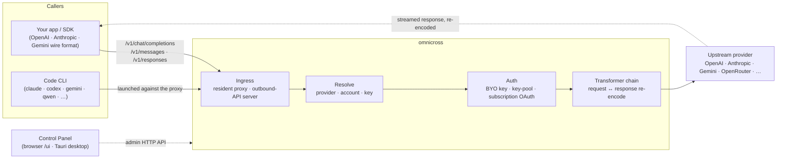

# omnicross

<div align="center">

[](https://opensource.org/licenses/MIT) [](https://nodejs.org/) [](https://www.typescriptlang.org/) [](https://www.npmjs.com/package/@omnicross/core)

[English](../README.md) · [简体中文](README.zh.md) · [繁體中文](README.zh-Hant.md) · [日本語](README.ja.md) · [한국어](README.ko.md) · [Français](README.fr.md) · [Deutsch](README.de.md) · [Italiano](README.it.md) · [Español (España)](README.es-ES.md) · [Español (Latinoamérica)](README.es-419.md) · [Português (Brasil)](README.pt-BR.md) · [Português (Portugal)](README.pt-PT.md) · [Nederlands](README.nl.md) · [Dansk](README.da.md) · [Svenska](README.sv.md) · [Norsk bokmål](README.nb.md) · [Suomi](README.fi.md) · [Polski](README.pl.md) · [Čeština](README.cs.md) · [Magyar](README.hu.md) · [Română](README.ro.md) · [Български](README.bg.md) · [Русский](README.ru.md) · [Українська](README.uk.md) · [Ελληνικά](README.el.md) · [Türkçe](README.tr.md) · [العربية](README.ar.md) · [ไทย](README.th.md) · [Tiếng Việt](README.vi.md) · [Bahasa Indonesia](README.id.md) · **Bahasa Melayu**

**Teras perkhidmatan LLM sejagat — laluan, transformasi, dan proksi mana-mana pembekal di sebalik satu set API.**

</div>

---

**omnicross menguasai semua aplikasi AI dan CLI pengekodan dari satu tempat — dengan langganan atau API Key sedia ada anda.**

Arahkan Claude Code, Codex, Gemini CLI — atau mana-mana aplikasi yang bercakap API OpenAI / Anthropic / Gemini — ke omnicross, dan ia akan menghala setiap permintaan kepada pembekal dan model yang anda pilih. Apa yang boleh anda lakukan:

- jalankan menggunakan **log masuk langganan Claude / ChatGPT / Gemini**, mengelak API Key berbayar-per-penggunaan;
- kumpulkan banyak API Key dengan giliran dan failover automatik;
- benarkan alat yang hanya bercakap satu format API memanggil model yang bercakap format lain — omnicross menterjemah permintaan dan respons pada masa nyata.

Semua ini diurus dalam GUI aplikasi desktop — tanpa perlu mengedit fail konfigurasi secara manual.

Ia dihantar dalam beberapa bentuk:

- **🖥️ Sebagai aplikasi desktop** — tetingkap Tauri v2 asli (`apps/desktop`) yang menampilkan GUI Panel Kawalan penuh dan menggabungkan serta mengurus daemon untuk anda (dulang, permulaan automatik, kitaran hayat daemon). **Cara utama kebanyakan orang menggunakan omnicross** — tiada terminal, tiada npm, tiada persediaan CORS.
- **🌐 Dalam pelayar anda** — lebih suka tidak memasang aplikasi asli? `omnicross ui` memulakan daemon dan membuka GUI yang sama dalam pelayar anda (dihidangkan oleh daemon sendiri di `/ui` — asal yang sama, tiada persediaan tambahan) untuk mengurus pembekal, kunci, akaun, dan pelancaran Code CLI.
- **🚀 Sebagai daemon tanpa kepala** — CLI/daemon `omnicross`: proses Node tulen dengan API HTTP setempat, papan pemuka admin, dan perintah untuk kunci, pembekal, log masuk OAuth, dan melancarkan Code CLI. Sesuai untuk pelayan dan aliran kerja terminal-dahulu; ia juga yang menguasai aplikasi desktop dan Panel Kawalan dalam pelayar.
- **📦 Sebagai pustaka** — `npm install @omnicross/core` dan benamkan teras perkhidmatan terus di dalam mana-mana projek Node.

Teras perkhidmatan itu sendiri adalah Node tulen — tiada Electron, tiada penguncian rangka kerja; UI adalah aplikasi web biasa, dan cangkerang desktop adalah lapisan Tauri nipis di atasnya.

## 🏗️ Seni Bina

Permintaan masuk memasuki melalui **ingress** (proksi dalam-proses pemastautin, atau pelayan API keluar bebas), diselesaikan kepada **pembekal + identiti**, ditukar oleh **rantai transformer**, dan diproksi **ke hulu** — kemudian respons mengalir balik melalui rantai yang sama, dikekod semula ke dalam format wayar pemanggil.



| Blok binaan | Lokasi |
| --- | --- |
| Bahagian hadapan Panel Kawalan (Vite + React) | `@omnicross/ui` (`packages/ui` — menerbitkan `dist/` yang telah dibina) |
| Cangkerang desktop (Tauri v2) | `apps/desktop` |
| Masa jalan bebas (API HTTP · papan pemuka · CLI · menghidangkan UI di `/ui`) | `@omnicross/daemon` |
| Ingress · penghantaran · transformer · proksi | `@omnicross/core` |
| Langganan OAuth + strategi pengesahan | `@omnicross/subscriptions` |
| Jenis kontrak dikongsi + pratetap pembekal | `@omnicross/contracts` |
| Pelancaran Code CLI (proxy-env + penyelia) | `@omnicross/cli-launcher` |

## ✨ Ciri-ciri

- **GUI Panel Kawalan** — UI React melalui API admin localhost daemon: urus pembekal, kunci, dan akaun langganan secara visual dan bukannya melalui fail konfigurasi. Dihantar sebagai aplikasi desktop Tauri v2 asli (cara harian masuk — dulang, permulaan automatik, daemon terbundel, tiada Electron), atau dihidangkan dalam pelayar anda dengan satu perintah (`omnicross ui`).
- **Format wayar apa-ke-apa** — terima permintaan berbentuk OpenAI / Anthropic / Gemini dan sasarkan pembekal yang bercakap format *berbeza*; saluran transformer menukar kedua-dua permintaan dan respons yang distrim.
- **Kunci BYO + kumpulan berbilang kunci** — ikat kunci pembekal anda sendiri, atau kumpulkan banyak kunci setiap pembekal dengan giliran berwajaran dan failover automatik pada `429 / 529 / 401 / 403`.
- **Langganan sebagai pembekal** — dorong permintaan melalui langganan Claude / ChatGPT (Codex) / Gemini melalui OAuth, atau kunci pembawa OpenCodeGo, dan bukannya kunci API bermeter.
- **Pratetap pembekal** — katalog terpilih titik akhir/templat pembekal (OpenAI, Anthropic, Gemini, DeepSeek, OpenRouter, Groq, Mistral, dan banyak lagi) yang boleh anda petakan ke baris konfigurasi dalam satu perintah.
- **Proksi asli penstriman** — proksi dalam-proses pemastautin menyampaikan strim SSE secara verbatim di mana format sepadan, dan mengekod semula di mana tidak sepadan.
- **Pelancar Code CLI** — mulakan `claude` / `codex` / `gemini` / `qwen` / `copilot` / `opencode` terhadap proksi setempat supaya sesi CLI boleh berjalan pada **mana-mana** pembekal atau langganan yang telah anda konfigurasikan.
- **Agnostik hos & bertaip** — Node + TypeScript tulen, jenis kontrak ringan-kebergantungan diterbitkan secara berasingan, tiada gandingan kepada mana-mana aplikasi hos.

## 📦 Susun Atur

Ini adalah monorepo satu-workspace: pakej yang boleh diterbitkan dalam `packages/`, aplikasi yang boleh dijalankan dalam `apps/`. Nama pakej npm mengekalkan skop `@omnicross/`; nama direktori menggugurkan awalan `omnicross-`.

| Aplikasi | Apakah ia |
| --- | --- |
| `apps/desktop` | **omnicross-desktop** — aplikasi desktop Tauri v2 asli: membungkus bahagian hadapan `@omnicross/ui` sebagai tetingkap asli dan menggabungkan serta mengurus daemon (dulang, permulaan automatik, kitaran hayat daemon). Lihat [`apps/desktop/README.md`](../apps/desktop/README.md). |

Pakej yang diterbitkan:

| Pakej | npm | Apakah ia |
| --- | --- | --- |
| `packages/contracts` | [`@omnicross/contracts`](https://www.npmjs.com/package/@omnicross/contracts) | Jenis kontrak ringan-kebergantungan + pembantu nilai masa jalan (konfigurasi LLM, jenis completion/chat, pratetap pembekal, konfigurasi pemikiran, penggunaan, jenis token langganan/akaun). Digunakan melalui subpath (`@omnicross/contracts/llm-config`, `/provider-presets`, …). |
| `packages/core` | [`@omnicross/core`](https://www.npmjs.com/package/@omnicross/core) | Teras perkhidmatan — penghantaran pembekal, saluran completion, transformer, proksi pembekal, dan permukaan API keluar. |
| `packages/subscriptions` | [`@omnicross/subscriptions`](https://www.npmjs.com/package/@omnicross/subscriptions) | Strategi pengesahan langganan-sebagai-pembekal, aliran OAuth (Claude / Codex / Gemini), dan penghantaran senario OpenCodeGo. |
| `packages/cli-launcher` | [`@omnicross/cli-launcher`](https://www.npmjs.com/package/@omnicross/cli-launcher) | Mekanisme kitaran hayat subproses `ProcessSupervisor` + pembina konfigurasi pelancaran proxy-env setiap CLI. |
| `packages/daemon` | [`@omnicross/daemon`](https://www.npmjs.com/package/@omnicross/daemon) | Pembenam Node tulen `@omnicross/core` dengan API HTTP admin + papan pemuka, CLI `omnicross`, dan penghidangan asal-sama Panel Kawalan di `/ui`. |
| `packages/ui` | [`@omnicross/ui`](https://www.npmjs.com/package/@omnicross/ui) | Bahagian hadapan Panel Kawalan (Vite + React). Menerbitkan hanya `dist/` yang telah dibina (aset statik, tiada kebergantungan masa jalan); daemon menghidangkannya di `/ui`, cangkerang Tauri membungkusnya. |

## 🚀 Mula Pantas

### Pilihan A — Aplikasi desktop (disyorkan untuk kebanyakan pengguna)

Muat turun pemasang untuk OS anda dari [keluaran terkini](https://github.com/Dumoedss/omnicross/releases/latest) dan jalankannya:

- **Windows** — `*-setup.exe` (NSIS) atau `*.msi`
- **macOS** — `*.dmg` (universal — Apple Silicon + Intel)
- **Linux** — `*.AppImage`, `*.deb`, atau `*.rpm`

Aplikasi menggabungkan dan mengurus segala-galanya untuk anda — daemon **dan** masa jalan Node peribadi — jadi tiada apa lagi yang perlu dipasang. Hanya muat turun, jalankan pemasang, dan buka.

> Ingin membinanya sendiri? Lihat [`apps/desktop/README.md`](../apps/desktop/README.md) (`npm run build:app`, memerlukan Rust).

### Pilihan B — Panel Kawalan dalam pelayar anda

Lebih suka tidak memasang aplikasi? Satu perintah — daemon menghidangkan UI yang sama sendiri (asal yang sama dengan API adminnya — tiada CORS, tiada `.env`):

```bash
npm install -g @omnicross/daemon
omnicross ui --config ./omnicross.config.json   # boots the daemon + opens http://127.0.0.1:8766/ui/
```

Tambah `--no-open` untuk melangkau pelancaran pelayar. Aliran kerja pembangunan bahagian hadapan ada dalam [`packages/ui/README.md`](../packages/ui/README.md).

### Pilihan C — Daemon tanpa kepala

Semua yang dilakukan aplikasi — dan lebih lagi — tersedia dari terminal:

```bash
npm install -g @omnicross/daemon
```

```bash
# Boot the daemon (BYO-key serving) against a config file
omnicross start --config ./omnicross.config.json

# Map a curated provider preset + your key into the config
omnicross providers presets --config ./omnicross.config.json
omnicross providers add openai --key $OPENAI_API_KEY --config ./omnicross.config.json

# Mint a local API key for your clients (shown once)
omnicross keys add my-app --config ./omnicross.config.json

# Log in to a subscription via browser OAuth (claude | codex | gemini)
omnicross login claude --config ./omnicross.config.json

# Launch a Code CLI against the in-process proxy on any configured provider
omnicross launch claude --provider openai --model gpt-4o --config ./omnicross.config.json
```

Jalankan `omnicross --help` untuk senarai perintah penuh.

### Pilihan D — Sebagai pustaka

```bash
npm install @omnicross/core @omnicross/contracts
```

```ts
import type { LLMProvider } from '@omnicross/contracts/llm-config';
// import the serving-core pieces you need from @omnicross/core

// Wire the serving core into your own Node app: supply a provider-config
// source + key store, then route inbound requests through the proxy.
```

> Import subpath mengekalkan graf kebergantungan padat, cth.
> `@omnicross/contracts/provider-presets`, `@omnicross/core/provider-proxy`.

## 🛠️ Membangun

```bash
git clone https://github.com/Dumoedss/omnicross.git
cd omnicross
npm install          # workspace symlinks for @omnicross/* + external deps
npm run typecheck    # tsc --noEmit per package
npm test             # vitest (tests run against src via aliases)
npm run build        # tsup per package → dist/ (ESM + CJS + .d.ts)
```

Ujian dan pemeriksaan jenis menyelesaikan import `@omnicross/*` ke **sumber** pakej melalui alias, jadi tiada bina awal diperlukan. `npm run build` mengeluarkan `dist/` setiap pakej untuk penerbitan.

Untuk pembangunan Panel Kawalan, `npm run dev` (akar repo) adalah gelung satu-perintah: ia menyemai `omnicross.dev.config.json` yang diabaikan git pada larian pertama, memulakan daemon pada `127.0.0.1:8766`, dan memulakan pelayan dev Vite UI pada `http://localhost:1430` (Ctrl+C menghentikan kedua-duanya). Pelayan dev memproksi `/admin/*` ke pelayan daemon, jadi pelayar kekal asal-sama — daemon tidak menghantar pengepala CORS mengikut reka bentuk. Bahagian hadapan itu sendiri adalah pakej workspace `@omnicross/ui` — `npm run build -w @omnicross/ui` menyegarkan `dist/` yang dihidangkan daemon. Untuk tetingkap asli (memerlukan Rust): `npm run dev:app` menjalankan `tauri dev`, dan `npm run build:app` membungkus boleh laksana keluaran + pemasang dengan masa jalan daemon **dan binari Node peribadi** yang digabungkan (output di bawah `apps/desktop/src-tauri/target/release/`; mesin sasaran tidak perlu memasang apa-apa — butiran dalam [`apps/desktop/README.md`](../apps/desktop/README.md)).

## 📄 Lesen

[MIT](../LICENSE) 

Bahagian `@omnicross/core` dan pakej lain menyesuaikan kerja pihak ketiga di bawah lesen masing-masing — lihat fail `NOTICE` dalam pakej yang berkenaan.
