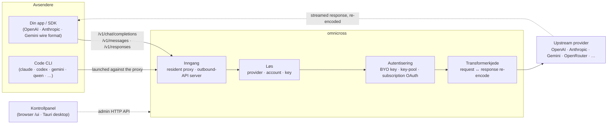

# omnicross

<div align="center">

[](https://opensource.org/licenses/MIT) [](https://nodejs.org/) [](https://www.typescriptlang.org/) [](https://www.npmjs.com/package/@omnicross/core)

[English](../README.md) · [简体中文](README.zh.md) · [繁體中文](README.zh-Hant.md) · [日本語](README.ja.md) · [한국어](README.ko.md) · [Français](README.fr.md) · [Deutsch](README.de.md) · [Italiano](README.it.md) · [Español (España)](README.es-ES.md) · [Español (Latinoamérica)](README.es-419.md) · [Português (Brasil)](README.pt-BR.md) · [Português (Portugal)](README.pt-PT.md) · [Nederlands](README.nl.md) · [Dansk](README.da.md) · [Svenska](README.sv.md) · **Norsk bokmål** · [Suomi](README.fi.md) · [Polski](README.pl.md) · [Čeština](README.cs.md) · [Magyar](README.hu.md) · [Română](README.ro.md) · [Български](README.bg.md) · [Русский](README.ru.md) · [Українська](README.uk.md) · [Ελληνικά](README.el.md) · [Türkçe](README.tr.md) · [العربية](README.ar.md) · [ไทย](README.th.md) · [Tiếng Việt](README.vi.md) · [Bahasa Indonesia](README.id.md) · [Bahasa Melayu](README.ms.md)

**En universell LLM-serverkjerne — rut, transformer og proxyer enhver leverandør bak ett sett med APIer.**

</div>

---

`omnicross` tar imot en innkommende LLM-forespørsel — OpenAI `/v1/chat/completions`, Anthropic `/v1/messages`, Gemini og mer — finner ut **hvilken leverandør, konto og nøkkel** som skal svare (dine egne API-nøkler, en fler-nøkkel-pool, eller en abonnements-OAuth-identitet), kjører den gjennom en transformer- og autentiseringspipeline, og proxyer den oppstrøms — og re-enkoder svaret tilbake til det trådformatet avsenderen ba om.

Den leveres i noen former:

- **🖥️ Som en skrivebordsapp** — et innebygd Tauri v2-vindu (`apps/desktop`) som presenterer et fullstendig kontrollpanel-GUI og samler og administrerer daemonen for deg (systemkurv, autostart, daemon-livssyklus). **Den viktigste måten de fleste bruker omnicross på** — ingen terminal, ingen npm, ingen CORS-oppsett.
- **🌐 I nettleseren din** — foretrekker du å ikke installere en innebygd app? `omnicross ui` starter daemonen og åpner det samme GUI-et i nettleseren din (servert av daemonen selv på `/ui` — samme opphav, ingen ekstra oppsett) for å administrere leverandører, nøkler, kontoer og Code CLI-lanseringer.
- **🚀 Som en headless daemon** — `omnicross` CLI/daemon: en ren Node-prosess med et lokalt HTTP-API, et administrasjonsdashbord og kommandoer for nøkler, leverandører, OAuth-innlogging og lansering av Code CLI-er. Perfekt for servere og terminalbaserte arbeidsflyter; det er også det som driver skrivebordsappen og det nettleserbaserte kontrollpanelet.
- **📦 Som et bibliotek** — `npm install @omnicross/core` og integrer serverkjernen direkte i ethvert Node-prosjekt.

Serverkjernen er ren Node — ingen Electron, ingen rammeverklåsing; UI-et er en vanlig nettapp, og skrivebordsshellen er et tynt Tauri-lag over det.

## 🏗️ Arkitektur

En innkommende forespørsel går inn gjennom en **inngang** (den innebygde in-process-proxyen, eller den frittstående utgående API-serveren), blir løst til en **leverandør + identitet**, konverteres av **transformerkjeden**, og proxyes **oppstrøms** — deretter strømmer svaret tilbake gjennom den samme kjeden, re-enkodet til avsenderens trådformat.



| Byggeblokk | Plassering |
| --- | --- |
| Kontrollpanel-frontend (Vite + React) | `@omnicross/ui` (`packages/ui` — publiserer kun sin bygde `dist/`) |
| Skrivebordsskall (Tauri v2) | `apps/desktop` |
| Frittstående kjøretid (HTTP API · dashbord · CLI · serverer UI på `/ui`) | `@omnicross/daemon` |
| Inngang · utsendelse · transformer · proxy | `@omnicross/core` |
| Abonnements-OAuth + autentiseringsstrategier | `@omnicross/subscriptions` |
| Delte kontrakttyper + leverandørforhåndsinnstillinger | `@omnicross/contracts` |
| Code CLI-lansering (proxy-env + supervisor) | `@omnicross/cli-launcher` |

## ✨ Funksjoner

- **Kontrollpanel-GUI** — et React-UI over daemonens localhost admin-API: administrer leverandører, nøkler og abonnementskontoer visuelt i stedet for via konfigurasjonsfil. Leveres som en innebygd Tauri v2-skrivebordsapp (den hverdagslige inngangen — systemkurv, autostart, samlet daemon, ingen Electron), eller servert i nettleseren din med én kommando (`omnicross ui`).
- **Ethvert-til-ethvert trådformat** — ta imot forespørsler i OpenAI / Anthropic / Gemini-format og målrett en leverandør som snakker et *annet* format; transformerpipelinen konverterer både forespørselen og det strømmede svaret.
- **BYO-nøkler + fler-nøkkel-pooler** — bind dine egne leverandørnøkler, eller pool mange nøkler per leverandør med vektet round-robin og automatisk failover ved `429 / 529 / 401 / 403`.
- **Abonnement som leverandør** — kjør forespørsler gjennom et Claude / ChatGPT (Codex) / Gemini-abonnement via OAuth, eller en OpenCodeGo bearer-nøkkel, i stedet for en målt API-nøkkel.
- **Leverandørforhåndsinnstillinger** — en kuratert katalog over leverandørenes endepunkter/maler (OpenAI, Anthropic, Gemini, DeepSeek, OpenRouter, Groq, Mistral og mange flere) du kan tilordne til en konfigurasjonsrad med én kommando.
- **Strømmingsinnebygd proxy** — en innebygd in-process-proxy videresender SSE-strømmer ordrett der formater samsvarer, og re-enkoder dem der de ikke gjør det.
- **Code CLI-lanserer** — start `claude` / `codex` / `gemini` / `qwen` / `copilot` / `opencode` mot en lokal proxy slik at en CLI-økt kan kjøre på **hvilken som helst** leverandør eller abonnement du har konfigurert.
- **Vertsagnostisk og typet** — ren Node + TypeScript, avhengighetslette kontrakttyper publisert separat, null kobling til enhver vertsapp.

## 📦 Oppsett

Dette er et enkelt-workspace-monorepo: publiserbare pakker i `packages/`, kjørbare apper i `apps/`. npm-pakkenavnene beholder `@omnicross/`-omfanget; katalognavnene sløyfer `omnicross-`-prefikset.

| App | Hva det er |
| --- | --- |
| `apps/desktop` | **omnicross-desktop** — den innebygde Tauri v2-skrivebordsappen: pakker `@omnicross/ui`-frontendet som et innebygd vindu og samler og administrerer daemonen (systemkurv, autostart, daemon-livssyklus). Se [`apps/desktop/README.md`](../apps/desktop/README.md). |

De publiserte pakkene:

| Pakke | npm | Hva det er |
| --- | --- | --- |
| `packages/contracts` | [`@omnicross/contracts`](https://www.npmjs.com/package/@omnicross/contracts) | Avhengighetslette kontrakttyper + kjøretidsverdi-hjelpere (LLM-konfig, completion/chat-typer, leverandørforhåndsinnstillinger, thinking-konfig, bruk, abonnements-/kontotokentyper). Konsumert via delstier (`@omnicross/contracts/llm-config`, `/provider-presets`, …). |
| `packages/core` | [`@omnicross/core`](https://www.npmjs.com/package/@omnicross/core) | Serverkjernen — leverandørutsendelse, completion-pipeline, transformere, leverandørproxyen og det utgående API-overflaten. |
| `packages/subscriptions` | [`@omnicross/subscriptions`](https://www.npmjs.com/package/@omnicross/subscriptions) | Abonnement-som-leverandør-autentiseringsstrategier, OAuth-flyter (Claude / Codex / Gemini) og OpenCodeGo-scenarioutsender. |
| `packages/cli-launcher` | [`@omnicross/cli-launcher`](https://www.npmjs.com/package/@omnicross/cli-launcher) | `ProcessSupervisor`-subprosess-livssyklusmekanismen + per-CLI proxy-env-lanseringskonfigurasjonsbyggere. |
| `packages/daemon` | [`@omnicross/daemon`](https://www.npmjs.com/package/@omnicross/daemon) | En ren Node-innbygger av `@omnicross/core` med et admin HTTP-API + dashbord, `omnicross`-CLI-et og same-origin-servering av kontrollpanelet på `/ui`. |
| `packages/ui` | [`@omnicross/ui`](https://www.npmjs.com/package/@omnicross/ui) | Kontrollpanel-frontendet (Vite + React). Publiserer kun sin bygde `dist/` (statiske ressurser, null kjøretidsavhengigheter); daemonen serverer det på `/ui`, Tauri-skallet pakker det inn. |

## 🚀 Hurtigstart

### Alternativ A — Skrivebordsapp (anbefalt for de fleste brukere)

Last ned installasjonsprogrammet for ditt operativsystem fra [siste utgivelse](https://github.com/Dumoedss/omnicross/releases/latest) og kjør det:

- **Windows** — `*-setup.exe` (NSIS) eller `*.msi`
- **macOS** — `*.dmg` (universell — Apple Silicon + Intel)
- **Linux** — `*.AppImage`, `*.deb` eller `*.rpm`

Appen samler og administrerer alt for deg — daemonen **og** en privat Node-kjøretid — så det er ingenting annet å installere. Bare last ned, kjør installasjonsprogrammet og åpne det.

> Vil du bygge det selv? Se [`apps/desktop/README.md`](../apps/desktop/README.md) (`npm run build:app`, krever Rust).

### Alternativ B — Kontrollpanel i nettleseren

Foretrekker du å ikke installere en app? Én kommando — daemonen serverer det samme UI-et selv (samme opphav som admin-API-et — ingen CORS, ingen `.env`):

```bash
npm install -g @omnicross/daemon
omnicross ui --config ./omnicross.config.json   # boots the daemon + opens http://127.0.0.1:8766/ui/
```

Legg til `--no-open` for å hoppe over nettleserlansering. Arbeidsflyter for frontend-utvikling finnes i [`packages/ui/README.md`](../packages/ui/README.md).

### Alternativ C — headless daemon

Alt appen gjør — og mer — er tilgjengelig fra terminalen:

```bash
npm install -g @omnicross/daemon
```

```bash
# Boot the daemon (BYO-key serving) against a config file
omnicross start --config ./omnicross.config.json

# Map a curated provider preset + your key into the config
omnicross providers presets --config ./omnicross.config.json
omnicross providers add openai --key $OPENAI_API_KEY --config ./omnicross.config.json

# Mint a local API key for your clients (shown once)
omnicross keys add my-app --config ./omnicross.config.json

# Log in to a subscription via browser OAuth (claude | codex | gemini)
omnicross login claude --config ./omnicross.config.json

# Launch a Code CLI against the in-process proxy on any configured provider
omnicross launch claude --provider openai --model gpt-4o --config ./omnicross.config.json
```

Kjør `omnicross --help` for den fullstendige kommandolisten.

### Alternativ D — som et bibliotek

```bash
npm install @omnicross/core @omnicross/contracts
```

```ts
import type { LLMProvider } from '@omnicross/contracts/llm-config';
// import the serving-core pieces you need from @omnicross/core

// Wire the serving core into your own Node app: supply a provider-config
// source + key store, then route inbound requests through the proxy.
```

> Delsti-importer holder avhengighetsgrafen stram, f.eks.
> `@omnicross/contracts/provider-presets`, `@omnicross/core/provider-proxy`.

## 🛠️ Utvikling

```bash
git clone https://github.com/Dumoedss/omnicross.git
cd omnicross
npm install          # workspace symlinks for @omnicross/* + external deps
npm run typecheck    # tsc --noEmit per package
npm test             # vitest (tests run against src via aliases)
npm run build        # tsup per package → dist/ (ESM + CJS + .d.ts)
```

Tester og typekontroller løser `@omnicross/*`-importer til pakke**kilde** via aliaser, så ingen forhåndsbygging er nødvendig. `npm run build` sender ut hver pakkes `dist/` for publisering.

For kontrollpanel-utvikling er `npm run dev` (repo-rot) en én-kommando-løkke: den seeder en gitignorert `omnicross.dev.config.json` ved første kjøring, starter daemonen på `127.0.0.1:8766`, og starter UI-ets Vite-utviklingsserver på `http://localhost:1430` (Ctrl+C stopper begge). Utviklingsserveren proxyer `/admin/*` til daemon-serveren, slik at nettleseren forblir same-origin — daemonen sender ingen CORS-headere av design. Selve frontendet er `@omnicross/ui`-workspace-pakken — `npm run build -w @omnicross/ui` oppdaterer daemon-servert `dist/`. For det innebygde vinduet (krever Rust): `npm run dev:app` kjører `tauri dev`, og `npm run build:app` pakker utgivelseskjørbare + installasjonsprogrammer med daemon-kjøretiden **og en privat Node-binær** samlet inn (utdata under `apps/desktop/src-tauri/target/release/`; målmaskiner trenger ingenting installert — detaljer i [`apps/desktop/README.md`](../apps/desktop/README.md)).

## 📄 Lisens

[MIT](../LICENSE) 

Deler av `@omnicross/core` og andre pakker tilpasser tredjeparts arbeid under egne lisenser — se `NOTICE`-filene i de respektive pakkene.
