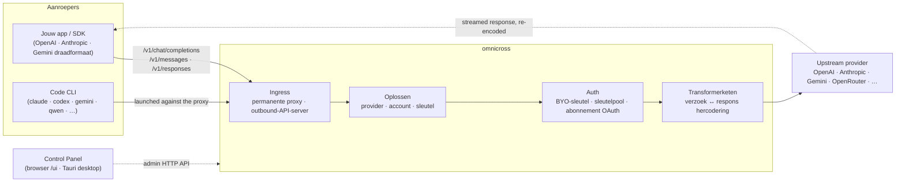

# omnicross

<div align="center">

[](https://opensource.org/licenses/MIT) [](https://nodejs.org/) [](https://www.typescriptlang.org/) [](https://www.npmjs.com/package/@omnicross/core)

[English](../README.md) · [简体中文](README.zh.md) · [繁體中文](README.zh-Hant.md) · [日本語](README.ja.md) · [한국어](README.ko.md) · [Français](README.fr.md) · [Deutsch](README.de.md) · [Italiano](README.it.md) · [Español (España)](README.es-ES.md) · [Español (Latinoamérica)](README.es-419.md) · [Português (Brasil)](README.pt-BR.md) · [Português (Portugal)](README.pt-PT.md) · **Nederlands** · [Dansk](README.da.md) · [Svenska](README.sv.md) · [Norsk bokmål](README.nb.md) · [Suomi](README.fi.md) · [Polski](README.pl.md) · [Čeština](README.cs.md) · [Magyar](README.hu.md) · [Română](README.ro.md) · [Български](README.bg.md) · [Русский](README.ru.md) · [Українська](README.uk.md) · [Ελληνικά](README.el.md) · [Türkçe](README.tr.md) · [العربية](README.ar.md) · [ไทย](README.th.md) · [Tiếng Việt](README.vi.md) · [Bahasa Indonesia](README.id.md) · [Bahasa Melayu](README.ms.md)

**Een universele LLM-serverkern — route, transformeer en proxy elke provider achter één set API's.**

</div>

---

**omnicross drijft elke AI-app en programmeer-CLI aan vanuit één plek — met je bestaande abonnementen of API-sleutels.**

Wijs Claude Code, Codex, Gemini CLI — of elke app die de OpenAI / Anthropic / Gemini API spreekt — naar omnicross, en het routeert elk verzoek naar de provider en het model dat jij kiest. Wat je kunt doen:

- draaien op een **Claude / ChatGPT / Gemini abonnement-login**, zonder verbruiksgebaseerde API-sleutels;
- meerdere API-sleutels samenvoegen in een sleutelpool met automatische rotatie en failover;
- een tool die slechts één API-formaat spreekt toch een model laten aanroepen dat een ander formaat spreekt — omnicross vertaalt het verzoek en de respons realtime.

Dit alles beheerd in een desktop-GUI — geen handmatig bewerken van configuratiebestanden.

Het wordt geleverd in een paar vormen:

- **🖥️ Als desktopapp** — een native Tauri v2-venster (`apps/desktop`) dat de volledige Control Panel GUI toont en de daemon voor je bundelt en beheert (systeemvak, automatisch starten, daemon-levenscyclus). **De manier waarop de meeste mensen omnicross gebruiken** — geen terminal, geen npm, geen CORS-configuratie.
- **🌐 In je browser** — liever geen native app installeren? `omnicross ui` start de daemon en opent dezelfde GUI in je browser (aangeboden door de daemon zelf op `/ui` — zelfde oorsprong, geen extra configuratie) voor het beheren van providers, sleutels, accounts en Code-CLI-launches.
- **🚀 Als headless daemon** — de `omnicross` CLI/daemon: een kaal Node-proces met een lokale HTTP API, een beheerdashboard en opdrachten voor sleutels, providers, OAuth-login en het starten van Code-CLI's. Ideaal voor servers en terminal-georiënteerde workflows; het is ook wat de desktopapp en het in-browser Control Panel aandrijft.
- **📦 Als bibliotheek** — `npm install @omnicross/core` en embed de serverkern direct in elk Node-project.

De serverkern zelf is puur Node — geen Electron, geen framework-lock-in; de UI is een gewone webapp, en de desktopschil is een dunne Tauri-laag erover.

## 🏗️ Architectuur

Een inkomend verzoek komt binnen via een **ingress** (de permanente in-process proxy, of de zelfstandige outbound-API-server), wordt omgezet naar een **provider + identiteit**, wordt geconverteerd door de **transformerketen**, en wordt naar **upstream** geproxied — waarna de respons via dezelfde keten terugstroomt, opnieuw gecodeerd in het draadformaat van de aanroeper.



| Bouwsteen | Waar |
| --- | --- |
| Control Panel frontend (Vite + React) | `@omnicross/ui` (`packages/ui` — publiceert alleen zijn gebouwde `dist/`) |
| Desktopschil (Tauri v2) | `apps/desktop` |
| Zelfstandige runtime (HTTP API · dashboard · CLI · serveert de UI op `/ui`) | `@omnicross/daemon` |
| Ingress · dispatch · transformer · proxy | `@omnicross/core` |
| Abonnement OAuth + auth-strategieën | `@omnicross/subscriptions` |
| Gedeelde contracttypes + provider-presets | `@omnicross/contracts` |
| Code-CLI-launch (proxy-env + supervisor) | `@omnicross/cli-launcher` |

## ✨ Functies

- **Control Panel GUI** — een React-UI over de localhost admin API van de daemon: beheer providers, sleutels en abonnementsaccounts visueel in plaats van via een configuratiebestand. Wordt geleverd als native Tauri v2-desktopapp (de dagelijkse ingang — systeemvak, automatisch starten, gebundelde daemon, geen Electron), of aangeboden in je browser met één opdracht (`omnicross ui`).
- **Elk-naar-elk draadformaat** — accepteer OpenAI / Anthropic / Gemini-vormige verzoeken en richt ze op een provider die een *ander* formaat spreekt; de transformer-pipeline converteert zowel het verzoek als de gestreamde respons.
- **BYO-sleutels + pools met meerdere sleutels** — bind je eigen provider-sleutels, of pool meerdere sleutels per provider met gewogen round-robin en automatische failover bij `429 / 529 / 401 / 403`.
- **Abonnement als provider** — verwerk verzoeken via een Claude / ChatGPT (Codex) / Gemini-abonnement via OAuth, of een OpenCodeGo bearer-sleutel, in plaats van een verbruiksgebaseerde API-sleutel.
- **Provider-presets** — een samengestelde catalogus van provider-endpoints/templates (OpenAI, Anthropic, Gemini, DeepSeek, OpenRouter, Groq, Mistral en vele anderen) die je met één opdracht kunt koppelen aan een configuratieregel.
- **Streaming-native proxy** — een permanente in-process proxy relay SSE-streams verbatim waar formaten overeenkomen, en codeert ze opnieuw waar ze dat niet doen.
- **Code CLI-launcher** — start `claude` / `codex` / `gemini` / `qwen` / `copilot` / `opencode` tegen een lokale proxy zodat een CLI-sessie kan draaien op **elke** provider of elk abonnement dat je hebt geconfigureerd.
- **Host-agnostisch & getypeerd** — puur Node + TypeScript, afhankelijkheidsarme contracttypes apart gepubliceerd, geen koppeling aan een hostapp.

## 📦 Indeling

Dit is een monorepo met één workspace: publiceerbare pakketten in `packages/`, uitvoerbare apps in `apps/`. De npm-pakketnamen behouden de scope `@omnicross/`; de mapnamen laten het voorvoegsel `omnicross-` weg.

| App | Wat het is |
| --- | --- |
| `apps/desktop` | **omnicross-desktop** — de native Tauri v2-desktopapp: wikkelt de `@omnicross/ui` frontend als native venster en bundelt en beheert de daemon (systeemvak, automatisch starten, daemon-levenscyclus). Zie [`apps/desktop/README.md`](../apps/desktop/README.md). |

De gepubliceerde pakketten:

| Pakket | npm | Wat het is |
| --- | --- | --- |
| `packages/contracts` | [`@omnicross/contracts`](https://www.npmjs.com/package/@omnicross/contracts) | Afhankelijkheidsarme contracttypes + runtime-waarde-hulpfuncties (LLM-configuratie, completion/chat-types, provider-presets, thinking-configuratie, gebruik, abonnement/account-tokentypes). Geconsumeerd via subpaden (`@omnicross/contracts/llm-config`, `/provider-presets`, …). |
| `packages/core` | [`@omnicross/core`](https://www.npmjs.com/package/@omnicross/core) | De serverkern — provider-dispatch, completion-pipeline, transformers, de provider-proxy en het outbound API-oppervlak. |
| `packages/subscriptions` | [`@omnicross/subscriptions`](https://www.npmjs.com/package/@omnicross/subscriptions) | Abonnement-als-provider auth-strategieën, OAuth-flows (Claude / Codex / Gemini), en de OpenCodeGo-scenario-dispatcher. |
| `packages/cli-launcher` | [`@omnicross/cli-launcher`](https://www.npmjs.com/package/@omnicross/cli-launcher) | Het `ProcessSupervisor` subprocess-levenscyclusmechanisme + per-CLI proxy-env launch-configuratiebouwers. |
| `packages/daemon` | [`@omnicross/daemon`](https://www.npmjs.com/package/@omnicross/daemon) | Een kale Node-embedder van `@omnicross/core` met een admin HTTP API + dashboard, de `omnicross` CLI, en same-origin serving van het Control Panel op `/ui`. |
| `packages/ui` | [`@omnicross/ui`](https://www.npmjs.com/package/@omnicross/ui) | De Control Panel frontend (Vite + React). Publiceert alleen zijn gebouwde `dist/` (statische assets, geen runtime-afhankelijkheden); de daemon serveert het op `/ui`, de Tauri-schil wikkelt het. |

## 🚀 Snel aan de slag

### Optie A — Desktopapp (aanbevolen voor de meeste gebruikers)

Download het installatieprogramma voor jouw besturingssysteem van de [nieuwste release](https://github.com/Dumoedss/omnicross/releases/latest) en voer het uit:

- **Windows** — `*-setup.exe` (NSIS) of `*.msi`
- **macOS** — `*.dmg` (universeel — Apple Silicon + Intel)
- **Linux** — `*.AppImage`, `*.deb`, of `*.rpm`

De app bundelt en beheert alles voor je — de daemon **en** een private Node-runtime — dus er is niets anders te installeren. Download gewoon het installatieprogramma, voer het uit en open de app.

> Wil je het zelf bouwen? Zie [`apps/desktop/README.md`](../apps/desktop/README.md) (`npm run build:app`, vereist Rust).

### Optie B — Control Panel in je browser

Liever geen app installeren? Eén opdracht — de daemon serveert dezelfde UI zelf (zelfde oorsprong als zijn admin API — geen CORS, geen `.env`):

```bash
npm install -g @omnicross/daemon
omnicross ui --config ./omnicross.config.json   # boots the daemon + opens http://127.0.0.1:8766/ui/
```

Voeg `--no-open` toe om het starten van de browser over te slaan. Frontend dev-workflows staan in [`packages/ui/README.md`](../packages/ui/README.md).

### Optie C — Headless daemon

Alles wat de app doet — en meer — is beschikbaar vanuit de terminal:

```bash
npm install -g @omnicross/daemon
```

```bash
# Boot the daemon (BYO-key serving) against a config file
omnicross start --config ./omnicross.config.json

# Map a curated provider preset + your key into the config
omnicross providers presets --config ./omnicross.config.json
omnicross providers add openai --key $OPENAI_API_KEY --config ./omnicross.config.json

# Mint a local API key for your clients (shown once)
omnicross keys add my-app --config ./omnicross.config.json

# Log in to a subscription via browser OAuth (claude | codex | gemini)
omnicross login claude --config ./omnicross.config.json

# Launch a Code CLI against the in-process proxy on any configured provider
omnicross launch claude --provider openai --model gpt-4o --config ./omnicross.config.json
```

Voer `omnicross --help` uit voor de volledige opdrachtlijst.

### Optie D — Als bibliotheek

```bash
npm install @omnicross/core @omnicross/contracts
```

```ts
import type { LLMProvider } from '@omnicross/contracts/llm-config';
// import the serving-core pieces you need from @omnicross/core

// Wire the serving core into your own Node app: supply a provider-config
// source + key store, then route inbound requests through the proxy.
```

> Subpad-imports houden de afhankelijkheidsgraph compact, bijv.
> `@omnicross/contracts/provider-presets`, `@omnicross/core/provider-proxy`.

## 🛠️ Ontwikkelen

```bash
git clone https://github.com/Dumoedss/omnicross.git
cd omnicross
npm install          # workspace symlinks for @omnicross/* + external deps
npm run typecheck    # tsc --noEmit per package
npm test             # vitest (tests run against src via aliases)
npm run build        # tsup per package → dist/ (ESM + CJS + .d.ts)
```

Tests en typechecks lossen `@omnicross/*`-imports op naar de package **broncode** via aliassen, dus er is geen voorafgaande build nodig. `npm run build` genereert de `dist/` van elk pakket voor publicatie.

Voor Control Panel-ontwikkeling is `npm run dev` (repo-root) de alles-in-één-opdracht-lus: het zaait bij de eerste uitvoering een gitignored `omnicross.dev.config.json`, start de daemon op `127.0.0.1:8766`, en start de Vite dev-server van de UI op `http://localhost:1430` (Ctrl+C stopt beide). De dev-server proxiet `/admin/*` naar de daemon server-side, zodat de browser dezelfde oorsprong behoudt — de daemon verzendt bewust geen CORS-headers. De frontend zelf is het `@omnicross/ui` workspace-pakket — `npm run build -w @omnicross/ui` vernieuwt de door de daemon aangeboden `dist/`. Voor het native venster (vereist Rust): `npm run dev:app` voert `tauri dev` uit, en `npm run build:app` pakt het release-uitvoerbare bestand + installatieprogramma's met de daemon-runtime **en een private Node-binary** gebundeld (uitvoer onder `apps/desktop/src-tauri/target/release/`; doelmachines hoeven niets te installeren — details in [`apps/desktop/README.md`](../apps/desktop/README.md)).

## 📄 Licentie

[MIT](../LICENSE) 

Delen van `@omnicross/core` en andere pakketten passen werk van derden aan onder hun eigen licenties — zie de `NOTICE`-bestanden in de betreffende pakketten.
