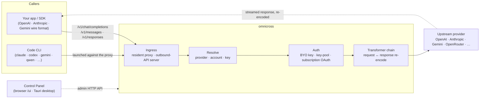

# omnicross

<div align="center">

[](https://opensource.org/licenses/MIT) [](https://nodejs.org/) [](https://www.typescriptlang.org/) [](https://www.npmjs.com/package/@omnicross/core)

[English](../README.md) · [简体中文](README.zh.md) · [繁體中文](README.zh-Hant.md) · [日本語](README.ja.md) · [한국어](README.ko.md) · [Français](README.fr.md) · [Deutsch](README.de.md) · [Italiano](README.it.md) · [Español (España)](README.es-ES.md) · [Español (Latinoamérica)](README.es-419.md) · [Português (Brasil)](README.pt-BR.md) · [Português (Portugal)](README.pt-PT.md) · [Nederlands](README.nl.md) · [Dansk](README.da.md) · [Svenska](README.sv.md) · [Norsk bokmål](README.nb.md) · [Suomi](README.fi.md) · **Polski** · [Čeština](README.cs.md) · [Magyar](README.hu.md) · [Română](README.ro.md) · [Български](README.bg.md) · [Русский](README.ru.md) · [Українська](README.uk.md) · [Ελληνικά](README.el.md) · [Türkçe](README.tr.md) · [العربية](README.ar.md) · [ไทย](README.th.md) · [Tiếng Việt](README.vi.md) · [Bahasa Indonesia](README.id.md) · [Bahasa Melayu](README.ms.md)

**Uniwersalny rdzeń obsługi LLM — kieruj, przekształcaj i pośredcz dla dowolnego dostawcy za pomocą jednego zestawu API.**

</div>

---

**omnicross zasila każdą aplikację AI i CLI do kodowania z jednego miejsca — przy użyciu Twoich istniejących subskrypcji lub kluczy API.**

Skieruj Claude Code, Codex, Gemini CLI — lub dowolną aplikację korzystającą z API OpenAI / Anthropic / Gemini — na omnicross, a on przekieruje każde żądanie do wybranego przez Ciebie dostawcy i modelu. Co możesz zrobić:

- korzystać z **subskrypcyjnego logowania Claude / ChatGPT / Gemini**, pomijając płatne klucze API;
- łączyć wiele kluczy API w pulę kluczy z automatyczną rotacją i przełączaniem awaryjnym;
- pozwolić narzędziu obsługującemu tylko jeden format API wywoływać model mówiący innym formatem — omnicross przetłumaczy żądanie i odpowiedź w locie.

Wszystkim tym zarządzasz przez graficzny interfejs aplikacji desktopowej — bez ręcznej edycji plików konfiguracyjnych.

Dostępne jest w kilku wariantach:

- **🖥️ Jako aplikacja desktopowa** — natywne okno Tauri v2 (`apps/desktop`), które prezentuje pełny interfejs graficzny Panelu Sterowania i zarządza za Ciebie demonem (zasobnik systemowy, autostart, cykl życia demona). **Główny sposób, w jaki większość ludzi używa omnicross** — bez terminala, bez npm, bez konfiguracji CORS.
- **🌐 W przeglądarce** — wolisz nie instalować natywnej aplikacji? `omnicross ui` uruchamia demona i otwiera ten sam interfejs w przeglądarce (udostępniany przez samego demona pod adresem `/ui` — ten sam origin, bez dodatkowej konfiguracji) do zarządzania dostawcami, kluczami, kontami i uruchamiania Code CLI.
- **🚀 Jako demon headless** — CLI/demon `omnicross`: czysty proces Node z lokalnym API HTTP, panelem administracyjnym i poleceniami do zarządzania kluczami, dostawcami, logowania przez OAuth i uruchamiania Code CLI. Idealny do serwerów i przepływów pracy zorientowanych na terminal; to również silnik napędzający aplikację desktopową i Panel Sterowania w przeglądarce.
- **📦 Jako biblioteka** — `npm install @omnicross/core` i osadź rdzeń obsługi bezpośrednio w dowolnym projekcie Node.

Sam rdzeń obsługi jest czystym Node — bez Electrona, bez uzależnienia od frameworka; interfejs użytkownika to zwykła aplikacja webowa, a powłoka desktopowa to cienka warstwa Tauri nad nią.

## 🏗️ Architektura

Przychodzące żądanie wchodzi przez **ingress** (rezydentny proxy wewnątrz procesu lub samodzielny serwer zewnętrznego API), zostaje rozwiązane do **dostawcy + tożsamości**, przekształcone przez **łańcuch transformatorów** i przekazane **upstream** — następnie odpowiedź strumieniuje z powrotem przez ten sam łańcuch, ponownie zakodowana w formacie protokołu wywołującego.



| Blok składowy | Lokalizacja |
| --- | --- |
| Frontend Panelu Sterowania (Vite + React) | `@omnicross/ui` (`packages/ui` — publikuje tylko zbudowany `dist/`) |
| Powłoka desktopowa (Tauri v2) | `apps/desktop` |
| Samodzielne środowisko uruchomieniowe (API HTTP · panel · CLI · udostępnia interfejs pod `/ui`) | `@omnicross/daemon` |
| Ingress · dyspozycja · transformator · proxy | `@omnicross/core` |
| Subskrypcja OAuth + strategie uwierzytelniania | `@omnicross/subscriptions` |
| Wspólne typy kontraktów + presety dostawców | `@omnicross/contracts` |
| Uruchamianie Code CLI (proxy-env + supervisor) | `@omnicross/cli-launcher` |

## ✨ Funkcjonalności

- **Graficzny interfejs Panelu Sterowania** — interfejs React oparty na lokalnym API administratora demona: wizualne zarządzanie dostawcami, kluczami i kontami subskrypcji zamiast edycji pliku konfiguracyjnego. Dostępny jako natywna aplikacja desktopowa Tauri v2 (codzienny punkt wejścia — zasobnik systemowy, autostart, wbudowany demon, bez Electrona) lub w przeglądarce jednym poleceniem (`omnicross ui`).
- **Dowolny format na dowolny format** — przyjmuj żądania w formacie OpenAI / Anthropic / Gemini i kieruj je do dostawcy mówiącego *innym* formatem; potok transformatorów konwertuje zarówno żądanie, jak i strumieniowaną odpowiedź.
- **Własne klucze + pule wielu kluczy** — powiąż własne klucze dostawców lub utwórz pulę wielu kluczy na dostawcę z ważonym round-robinem i automatycznym przełączeniem awaryjnym przy `429 / 529 / 401 / 403`.
- **Subskrypcja jako dostawca** — kieruj żądania przez subskrypcję Claude / ChatGPT (Codex) / Gemini za pomocą OAuth lub klucza bearer OpenCodeGo zamiast płatnego klucza API.
- **Presety dostawców** — wyselekcjonowany katalog endpointów/szablonów dostawców (OpenAI, Anthropic, Gemini, DeepSeek, OpenRouter, Groq, Mistral i wiele innych), który można zmapować do wpisu konfiguracyjnego jednym poleceniem.
- **Natywne proxy strumieniowania** — rezydentny proxy wewnątrz procesu przekazuje strumienie SSE bez zmian tam, gdzie formaty są zgodne, i ponownie je koduje tam, gdzie nie są.
- **Launcher Code CLI** — uruchamiaj `claude` / `codex` / `gemini` / `qwen` / `copilot` / `opencode` względem lokalnego proxy, dzięki czemu sesja CLI może działać na **dowolnym** skonfigurowanym dostawcy lub subskrypcji.
- **Niezależny od hosta i otypowany** — czysty Node + TypeScript, lekkie typy kontraktów publikowane osobno, zerowe powiązanie z jakąkolwiek aplikacją hosta.

## 📦 Układ repozytorium

To monorepo z jednym workspace: publikowalne pakiety w `packages/`, uruchamialne aplikacje w `apps/`. Nazwy pakietów npm zachowują zakres `@omnicross/`; nazwy katalogów pomijają prefiks `omnicross-`.

| Aplikacja | Opis |
| --- | --- |
| `apps/desktop` | **omnicross-desktop** — natywna aplikacja desktopowa Tauri v2: opakowuje frontend `@omnicross/ui` jako natywne okno i zarządza demonem (zasobnik systemowy, autostart, cykl życia demona). Zob. [`apps/desktop/README.md`](../apps/desktop/README.md). |

Opublikowane pakiety:

| Pakiet | npm | Opis |
| --- | --- | --- |
| `packages/contracts` | [`@omnicross/contracts`](https://www.npmjs.com/package/@omnicross/contracts) | Lekkie typy kontraktów + pomocniki wartości w czasie wykonania (konfiguracja LLM, typy completion/chat, presety dostawców, konfiguracja thinking, użycie, typy tokenów subskrypcji/konta). Importowane przez ścieżki podrzędne (`@omnicross/contracts/llm-config`, `/provider-presets`, …). |
| `packages/core` | [`@omnicross/core`](https://www.npmjs.com/package/@omnicross/core) | Rdzeń obsługi — dyspozycja dostawców, potok completion, transformatory, proxy dostawcy i zewnętrzna powierzchnia API. |
| `packages/subscriptions` | [`@omnicross/subscriptions`](https://www.npmjs.com/package/@omnicross/subscriptions) | Strategie uwierzytelniania subskrypcji jako dostawcy, przepływy OAuth (Claude / Codex / Gemini) oraz dyspozytor scenariuszy OpenCodeGo. |
| `packages/cli-launcher` | [`@omnicross/cli-launcher`](https://www.npmjs.com/package/@omnicross/cli-launcher) | Mechanizm cyklu życia podprocesów `ProcessSupervisor` + konstruktory konfiguracji uruchomienia proxy-env dla poszczególnych CLI. |
| `packages/daemon` | [`@omnicross/daemon`](https://www.npmjs.com/package/@omnicross/daemon) | Czysty host Node dla `@omnicross/core` z administracyjnym API HTTP + panelem, CLI `omnicross` i udostępnianiem Panelu Sterowania pod `/ui` z tego samego origin. |
| `packages/ui` | [`@omnicross/ui`](https://www.npmjs.com/package/@omnicross/ui) | Frontend Panelu Sterowania (Vite + React). Publikuje tylko zbudowany `dist/` (statyczne zasoby, zero zależności w czasie wykonania); demon udostępnia go pod `/ui`, powłoka Tauri go opakowuje. |

## 🚀 Szybki start

### Opcja A — Aplikacja desktopowa (zalecana dla większości użytkowników)

Pobierz instalator dla swojego systemu operacyjnego z [najnowszego wydania](https://github.com/Dumoedss/omnicross/releases/latest) i uruchom go:

- **Windows** — `*-setup.exe` (NSIS) lub `*.msi`
- **macOS** — `*.dmg` (universal — Apple Silicon + Intel)
- **Linux** — `*.AppImage`, `*.deb` lub `*.rpm`

Aplikacja zarządza za Ciebie wszystkim — demonem **oraz** prywatnym środowiskiem uruchomieniowym Node — więc nie trzeba nic więcej instalować. Wystarczy pobrać, uruchomić instalator i otworzyć.

> Chcesz zbudować samodzielnie? Zob. [`apps/desktop/README.md`](../apps/desktop/README.md) (`npm run build:app`, wymaga Rust).

### Opcja B — Panel Sterowania w przeglądarce

Wolisz nie instalować aplikacji? Jedno polecenie — demon sam udostępnia ten sam interfejs (ten sam origin co jego API administratora — bez CORS, bez `.env`):

```bash
npm install -g @omnicross/daemon
omnicross ui --config ./omnicross.config.json   # boots the daemon + opens http://127.0.0.1:8766/ui/
```

Dodaj `--no-open`, aby pominąć uruchamianie przeglądarki. Przepływy pracy przy tworzeniu frontendu opisano w [`packages/ui/README.md`](../packages/ui/README.md).

### Opcja C — Demon headless

Wszystko, co robi aplikacja — i więcej — jest dostępne z terminala:

```bash
npm install -g @omnicross/daemon
```

```bash
# Boot the daemon (BYO-key serving) against a config file
omnicross start --config ./omnicross.config.json

# Map a curated provider preset + your key into the config
omnicross providers presets --config ./omnicross.config.json
omnicross providers add openai --key $OPENAI_API_KEY --config ./omnicross.config.json

# Mint a local API key for your clients (shown once)
omnicross keys add my-app --config ./omnicross.config.json

# Log in to a subscription via browser OAuth (claude | codex | gemini)
omnicross login claude --config ./omnicross.config.json

# Launch a Code CLI against the in-process proxy on any configured provider
omnicross launch claude --provider openai --model gpt-4o --config ./omnicross.config.json
```

Uruchom `omnicross --help`, aby zobaczyć pełną listę poleceń.

### Opcja D — Jako biblioteka

```bash
npm install @omnicross/core @omnicross/contracts
```

```ts
import type { LLMProvider } from '@omnicross/contracts/llm-config';
// import the serving-core pieces you need from @omnicross/core

// Wire the serving core into your own Node app: supply a provider-config
// source + key store, then route inbound requests through the proxy.
```

> Importy przez ścieżki podrzędne pozwalają utrzymać zwięzły graf zależności, np.
> `@omnicross/contracts/provider-presets`, `@omnicross/core/provider-proxy`.

## 🛠️ Rozwój

```bash
git clone https://github.com/Dumoedss/omnicross.git
cd omnicross
npm install          # workspace symlinks for @omnicross/* + external deps
npm run typecheck    # tsc --noEmit per package
npm test             # vitest (tests run against src via aliases)
npm run build        # tsup per package → dist/ (ESM + CJS + .d.ts)
```

Testy i sprawdzanie typów rozwiązują importy `@omnicross/*` do **źródła** pakietu za pomocą aliasów, więc nie jest wymagana wcześniejsza kompilacja. `npm run build` emituje `dist/` każdego pakietu do publikacji.

Przy tworzeniu Panelu Sterowania, `npm run dev` (korzeń repozytorium) to pętla jednego polecenia: przy pierwszym uruchomieniu tworzy gitignorowany plik `omnicross.dev.config.json`, uruchamia demona na `127.0.0.1:8766` i serwer deweloperski Vite interfejsu użytkownika na `http://localhost:1430` (Ctrl+C zatrzymuje oba). Serwer deweloperski przekierowuje `/admin/*` do serwera demona po stronie serwera, więc przeglądarka pozostaje na tym samym origin — demon nie wysyła nagłówków CORS z założenia. Sam frontend to pakiet workspace `@omnicross/ui` — `npm run build -w @omnicross/ui` odświeża `dist/` udostępniany przez demona. W przypadku natywnego okna (wymaga Rust): `npm run dev:app` uruchamia `tauri dev`, a `npm run build:app` pakuje plik wykonywalny wydania + instalatory ze środowiskiem uruchomieniowym demona **oraz prywatnym plikiem binarnym Node** dołączonym w środku (wyniki w `apps/desktop/src-tauri/target/release/`; docelowe maszyny nie potrzebują niczego zainstalowanego — szczegóły w [`apps/desktop/README.md`](../apps/desktop/README.md)).

## 📄 Licencja

[MIT](../LICENSE) 

Fragmenty `@omnicross/core` i innych pakietów adaptują prace firm trzecich na podstawie ich własnych licencji — zob. pliki `NOTICE` w odpowiednich pakietach.
