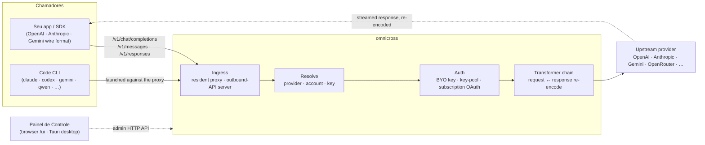

# omnicross

<div align="center">

[](https://opensource.org/licenses/MIT) [](https://nodejs.org/) [](https://www.typescriptlang.org/) [](https://www.npmjs.com/package/@omnicross/core)

[English](../README.md) · [简体中文](README.zh.md) · [繁體中文](README.zh-Hant.md) · [日本語](README.ja.md) · [한국어](README.ko.md) · [Français](README.fr.md) · [Deutsch](README.de.md) · [Italiano](README.it.md) · [Español (España)](README.es-ES.md) · [Español (Latinoamérica)](README.es-419.md) · **Português (Brasil)** · [Português (Portugal)](README.pt-PT.md) · [Nederlands](README.nl.md) · [Dansk](README.da.md) · [Svenska](README.sv.md) · [Norsk bokmål](README.nb.md) · [Suomi](README.fi.md) · [Polski](README.pl.md) · [Čeština](README.cs.md) · [Magyar](README.hu.md) · [Română](README.ro.md) · [Български](README.bg.md) · [Русский](README.ru.md) · [Українська](README.uk.md) · [Ελληνικά](README.el.md) · [Türkçe](README.tr.md) · [العربية](README.ar.md) · [ไทย](README.th.md) · [Tiếng Việt](README.vi.md) · [Bahasa Indonesia](README.id.md) · [Bahasa Melayu](README.ms.md)

**Um núcleo universal de serviço para LLMs — roteie, transforme e proxeie qualquer provedor por trás de um único conjunto de APIs.**

</div>

---

**omnicross alimenta todos os seus apps de IA e CLIs de programação em um só lugar — com suas assinaturas existentes ou API Keys.**

Aponte Claude Code, Codex, Gemini CLI — ou qualquer app que fale a API OpenAI / Anthropic / Gemini — para o omnicross, e ele roteia cada requisição para o provedor e modelo que você escolher. O que você pode fazer:

- rodar com um **login de assinatura Claude / ChatGPT / Gemini**, dispensando API Keys cobradas por uso;
- agrupar várias API Keys em um pool com rotação automática e failover;
- deixar uma ferramenta que fala apenas um formato de API chamar um modelo que fala outro — o omnicross traduz a requisição e a resposta em tempo real.

Tudo gerenciado em uma GUI desktop — sem editar arquivos de configuração manualmente.

Ele está disponível em algumas formas:

- **🖥️ Como aplicativo desktop** — uma janela Tauri v2 nativa (`apps/desktop`) que apresenta a GUI completa do Painel de Controle e agrupa e gerencia o daemon para você (bandeja do sistema, inicialização automática, ciclo de vida do daemon). **A principal forma como a maioria das pessoas usa o omnicross** — sem terminal, sem npm, sem configuração de CORS.
- **🌐 No seu navegador** — prefere não instalar um aplicativo nativo? `omnicross ui` inicia o daemon e abre a mesma GUI no seu navegador (servida pelo próprio daemon em `/ui` — mesma origem, sem configuração extra) para gerenciar provedores, chaves, contas e lançamentos de Code CLIs.
- **🚀 Como daemon headless** — o CLI/daemon `omnicross`: um processo Node puro com uma API HTTP local, um painel de administração e comandos para chaves, provedores, login OAuth e lançamento de Code CLIs. Perfeito para servidores e fluxos de trabalho orientados ao terminal; é também o que alimenta o aplicativo desktop e o Painel de Controle no navegador.
- **📦 Como biblioteca** — `npm install @omnicross/core` e incorpore o núcleo de serviço diretamente em qualquer projeto Node.

O núcleo de serviço em si é Node puro — sem Electron, sem acoplamento a framework; a UI é um aplicativo web simples, e o shell desktop é uma camada Tauri fina sobre ela.

## 🏗️ Arquitetura

Uma requisição de entrada entra por um **ingress** (o proxy residente em processo, ou o servidor de API de saída independente), é resolvida para um **provedor + identidade**, é convertida pela **cadeia de transformadores**, e é proxeada para o **upstream** — então a resposta flui de volta pela mesma cadeia, recodificada no formato de protocolo do chamador.



| Bloco de construção | Localização |
| --- | --- |
| Frontend do Painel de Controle (Vite + React) | `@omnicross/ui` (`packages/ui` — publica apenas seu `dist/` compilado) |
| Shell desktop (Tauri v2) | `apps/desktop` |
| Runtime independente (API HTTP · painel · CLI · serve a UI em `/ui`) | `@omnicross/daemon` |
| Ingress · despacho · transformador · proxy | `@omnicross/core` |
| OAuth de assinatura + estratégias de autenticação | `@omnicross/subscriptions` |
| Tipos de contrato compartilhados + presets de provedores | `@omnicross/contracts` |
| Lançamento de Code CLI (proxy-env + supervisor) | `@omnicross/cli-launcher` |

## ✨ Funcionalidades

- **GUI do Painel de Controle** — uma interface React sobre a API de administração localhost do daemon: gerencie provedores, chaves e contas de assinatura visualmente em vez de por arquivo de configuração. Disponível como aplicativo desktop nativo Tauri v2 (a principal forma de uso cotidiano — bandeja do sistema, inicialização automática, daemon integrado, sem Electron), ou servido no seu navegador com um comando (`omnicross ui`).
- **Conversão de formato arbitrária** — aceite requisições no formato OpenAI / Anthropic / Gemini e direcione para um provedor que fala um formato *diferente*; o pipeline de transformadores converte tanto a requisição quanto a resposta em streaming.
- **Chaves próprias + pools de múltiplas chaves** — vincule suas próprias chaves de provedor, ou agrupe várias chaves por provedor com round-robin ponderado e failover automático em `429 / 529 / 401 / 403`.
- **Assinatura como provedor** — direcione requisições por meio de uma assinatura Claude / ChatGPT (Codex) / Gemini via OAuth, ou com uma chave bearer do OpenCodeGo, em vez de uma chave de API tarifada.
- **Presets de provedores** — um catálogo curado de endpoints/templates de provedores (OpenAI, Anthropic, Gemini, DeepSeek, OpenRouter, Groq, Mistral e muitos mais) que você pode mapear para uma linha de configuração com um único comando.
- **Proxy nativo de streaming** — um proxy residente em processo retransmite streams SSE verbatim quando os formatos coincidem, e os recodifica quando não coincidem.
- **Lançador de Code CLI** — inicie `claude` / `codex` / `gemini` / `qwen` / `copilot` / `opencode` contra um proxy local para que uma sessão de CLI possa rodar em **qualquer** provedor ou assinatura que você tenha configurado.
- **Agnóstico de host e tipado** — Node + TypeScript puro, tipos de contrato com poucas dependências publicados separadamente, zero acoplamento a qualquer aplicativo host.

## 📦 Estrutura

Este é um monorepo de workspace único: pacotes publicáveis em `packages/`, aplicativos executáveis em `apps/`. Os nomes dos pacotes npm mantêm o escopo `@omnicross/`; os nomes de diretórios omitem o prefixo `omnicross-`.

| Aplicativo | O que é |
| --- | --- |
| `apps/desktop` | **omnicross-desktop** — o aplicativo desktop nativo Tauri v2: encapsula o frontend `@omnicross/ui` como uma janela nativa e agrupa e gerencia o daemon (bandeja do sistema, inicialização automática, ciclo de vida do daemon). Veja [`apps/desktop/README.md`](../apps/desktop/README.md). |

Os pacotes publicados:

| Pacote | npm | O que é |
| --- | --- | --- |
| `packages/contracts` | [`@omnicross/contracts`](https://www.npmjs.com/package/@omnicross/contracts) | Tipos de contrato com poucas dependências + helpers de valores em runtime (configuração de LLM, tipos de completion/chat, presets de provedores, configuração de thinking, uso, tipos de token de assinatura/conta). Consumido via subcaminhos (`@omnicross/contracts/llm-config`, `/provider-presets`, …). |
| `packages/core` | [`@omnicross/core`](https://www.npmjs.com/package/@omnicross/core) | O núcleo de serviço — despacho de provedores, pipeline de completion, transformadores, o proxy de provedores e a superfície de API de saída. |
| `packages/subscriptions` | [`@omnicross/subscriptions`](https://www.npmjs.com/package/@omnicross/subscriptions) | Estratégias de autenticação de assinatura como provedor, fluxos OAuth (Claude / Codex / Gemini) e o despachador de cenário OpenCodeGo. |
| `packages/cli-launcher` | [`@omnicross/cli-launcher`](https://www.npmjs.com/package/@omnicross/cli-launcher) | O mecanismo de ciclo de vida de subprocesso `ProcessSupervisor` + construtores de configuração de lançamento proxy-env por CLI. |
| `packages/daemon` | [`@omnicross/daemon`](https://www.npmjs.com/package/@omnicross/daemon) | Um embedder Node puro de `@omnicross/core` com API HTTP de administração + painel, o CLI `omnicross` e serviço de mesma origem do Painel de Controle em `/ui`. |
| `packages/ui` | [`@omnicross/ui`](https://www.npmjs.com/package/@omnicross/ui) | O frontend do Painel de Controle (Vite + React). Publica apenas seu `dist/` compilado (assets estáticos, zero dependências em runtime); o daemon o serve em `/ui`, o shell Tauri o encapsula. |

## 🚀 Início rápido

### Opção A — Aplicativo desktop (recomendado para a maioria dos usuários)

Baixe o instalador para seu sistema operacional na [versão mais recente](https://github.com/Dumoedss/omnicross/releases/latest) e execute-o:

- **Windows** — `*-setup.exe` (NSIS) ou `*.msi`
- **macOS** — `*.dmg` (universal — Apple Silicon + Intel)
- **Linux** — `*.AppImage`, `*.deb` ou `*.rpm`

O aplicativo agrupa e gerencia tudo para você — o daemon **e** um runtime Node privado — portanto não há mais nada para instalar. Basta baixar, executar o instalador e abri-lo.

> Quer compilar você mesmo? Veja [`apps/desktop/README.md`](../apps/desktop/README.md) (`npm run build:app`, requer Rust).

### Opção B — Painel de Controle no seu navegador

Prefere não instalar um aplicativo? Um comando — o daemon serve a mesma UI por conta própria (mesma origem que sua API de administração — sem CORS, sem `.env`):

```bash
npm install -g @omnicross/daemon
omnicross ui --config ./omnicross.config.json   # boots the daemon + opens http://127.0.0.1:8766/ui/
```

Adicione `--no-open` para pular a abertura do navegador. Fluxos de trabalho de desenvolvimento frontend estão em [`packages/ui/README.md`](../packages/ui/README.md).

### Opção C — Daemon headless

Tudo que o aplicativo faz — e mais — está disponível pelo terminal:

```bash
npm install -g @omnicross/daemon
```

```bash
# Boot the daemon (BYO-key serving) against a config file
omnicross start --config ./omnicross.config.json

# Map a curated provider preset + your key into the config
omnicross providers presets --config ./omnicross.config.json
omnicross providers add openai --key $OPENAI_API_KEY --config ./omnicross.config.json

# Mint a local API key for your clients (shown once)
omnicross keys add my-app --config ./omnicross.config.json

# Log in to a subscription via browser OAuth (claude | codex | gemini)
omnicross login claude --config ./omnicross.config.json

# Launch a Code CLI against the in-process proxy on any configured provider
omnicross launch claude --provider openai --model gpt-4o --config ./omnicross.config.json
```

Execute `omnicross --help` para a lista completa de comandos.

### Opção D — Como biblioteca

```bash
npm install @omnicross/core @omnicross/contracts
```

```ts
import type { LLMProvider } from '@omnicross/contracts/llm-config';
// import the serving-core pieces you need from @omnicross/core

// Wire the serving core into your own Node app: supply a provider-config
// source + key store, then route inbound requests through the proxy.
```

> Importações por subcaminho mantêm o grafo de dependências enxuto, por exemplo
> `@omnicross/contracts/provider-presets`, `@omnicross/core/provider-proxy`.

## 🛠️ Desenvolvimento

```bash
git clone https://github.com/Dumoedss/omnicross.git
cd omnicross
npm install          # workspace symlinks for @omnicross/* + external deps
npm run typecheck    # tsc --noEmit per package
npm test             # vitest (tests run against src via aliases)
npm run build        # tsup per package → dist/ (ESM + CJS + .d.ts)
```

Os testes e verificações de tipo resolvem importações `@omnicross/*` para o **código-fonte** dos pacotes via aliases, portanto nenhuma compilação prévia é necessária. `npm run build` emite o `dist/` de cada pacote para publicação.

Para o desenvolvimento do Painel de Controle, `npm run dev` (raiz do repositório) é o loop de um único comando: ele cria um `omnicross.dev.config.json` ignorado pelo git na primeira execução, inicia o daemon em `127.0.0.1:8766` e inicia o servidor de desenvolvimento Vite da UI em `http://localhost:1430` (Ctrl+C para ambos). O servidor de desenvolvimento proxeia `/admin/*` para o servidor do daemon, de modo que o navegador permanece na mesma origem — o daemon não envia cabeçalhos CORS por design. O frontend em si é o pacote de workspace `@omnicross/ui` — `npm run build -w @omnicross/ui` atualiza o `dist/` servido pelo daemon. Para a janela nativa (requer Rust): `npm run dev:app` executa `tauri dev`, e `npm run build:app` empacota o executável de release + instaladores com o runtime do daemon **e um binário Node privado** incluídos (saída em `apps/desktop/src-tauri/target/release/`; as máquinas de destino não precisam ter nada instalado — detalhes em [`apps/desktop/README.md`](../apps/desktop/README.md)).

## 📄 Licença

[MIT](../LICENSE) 

Partes de `@omnicross/core` e outros pacotes adaptam trabalhos de terceiros sob suas próprias licenças — consulte os arquivos `NOTICE` nos respectivos pacotes.
