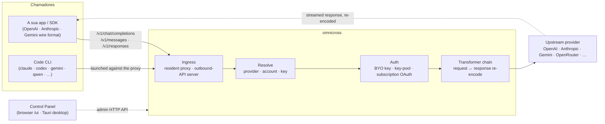

# omnicross

<div align="center">

[](https://opensource.org/licenses/MIT) [](https://nodejs.org/) [](https://www.typescriptlang.org/) [](https://www.npmjs.com/package/@omnicross/core)

[English](../README.md) · [简体中文](README.zh.md) · [繁體中文](README.zh-Hant.md) · [日本語](README.ja.md) · [한국어](README.ko.md) · [Français](README.fr.md) · [Deutsch](README.de.md) · [Italiano](README.it.md) · [Español (España)](README.es-ES.md) · [Español (Latinoamérica)](README.es-419.md) · [Português (Brasil)](README.pt-BR.md) · **Português (Portugal)** · [Nederlands](README.nl.md) · [Dansk](README.da.md) · [Svenska](README.sv.md) · [Norsk bokmål](README.nb.md) · [Suomi](README.fi.md) · [Polski](README.pl.md) · [Čeština](README.cs.md) · [Magyar](README.hu.md) · [Română](README.ro.md) · [Български](README.bg.md) · [Русский](README.ru.md) · [Українська](README.uk.md) · [Ελληνικά](README.el.md) · [Türkçe](README.tr.md) · [العربية](README.ar.md) · [ไทย](README.th.md) · [Tiếng Việt](README.vi.md) · [Bahasa Indonesia](README.id.md) · [Bahasa Melayu](README.ms.md)

**Um núcleo de serviço LLM universal — encaminhe, transforme e faça proxy de qualquer fornecedor por detrás de um único conjunto de APIs.**

</div>

---

O `omnicross` recebe um pedido LLM de entrada — OpenAI `/v1/chat/completions`, Anthropic `/v1/messages`, Gemini e mais — determina **qual o fornecedor, conta e chave** que deve responder (as suas próprias chaves de API, um conjunto de múltiplas chaves, ou uma identidade OAuth de subscrição), executa-o através de um pipeline de transformador + autenticação, e faz o proxy para o destino — recodificando a resposta de volta para o formato de transmissão que o chamador solicitou.

É fornecido em várias formas:

- **🖥️ Como aplicação desktop** — uma janela nativa Tauri v2 (`apps/desktop`) que apresenta a GUI completa do Painel de Controlo e agrupa e gere o daemon por si (tabuleiro do sistema, arranque automático, ciclo de vida do daemon). **A forma principal como a maioria das pessoas utiliza o omnicross** — sem terminal, sem npm, sem configuração CORS.
- **🌐 No seu browser** — prefere não instalar uma aplicação nativa? O `omnicross ui` inicia o daemon e abre a mesma GUI no seu browser (servida pelo próprio daemon em `/ui` — mesma origem, sem configuração adicional) para gerir fornecedores, chaves, contas e lançamentos de Code CLI.
- **🚀 Como daemon headless** — o CLI/daemon `omnicross`: um processo Node puro com uma API HTTP local, um painel de administração e comandos para chaves, fornecedores, login OAuth e lançamento de Code CLIs. Perfeito para servidores e fluxos de trabalho centrados no terminal; é também o que alimenta a aplicação desktop e o Painel de Controlo no browser.
- **📦 Como biblioteca** — `npm install @omnicross/core` e incorpore o núcleo de serviço diretamente em qualquer projeto Node.

O núcleo de serviço em si é Node puro — sem Electron, sem dependência de framework; a UI é uma aplicação web simples, e a shell desktop é uma camada Tauri fina sobre ela.

## 🏗️ Arquitetura

Um pedido de entrada entra através de um **ingress** (o proxy residente em processo, ou o servidor de API de saída autónomo), é resolvido para um **fornecedor + identidade**, é convertido pela **cadeia de transformadores**, e é encaminhado por proxy **upstream** — depois a resposta flui de volta pela mesma cadeia, recodificada no formato de transmissão do chamador.



| Bloco de construção | Localização |
| --- | --- |
| Frontend do Painel de Controlo (Vite + React) | `@omnicross/ui` (`packages/ui` — publica apenas o `dist/` compilado) |
| Shell desktop (Tauri v2) | `apps/desktop` |
| Runtime autónomo (API HTTP · painel · CLI · serve a UI em `/ui`) | `@omnicross/daemon` |
| Ingress · despacho · transformador · proxy | `@omnicross/core` |
| OAuth de subscrição + estratégias de autenticação | `@omnicross/subscriptions` |
| Tipos de contrato partilhados + predefinições de fornecedor | `@omnicross/contracts` |
| Lançamento de Code CLI (proxy-env + supervisor) | `@omnicross/cli-launcher` |

## ✨ Funcionalidades

- **GUI do Painel de Controlo** — uma UI React sobre a API de administração localhost do daemon: gira fornecedores, chaves e contas de subscrição visualmente em vez de editar ficheiros de configuração. Fornecida como aplicação desktop nativa Tauri v2 (a forma habitual de acesso — tabuleiro do sistema, arranque automático, daemon integrado, sem Electron), ou servida no browser com um único comando (`omnicross ui`).
- **Formato de transmissão de qualquer-para-qualquer** — aceite pedidos no formato OpenAI / Anthropic / Gemini e direcione-os para um fornecedor que fala um formato *diferente*; o pipeline de transformadores converte tanto o pedido como a resposta em streaming.
- **Chaves próprias + conjuntos de múltiplas chaves** — vincule as suas próprias chaves de fornecedor, ou agrupe múltiplas chaves por fornecedor com round-robin ponderado e failover automático em `429 / 529 / 401 / 403`.
- **Subscrição como fornecedor** — execute pedidos através de uma subscrição Claude / ChatGPT (Codex) / Gemini via OAuth, ou uma chave bearer OpenCodeGo, em vez de uma chave de API com medição de consumo.
- **Predefinições de fornecedor** — um catálogo selecionado de endpoints/modelos de fornecedores (OpenAI, Anthropic, Gemini, DeepSeek, OpenRouter, Groq, Mistral e muitos mais) que pode mapear para uma linha de configuração com um único comando.
- **Proxy nativo de streaming** — um proxy residente em processo retransmite fluxos SSE verbatim quando os formatos coincidem, e recodifica-os quando não coincidem.
- **Lançador de Code CLI** — inicie `claude` / `codex` / `gemini` / `qwen` / `copilot` / `opencode` contra um proxy local para que uma sessão CLI possa correr em **qualquer** fornecedor ou subscrição que tenha configurado.
- **Agnóstico de host e tipado** — Node puro + TypeScript, tipos de contrato com poucas dependências publicados separadamente, zero acoplamento a qualquer aplicação host.

## 📦 Estrutura

Este é um monorepo de workspace único: pacotes publicáveis em `packages/`, aplicações executáveis em `apps/`. Os nomes dos pacotes npm mantêm o âmbito `@omnicross/`; os nomes de diretório omitem o prefixo `omnicross-`.

| Aplicação | O que é |
| --- | --- |
| `apps/desktop` | **omnicross-desktop** — a aplicação desktop nativa Tauri v2: encapsula o frontend `@omnicross/ui` como uma janela nativa e agrupa e gere o daemon (tabuleiro do sistema, arranque automático, ciclo de vida do daemon). Consulte [`apps/desktop/README.md`](../apps/desktop/README.md). |

Os pacotes publicados:

| Pacote | npm | O que é |
| --- | --- | --- |
| `packages/contracts` | [`@omnicross/contracts`](https://www.npmjs.com/package/@omnicross/contracts) | Tipos de contrato com poucas dependências + auxiliares de valores em runtime (configuração LLM, tipos completion/chat, predefinições de fornecedor, configuração de thinking, utilização, tipos de subscrição/token de conta). Consumido via subcaminhos (`@omnicross/contracts/llm-config`, `/provider-presets`, …). |
| `packages/core` | [`@omnicross/core`](https://www.npmjs.com/package/@omnicross/core) | O núcleo de serviço — despacho de fornecedor, pipeline de completion, transformadores, o proxy de fornecedor e a superfície de API de saída. |
| `packages/subscriptions` | [`@omnicross/subscriptions`](https://www.npmjs.com/package/@omnicross/subscriptions) | Estratégias de autenticação de subscrição-como-fornecedor, fluxos OAuth (Claude / Codex / Gemini) e o despachante de cenário OpenCodeGo. |
| `packages/cli-launcher` | [`@omnicross/cli-launcher`](https://www.npmjs.com/package/@omnicross/cli-launcher) | O mecanismo de ciclo de vida de subprocessos `ProcessSupervisor` + construtores de configuração de lançamento proxy-env por CLI. |
| `packages/daemon` | [`@omnicross/daemon`](https://www.npmjs.com/package/@omnicross/daemon) | Um incorporador Node puro do `@omnicross/core` com uma API HTTP de administração + painel, o CLI `omnicross` e serviço do Painel de Controlo com mesma origem em `/ui`. |
| `packages/ui` | [`@omnicross/ui`](https://www.npmjs.com/package/@omnicross/ui) | O frontend do Painel de Controlo (Vite + React). Publica apenas o `dist/` compilado (assets estáticos, zero dependências em runtime); o daemon serve-o em `/ui`, a shell Tauri encapsula-o. |

## 🚀 Início rápido

### Opção A — Aplicação desktop (recomendada para a maioria dos utilizadores)

Transfira o instalador para o seu SO a partir da [versão mais recente](https://github.com/Dumoedss/omnicross/releases/latest) e execute-o:

- **Windows** — `*-setup.exe` (NSIS) ou `*.msi`
- **macOS** — `*.dmg` (universal — Apple Silicon + Intel)
- **Linux** — `*.AppImage`, `*.deb` ou `*.rpm`

A aplicação agrupa e gere tudo por si — o daemon **e** um runtime Node privado — pelo que não há mais nada a instalar. Basta transferir, executar o instalador e abri-lo.

> Quer compilá-lo você mesmo? Consulte [`apps/desktop/README.md`](../apps/desktop/README.md) (`npm run build:app`, requer Rust).

### Opção B — Painel de Controlo no browser

Prefere não instalar uma aplicação? Um único comando — o daemon serve a mesma UI ele próprio (mesma origem que a sua API de administração — sem CORS, sem `.env`):

```bash
npm install -g @omnicross/daemon
omnicross ui --config ./omnicross.config.json   # boots the daemon + opens http://127.0.0.1:8766/ui/
```

Adicione `--no-open` para omitir o lançamento do browser. Os fluxos de trabalho de desenvolvimento de frontend estão em [`packages/ui/README.md`](../packages/ui/README.md).

### Opção C — daemon headless

Tudo o que a aplicação faz — e mais — está disponível no terminal:

```bash
npm install -g @omnicross/daemon
```

```bash
# Boot the daemon (BYO-key serving) against a config file
omnicross start --config ./omnicross.config.json

# Map a curated provider preset + your key into the config
omnicross providers presets --config ./omnicross.config.json
omnicross providers add openai --key $OPENAI_API_KEY --config ./omnicross.config.json

# Mint a local API key for your clients (shown once)
omnicross keys add my-app --config ./omnicross.config.json

# Log in to a subscription via browser OAuth (claude | codex | gemini)
omnicross login claude --config ./omnicross.config.json

# Launch a Code CLI against the in-process proxy on any configured provider
omnicross launch claude --provider openai --model gpt-4o --config ./omnicross.config.json
```

Execute `omnicross --help` para a lista completa de comandos.

### Opção D — como biblioteca

```bash
npm install @omnicross/core @omnicross/contracts
```

```ts
import type { LLMProvider } from '@omnicross/contracts/llm-config';
// import the serving-core pieces you need from @omnicross/core

// Wire the serving core into your own Node app: supply a provider-config
// source + key store, then route inbound requests through the proxy.
```

> As importações por subcaminho mantêm o grafo de dependências compacto, por exemplo
> `@omnicross/contracts/provider-presets`, `@omnicross/core/provider-proxy`.

## 🛠️ Desenvolvimento

```bash
git clone https://github.com/Dumoedss/omnicross.git
cd omnicross
npm install          # workspace symlinks for @omnicross/* + external deps
npm run typecheck    # tsc --noEmit per package
npm test             # vitest (tests run against src via aliases)
npm run build        # tsup per package → dist/ (ESM + CJS + .d.ts)
```

Os testes e as verificações de tipos resolvem as importações `@omnicross/*` para o **código-fonte** do pacote via aliases, pelo que não é necessária uma compilação prévia. O `npm run build` emite o `dist/` de cada pacote para publicação.

Para o desenvolvimento do Painel de Controlo, o `npm run dev` (raiz do repositório) é o ciclo de um único comando: propaga um `omnicross.dev.config.json` ignorado pelo git na primeira execução, inicia o daemon em `127.0.0.1:8766` e inicia o servidor de desenvolvimento Vite da UI em `http://localhost:1430` (Ctrl+C para ambos). O servidor de desenvolvimento faz proxy de `/admin/*` para o daemon no lado do servidor, pelo que o browser permanece na mesma origem — o daemon não envia cabeçalhos CORS por design. O próprio frontend é o pacote de workspace `@omnicross/ui` — o `npm run build -w @omnicross/ui` atualiza o `dist/` servido pelo daemon. Para a janela nativa (requer Rust): o `npm run dev:app` executa o `tauri dev` e o `npm run build:app` empacota o executável de lançamento + instaladores com o runtime do daemon **e um binário Node privado** incluídos (resultado em `apps/desktop/src-tauri/target/release/`; as máquinas de destino não precisam de ter nada instalado — detalhes em [`apps/desktop/README.md`](../apps/desktop/README.md)).

## 📄 Licença

[MIT](../LICENSE) 

Partes do `@omnicross/core` e de outros pacotes adaptam trabalho de terceiros sob as respetivas licenças — consulte os ficheiros `NOTICE` nos pacotes correspondentes.
