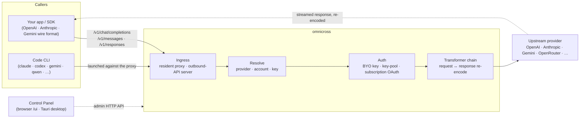

# omnicross

<div align="center">

[](https://opensource.org/licenses/MIT) [](https://nodejs.org/) [](https://www.typescriptlang.org/) [](https://www.npmjs.com/package/@omnicross/core)

[English](../README.md) · [简体中文](README.zh.md) · [繁體中文](README.zh-Hant.md) · [日本語](README.ja.md) · [한국어](README.ko.md) · [Français](README.fr.md) · [Deutsch](README.de.md) · [Italiano](README.it.md) · [Español (España)](README.es-ES.md) · [Español (Latinoamérica)](README.es-419.md) · [Português (Brasil)](README.pt-BR.md) · [Português (Portugal)](README.pt-PT.md) · [Nederlands](README.nl.md) · [Dansk](README.da.md) · [Svenska](README.sv.md) · [Norsk bokmål](README.nb.md) · [Suomi](README.fi.md) · [Polski](README.pl.md) · [Čeština](README.cs.md) · [Magyar](README.hu.md) · **Română** · [Български](README.bg.md) · [Русский](README.ru.md) · [Українська](README.uk.md) · [Ελληνικά](README.el.md) · [Türkçe](README.tr.md) · [العربية](README.ar.md) · [ไทย](README.th.md) · [Tiếng Việt](README.vi.md) · [Bahasa Indonesia](README.id.md) · [Bahasa Melayu](README.ms.md)

**Un nucleu universal de servire LLM — rutează, transformă și intermediază orice furnizor printr-un singur set de API-uri.**

</div>

---

**omnicross alimentează toate aplicațiile AI și CLI-urile de programare dintr-un singur loc — cu abonamentele sau cheile API existente.**

Îndreaptă Claude Code, Codex, Gemini CLI — sau orice aplicație care vorbește API-ul OpenAI / Anthropic / Gemini — spre omnicross, și acesta rutează fiecare cerere către furnizorul și modelul ales de tine. Ce poți face:

- rulezi pe baza unui **abonament Claude / ChatGPT / Gemini**, fără chei API cu plată per utilizare;
- grupezi mai multe chei API într-un pool cu rotație automată și failover;
- lași un instrument care vorbește doar un singur format de API să apeleze un model care vorbește un alt format — omnicross traduce cererea și răspunsul din mers.

Toate acestea gestionate printr-un GUI desktop — fără editare manuală a fișierelor de configurare.

Este disponibil în câteva forme:

- **🖥️ Ca aplicație desktop** — o fereastră nativă Tauri v2 (`apps/desktop`) care prezintă GUI-ul complet al Panoului de control și gestionează daemon-ul pentru tine (tavă de sistem, pornire automată, ciclu de viață al daemon-ului). **Modul principal în care majoritatea oamenilor folosesc omnicross** — fără terminal, fără npm, fără configurare CORS.
- **🌐 În browser** — preferi să nu instalezi o aplicație nativă? `omnicross ui` pornește daemon-ul și deschide același GUI în browser (servit de daemon însuși la `/ui` — aceeași origine, fără configurare suplimentară) pentru gestionarea furnizorilor, cheilor, conturilor și lansărilor Code CLI.
- **🚀 Ca daemon headless** — CLI-ul/daemon-ul `omnicross`: un proces pur Node cu un API HTTP local, un tablou de bord de administrare și comenzi pentru chei, furnizori, autentificare OAuth și lansarea Code CLI-urilor. Perfect pentru servere și fluxuri de lucru orientate spre terminal; este și ceea ce alimentează aplicația desktop și Panoul de control din browser.
- **📦 Ca bibliotecă** — `npm install @omnicross/core` și înglobează nucleul de servire direct în orice proiect Node.

Nucleul de servire în sine este pur Node — fără Electron, fără dependență de framework; UI-ul este o aplicație web obișnuită, iar shell-ul desktop este un strat Tauri subțire peste acesta.

## 🏗️ Arhitectură

O cerere de intrare intră printr-un **ingress** (proxy-ul rezident în proces sau serverul API extern independent), este rezolvată la un **furnizor + identitate**, este convertită de **lanțul de transformatoare** și este intermediată **în amonte** — apoi răspunsul se transmite înapoi prin același lanț, recodificat în formatul de protocol al apelantului.



| Bloc de construcție | Unde |
| --- | --- |
| Frontend Panou de control (Vite + React) | `@omnicross/ui` (`packages/ui` — publică doar `dist/`-ul compilat) |
| Shell desktop (Tauri v2) | `apps/desktop` |
| Runtime independent (API HTTP · tablou de bord · CLI · servește UI la `/ui`) | `@omnicross/daemon` |
| Ingress · dispatch · transformator · proxy | `@omnicross/core` |
| OAuth abonament + strategii de autentificare | `@omnicross/subscriptions` |
| Tipuri de contract partajate + presetări furnizori | `@omnicross/contracts` |
| Lansare Code CLI (proxy-env + supervizor) | `@omnicross/cli-launcher` |

## ✨ Funcționalități

- **GUI Panou de control** — o interfață React peste API-ul de administrare localhost al daemon-ului: gestionează vizual furnizorii, cheile și conturile de abonament în loc de fișiere de configurare. Este disponibil ca aplicație desktop nativă Tauri v2 (modul uzual de acces — tavă de sistem, pornire automată, daemon integrat, fără Electron) sau servit în browser cu o singură comandă (`omnicross ui`).
- **Format de protocol any-to-any** — acceptă cereri în format OpenAI / Anthropic / Gemini și le direcționează către un furnizor care vorbește un format *diferit*; pipeline-ul de transformare convertește atât cererea, cât și răspunsul transmis în flux.
- **Chei proprii + pool-uri multi-cheie** — leagă propriile chei de furnizor, sau grupează mai multe chei per furnizor cu round-robin ponderat și failover automat la `429 / 529 / 401 / 403`.
- **Abonamentul ca furnizor** — dirijează cereri printr-un abonament Claude / ChatGPT (Codex) / Gemini via OAuth, sau o cheie bearer OpenCodeGo, în loc de o cheie API cu plată per utilizare.
- **Presetări furnizori** — un catalog selectat de endpoint-uri/șabloane furnizori (OpenAI, Anthropic, Gemini, DeepSeek, OpenRouter, Groq, Mistral și mulți alții) pe care le poți mapa la un rând de configurare cu o singură comandă.
- **Proxy nativ pentru streaming** — un proxy rezident în proces transmite fluxurile SSE verbatim acolo unde formatele se potrivesc și le recodifică acolo unde nu se potrivesc.
- **Lansator Code CLI** — pornește `claude` / `codex` / `gemini` / `qwen` / `copilot` / `opencode` împotriva unui proxy local, astfel încât o sesiune CLI poate rula pe **orice** furnizor sau abonament ai configurat.
- **Agnostic față de gazdă & tipizat** — Node pur + TypeScript, tipuri de contract cu dependențe minime publicate separat, zero cuplare cu orice aplicație gazdă.

## 📦 Structură

Acesta este un monorepo cu un singur workspace: pachetele publicabile în `packages/`, aplicațiile executabile în `apps/`. Numele pachetelor npm păstrează scope-ul `@omnicross/`; numele directoarelor omit prefixul `omnicross-`.

| Aplicație | Ce este |
| --- | --- |
| `apps/desktop` | **omnicross-desktop** — aplicația desktop nativă Tauri v2: învelește frontend-ul `@omnicross/ui` ca fereastră nativă și integrează și gestionează daemon-ul (tavă de sistem, pornire automată, ciclu de viață al daemon-ului). Vezi [`apps/desktop/README.md`](../apps/desktop/README.md). |

Pachetele publicate:

| Pachet | npm | Ce este |
| --- | --- | --- |
| `packages/contracts` | [`@omnicross/contracts`](https://www.npmjs.com/package/@omnicross/contracts) | Tipuri de contract cu dependențe minime + ajutoare de valori runtime (configurare LLM, tipuri completion/chat, presetări furnizori, configurare thinking, utilizare, tipuri de token abonament/cont). Consumate prin subpaths (`@omnicross/contracts/llm-config`, `/provider-presets`, …). |
| `packages/core` | [`@omnicross/core`](https://www.npmjs.com/package/@omnicross/core) | Nucleul de servire — dispatch furnizor, pipeline completion, transformatoare, proxy-ul furnizorului și suprafața API externă. |
| `packages/subscriptions` | [`@omnicross/subscriptions`](https://www.npmjs.com/package/@omnicross/subscriptions) | Strategii de autentificare abonament-ca-furnizor, fluxuri OAuth (Claude / Codex / Gemini) și dispatcher-ul scenariului OpenCodeGo. |
| `packages/cli-launcher` | [`@omnicross/cli-launcher`](https://www.npmjs.com/package/@omnicross/cli-launcher) | Mecanismul `ProcessSupervisor` pentru ciclul de viață al subproceselor + constructori de configurare lansare proxy-env per CLI. |
| `packages/daemon` | [`@omnicross/daemon`](https://www.npmjs.com/package/@omnicross/daemon) | Un embedder pur Node al `@omnicross/core` cu API HTTP de administrare + tablou de bord, CLI-ul `omnicross` și servire same-origin a Panoului de control la `/ui`. |
| `packages/ui` | [`@omnicross/ui`](https://www.npmjs.com/package/@omnicross/ui) | Frontend-ul Panoului de control (Vite + React). Publică doar `dist/`-ul compilat (active statice, zero dependențe runtime); daemon-ul îl servește la `/ui`, shell-ul Tauri îl învelește. |

## 🚀 Start rapid

### Opțiunea A — Aplicație desktop (recomandat pentru majoritatea utilizatorilor)

Descarcă installerul pentru sistemul tău de operare din [cea mai recentă versiune](https://github.com/Dumoedss/omnicross/releases/latest) și rulează-l:

- **Windows** — `*-setup.exe` (NSIS) sau `*.msi`
- **macOS** — `*.dmg` (universal — Apple Silicon + Intel)
- **Linux** — `*.AppImage`, `*.deb` sau `*.rpm`

Aplicația integrează și gestionează totul pentru tine — daemon-ul **și** un runtime Node privat — deci nu mai trebuie să instalezi nimic altceva. Descarcă, rulează installerul și deschide-o.

> Vrei să o compilezi singur? Vezi [`apps/desktop/README.md`](../apps/desktop/README.md) (`npm run build:app`, necesită Rust).

### Opțiunea B — Panou de control în browser

Preferi să nu instalezi o aplicație? O singură comandă — daemon-ul servește același UI el însuși (aceeași origine cu API-ul de administrare — fără CORS, fără `.env`):

```bash
npm install -g @omnicross/daemon
omnicross ui --config ./omnicross.config.json   # boots the daemon + opens http://127.0.0.1:8766/ui/
```

Adaugă `--no-open` pentru a sări peste deschiderea browserului. Fluxurile de lucru pentru dezvoltarea frontend-ului se găsesc în [`packages/ui/README.md`](../packages/ui/README.md).

### Opțiunea C — daemon headless

Tot ceea ce face aplicația — și mai mult — este disponibil din terminal:

```bash
npm install -g @omnicross/daemon
```

```bash
# Boot the daemon (BYO-key serving) against a config file
omnicross start --config ./omnicross.config.json

# Map a curated provider preset + your key into the config
omnicross providers presets --config ./omnicross.config.json
omnicross providers add openai --key $OPENAI_API_KEY --config ./omnicross.config.json

# Mint a local API key for your clients (shown once)
omnicross keys add my-app --config ./omnicross.config.json

# Log in to a subscription via browser OAuth (claude | codex | gemini)
omnicross login claude --config ./omnicross.config.json

# Launch a Code CLI against the in-process proxy on any configured provider
omnicross launch claude --provider openai --model gpt-4o --config ./omnicross.config.json
```

Rulează `omnicross --help` pentru lista completă de comenzi.

### Opțiunea D — ca bibliotecă

```bash
npm install @omnicross/core @omnicross/contracts
```

```ts
import type { LLMProvider } from '@omnicross/contracts/llm-config';
// import the serving-core pieces you need from @omnicross/core

// Wire the serving core into your own Node app: supply a provider-config
// source + key store, then route inbound requests through the proxy.
```

> Importurile prin subpath mențin graful de dependențe compact, de ex.
> `@omnicross/contracts/provider-presets`, `@omnicross/core/provider-proxy`.

## 🛠️ Dezvoltare

```bash
git clone https://github.com/Dumoedss/omnicross.git
cd omnicross
npm install          # workspace symlinks for @omnicross/* + external deps
npm run typecheck    # tsc --noEmit per package
npm test             # vitest (tests run against src via aliases)
npm run build        # tsup per package → dist/ (ESM + CJS + .d.ts)
```

Testele și verificările de tip rezolvă importurile `@omnicross/*` la **sursa** pachetului prin aliasuri, deci nu este necesară o compilare prealabilă. `npm run build` emite `dist/`-ul fiecărui pachet pentru publicare.

Pentru dezvoltarea Panoului de control, `npm run dev` (din rădăcina repo-ului) este bucla cu o singură comandă: generează un `omnicross.dev.config.json` gitignored la prima rulare, pornește daemon-ul pe `127.0.0.1:8766` și pornește serverul de dezvoltare Vite al UI-ului pe `http://localhost:1430` (Ctrl+C oprește ambele). Serverul de dezvoltare intermediază `/admin/*` către server-side al daemon-ului, astfel încât browserul rămâne same-origin — daemon-ul nu trimite headere CORS prin design. Frontend-ul în sine este pachetul workspace `@omnicross/ui` — `npm run build -w @omnicross/ui` reîmprospătează `dist/`-ul servit de daemon. Pentru fereastra nativă (necesită Rust): `npm run dev:app` rulează `tauri dev`, iar `npm run build:app` împachetează executabilul de lansare + installerele cu runtime-ul daemon **și un binar Node privat** inclus (ieșire în `apps/desktop/src-tauri/target/release/`; mașinile țintă nu au nevoie de nimic instalat — detalii în [`apps/desktop/README.md`](../apps/desktop/README.md)).

## 📄 Licență

[MIT](../LICENSE) 

Porțiuni din `@omnicross/core` și alte pachete adaptează lucrări terțe sub propriile licențe — vezi fișierele `NOTICE` din pachetele respective.
