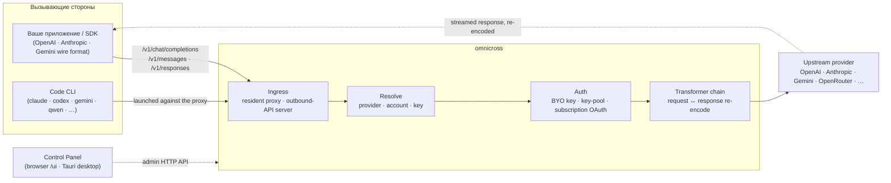

# omnicross

<div align="center">

[](https://opensource.org/licenses/MIT) [](https://nodejs.org/) [](https://www.typescriptlang.org/) [](https://www.npmjs.com/package/@omnicross/core)

[English](../README.md) · [简体中文](README.zh.md) · [繁體中文](README.zh-Hant.md) · [日本語](README.ja.md) · [한국어](README.ko.md) · [Français](README.fr.md) · [Deutsch](README.de.md) · [Italiano](README.it.md) · [Español (España)](README.es-ES.md) · [Español (Latinoamérica)](README.es-419.md) · [Português (Brasil)](README.pt-BR.md) · [Português (Portugal)](README.pt-PT.md) · [Nederlands](README.nl.md) · [Dansk](README.da.md) · [Svenska](README.sv.md) · [Norsk bokmål](README.nb.md) · [Suomi](README.fi.md) · [Polski](README.pl.md) · [Čeština](README.cs.md) · [Magyar](README.hu.md) · [Română](README.ro.md) · [Български](README.bg.md) · **Русский** · [Українська](README.uk.md) · [Ελληνικά](README.el.md) · [Türkçe](README.tr.md) · [العربية](README.ar.md) · [ไทย](README.th.md) · [Tiếng Việt](README.vi.md) · [Bahasa Indonesia](README.id.md) · [Bahasa Melayu](README.ms.md)

**Универсальное ядро для обслуживания LLM — маршрутизация, трансформация и проксирование любого провайдера через единый набор API.**

</div>

---

**omnicross управляет всеми AI-приложениями и Code CLI из одного места — с вашими существующими подписками или API-ключами.**

Направьте Claude Code, Codex, Gemini CLI — или любое приложение, работающее с API OpenAI / Anthropic / Gemini — на omnicross, и он будет маршрутизировать каждый запрос к выбранному вами провайдеру и модели. Что вы можете делать:

- работать с **подпиской Claude / ChatGPT / Gemini**, не используя платные API Key;
- объединять несколько API Key в пул с автоматической ротацией и переключением при сбое;
- позволить инструменту, говорящему только на одном формате API, вызывать модель другого провайдера — omnicross транслирует запрос и ответ на лету.

Всё это управляется через графический интерфейс настольного приложения — без ручного редактирования конфигурационных файлов.

Инструмент доступен в нескольких вариантах:

- **🖥️ Как настольное приложение** — нативное окно Tauri v2 (`apps/desktop`), предоставляющее полноценный графический интерфейс Панели управления и самостоятельно управляющее демоном (трей, автозапуск, жизненный цикл демона). **Основной способ использования omnicross для большинства пользователей** — без терминала, без npm, без настройки CORS.
- **🌐 В браузере** — не хотите устанавливать нативное приложение? `omnicross ui` запускает демон и открывает тот же графический интерфейс в вашем браузере (обслуживается самим демоном по адресу `/ui` — тот же источник, никаких дополнительных настроек) для управления провайдерами, ключами, аккаунтами и запуска Code CLI.
- **🚀 Как headless-демон** — интерфейс командной строки/демон `omnicross`: чистый Node-процесс с локальным HTTP API, панелью администратора и командами для управления ключами, провайдерами, OAuth-входом и запуска Code CLI. Идеально подходит для серверов и рабочих процессов с терминалом; именно он лежит в основе настольного приложения и браузерной Панели управления.
- **📦 Как библиотека** — `npm install @omnicross/core` и встройте ядро обслуживания напрямую в любой Node-проект.

Само ядро обслуживания — чистый Node, без Electron и без привязки к какому-либо фреймворку; UI — обычное веб-приложение, а настольная оболочка — лишь тонкий слой Tauri поверх него.

## 🏗️ Архитектура

Входящий запрос поступает через **ingress** (постоянный внутрипроцессный прокси или отдельный сервер исходящего API), разрешается до конкретного **провайдера + идентичности**, преобразуется **цепочкой трансформаторов** и проксируется **к вышестоящему провайдеру** — после чего ответ в потоковом режиме возвращается по той же цепочке и перекодируется в формат, запрошенный вызывающей стороной.



| Компонент | Расположение |
| --- | --- |
| Фронтенд Панели управления (Vite + React) | `@omnicross/ui` (`packages/ui` — публикует только собранный `dist/`) |
| Настольная оболочка (Tauri v2) | `apps/desktop` |
| Автономная среда выполнения (HTTP API · панель · CLI · обслуживает UI на `/ui`) | `@omnicross/daemon` |
| Ingress · диспетчеризация · трансформатор · прокси | `@omnicross/core` |
| Подписочный OAuth + стратегии аутентификации | `@omnicross/subscriptions` |
| Общие типы контрактов + пресеты провайдеров | `@omnicross/contracts` |
| Запуск Code CLI (proxy-env + супервизор) | `@omnicross/cli-launcher` |

## ✨ Возможности

- **Графический интерфейс Панели управления** — React-интерфейс поверх локального admin API демона: управляйте провайдерами, ключами и подписочными аккаунтами визуально, без редактирования конфигурационных файлов. Поставляется как нативное настольное приложение Tauri v2 (основной способ повседневного использования — трей, автозапуск, встроенный демон, без Electron) или открывается в браузере одной командой (`omnicross ui`).
- **Конвертация любого формата в любой** — принимайте запросы в формате OpenAI / Anthropic / Gemini и направляйте их провайдеру, говорящему на *другом* формате; конвейер трансформаторов конвертирует и запрос, и потоковый ответ.
- **BYO-ключи + пулы из нескольких ключей** — привяжите собственные ключи провайдеров или сформируйте пулы из нескольких ключей для каждого провайдера с взвешенным round-robin и автоматическим переключением при сбое на `429 / 529 / 401 / 403`.
- **Подписка как провайдер** — выполняйте запросы через подписку Claude / ChatGPT (Codex) / Gemini с использованием OAuth или через bearer-ключ OpenCodeGo — вместо платного API-ключа.
- **Пресеты провайдеров** — подобранный каталог конечных точек и шаблонов провайдеров (OpenAI, Anthropic, Gemini, DeepSeek, OpenRouter, Groq, Mistral и многие другие), которые можно добавить в конфигурацию одной командой.
- **Потоковый прокси нативно** — постоянный внутрипроцессный прокси передаёт SSE-потоки дословно там, где форматы совпадают, и перекодирует их там, где они отличаются.
- **Запуск Code CLI** — запускайте `claude` / `codex` / `gemini` / `qwen` / `copilot` / `opencode` против локального прокси, чтобы CLI-сессия могла работать с **любым** настроенным вами провайдером или подпиской.
- **Независимость от хоста и типизация** — чистый Node + TypeScript, типы контрактов с минимальными зависимостями публикуются отдельно, нулевая связанность с любым хост-приложением.

## 📦 Структура репозитория

Это монорепозиторий с единым рабочим пространством: публикуемые пакеты — в `packages/`, запускаемые приложения — в `apps/`. npm-пакеты сохраняют область видимости `@omnicross/`; имена директорий не содержат префикса `omnicross-`.

| Приложение | Описание |
| --- | --- |
| `apps/desktop` | **omnicross-desktop** — нативное настольное приложение Tauri v2: оборачивает фронтенд `@omnicross/ui` в нативное окно и встраивает демон + управляет им (трей, автозапуск, жизненный цикл демона). Подробнее: [`apps/desktop/README.md`](../apps/desktop/README.md). |

Публикуемые пакеты:

| Пакет | npm | Описание |
| --- | --- | --- |
| `packages/contracts` | [`@omnicross/contracts`](https://www.npmjs.com/package/@omnicross/contracts) | Типы контрактов с минимальными зависимостями + вспомогательные функции времени выполнения (конфигурация LLM, типы completion/chat, пресеты провайдеров, конфигурация thinking, статистика использования, типы токенов подписки/аккаунта). Импортируются через подпути (`@omnicross/contracts/llm-config`, `/provider-presets` и т. д.). |
| `packages/core` | [`@omnicross/core`](https://www.npmjs.com/package/@omnicross/core) | Ядро обслуживания — диспетчеризация провайдеров, конвейер completion, трансформаторы, прокси провайдера и исходящий API. |
| `packages/subscriptions` | [`@omnicross/subscriptions`](https://www.npmjs.com/package/@omnicross/subscriptions) | Стратегии аутентификации подписки как провайдера, OAuth-потоки (Claude / Codex / Gemini) и диспетчер сценариев OpenCodeGo. |
| `packages/cli-launcher` | [`@omnicross/cli-launcher`](https://www.npmjs.com/package/@omnicross/cli-launcher) | Механизм управления жизненным циклом подпроцессов `ProcessSupervisor` + построители конфигурации запуска proxy-env для каждого CLI. |
| `packages/daemon` | [`@omnicross/daemon`](https://www.npmjs.com/package/@omnicross/daemon) | Чистый Node-хост для `@omnicross/core` с admin HTTP API + панелью, CLI `omnicross` и обслуживанием Панели управления по адресу `/ui` с того же источника. |
| `packages/ui` | [`@omnicross/ui`](https://www.npmjs.com/package/@omnicross/ui) | Фронтенд Панели управления (Vite + React). Публикует только собранный `dist/` (статические ресурсы, без зависимостей времени выполнения); демон обслуживает его на `/ui`, оболочка Tauri оборачивает его. |

## 🚀 Быстрый старт

### Вариант A — Настольное приложение (рекомендуется для большинства пользователей)

Скачайте установщик для вашей ОС из [последнего релиза](https://github.com/Dumoedss/omnicross/releases/latest) и запустите его:

- **Windows** — `*-setup.exe` (NSIS) или `*.msi`
- **macOS** — `*.dmg` (универсальный — Apple Silicon + Intel)
- **Linux** — `*.AppImage`, `*.deb` или `*.rpm`

Приложение самостоятельно упаковывает и управляет всем необходимым — демоном **и** приватной средой выполнения Node — поэтому ничего дополнительно устанавливать не нужно. Просто скачайте, запустите установщик и откройте приложение.

> Хотите собрать самостоятельно? Смотрите [`apps/desktop/README.md`](../apps/desktop/README.md) (`npm run build:app`, требуется Rust).

### Вариант B — Панель управления в браузере

Не хотите устанавливать приложение? Одна команда — демон сам обслуживает тот же UI (тот же источник, что и его admin API — без CORS, без `.env`):

```bash
npm install -g @omnicross/daemon
omnicross ui --config ./omnicross.config.json   # boots the daemon + opens http://127.0.0.1:8766/ui/
```

Добавьте `--no-open`, чтобы пропустить открытие браузера. Рабочие процессы разработки фронтенда описаны в [`packages/ui/README.md`](../packages/ui/README.md).

### Вариант C — Headless-демон

Всё, что умеет приложение — и даже больше — доступно из терминала:

```bash
npm install -g @omnicross/daemon
```

```bash
# Boot the daemon (BYO-key serving) against a config file
omnicross start --config ./omnicross.config.json

# Map a curated provider preset + your key into the config
omnicross providers presets --config ./omnicross.config.json
omnicross providers add openai --key $OPENAI_API_KEY --config ./omnicross.config.json

# Mint a local API key for your clients (shown once)
omnicross keys add my-app --config ./omnicross.config.json

# Log in to a subscription via browser OAuth (claude | codex | gemini)
omnicross login claude --config ./omnicross.config.json

# Launch a Code CLI against the in-process proxy on any configured provider
omnicross launch claude --provider openai --model gpt-4o --config ./omnicross.config.json
```

Запустите `omnicross --help` для получения полного списка команд.

### Вариант D — Как библиотека

```bash
npm install @omnicross/core @omnicross/contracts
```

```ts
import type { LLMProvider } from '@omnicross/contracts/llm-config';
// import the serving-core pieces you need from @omnicross/core

// Wire the serving core into your own Node app: supply a provider-config
// source + key store, then route inbound requests through the proxy.
```

> Импорты через подпути позволяют поддерживать граф зависимостей компактным, например:
> `@omnicross/contracts/provider-presets`, `@omnicross/core/provider-proxy`.

## 🛠️ Разработка

```bash
git clone https://github.com/Dumoedss/omnicross.git
cd omnicross
npm install          # workspace symlinks for @omnicross/* + external deps
npm run typecheck    # tsc --noEmit per package
npm test             # vitest (tests run against src via aliases)
npm run build        # tsup per package → dist/ (ESM + CJS + .d.ts)
```

Тесты и проверки типов разрешают импорты `@omnicross/*` в **исходный код** пакетов через псевдонимы, поэтому предварительная сборка не требуется. `npm run build` создаёт `dist/` каждого пакета для публикации.

Для разработки Панели управления `npm run dev` (из корня репозитория) — это универсальная команда: при первом запуске она создаёт `omnicross.dev.config.json` (добавлен в gitignore), запускает демон на `127.0.0.1:8766` и Vite dev-сервер UI на `http://localhost:1430` (Ctrl+C останавливает оба). Dev-сервер проксирует `/admin/*` к демону на стороне сервера, поэтому браузер остаётся в рамках одного источника — демон намеренно не отправляет заголовки CORS. Сам фронтенд — это пакет `@omnicross/ui` в рабочем пространстве — `npm run build -w @omnicross/ui` обновляет `dist/`, обслуживаемый демоном. Для нативного окна (требуется Rust): `npm run dev:app` запускает `tauri dev`, а `npm run build:app` упаковывает релизный исполняемый файл + установщики со встроенными средой выполнения демона **и приватным бинарником Node** (результаты находятся в `apps/desktop/src-tauri/target/release/`; на целевых машинах ничего устанавливать не нужно — подробности в [`apps/desktop/README.md`](../apps/desktop/README.md)).

## 📄 Лицензия

[MIT](../LICENSE) 

Отдельные части `@omnicross/core` и других пакетов адаптированы из сторонних разработок и распространяются под соответствующими лицензиями — смотрите файлы `NOTICE` в соответствующих пакетах.
