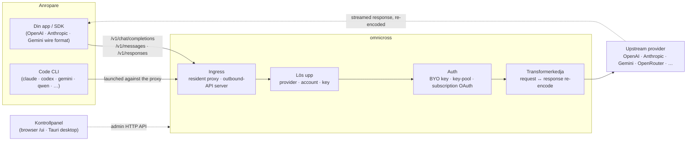

# omnicross

<div align="center">

[](https://opensource.org/licenses/MIT) [](https://nodejs.org/) [](https://www.typescriptlang.org/) [](https://www.npmjs.com/package/@omnicross/core)

[English](../README.md) · [简体中文](README.zh.md) · [繁體中文](README.zh-Hant.md) · [日本語](README.ja.md) · [한국어](README.ko.md) · [Français](README.fr.md) · [Deutsch](README.de.md) · [Italiano](README.it.md) · [Español (España)](README.es-ES.md) · [Español (Latinoamérica)](README.es-419.md) · [Português (Brasil)](README.pt-BR.md) · [Português (Portugal)](README.pt-PT.md) · [Nederlands](README.nl.md) · [Dansk](README.da.md) · **Svenska** · [Norsk bokmål](README.nb.md) · [Suomi](README.fi.md) · [Polski](README.pl.md) · [Čeština](README.cs.md) · [Magyar](README.hu.md) · [Română](README.ro.md) · [Български](README.bg.md) · [Русский](README.ru.md) · [Українська](README.uk.md) · [Ελληνικά](README.el.md) · [Türkçe](README.tr.md) · [العربية](README.ar.md) · [ไทย](README.th.md) · [Tiếng Việt](README.vi.md) · [Bahasa Indonesia](README.id.md) · [Bahasa Melayu](README.ms.md)

**En universell LLM-serverkärna — dirigera, transformera och proxya vilken leverantör som helst bakom ett enda API-gränssnitt.**

</div>

---

`omnicross` tar emot en inkommande LLM-förfrågan — OpenAI `/v1/chat/completions`, Anthropic `/v1/messages`, Gemini med mera — avgör **vilken leverantör, vilket konto och vilken nyckel** som ska besvara den (dina egna API-nycklar, en pool med flera nycklar eller en prenumerations-OAuth-identitet), kör den genom en transformer- och autentiseringspipeline, och proxyr den uppströms — och kodar om svaret tillbaka till vilket trådformat som anroparen begärde.

Det finns i några olika former:

- **🖥️ Som en skrivbordsapp** — ett inbyggt Tauri v2-fönster (`apps/desktop`) som presenterar det fullständiga kontrollpanelens GUI och paketerar och hanterar daemonen åt dig (systemfält, autostart, daemon-livscykel). **Det huvudsakliga sättet de flesta använder omnicross** — ingen terminal, ingen npm, ingen CORS-konfiguration.
- **🌐 I din webbläsare** — föredrar du att inte installera en inbyggd app? `omnicross ui` startar daemonen och öppnar samma GUI i din webbläsare (serverat av daemonen själv på `/ui` — samma ursprung, ingen extra konfiguration) för att hantera leverantörer, nycklar, konton och Code CLI-starter.
- **🚀 Som en headless daemon** — `omnicross` CLI/daemon: en ren Node-process med ett lokalt HTTP-API, en administrationspanel och kommandon för nycklar, leverantörer, OAuth-inloggning och start av Code CLI:er. Perfekt för servrar och terminalbaserade arbetsflöden; det är också det som driver skrivbordsappen och den webbläsarbaserade kontrollpanelen.
- **📦 Som ett bibliotek** — `npm install @omnicross/core` och bädda in serverkärnan direkt i vilket Node-projekt som helst.

Serverkärnan i sig är ren Node — ingen Electron, ingen framework-inlåsning; UI:t är en vanlig webbapp och skrivbordsskalet är ett tunt Tauri-lager ovanpå den.

## 🏗️ Arkitektur

En inkommande förfrågan går in via ett **ingress** (den inbyggda in-process-proxyn eller den fristående outbound-API-servern), löses till en **leverantör + identitet**, konverteras av **transformerkedjan** och proxyas **uppströms** — sedan strömmar svaret tillbaka genom samma kedja, omskodat till anroparens trådformat.



| Byggblock | Plats |
| --- | --- |
| Kontrollpanelens frontend (Vite + React) | `@omnicross/ui` (`packages/ui` — publicerar sin byggda `dist/`) |
| Skrivbordsskal (Tauri v2) | `apps/desktop` |
| Fristående körtid (HTTP API · panel · CLI · serverar UI på `/ui`) | `@omnicross/daemon` |
| Ingress · dispatch · transformer · proxy | `@omnicross/core` |
| Prenumerations-OAuth + autentiseringsstrategier | `@omnicross/subscriptions` |
| Delade kontraktstyper + leverantörsförinställningar | `@omnicross/contracts` |
| Code CLI-start (proxy-env + supervisor) | `@omnicross/cli-launcher` |

## ✨ Funktioner

- **Kontrollpanelens GUI** — ett React-gränssnitt mot daemonens localhost-admin-API: hantera leverantörer, nycklar och prenumerationskonton visuellt i stället för via konfigurationsfiler. Levereras som en inbyggd Tauri v2-skrivbordsapp (det vanliga sättet att komma in — systemfält, autostart, inbyggd daemon, ingen Electron), eller serveras i din webbläsare med ett kommando (`omnicross ui`).
- **Valfritt-till-valfritt trådformat** — ta emot förfrågningar i OpenAI-/Anthropic-/Gemini-format och rikta dem mot en leverantör som talar ett *annat* format; transformerpipelinen konverterar både förfrågan och det strömmade svaret.
- **Egna nycklar + flernyckel-pooler** — bind dina egna leverantörsnycklar, eller poola många nycklar per leverantör med viktad round-robin och automatisk failover vid `429 / 529 / 401 / 403`.
- **Prenumeration som leverantör** — kör förfrågningar via en Claude-/ChatGPT (Codex)-/Gemini-prenumeration via OAuth, eller en OpenCodeGo bearer-nyckel, i stället för en förbrukningsbaserad API-nyckel.
- **Leverantörsförinställningar** — en kurerad katalog med leverantörers endpoints/mallar (OpenAI, Anthropic, Gemini, DeepSeek, OpenRouter, Groq, Mistral med många fler) som du kan mappa till en konfigurationsrad med ett enda kommando.
- **Strömningsnativ proxy** — en inbyggd in-process-proxy vidarebefordrar SSE-strömmar ordagrant där formaten matchar och kodar om dem där de inte gör det.
- **Code CLI-starter** — starta `claude` / `codex` / `gemini` / `qwen` / `copilot` / `opencode` mot en lokal proxy så att en CLI-session kan köras på **vilken** leverantör eller prenumeration du har konfigurerat.
- **Värdagnostisk och typad** — ren Node + TypeScript, beroendelättare kontraktstyper publicerade separat, noll koppling till någon värdapp.

## 📦 Struktur

Detta är ett monorepo med en enda workspace: publicerbara paket i `packages/`, körbara appar i `apps/`. npm-paketnamnen behåller `@omnicross/`-scopet; katalognamnen tar bort prefixet `omnicross-`.

| App | Vad det är |
| --- | --- |
| `apps/desktop` | **omnicross-desktop** — den inbyggda Tauri v2-skrivbordsappen: slår in `@omnicross/ui`-frontendn som ett inbyggt fönster och paketerar och hanterar daemonen (systemfält, autostart, daemon-livscykel). Se [`apps/desktop/README.md`](../apps/desktop/README.md). |

De publicerade paketen:

| Paket | npm | Vad det är |
| --- | --- | --- |
| `packages/contracts` | [`@omnicross/contracts`](https://www.npmjs.com/package/@omnicross/contracts) | Beroendelättare kontraktstyper + hjälpfunktioner för körtidsvärden (LLM-konfiguration, completion-/chat-typer, leverantörsförinställningar, thinking-konfiguration, användning, prenumerations-/kontotokentyper). Konsumeras via undervägar (`@omnicross/contracts/llm-config`, `/provider-presets`, …). |
| `packages/core` | [`@omnicross/core`](https://www.npmjs.com/package/@omnicross/core) | Serverkärnan — leverantörsdispatch, completion-pipeline, transformers, leverantörsproyn och det utgående API-lagret. |
| `packages/subscriptions` | [`@omnicross/subscriptions`](https://www.npmjs.com/package/@omnicross/subscriptions) | Autentiseringsstrategier för prenumeration-som-leverantör, OAuth-flöden (Claude / Codex / Gemini) och OpenCodeGo-scenariot dispatcher. |
| `packages/cli-launcher` | [`@omnicross/cli-launcher`](https://www.npmjs.com/package/@omnicross/cli-launcher) | `ProcessSupervisor`-mekanismen för subprocess-livscykel + per-CLI proxy-env-startkonfigurationsbyggare. |
| `packages/daemon` | [`@omnicross/daemon`](https://www.npmjs.com/package/@omnicross/daemon) | En ren Node-inbäddare av `@omnicross/core` med ett admin-HTTP-API + panel, `omnicross`-CLI:n och samursprungsservering av kontrollpanelen på `/ui`. |
| `packages/ui` | [`@omnicross/ui`](https://www.npmjs.com/package/@omnicross/ui) | Kontrollpanelens frontend (Vite + React). Publicerar enbart sin byggda `dist/` (statiska tillgångar, inga körtidsberoenden); daemonen serverar den på `/ui` och Tauri-skalet slår in den. |

## 🚀 Snabbstart

### Alternativ A — Skrivbordsapp (rekommenderas för de flesta användare)

Ladda ned installationsprogrammet för ditt operativsystem från den [senaste releasen](https://github.com/Dumoedss/omnicross/releases/latest) och kör det:

- **Windows** — `*-setup.exe` (NSIS) eller `*.msi`
- **macOS** — `*.dmg` (universell — Apple Silicon + Intel)
- **Linux** — `*.AppImage`, `*.deb` eller `*.rpm`

Appen paketerar och hanterar allt åt dig — daemonen **och** en privat Node-körtid — så det finns inget annat att installera. Ladda bara ned, kör installationsprogrammet och öppna det.

> Vill du bygga det själv i stället? Se [`apps/desktop/README.md`](../apps/desktop/README.md) (`npm run build:app`, kräver Rust).

### Alternativ B — Kontrollpanel i din webbläsare

Föredrar du att inte installera en app? Ett kommando — daemonen serverar samma UI själv (samma ursprung som dess admin-API — ingen CORS, ingen `.env`):

```bash
npm install -g @omnicross/daemon
omnicross ui --config ./omnicross.config.json   # boots the daemon + opens http://127.0.0.1:8766/ui/
```

Lägg till `--no-open` för att hoppa över webbläsarstart. Frontend-utvecklingsarbetsflöden finns i [`packages/ui/README.md`](../packages/ui/README.md).

### Alternativ C — headless daemon

Allt appen gör — och mer — är tillgängligt från terminalen:

```bash
npm install -g @omnicross/daemon
```

```bash
# Boot the daemon (BYO-key serving) against a config file
omnicross start --config ./omnicross.config.json

# Map a curated provider preset + your key into the config
omnicross providers presets --config ./omnicross.config.json
omnicross providers add openai --key $OPENAI_API_KEY --config ./omnicross.config.json

# Mint a local API key for your clients (shown once)
omnicross keys add my-app --config ./omnicross.config.json

# Log in to a subscription via browser OAuth (claude | codex | gemini)
omnicross login claude --config ./omnicross.config.json

# Launch a Code CLI against the in-process proxy on any configured provider
omnicross launch claude --provider openai --model gpt-4o --config ./omnicross.config.json
```

Kör `omnicross --help` för den fullständiga kommandolistan.

### Alternativ D — som ett bibliotek

```bash
npm install @omnicross/core @omnicross/contracts
```

```ts
import type { LLMProvider } from '@omnicross/contracts/llm-config';
// import the serving-core pieces you need from @omnicross/core

// Wire the serving core into your own Node app: supply a provider-config
// source + key store, then route inbound requests through the proxy.
```

> Undervägsimporter håller beroendegrafen kompakt, t.ex.
> `@omnicross/contracts/provider-presets`, `@omnicross/core/provider-proxy`.

## 🛠️ Utveckling

```bash
git clone https://github.com/Dumoedss/omnicross.git
cd omnicross
npm install          # workspace symlinks for @omnicross/* + external deps
npm run typecheck    # tsc --noEmit per package
npm test             # vitest (tests run against src via aliases)
npm run build        # tsup per package → dist/ (ESM + CJS + .d.ts)
```

Tester och typkontroller löser `@omnicross/*`-importer till paketets **källkod** via alias, så ingen förhandskompilering behövs. `npm run build` producerar varje pakets `dist/` för publicering.

För kontrollpanelsutveckling är `npm run dev` (repots rot) en ett-kommandos loop: den skapar en gitignorerad `omnicross.dev.config.json` vid första körning, startar daemonen på `127.0.0.1:8766` och startar UI:ts Vite-dev-server på `http://localhost:1430` (Ctrl+C stoppar båda). Dev-servern proxyr `/admin/*` till daemonservern på serversidan, så att webbläsaren förblir samursprung — daemonen skickar inga CORS-huvuden av design. Frontendn i sig är `@omnicross/ui`-workspace-paketet — `npm run build -w @omnicross/ui` uppdaterar daemonserverade `dist/`. För det inbyggda fönstret (kräver Rust): `npm run dev:app` kör `tauri dev`, och `npm run build:app` paketerar release-körbara filen + installationsprogram med daemonkörtidens **och en privat Node-binär** inbyggda (utdata under `apps/desktop/src-tauri/target/release/`; målmaskiner behöver inget installerat — detaljer i [`apps/desktop/README.md`](../apps/desktop/README.md)).

## 📄 Licens

[MIT](../LICENSE) 

Delar av `@omnicross/core` och andra paket anpassar tredjepartsarbeten under sina egna licenser — se `NOTICE`-filerna i respektive paket.
