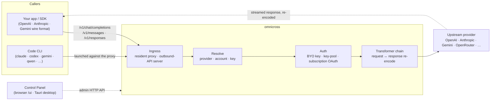

# omnicross

<div align="center">

[](https://opensource.org/licenses/MIT) [](https://nodejs.org/) [](https://www.typescriptlang.org/) [](https://www.npmjs.com/package/@omnicross/core)

[English](../README.md) · [简体中文](README.zh.md) · [繁體中文](README.zh-Hant.md) · [日本語](README.ja.md) · [한국어](README.ko.md) · [Français](README.fr.md) · [Deutsch](README.de.md) · [Italiano](README.it.md) · [Español (España)](README.es-ES.md) · [Español (Latinoamérica)](README.es-419.md) · [Português (Brasil)](README.pt-BR.md) · [Português (Portugal)](README.pt-PT.md) · [Nederlands](README.nl.md) · [Dansk](README.da.md) · [Svenska](README.sv.md) · [Norsk bokmål](README.nb.md) · [Suomi](README.fi.md) · [Polski](README.pl.md) · [Čeština](README.cs.md) · [Magyar](README.hu.md) · [Română](README.ro.md) · [Български](README.bg.md) · [Русский](README.ru.md) · [Українська](README.uk.md) · [Ελληνικά](README.el.md) · [Türkçe](README.tr.md) · [العربية](README.ar.md) · **ไทย** · [Tiếng Việt](README.vi.md) · [Bahasa Indonesia](README.id.md) · [Bahasa Melayu](README.ms.md)

**แกนกลางสำหรับให้บริการ LLM แบบสากล — กำหนดเส้นทาง แปลงรูปแบบ และพร็อกซีไปยังผู้ให้บริการทุกรายผ่าน API ชุดเดียว**

</div>

---

**omnicross ให้คุณจัดการแอป AI และ coding CLI ทุกตัวจากที่เดียว — ด้วยการสมัครสมาชิกหรือ API Key ที่มีอยู่แล้ว**

ชี้ Claude Code, Codex, Gemini CLI — หรือแอปใด ๆ ที่พูด OpenAI / Anthropic / Gemini API — มาที่ omnicross แล้วมันจะกำหนดเส้นทางแต่ละคำขอไปยังผู้ให้บริการและโมเดลที่คุณเลือก สิ่งที่คุณทำได้:

- ใช้**การสมัครสมาชิก Claude / ChatGPT / Gemini เพื่อเข้าสู่ระบบ**ได้เลย โดยไม่ต้องพึ่ง API Key แบบจ่ายตามการใช้งาน
- รวมหลาย API Key เข้าเป็นพูลคีย์พร้อมการสลับอัตโนมัติและ failover
- ให้เครื่องมือที่พูดได้เพียงรูปแบบ API เดียวเรียกใช้โมเดลที่พูดอีกรูปแบบหนึ่ง — omnicross แปลงคำขอและการตอบสนองแบบเรียลไทม์

ทั้งหมดจัดการผ่าน GUI แอปพลิเคชันเดสก์ท็อป — ไม่ต้องแก้ไขไฟล์คอนฟิกด้วยมือ

ใช้งานได้หลายรูปแบบ:

- **🖥️ แอปพลิเคชันเดสก์ท็อป** — หน้าต่าง Tauri v2 แบบเนทีฟ (`apps/desktop`) ที่นำเสนอ GUI ของแผงควบคุมเต็มรูปแบบและรวมถึงจัดการ daemon ให้คุณ (ถาดระบบ, เริ่มอัตโนมัติ, วงจรชีวิต daemon) **วิธีหลักที่คนส่วนใหญ่ใช้ omnicross** — ไม่ต้องใช้เทอร์มินัล, ไม่ต้องใช้ npm, ไม่ต้องตั้งค่า CORS
- **🌐 ในเบราว์เซอร์ของคุณ** — ไม่ต้องการติดตั้งแอปเนทีฟ? `omnicross ui` เริ่ม daemon และเปิด GUI เดียวกันในเบราว์เซอร์ (ให้บริการโดย daemon เองที่ `/ui` — ต้นทางเดียวกัน ไม่ต้องตั้งค่าเพิ่มเติม) สำหรับจัดการผู้ให้บริการ คีย์ บัญชี และการเปิดใช้ Code CLI
- **🚀 เป็น headless daemon** — CLI/daemon `omnicross`: กระบวนการ Node แบบล้วน ๆ พร้อม HTTP API ในเครื่อง แดชบอร์ดผู้ดูแลระบบ และคำสั่งสำหรับคีย์ ผู้ให้บริการ การเข้าสู่ระบบ OAuth และการเปิดใช้ Code CLI เหมาะสำหรับเซิร์ฟเวอร์และเวิร์กโฟลว์ที่เน้นเทอร์มินัล; นี่คือสิ่งที่ขับเคลื่อนแอปเดสก์ท็อปและแผงควบคุมในเบราว์เซอร์ด้วย
- **📦 เป็นไลบรารี** — `npm install @omnicross/core` และฝังแกนกลางการให้บริการโดยตรงในโปรเจกต์ Node ใด ๆ

แกนกลางการให้บริการเป็น Node บริสุทธิ์ — ไม่มี Electron ไม่ผูกติดกับเฟรมเวิร์กใด; UI คือเว็บแอปธรรมดา และเชลล์เดสก์ท็อปคือเลเยอร์ Tauri บาง ๆ ที่ครอบอยู่

## 🏗️ สถาปัตยกรรม

คำขอขาเข้าเข้าสู่ระบบผ่าน**ingress** (พร็อกซีในกระบวนการที่อยู่ประจำ หรือเซิร์ฟเวอร์ API ขาออกแบบสแตนด์อโลน) ถูกแก้ไขเป็น**ผู้ให้บริการ + ตัวตน** แปลงโดย**ท่อ transformer** และพร็อกซีไปยัง**ต้นทาง** — จากนั้นการตอบสนองสตรีมกลับผ่านท่อเดิม เข้ารหัสใหม่เป็นรูปแบบ wire format ของผู้เรียก



| ส่วนประกอบ | ที่อยู่ |
| --- | --- |
| ส่วนหน้าของแผงควบคุม (Vite + React) | `@omnicross/ui` (`packages/ui` — เผยแพร่เฉพาะ `dist/` ที่สร้างแล้ว) |
| เชลล์เดสก์ท็อป (Tauri v2) | `apps/desktop` |
| รันไทม์แบบสแตนด์อโลน (HTTP API · แดชบอร์ด · CLI · ให้บริการ UI ที่ `/ui`) | `@omnicross/daemon` |
| Ingress · dispatch · transformer · proxy | `@omnicross/core` |
| Subscription OAuth + กลยุทธ์การตรวจสอบสิทธิ์ | `@omnicross/subscriptions` |
| ประเภทสัญญาที่ใช้ร่วมกัน + การตั้งค่าล่วงหน้าของผู้ให้บริการ | `@omnicross/contracts` |
| การเปิดใช้ Code CLI (proxy-env + supervisor) | `@omnicross/cli-launcher` |

## ✨ คุณสมบัติ

- **GUI แผงควบคุม** — React UI ที่ทำงานผ่าน admin API localhost ของ daemon: จัดการผู้ให้บริการ คีย์ และบัญชีสมาชิกแบบภาพแทนการแก้ไขไฟล์คอนฟิก มาพร้อมแอปเดสก์ท็อป Tauri v2 เนทีฟ (วิธีใช้งานปกติ — ถาดระบบ เริ่มอัตโนมัติ daemon ในตัว ไม่มี Electron) หรือใช้ในเบราว์เซอร์ด้วยคำสั่งเดียว (`omnicross ui`)
- **แปลงรูปแบบ wire format ใด ๆ ก็ได้** — รับคำขอในรูปแบบ OpenAI / Anthropic / Gemini และส่งไปยังผู้ให้บริการที่ใช้รูปแบบ*ต่างกัน*; ท่อ transformer จะแปลงทั้งคำขอและการตอบสนองแบบสตรีม
- **คีย์ของคุณเอง + พูลคีย์หลายตัว** — ผูกคีย์ผู้ให้บริการของคุณเอง หรือรวมคีย์หลายตัวต่อผู้ให้บริการพร้อม round-robin แบบถ่วงน้ำหนักและ failover อัตโนมัติเมื่อ `429 / 529 / 401 / 403`
- **การสมัครสมาชิกเป็นผู้ให้บริการ** — ขับเคลื่อนคำขอผ่านการสมัครสมาชิก Claude / ChatGPT (Codex) / Gemini ผ่าน OAuth หรือ bearer key ของ OpenCodeGo แทนการใช้คีย์ API แบบจ่ายตามการใช้งาน
- **การตั้งค่าล่วงหน้าของผู้ให้บริการ** — แคตาล็อกที่คัดสรรของ endpoint/template ของผู้ให้บริการ (OpenAI, Anthropic, Gemini, DeepSeek, OpenRouter, Groq, Mistral และอีกมากมาย) ที่คุณสามารถแมปเป็นแถวคอนฟิกด้วยคำสั่งเดียว
- **พร็อกซีแบบ Streaming-native** — พร็อกซีในกระบวนการที่อยู่ประจำส่งต่อ SSE stream ตรง ๆ เมื่อรูปแบบตรงกัน และเข้ารหัสใหม่เมื่อไม่ตรงกัน
- **ตัวเปิดใช้ Code CLI** — เริ่ม `claude` / `codex` / `gemini` / `qwen` / `copilot` / `opencode` กับพร็อกซีในเครื่อง เพื่อให้เซสชัน CLI สามารถทำงานบน**ผู้ให้บริการหรือการสมัครสมาชิกใด ๆ** ที่คุณตั้งค่าไว้
- **ไม่ผูกติดกับ host และมีประเภทชัดเจน** — Node + TypeScript บริสุทธิ์ ประเภทสัญญาที่มีการพึ่งพาน้อยเผยแพร่แยกต่างหาก ไม่มีการผูกติดกับแอป host ใด ๆ

## 📦 โครงสร้าง

นี่คือ monorepo แบบ workspace เดียว: แพ็คเกจที่เผยแพร่ได้อยู่ใน `packages/` แอปที่รันได้อยู่ใน `apps/` ชื่อแพ็คเกจ npm ใช้ scope `@omnicross/`; ชื่อไดเรกทอรีตัด prefix `omnicross-` ออก

| แอป | คืออะไร |
| --- | --- |
| `apps/desktop` | **omnicross-desktop** — แอปเดสก์ท็อป Tauri v2 เนทีฟ: ห่อส่วนหน้า `@omnicross/ui` เป็นหน้าต่างเนทีฟและรวมถึงจัดการ daemon (ถาดระบบ เริ่มอัตโนมัติ วงจรชีวิต daemon) ดู [`apps/desktop/README.md`](../apps/desktop/README.md) |

แพ็คเกจที่เผยแพร่:

| แพ็คเกจ | npm | คืออะไร |
| --- | --- | --- |
| `packages/contracts` | [`@omnicross/contracts`](https://www.npmjs.com/package/@omnicross/contracts) | ประเภทสัญญาที่มีการพึ่งพาน้อย + helpers สำหรับค่ารันไทม์ (LLM config, ประเภท completion/chat, การตั้งค่าล่วงหน้าของผู้ให้บริการ, การตั้งค่า thinking, การใช้งาน, ประเภท subscription/account-token) เข้าถึงผ่าน subpath (`@omnicross/contracts/llm-config`, `/provider-presets`, …) |
| `packages/core` | [`@omnicross/core`](https://www.npmjs.com/package/@omnicross/core) | แกนกลางการให้บริการ — การ dispatch ผู้ให้บริการ, ท่อ completion, transformers, พร็อกซีผู้ให้บริการ และพื้นผิว API ขาออก |
| `packages/subscriptions` | [`@omnicross/subscriptions`](https://www.npmjs.com/package/@omnicross/subscriptions) | กลยุทธ์การตรวจสอบสิทธิ์การสมัครสมาชิกเป็นผู้ให้บริการ, OAuth flows (Claude / Codex / Gemini) และ dispatcher สำหรับ OpenCodeGo |
| `packages/cli-launcher` | [`@omnicross/cli-launcher`](https://www.npmjs.com/package/@omnicross/cli-launcher) | กลไก `ProcessSupervisor` สำหรับวงจรชีวิต subprocess + builders การตั้งค่าเปิดใช้ proxy-env ต่อ CLI |
| `packages/daemon` | [`@omnicross/daemon`](https://www.npmjs.com/package/@omnicross/daemon) | ตัวฝัง `@omnicross/core` แบบ Node ล้วน ๆ พร้อม admin HTTP API + แดชบอร์ด, CLI `omnicross` และให้บริการแผงควบคุมที่ `/ui` แบบ same-origin |
| `packages/ui` | [`@omnicross/ui`](https://www.npmjs.com/package/@omnicross/ui) | ส่วนหน้าของแผงควบคุม (Vite + React) เผยแพร่เฉพาะ `dist/` ที่สร้างแล้ว (static assets ไม่มี runtime deps); daemon ให้บริการที่ `/ui`, Tauri shell ห่ออยู่ |

## 🚀 เริ่มต้นอย่างรวดเร็ว

### ตัวเลือก A — แอปเดสก์ท็อป (แนะนำสำหรับผู้ใช้ส่วนใหญ่)

ดาวน์โหลดตัวติดตั้งสำหรับ OS ของคุณจาก [release ล่าสุด](https://github.com/Dumoedss/omnicross/releases/latest) และรัน:

- **Windows** — `*-setup.exe` (NSIS) หรือ `*.msi`
- **macOS** — `*.dmg` (universal — Apple Silicon + Intel)
- **Linux** — `*.AppImage`, `*.deb` หรือ `*.rpm`

แอปรวมและจัดการทุกอย่างให้คุณ — daemon **และ** Node runtime ส่วนตัว — ดังนั้นไม่ต้องติดตั้งอะไรเพิ่มเติม เพียงดาวน์โหลด รันตัวติดตั้ง และเปิดใช้งาน

> ต้องการสร้างด้วยตัวเองแทน? ดู [`apps/desktop/README.md`](../apps/desktop/README.md) (`npm run build:app` ต้องใช้ Rust)

### ตัวเลือก B — แผงควบคุมในเบราว์เซอร์ของคุณ

ไม่ต้องการติดตั้งแอป? คำสั่งเดียว — daemon ให้บริการ UI เดียวกันเอง (ต้นทางเดียวกับ admin API — ไม่มี CORS ไม่ต้องตั้งค่า `.env`):

```bash
npm install -g @omnicross/daemon
omnicross ui --config ./omnicross.config.json   # boots the daemon + opens http://127.0.0.1:8766/ui/
```

เพิ่ม `--no-open` เพื่อข้ามการเปิดเบราว์เซอร์ เวิร์กโฟลว์การพัฒนา frontend อยู่ใน [`packages/ui/README.md`](../packages/ui/README.md)

### ตัวเลือก C — headless daemon

ทุกสิ่งที่แอปทำ — และมากกว่านั้น — สามารถทำได้จากเทอร์มินัล:

```bash
npm install -g @omnicross/daemon
```

```bash
# Boot the daemon (BYO-key serving) against a config file
omnicross start --config ./omnicross.config.json

# Map a curated provider preset + your key into the config
omnicross providers presets --config ./omnicross.config.json
omnicross providers add openai --key $OPENAI_API_KEY --config ./omnicross.config.json

# Mint a local API key for your clients (shown once)
omnicross keys add my-app --config ./omnicross.config.json

# Log in to a subscription via browser OAuth (claude | codex | gemini)
omnicross login claude --config ./omnicross.config.json

# Launch a Code CLI against the in-process proxy on any configured provider
omnicross launch claude --provider openai --model gpt-4o --config ./omnicross.config.json
```

รัน `omnicross --help` เพื่อดูรายการคำสั่งทั้งหมด

### ตัวเลือก D — เป็นไลบรารี

```bash
npm install @omnicross/core @omnicross/contracts
```

```ts
import type { LLMProvider } from '@omnicross/contracts/llm-config';
// import the serving-core pieces you need from @omnicross/core

// Wire the serving core into your own Node app: supply a provider-config
// source + key store, then route inbound requests through the proxy.
```

> การ import แบบ subpath ช่วยให้กราฟการพึ่งพากระชับ เช่น
> `@omnicross/contracts/provider-presets`, `@omnicross/core/provider-proxy`

## 🛠️ พัฒนา

```bash
git clone https://github.com/Dumoedss/omnicross.git
cd omnicross
npm install          # workspace symlinks for @omnicross/* + external deps
npm run typecheck    # tsc --noEmit per package
npm test             # vitest (tests run against src via aliases)
npm run build        # tsup per package → dist/ (ESM + CJS + .d.ts)
```

การทดสอบและการตรวจสอบประเภทจะแก้ไข `@omnicross/*` imports ไปยัง**source** ของแพ็คเกจผ่าน aliases ดังนั้นไม่จำเป็นต้องสร้างก่อน `npm run build` จะสร้าง `dist/` ของแต่ละแพ็คเกจสำหรับการเผยแพร่

สำหรับการพัฒนาแผงควบคุม `npm run dev` (root ของ repo) คือ loop คำสั่งเดียว: จะสร้าง `omnicross.dev.config.json` ที่ gitignored ในการรันครั้งแรก เริ่ม daemon บน `127.0.0.1:8766` และเริ่ม Vite dev server ของ UI บน `http://localhost:1430` (Ctrl+C หยุดทั้งคู่) Dev server จะพร็อกซี `/admin/*` ไปยัง daemon ฝั่งเซิร์ฟเวอร์ เพื่อให้เบราว์เซอร์ยังคงเป็น same-origin — daemon ไม่ส่ง CORS headers โดยออกแบบไว้เช่นนั้น ส่วนหน้าเองคือแพ็คเกจ `@omnicross/ui` ใน workspace — `npm run build -w @omnicross/ui` รีเฟรช `dist/` ที่ daemon ให้บริการ สำหรับหน้าต่างเนทีฟ (ต้องใช้ Rust): `npm run dev:app` รัน `tauri dev` และ `npm run build:app` แพ็คเกจ release executable + installers พร้อม daemon runtime **และ Node binary ส่วนตัว** ที่รวมอยู่ด้วย (output อยู่ที่ `apps/desktop/src-tauri/target/release/`; เครื่องปลายทางไม่ต้องติดตั้งอะไร — รายละเอียดใน [`apps/desktop/README.md`](../apps/desktop/README.md))

## 📄 ใบอนุญาต

[MIT](../LICENSE) 

บางส่วนของ `@omnicross/core` และแพ็คเกจอื่น ๆ ดัดแปลงมาจากงานของบุคคลที่สามภายใต้ใบอนุญาตของตัวเอง — ดูไฟล์ `NOTICE` ในแพ็คเกจที่เกี่ยวข้อง
