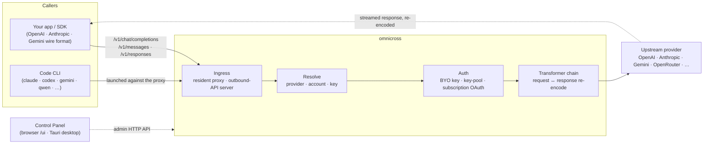

# omnicross

<div align="center">

[](https://opensource.org/licenses/MIT) [](https://nodejs.org/) [](https://www.typescriptlang.org/) [](https://www.npmjs.com/package/@omnicross/core)

[English](../README.md) · [简体中文](README.zh.md) · [繁體中文](README.zh-Hant.md) · [日本語](README.ja.md) · [한국어](README.ko.md) · [Français](README.fr.md) · [Deutsch](README.de.md) · [Italiano](README.it.md) · [Español (España)](README.es-ES.md) · [Español (Latinoamérica)](README.es-419.md) · [Português (Brasil)](README.pt-BR.md) · [Português (Portugal)](README.pt-PT.md) · [Nederlands](README.nl.md) · [Dansk](README.da.md) · [Svenska](README.sv.md) · [Norsk bokmål](README.nb.md) · [Suomi](README.fi.md) · [Polski](README.pl.md) · [Čeština](README.cs.md) · [Magyar](README.hu.md) · [Română](README.ro.md) · [Български](README.bg.md) · [Русский](README.ru.md) · [Українська](README.uk.md) · [Ελληνικά](README.el.md) · **Türkçe** · [العربية](README.ar.md) · [ไทย](README.th.md) · [Tiếng Việt](README.vi.md) · [Bahasa Indonesia](README.id.md) · [Bahasa Melayu](README.ms.md)

**Evrensel bir LLM servis çekirdeği — tek bir API seti üzerinden herhangi bir sağlayıcıya yönlendirin, dönüştürün ve proxy yapın.**

</div>

---

**omnicross, mevcut abonelikleriniz veya API anahtarlarınızla tüm AI uygulamalarını ve kodlama CLI'larını tek bir yerden besler.**

Claude Code, Codex, Gemini CLI — ya da OpenAI / Anthropic / Gemini API konuşan herhangi bir uygulama — omnicross'a yönlendirin; her isteği seçtiğiniz sağlayıcıya ve modele yönlendirir. Yapabilecekleriniz:

- ölçülü API anahtarlarını atlayarak **Claude / ChatGPT / Gemini abonelik girişiyle** çalıştırın;
- birden fazla API anahtarını otomatik rotasyon ve yük devretmeyle havuzlayın;
- yalnızca tek bir API formatı konuşan bir aracın, başka bir format konuşan modeli çağırmasını sağlayın — omnicross isteği ve yanıtı anında dönüştürür.

Tüm bunlar bir masaüstü GUI'sinde yönetilir — config dosyalarını elle düzenlemenize gerek yoktur.

Birkaç farklı biçimde sunulur:

- **🖥️ Masaüstü uygulaması olarak** — tam Kontrol Paneli GUI'sini sunan ve daemon'ı sizin adınıza paketleyip yöneten (`apps/desktop`) yerel bir Tauri v2 penceresi (sistem tepsisi, otomatik başlatma, daemon yaşam döngüsü). **Çoğu insanın omnicross'u kullandığı ana yol** — terminal yok, npm yok, CORS kurulumu yok.
- **🌐 Tarayıcınızda** — yerel uygulama yüklemek istemiyor musunuz? `omnicross ui`, daemon'ı başlatır ve aynı GUI'yi tarayıcınızda açar (daemon'ın kendisi tarafından `/ui` adresinde sunulur — aynı kaynak, ek kurulum gerekmez); sağlayıcıları, anahtarları, hesapları ve Code CLI başlatmalarını yönetmek için.
- **🚀 Başsız daemon olarak** — `omnicross` CLI/daemon: yerel bir HTTP API'ye, yönetici kontrol paneline ve anahtarlar, sağlayıcılar, OAuth girişi ve Code CLI başlatma için komutlara sahip saf bir Node işlemi. Sunucular ve terminal odaklı iş akışları için mükemmel; aynı zamanda masaüstü uygulamasına ve tarayıcı içi Kontrol Paneli'ne güç veren şeydir.
- **📦 Bir kütüphane olarak** — `npm install @omnicross/core` ile servis çekirdeğini herhangi bir Node projesinin içine doğrudan gömün.

Servis çekirdeğinin kendisi saf Node'dur — Electron yok, çerçeve bağımlılığı yok; UI sıradan bir web uygulamasıdır ve masaüstü kabuğu onun üzerinde ince bir Tauri katmanıdır.

## 🏗️ Mimari

Gelen bir istek bir **ingress** üzerinden girer (işlem içi daimi proxy veya bağımsız dış API sunucusu), bir **sağlayıcı + kimlik**'e çözümlenir, **dönüştürücü zinciri** tarafından dönüştürülür ve **üst akıma** proxy'lenir — ardından yanıt aynı zincir üzerinden geri akar ve arayanın tel formatına yeniden kodlanır.



| Yapı taşı | Konum |
| --- | --- |
| Kontrol Paneli ön yüzü (Vite + React) | `@omnicross/ui` (`packages/ui` — yalnızca derlenmiş `dist/` yayımlanır) |
| Masaüstü kabuğu (Tauri v2) | `apps/desktop` |
| Bağımsız çalışma zamanı (HTTP API · kontrol paneli · CLI · `/ui` adresinde UI sunar) | `@omnicross/daemon` |
| Ingress · dağıtım · dönüştürücü · proxy | `@omnicross/core` |
| Abonelik OAuth + kimlik doğrulama stratejileri | `@omnicross/subscriptions` |
| Paylaşılan sözleşme türleri + sağlayıcı ön ayarları | `@omnicross/contracts` |
| Code CLI başlatma (proxy-env + süpervizör) | `@omnicross/cli-launcher` |

## ✨ Özellikler

- **Kontrol Paneli GUI** — daemon'ın localhost yönetici API'si üzerinde bir React UI'ı: sağlayıcıları, anahtarları ve abonelik hesaplarını yapılandırma dosyası yerine görsel olarak yönetin. Yerel bir Tauri v2 masaüstü uygulaması olarak gelir (günlük giriş yolu — sistem tepsisi, otomatik başlatma, paketlenmiş daemon, Electron yok) veya tek bir komutla (`omnicross ui`) tarayıcınızda sunulur.
- **Herhangi formattan herhangi formata dönüşüm** — OpenAI / Anthropic / Gemini şeklindeki istekleri kabul edin ve *farklı* bir format konuşan bir sağlayıcıyı hedefleyin; dönüştürücü hattı hem isteği hem de akışlı yanıtı dönüştürür.
- **Kendi anahtarlarınızı getirin + çok anahtarlı havuzlar** — kendi sağlayıcı anahtarlarınızı bağlayın veya sağlayıcı başına birçok anahtarı ağırlıklı round-robin ile havuzlayın ve `429 / 529 / 401 / 403` hatalarında otomatik yük devretme yapın.
- **Sağlayıcı olarak abonelik** — ölçülü bir API anahtarı yerine OAuth aracılığıyla bir Claude / ChatGPT (Codex) / Gemini aboneliği veya bir OpenCodeGo taşıyıcı anahtarı üzerinden istekleri yönlendirin.
- **Sağlayıcı ön ayarları** — tek bir komutla bir yapılandırma satırına eşleyebileceğiniz, seçilmiş sağlayıcı uç noktaları/şablonları kataloğu (OpenAI, Anthropic, Gemini, DeepSeek, OpenRouter, Groq, Mistral ve çok daha fazlası).
- **Akışa özgü proxy** — işlem içi daimi proxy, formatlar eşleştiğinde SSE akışlarını olduğu gibi iletir, eşleşmediğinde ise yeniden kodlar.
- **Code CLI başlatıcı** — yapılandırdığınız **herhangi** bir sağlayıcı veya abonelik üzerinde bir CLI oturumu çalışabilmesi için `claude` / `codex` / `gemini` / `qwen` / `copilot` / `opencode`'u yerel bir proxy'ye karşı başlatın.
- **Konaktan bağımsız ve tiplenmiş** — saf Node + TypeScript, bağımlılığı az sözleşme türleri ayrı olarak yayımlanır, herhangi bir konak uygulamaya sıfır bağlantı.

## 📦 Düzen

Bu, tek bir çalışma alanına sahip bir monorepo'dur: yayımlanabilir paketler `packages/` içinde, çalıştırılabilir uygulamalar `apps/` içinde yer alır. npm paket adları `@omnicross/` kapsamını korur; dizin adları `omnicross-` önekini düşürür.

| Uygulama | Nedir |
| --- | --- |
| `apps/desktop` | **omnicross-desktop** — yerel Tauri v2 masaüstü uygulaması: `@omnicross/ui` ön yüzünü yerel bir pencere olarak sarar ve daemon'ı paketleyip yönetir (sistem tepsisi, otomatik başlatma, daemon yaşam döngüsü). Bkz. [`apps/desktop/README.md`](../apps/desktop/README.md). |

Yayımlanan paketler:

| Paket | npm | Nedir |
| --- | --- | --- |
| `packages/contracts` | [`@omnicross/contracts`](https://www.npmjs.com/package/@omnicross/contracts) | Bağımlılığı az sözleşme türleri + çalışma zamanı değer yardımcıları (LLM yapılandırması, completion/chat türleri, sağlayıcı ön ayarları, thinking yapılandırması, kullanım, abonelik/hesap-token türleri). Alt yollar aracılığıyla kullanılır (`@omnicross/contracts/llm-config`, `/provider-presets`, …). |
| `packages/core` | [`@omnicross/core`](https://www.npmjs.com/package/@omnicross/core) | Servis çekirdeği — sağlayıcı dağıtımı, completion hattı, dönüştürücüler, sağlayıcı proxy'si ve dış API yüzeyi. |
| `packages/subscriptions` | [`@omnicross/subscriptions`](https://www.npmjs.com/package/@omnicross/subscriptions) | Sağlayıcı olarak abonelik kimlik doğrulama stratejileri, OAuth akışları (Claude / Codex / Gemini) ve OpenCodeGo senaryo dağıtıcısı. |
| `packages/cli-launcher` | [`@omnicross/cli-launcher`](https://www.npmjs.com/package/@omnicross/cli-launcher) | `ProcessSupervisor` alt işlem yaşam döngüsü mekanizması + CLI başına proxy-env başlatma yapılandırması oluşturucuları. |
| `packages/daemon` | [`@omnicross/daemon`](https://www.npmjs.com/package/@omnicross/daemon) | Yönetici HTTP API'si + kontrol paneli, `omnicross` CLI ve `/ui` adresinde Kontrol Paneli'nin aynı kaynaktan sunumuyla birlikte `@omnicross/core`'un saf Node gömücüsü. |
| `packages/ui` | [`@omnicross/ui`](https://www.npmjs.com/package/@omnicross/ui) | Kontrol Paneli ön yüzü (Vite + React). Yalnızca derlenmiş `dist/`'ini yayımlar (statik varlıklar, sıfır çalışma zamanı bağımlılığı); daemon onu `/ui` adresinde sunar, Tauri kabuğu onu sarar. |

## 🚀 Hızlı Başlangıç

### Seçenek A — Masaüstü uygulaması (çoğu kullanıcı için önerilir)

[En son sürümden](https://github.com/Dumoedss/omnicross/releases/latest) işletim sisteminiz için yükleyiciyi indirin ve çalıştırın:

- **Windows** — `*-setup.exe` (NSIS) veya `*.msi`
- **macOS** — `*.dmg` (evrensel — Apple Silicon + Intel)
- **Linux** — `*.AppImage`, `*.deb` veya `*.rpm`

Uygulama her şeyi sizin adınıza paketler ve yönetir — daemon **ve** özel bir Node çalışma zamanı — bu nedenle başka bir şey yüklemenize gerek yoktur. Sadece indirin, yükleyiciyi çalıştırın ve açın.

> Kendiniz derlemek mi istiyorsunuz? Bkz. [`apps/desktop/README.md`](../apps/desktop/README.md) (`npm run build:app`, Rust gerektirir).

### Seçenek B — Tarayıcınızda Kontrol Paneli

Uygulama yüklemek istemiyor musunuz? Tek komut — daemon aynı UI'ı kendisi sunar (yönetici API'siyle aynı kaynak — CORS yok, `.env` gerekmez):

```bash
npm install -g @omnicross/daemon
omnicross ui --config ./omnicross.config.json   # boots the daemon + opens http://127.0.0.1:8766/ui/
```

Tarayıcı açılışını atlamak için `--no-open` ekleyin. Ön yüz geliştirme iş akışları [`packages/ui/README.md`](../packages/ui/README.md) içinde yer almaktadır.

### Seçenek C — Başsız daemon

Uygulamanın yaptığı her şey — ve daha fazlası — terminalden erişilebilir:

```bash
npm install -g @omnicross/daemon
```

```bash
# Boot the daemon (BYO-key serving) against a config file
omnicross start --config ./omnicross.config.json

# Map a curated provider preset + your key into the config
omnicross providers presets --config ./omnicross.config.json
omnicross providers add openai --key $OPENAI_API_KEY --config ./omnicross.config.json

# Mint a local API key for your clients (shown once)
omnicross keys add my-app --config ./omnicross.config.json

# Log in to a subscription via browser OAuth (claude | codex | gemini)
omnicross login claude --config ./omnicross.config.json

# Launch a Code CLI against the in-process proxy on any configured provider
omnicross launch claude --provider openai --model gpt-4o --config ./omnicross.config.json
```

Tam komut listesi için `omnicross --help` komutunu çalıştırın.

### Seçenek D — Kütüphane olarak

```bash
npm install @omnicross/core @omnicross/contracts
```

```ts
import type { LLMProvider } from '@omnicross/contracts/llm-config';
// import the serving-core pieces you need from @omnicross/core

// Wire the serving core into your own Node app: supply a provider-config
// source + key store, then route inbound requests through the proxy.
```

> Alt yol içe aktarmaları bağımlılık grafiğini dar tutar, örneğin
> `@omnicross/contracts/provider-presets`, `@omnicross/core/provider-proxy`.

## 🛠️ Geliştirme

```bash
git clone https://github.com/Dumoedss/omnicross.git
cd omnicross
npm install          # workspace symlinks for @omnicross/* + external deps
npm run typecheck    # tsc --noEmit per package
npm test             # vitest (tests run against src via aliases)
npm run build        # tsup per package → dist/ (ESM + CJS + .d.ts)
```

Testler ve tür denetimleri `@omnicross/*` içe aktarmalarını takma adlar aracılığıyla paket **kaynak koduna** çözümler, dolayısıyla önceden derleme gerekmez. `npm run build`, yayımlama için her paketin `dist/` dizinini oluşturur.

Kontrol Paneli geliştirmesi için `npm run dev` (repo kök dizini) tek komutlu döngüdür: ilk çalıştırmada git tarafından yok sayılan bir `omnicross.dev.config.json` dosyası oluşturur, `127.0.0.1:8766` üzerinde daemon'ı ve `http://localhost:1430` üzerinde UI'ın Vite geliştirme sunucusunu başlatır (Ctrl+C her ikisini de durdurur). Geliştirme sunucusu `/admin/*` yollarını sunucu tarafında daemon'a proxy'ler, böylece tarayıcı aynı kaynakta kalır — daemon tasarım gereği CORS başlıkları göndermez. Ön yüzün kendisi `@omnicross/ui` çalışma alanı paketidir — `npm run build -w @omnicross/ui` daemon tarafından sunulan `dist/`'yi yeniler. Yerel pencere için (Rust gerektirir): `npm run dev:app`, `tauri dev`'i çalıştırır ve `npm run build:app`, daemon çalışma zamanı **ve özel bir Node ikili dosyası** paketlenmiş halde sürüm yürütülebilir dosyasını + yükleyicileri paketler (`apps/desktop/src-tauri/target/release/` altında çıktı; hedef makinelerde hiçbir şey yüklü olmasına gerek yoktur — ayrıntılar [`apps/desktop/README.md`](../apps/desktop/README.md) içinde).

## 📄 Lisans

[MIT](../LICENSE) 

`@omnicross/core` ve diğer paketlerin bazı bölümleri, kendi lisansları kapsamındaki üçüncü taraf çalışmalarını uyarlamaktadır — ilgili paketlerdeki `NOTICE` dosyalarına bakın.
