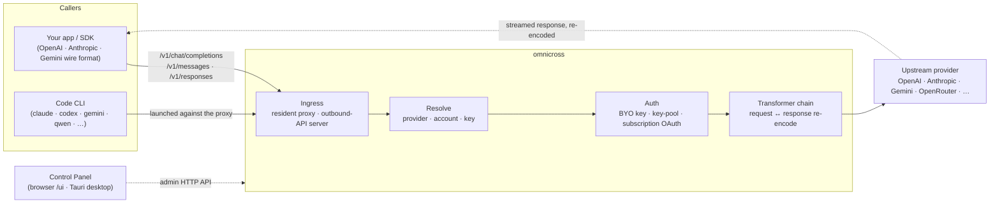

# omnicross

<div align="center">

[](https://opensource.org/licenses/MIT) [](https://nodejs.org/) [](https://www.typescriptlang.org/) [](https://www.npmjs.com/package/@omnicross/core)

[English](../README.md) · [简体中文](README.zh.md) · [繁體中文](README.zh-Hant.md) · [日本語](README.ja.md) · [한국어](README.ko.md) · [Français](README.fr.md) · [Deutsch](README.de.md) · [Italiano](README.it.md) · [Español (España)](README.es-ES.md) · [Español (Latinoamérica)](README.es-419.md) · [Português (Brasil)](README.pt-BR.md) · [Português (Portugal)](README.pt-PT.md) · [Nederlands](README.nl.md) · [Dansk](README.da.md) · [Svenska](README.sv.md) · [Norsk bokmål](README.nb.md) · [Suomi](README.fi.md) · [Polski](README.pl.md) · [Čeština](README.cs.md) · [Magyar](README.hu.md) · [Română](README.ro.md) · [Български](README.bg.md) · [Русский](README.ru.md) · **Українська** · [Ελληνικά](README.el.md) · [Türkçe](README.tr.md) · [العربية](README.ar.md) · [ไทย](README.th.md) · [Tiếng Việt](README.vi.md) · [Bahasa Indonesia](README.id.md) · [Bahasa Melayu](README.ms.md)

**Універсальне ядро для роботи з LLM — маршрутизуйте, перетворюйте та проксіюйте будь-якого провайдера через єдиний набір API.**

</div>

---

**omnicross живить кожен AI-застосунок і CLI для кодингу з одного місця — з вашими наявними підписками або API-ключами.**

Направте Claude Code, Codex, Gemini CLI — або будь-який застосунок, що розмовляє API OpenAI / Anthropic / Gemini — на omnicross, і він маршрутизує кожен запит до обраного вами провайдера та моделі. Що ви можете робити:

- працювати через **підписку Claude / ChatGPT / Gemini**, минаючи тарифіковані API Key;
- об'єднати кілька API Key у пул із автоматичною ротацією та перемиканням при збоях;
- дозволити інструменту, що розмовляє лише одним форматом API, викликати модель, що розмовляє іншим — omnicross перекладає запит і відповідь на льоту.

Усе це керується через графічний інтерфейс десктопного застосунку — без ручного редагування конфігураційних файлів.

Він постачається в кількох формах:

- **🖥️ Як десктопний застосунок** — нативне вікно Tauri v2 (`apps/desktop`), яке надає повний графічний інтерфейс Панелі керування та разом із ним запаковує демон і керує ним (системний трей, автозапуск, життєвий цикл демона). **Основний спосіб, яким більшість людей використовують omnicross** — без термінала, без npm, без налаштування CORS.
- **🌐 У браузері** — не хочете встановлювати нативний застосунок? `omnicross ui` запускає демон і відкриває той самий GUI у браузері (сервується самим демоном за адресою `/ui` — той самий origin, жодних додаткових налаштувань) для керування провайдерами, ключами, обліковими записами і запуском Code CLI.
- **🚀 Як headless-демон** — CLI/демон `omnicross`: чистий Node-процес із локальним HTTP API, адмін-панеллю та командами для ключів, провайдерів, OAuth-входу і запуску Code CLI. Ідеально для серверів і термінально-орієнтованих робочих процесів; саме він є рушієм і за десктопним застосунком, і за Панеллю керування у браузері.
- **📦 Як бібліотека** — `npm install @omnicross/core` та вбудуйте ядро обслуговування безпосередньо в будь-який Node-проект.

Саме ядро обслуговування — чистий Node без Electron, без прив'язки до будь-якого фреймворку; UI — звичайний веб-застосунок, а десктопна оболонка — тонкий шар Tauri поверх нього.

## 🏗️ Архітектура

Вхідний запит потрапляє через **ingress** (постійний внутрішньопроцесний проксі або автономний сервер вихідного API), отримує прив'язку до **провайдера + ідентифікатора**, перетворюється **ланцюжком трансформаторів** і проксіюється **до хмарного провайдера** — після чого відповідь потоком повертається тим самим ланцюжком, перекодована у дротовий формат викликача.



| Блок | Розташування |
| --- | --- |
| Фронтенд Панелі керування (Vite + React) | `@omnicross/ui` (`packages/ui` — публікує лише зібраний `dist/`) |
| Десктопна оболонка (Tauri v2) | `apps/desktop` |
| Автономне середовище виконання (HTTP API · панель · CLI · сервує UI за `/ui`) | `@omnicross/daemon` |
| Ingress · диспетчеризація · трансформатор · проксі | `@omnicross/core` |
| Підписка OAuth + стратегії автентифікації | `@omnicross/subscriptions` |
| Спільні типи контрактів + пресети провайдерів | `@omnicross/contracts` |
| Запуск Code CLI (proxy-env + супервізор) | `@omnicross/cli-launcher` |

## ✨ Можливості

- **GUI Панелі керування** — React-інтерфейс поверх локального адмін API демона: керуйте провайдерами, ключами та підписними обліковими записами візуально, без редагування конфігураційних файлів. Постачається як нативний десктопний застосунок Tauri v2 (основний повсякденний спосіб — трей, автозапуск, вбудований демон, без Electron) або запускається у браузері однією командою (`omnicross ui`).
- **Взаємна конвертація будь-яких форматів** — приймайте запити у форматі OpenAI / Anthropic / Gemini і відправляйте провайдеру, який розмовляє *іншим* форматом; конвеєр трансформаторів перетворює як запит, так і потокову відповідь.
- **Власні ключі + пули кількох ключів** — прив'яжіть власні ключі провайдера або об'єднайте кілька ключів на провайдера з ваговим round-robin і автоматичним перемиканням при `429 / 529 / 401 / 403`.
- **Підписка як провайдер** — направляйте запити через підписку Claude / ChatGPT (Codex) / Gemini через OAuth або bearer-ключ OpenCodeGo замість платного API-ключа.
- **Пресети провайдерів** — добірний каталог кінцевих точок/шаблонів провайдерів (OpenAI, Anthropic, Gemini, DeepSeek, OpenRouter, Groq, Mistral та багато інших), які можна відобразити на рядок конфігурації однією командою.
- **Нативний потоковий проксі** — постійний внутрішньопроцесний проксі передає SSE-потоки дослівно там, де формати збігаються, і перекодовує там, де ні.
- **Засіб запуску Code CLI** — запускайте `claude` / `codex` / `gemini` / `qwen` / `copilot` / `opencode` проти локального проксі, щоб сеанс CLI міг працювати на **будь-якому** налаштованому провайдері або підписці.
- **Незалежність від хоста й типізованість** — чистий Node + TypeScript, типи контрактів із мінімальними залежностями публікуються окремо, нульове зв'язування з будь-яким хост-застосунком.

## 📦 Структура

Це монорепозиторій із єдиним workspace: пакети, придатні до публікації, знаходяться в `packages/`, застосунки, придатні до запуску, — в `apps/`. Назви npm-пакетів зберігають область `@omnicross/`; назви директорій без префікса `omnicross-`.

| Застосунок | Що це |
| --- | --- |
| `apps/desktop` | **omnicross-desktop** — нативний десктопний застосунок Tauri v2: обгортає фронтенд `@omnicross/ui` як нативне вікно та запаковує і керує демоном (трей, автозапуск, життєвий цикл демона). Дивіться [`apps/desktop/README.md`](../apps/desktop/README.md). |

Опубліковані пакети:

| Пакет | npm | Що це |
| --- | --- | --- |
| `packages/contracts` | [`@omnicross/contracts`](https://www.npmjs.com/package/@omnicross/contracts) | Типи контрактів із мінімальними залежностями + допоміжні функції значень часу виконання (конфігурація LLM, типи completion/chat, пресети провайдерів, конфігурація thinking, використання, типи токенів підписки/облікового запису). Споживається через підшляхи (`@omnicross/contracts/llm-config`, `/provider-presets`, …). |
| `packages/core` | [`@omnicross/core`](https://www.npmjs.com/package/@omnicross/core) | Ядро обслуговування — диспетчеризація провайдерів, конвеєр completion, трансформатори, проксі провайдера та поверхня вихідного API. |
| `packages/subscriptions` | [`@omnicross/subscriptions`](https://www.npmjs.com/package/@omnicross/subscriptions) | Стратегії автентифікації підписки як провайдера, потоки OAuth (Claude / Codex / Gemini) та диспетчер сценаріїв OpenCodeGo. |
| `packages/cli-launcher` | [`@omnicross/cli-launcher`](https://www.npmjs.com/package/@omnicross/cli-launcher) | Механізм `ProcessSupervisor` для керування життєвим циклом підпроцесів + конструктори конфігурацій запуску proxy-env для кожного CLI. |
| `packages/daemon` | [`@omnicross/daemon`](https://www.npmjs.com/package/@omnicross/daemon) | Чистий Node-хост для `@omnicross/core` з адмін HTTP API + панеллю, CLI `omnicross` та сервуванням Панелі керування за `/ui` в тому самому origin. |
| `packages/ui` | [`@omnicross/ui`](https://www.npmjs.com/package/@omnicross/ui) | Фронтенд Панелі керування (Vite + React). Публікує лише зібраний `dist/` (статичні ресурси, нульові залежності часу виконання); демон сервує його за `/ui`, оболонка Tauri обгортає його. |

## 🚀 Швидкий старт

### Варіант A — Десктопний застосунок (рекомендовано для більшості користувачів)

Завантажте інсталятор для вашої ОС із [останнього релізу](https://github.com/Dumoedss/omnicross/releases/latest) і запустіть його:

- **Windows** — `*-setup.exe` (NSIS) або `*.msi`
- **macOS** — `*.dmg` (universal — Apple Silicon + Intel)
- **Linux** — `*.AppImage`, `*.deb` або `*.rpm`

Застосунок запаковує і керує всім за вас — демоном **і** приватним середовищем виконання Node — тому більше нічого не потрібно встановлювати. Просто завантажте, запустіть інсталятор і відкрийте застосунок.

> Хочете зібрати самостійно? Дивіться [`apps/desktop/README.md`](../apps/desktop/README.md) (`npm run build:app`, потребує Rust).

### Варіант B — Панель керування у браузері

Не хочете встановлювати застосунок? Одна команда — демон сам сервує той самий UI (той самий origin, що й адмін API — без CORS, без `.env`):

```bash
npm install -g @omnicross/daemon
omnicross ui --config ./omnicross.config.json   # boots the daemon + opens http://127.0.0.1:8766/ui/
```

Додайте `--no-open`, щоб пропустити відкриття браузера. Робочі процеси фронтенд-розробки описані в [`packages/ui/README.md`](../packages/ui/README.md).

### Варіант C — Headless-демон

Все, що робить застосунок — і навіть більше — доступне з термінала:

```bash
npm install -g @omnicross/daemon
```

```bash
# Boot the daemon (BYO-key serving) against a config file
omnicross start --config ./omnicross.config.json

# Map a curated provider preset + your key into the config
omnicross providers presets --config ./omnicross.config.json
omnicross providers add openai --key $OPENAI_API_KEY --config ./omnicross.config.json

# Mint a local API key for your clients (shown once)
omnicross keys add my-app --config ./omnicross.config.json

# Log in to a subscription via browser OAuth (claude | codex | gemini)
omnicross login claude --config ./omnicross.config.json

# Launch a Code CLI against the in-process proxy on any configured provider
omnicross launch claude --provider openai --model gpt-4o --config ./omnicross.config.json
```

Запустіть `omnicross --help` для перегляду повного списку команд.

### Варіант D — Як бібліотека

```bash
npm install @omnicross/core @omnicross/contracts
```

```ts
import type { LLMProvider } from '@omnicross/contracts/llm-config';
// import the serving-core pieces you need from @omnicross/core

// Wire the serving core into your own Node app: supply a provider-config
// source + key store, then route inbound requests through the proxy.
```

> Імпорти через підшляхи зберігають граф залежностей компактним, наприклад
> `@omnicross/contracts/provider-presets`, `@omnicross/core/provider-proxy`.

## 🛠️ Розробка

```bash
git clone https://github.com/Dumoedss/omnicross.git
cd omnicross
npm install          # workspace symlinks for @omnicross/* + external deps
npm run typecheck    # tsc --noEmit per package
npm test             # vitest (tests run against src via aliases)
npm run build        # tsup per package → dist/ (ESM + CJS + .d.ts)
```

Тести й перевірки типів розв'язують імпорти `@omnicross/*` до **вихідного коду** пакетів через псевдоніми, тому попередня збірка не потрібна. `npm run build` генерує `dist/` кожного пакета для публікації.

Для розробки Панелі керування `npm run dev` (корінь репозиторію) — це одна команда для повного циклу: при першому запуску вона створює `omnicross.dev.config.json` (доданий до gitignore), запускає демон на `127.0.0.1:8766` і Vite dev-сервер UI на `http://localhost:1430` (Ctrl+C зупиняє обидва). Dev-сервер проксіює `/admin/*` до сервера демона, тому браузер завжди залишається в тому самому origin — демон навмисно не надсилає заголовки CORS. Сам фронтенд — це пакет `@omnicross/ui` у workspace — `npm run build -w @omnicross/ui` оновлює `dist/`, що сервується демоном. Для нативного вікна (потребує Rust): `npm run dev:app` запускає `tauri dev`, а `npm run build:app` пакує релізний виконуваний файл + інсталятори з вбудованим середовищем виконання демона **і приватним бінарним файлом Node** (результат у `apps/desktop/src-tauri/target/release/`; на цільових машинах нічого встановлювати не потрібно — деталі в [`apps/desktop/README.md`](../apps/desktop/README.md)).

## 📄 Ліцензія

[MIT](../LICENSE) 

Частини `@omnicross/core` та інших пакетів адаптують роботи сторонніх авторів під їхніми власними ліцензіями — дивіться файли `NOTICE` у відповідних пакетах.
