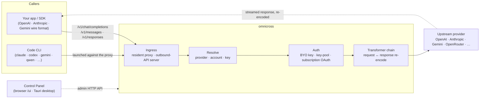

# omnicross

<div align="center">

[](https://opensource.org/licenses/MIT) [](https://nodejs.org/) [](https://www.typescriptlang.org/) [](https://www.npmjs.com/package/@omnicross/core)

[English](../README.md) · [简体中文](README.zh.md) · [繁體中文](README.zh-Hant.md) · [日本語](README.ja.md) · [한국어](README.ko.md) · [Français](README.fr.md) · [Deutsch](README.de.md) · [Italiano](README.it.md) · [Español (España)](README.es-ES.md) · [Español (Latinoamérica)](README.es-419.md) · [Português (Brasil)](README.pt-BR.md) · [Português (Portugal)](README.pt-PT.md) · [Nederlands](README.nl.md) · [Dansk](README.da.md) · [Svenska](README.sv.md) · [Norsk bokmål](README.nb.md) · [Suomi](README.fi.md) · [Polski](README.pl.md) · [Čeština](README.cs.md) · [Magyar](README.hu.md) · [Română](README.ro.md) · [Български](README.bg.md) · [Русский](README.ru.md) · [Українська](README.uk.md) · [Ελληνικά](README.el.md) · [Türkçe](README.tr.md) · [العربية](README.ar.md) · [ไทย](README.th.md) · **Tiếng Việt** · [Bahasa Indonesia](README.id.md) · [Bahasa Melayu](README.ms.md)

**Lõi phục vụ LLM đa năng — định tuyến, chuyển đổi và proxy bất kỳ nhà cung cấp nào sau một bộ API thống nhất.**

</div>

---

`omnicross` nhận một yêu cầu LLM đến — OpenAI `/v1/chat/completions`, Anthropic `/v1/messages`, Gemini và nhiều hơn nữa — xác định **nhà cung cấp, tài khoản và khóa** nào sẽ xử lý nó (khóa API của riêng bạn, một pool đa khóa, hoặc danh tính OAuth theo gói đăng ký), đưa qua pipeline transformer + xác thực, rồi proxy lên thượng nguồn — mã hóa lại phản hồi trả về đúng định dạng wire mà người gọi yêu cầu.

Nó được cung cấp dưới một số dạng:

- **🖥️ Dưới dạng ứng dụng desktop** — một cửa sổ Tauri v2 gốc (`apps/desktop`) hiển thị toàn bộ giao diện Control Panel và đóng gói & quản lý daemon cho bạn (khay hệ thống, tự khởi động, vòng đời daemon). **Cách hầu hết mọi người sử dụng omnicross** — không cần terminal, không cần npm, không cần thiết lập CORS.
- **🌐 Trên trình duyệt** — không muốn cài ứng dụng gốc? `omnicross ui` khởi động daemon và mở cùng giao diện GUI đó trên trình duyệt của bạn (được phục vụ bởi chính daemon tại `/ui` — cùng origin, không cần thiết lập thêm) để quản lý nhà cung cấp, khóa, tài khoản và các lần khởi chạy Code CLI.
- **🚀 Dưới dạng headless daemon** — CLI/daemon `omnicross`: một tiến trình Node thuần với API HTTP cục bộ, bảng điều khiển admin, và các lệnh để quản lý khóa, nhà cung cấp, đăng nhập OAuth và khởi chạy Code CLI. Hoàn hảo cho server và workflow ưu tiên terminal; đây cũng là thứ cung cấp năng lực cho ứng dụng desktop và Control Panel trên trình duyệt.
- **📦 Dưới dạng thư viện** — `npm install @omnicross/core` và nhúng lõi phục vụ trực tiếp vào bất kỳ dự án Node nào.

Bản thân lõi phục vụ là Node thuần — không có Electron, không bị khóa vào bất kỳ framework nào; giao diện là ứng dụng web thuần, và vỏ desktop chỉ là một lớp Tauri mỏng bên trên.

## 🏗️ Kiến trúc

Một yêu cầu đến đi qua **ingress** (proxy trong tiến trình thường trú, hoặc server API đầu ra độc lập), được giải quyết thành một **nhà cung cấp + danh tính**, được chuyển đổi bởi **chuỗi transformer**, và được proxy lên **thượng nguồn** — sau đó phản hồi phát trực tiếp trở lại qua cùng chuỗi đó, được mã hóa lại thành định dạng wire của người gọi.



| Khối xây dựng | Vị trí |
| --- | --- |
| Frontend Control Panel (Vite + React) | `@omnicross/ui` (`packages/ui` — chỉ xuất bản `dist/` đã build) |
| Vỏ desktop (Tauri v2) | `apps/desktop` |
| Runtime độc lập (API HTTP · bảng điều khiển · CLI · phục vụ UI tại `/ui`) | `@omnicross/daemon` |
| Ingress · dispatch · transformer · proxy | `@omnicross/core` |
| Subscription OAuth + chiến lược xác thực | `@omnicross/subscriptions` |
| Kiểu hợp đồng dùng chung + preset nhà cung cấp | `@omnicross/contracts` |
| Khởi chạy Code CLI (proxy-env + supervisor) | `@omnicross/cli-launcher` |

## ✨ Tính năng

- **GUI Control Panel** — một giao diện React trên API admin localhost của daemon: quản lý nhà cung cấp, khóa và tài khoản đăng ký một cách trực quan thay vì qua file cấu hình. Được cung cấp dưới dạng ứng dụng desktop Tauri v2 gốc (cách sử dụng hàng ngày — khay hệ thống, tự khởi động, daemon tích hợp, không có Electron), hoặc phục vụ trên trình duyệt chỉ với một lệnh (`omnicross ui`).
- **Chuyển đổi định dạng wire bất kỳ sang bất kỳ** — chấp nhận yêu cầu dạng OpenAI / Anthropic / Gemini và nhắm đến nhà cung cấp sử dụng định dạng *khác*; pipeline transformer chuyển đổi cả yêu cầu lẫn phản hồi phát trực tiếp.
- **BYO key + pool đa khóa** — gắn khóa nhà cung cấp của riêng bạn, hoặc tạo pool nhiều khóa cho mỗi nhà cung cấp với round-robin có trọng số và tự động chuyển đổi dự phòng khi gặp `429 / 529 / 401 / 403`.
- **Đăng ký như một nhà cung cấp** — điều hướng yêu cầu qua đăng ký Claude / ChatGPT (Codex) / Gemini bằng OAuth, hoặc khóa bearer OpenCodeGo, thay vì khóa API tính phí theo mức sử dụng.
- **Preset nhà cung cấp** — danh mục được tuyển chọn gồm các endpoint/template của nhà cung cấp (OpenAI, Anthropic, Gemini, DeepSeek, OpenRouter, Groq, Mistral và nhiều hơn nữa) bạn có thể ánh xạ thành một hàng cấu hình chỉ với một lệnh.
- **Proxy gốc streaming** — một proxy trong tiến trình thường trú truyền tiếp luồng SSE nguyên vẹn khi định dạng khớp, và mã hóa lại khi không khớp.
- **Trình khởi chạy Code CLI** — khởi động `claude` / `codex` / `gemini` / `qwen` / `copilot` / `opencode` trên một proxy cục bộ để một phiên CLI có thể chạy trên **bất kỳ** nhà cung cấp hoặc đăng ký nào bạn đã cấu hình.
- **Không phụ thuộc host & có kiểu đầy đủ** — Node + TypeScript thuần, kiểu hợp đồng phụ thuộc nhẹ được xuất bản riêng, không ghép nối với bất kỳ ứng dụng host nào.

## 📦 Cấu trúc

Đây là một monorepo workspace đơn: các gói có thể xuất bản trong `packages/`, các ứng dụng có thể chạy trong `apps/`. Tên gói npm giữ phạm vi `@omnicross/`; tên thư mục bỏ tiền tố `omnicross-`.

| Ứng dụng | Là gì |
| --- | --- |
| `apps/desktop` | **omnicross-desktop** — ứng dụng desktop Tauri v2 gốc: bọc frontend `@omnicross/ui` thành cửa sổ gốc và đóng gói & quản lý daemon (khay hệ thống, tự khởi động, vòng đời daemon). Xem [`apps/desktop/README.md`](../apps/desktop/README.md). |

Các gói đã xuất bản:

| Gói | npm | Là gì |
| --- | --- | --- |
| `packages/contracts` | [`@omnicross/contracts`](https://www.npmjs.com/package/@omnicross/contracts) | Kiểu hợp đồng phụ thuộc nhẹ + helper giá trị runtime (cấu hình LLM, kiểu completion/chat, preset nhà cung cấp, cấu hình thinking, usage, kiểu token subscription/tài khoản). Dùng qua subpath (`@omnicross/contracts/llm-config`, `/provider-presets`, …). |
| `packages/core` | [`@omnicross/core`](https://www.npmjs.com/package/@omnicross/core) | Lõi phục vụ — dispatch nhà cung cấp, pipeline completion, transformer, proxy nhà cung cấp, và bề mặt API đầu ra. |
| `packages/subscriptions` | [`@omnicross/subscriptions`](https://www.npmjs.com/package/@omnicross/subscriptions) | Chiến lược xác thực subscription-as-provider, luồng OAuth (Claude / Codex / Gemini), và dispatcher tình huống OpenCodeGo. |
| `packages/cli-launcher` | [`@omnicross/cli-launcher`](https://www.npmjs.com/package/@omnicross/cli-launcher) | Cơ chế vòng đời subprocess `ProcessSupervisor` + các builder cấu hình khởi chạy proxy-env cho từng CLI. |
| `packages/daemon` | [`@omnicross/daemon`](https://www.npmjs.com/package/@omnicross/daemon) | Một embedder Node thuần của `@omnicross/core` với API HTTP admin + bảng điều khiển, CLI `omnicross`, và phục vụ Control Panel cùng origin tại `/ui`. |
| `packages/ui` | [`@omnicross/ui`](https://www.npmjs.com/package/@omnicross/ui) | Frontend Control Panel (Vite + React). Chỉ xuất bản `dist/` đã build (tài sản tĩnh, không có runtime deps); daemon phục vụ nó tại `/ui`, vỏ Tauri bọc nó. |

## 🚀 Bắt đầu nhanh

### Tùy chọn A — Ứng dụng desktop (khuyên dùng cho hầu hết người dùng)

Tải xuống trình cài đặt cho hệ điều hành của bạn từ [bản phát hành mới nhất](https://github.com/Dumoedss/omnicross/releases/latest) và chạy nó:

- **Windows** — `*-setup.exe` (NSIS) hoặc `*.msi`
- **macOS** — `*.dmg` (universal — Apple Silicon + Intel)
- **Linux** — `*.AppImage`, `*.deb`, hoặc `*.rpm`

Ứng dụng đóng gói và quản lý mọi thứ cho bạn — daemon **và** một runtime Node riêng tư — vì vậy không cần cài đặt thêm bất cứ thứ gì. Chỉ cần tải xuống, chạy trình cài đặt và mở ứng dụng.

> Muốn tự build? Xem [`apps/desktop/README.md`](../apps/desktop/README.md) (`npm run build:app`, yêu cầu Rust).

### Tùy chọn B — Control Panel trên trình duyệt

Không muốn cài ứng dụng? Một lệnh — daemon tự phục vụ cùng giao diện UI (cùng origin với API admin của nó — không CORS, không `.env`):

```bash
npm install -g @omnicross/daemon
omnicross ui --config ./omnicross.config.json   # boots the daemon + opens http://127.0.0.1:8766/ui/
```

Thêm `--no-open` để bỏ qua việc tự mở trình duyệt. Quy trình phát triển frontend nằm trong [`packages/ui/README.md`](../packages/ui/README.md).

### Tùy chọn C — headless daemon

Mọi thứ ứng dụng làm được — và nhiều hơn nữa — đều có thể thực hiện từ terminal:

```bash
npm install -g @omnicross/daemon
```

```bash
# Boot the daemon (BYO-key serving) against a config file
omnicross start --config ./omnicross.config.json

# Map a curated provider preset + your key into the config
omnicross providers presets --config ./omnicross.config.json
omnicross providers add openai --key $OPENAI_API_KEY --config ./omnicross.config.json

# Mint a local API key for your clients (shown once)
omnicross keys add my-app --config ./omnicross.config.json

# Log in to a subscription via browser OAuth (claude | codex | gemini)
omnicross login claude --config ./omnicross.config.json

# Launch a Code CLI against the in-process proxy on any configured provider
omnicross launch claude --provider openai --model gpt-4o --config ./omnicross.config.json
```

Chạy `omnicross --help` để xem danh sách lệnh đầy đủ.

### Tùy chọn D — dưới dạng thư viện

```bash
npm install @omnicross/core @omnicross/contracts
```

```ts
import type { LLMProvider } from '@omnicross/contracts/llm-config';
// import the serving-core pieces you need from @omnicross/core

// Wire the serving core into your own Node app: supply a provider-config
// source + key store, then route inbound requests through the proxy.
```

> Import theo subpath giữ cho đồ thị phụ thuộc gọn gàng, ví dụ:
> `@omnicross/contracts/provider-presets`, `@omnicross/core/provider-proxy`.

## 🛠️ Phát triển

```bash
git clone https://github.com/Dumoedss/omnicross.git
cd omnicross
npm install          # workspace symlinks for @omnicross/* + external deps
npm run typecheck    # tsc --noEmit per package
npm test             # vitest (tests run against src via aliases)
npm run build        # tsup per package → dist/ (ESM + CJS + .d.ts)
```

Các bài kiểm thử và kiểm tra kiểu giải quyết các import `@omnicross/*` thành **source** của gói qua alias, vì vậy không cần build trước. `npm run build` tạo ra `dist/` của từng gói để xuất bản.

Để phát triển Control Panel, `npm run dev` (thư mục gốc repo) là vòng lặp một lệnh: lần chạy đầu tiên tạo ra `omnicross.dev.config.json` bị gitignore, khởi động daemon trên `127.0.0.1:8766`, và khởi động Vite dev server của UI trên `http://localhost:1430` (Ctrl+C dừng cả hai). Dev server proxy `/admin/*` lên daemon phía server, vì vậy trình duyệt luôn cùng origin — daemon không gửi header CORS theo thiết kế. Frontend bản thân là gói workspace `@omnicross/ui` — `npm run build -w @omnicross/ui` làm mới `dist/` mà daemon phục vụ. Đối với cửa sổ gốc (yêu cầu Rust): `npm run dev:app` chạy `tauri dev`, và `npm run build:app` đóng gói file thực thi phát hành + trình cài đặt với runtime daemon **và một binary Node riêng tư** được tích hợp bên trong (đầu ra nằm trong `apps/desktop/src-tauri/target/release/`; máy đích không cần cài đặt thêm gì — chi tiết trong [`apps/desktop/README.md`](../apps/desktop/README.md)).

## 📄 Giấy phép

[MIT](../LICENSE) 

Một số phần của `@omnicross/core` và các gói khác được phỏng theo tác phẩm của bên thứ ba theo giấy phép riêng của họ — xem các file `NOTICE` trong các gói tương ứng.
