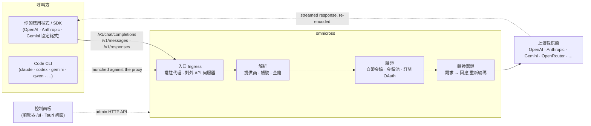

# omnicross

<div align="center">

[](https://opensource.org/licenses/MIT) [](https://nodejs.org/) [](https://www.typescriptlang.org/) [](https://www.npmjs.com/package/@omnicross/core)

[English](../README.md) · [简体中文](README.zh.md) · **繁體中文** · [日本語](README.ja.md) · [한국어](README.ko.md) · [Français](README.fr.md) · [Deutsch](README.de.md) · [Italiano](README.it.md) · [Español (España)](README.es-ES.md) · [Español (Latinoamérica)](README.es-419.md) · [Português (Brasil)](README.pt-BR.md) · [Português (Portugal)](README.pt-PT.md) · [Nederlands](README.nl.md) · [Dansk](README.da.md) · [Svenska](README.sv.md) · [Norsk bokmål](README.nb.md) · [Suomi](README.fi.md) · [Polski](README.pl.md) · [Čeština](README.cs.md) · [Magyar](README.hu.md) · [Română](README.ro.md) · [Български](README.bg.md) · [Русский](README.ru.md) · [Українська](README.uk.md) · [Ελληνικά](README.el.md) · [Türkçe](README.tr.md) · [العربية](README.ar.md) · [ไทย](README.th.md) · [Tiếng Việt](README.vi.md) · [Bahasa Indonesia](README.id.md) · [Bahasa Melayu](README.ms.md)

**通用 LLM 服務核心——在一套 API 背後路由、轉換並代理任意提供商。**

</div>

---

`omnicross` 接收一個入站 LLM 請求——OpenAI `/v1/chat/completions`、Anthropic `/v1/messages`、Gemini 等——判斷應由**哪個提供商、哪個帳號、哪個金鑰**來回應（你自己的 API 金鑰、多金鑰池，或訂閱 OAuth 身份），讓它穿過轉換器 + 驗證管線，再代理轉發到上游，並把回應**重新編碼回呼叫方所要求的協定格式**。

它有幾種使用形態：

- **🖥️ 桌面應用程式** —— 一個原生的 Tauri v2 視窗（`apps/desktop`），呈現完整的控制面板 GUI，並替你內建並管理守護程序（系統匣、開機自啟、daemon 生命週期）。**大多數人使用 omnicross 的主要方式**——無需終端機、無需 npm、無需 CORS 設定。
- **🌐 在瀏覽器中** —— 不想安裝原生應用程式？`omnicross ui` 啟動守護程序並在瀏覽器中開啟同一套 GUI（由守護程序自己在 `/ui` 託管——同源，零額外設定），可視化管理提供商、金鑰、帳號與 Code CLI 啟動。
- **🚀 作為 headless 守護程序** —— `omnicross` 命令列/守護程序：一個純 Node 程序，自帶本地 HTTP API、管理面板，以及用於管理金鑰／提供商／OAuth 登入／啟動 Code CLI 的命令列。適合伺服器與終端機優先的工作流程；它也是桌面應用程式與瀏覽器控制面板背後的引擎。
- **📦 作為函式庫** —— `npm install @omnicross/core`，把服務核心直接嵌入任何 Node 專案。

服務核心本身是純 Node——不綁定 Electron，不鎖定任何框架；UI 是普通的 Web 應用程式，桌面外殼只是覆在其上的一層輕量 Tauri 殼。

## 🏗️ 架構

一個入站請求從**入口（ingress）**進入（常駐的程序內代理，或獨立的對外 API 伺服器），被解析到一個**提供商 + 身份**，經**轉換器鏈**轉換後代理轉發到**上游**——隨後回應沿同一條鏈流回，並重新編碼成呼叫方的協定格式。



| 建構模組 | 位置 |
| --- | --- |
| 控制面板前端（Vite + React） | `@omnicross/ui`（`packages/ui`——僅發佈建構產物 `dist/`） |
| 桌面外殼（Tauri v2） | `apps/desktop` |
| 獨立執行環境（HTTP API · 面板 · 命令列 · 在 `/ui` 託管 UI） | `@omnicross/daemon` |
| 入口 · 派發 · 轉換器 · 代理 | `@omnicross/core` |
| 訂閱 OAuth + 驗證策略 | `@omnicross/subscriptions` |
| 共用契約型別 + 提供商預設 | `@omnicross/contracts` |
| Code CLI 啟動（proxy-env + 程序監管） | `@omnicross/cli-launcher` |

## ✨ 特性

- **控制面板 GUI** —— 基於守護程序本地 admin API 的 React 圖形介面：以可視化方式管理提供商、金鑰與訂閱帳號，而不必手動編輯設定檔。提供原生的 Tauri v2 桌面應用程式（日常使用的主要入口——系統匣、開機自啟、內建守護程序、無 Electron），也可一條命令（`omnicross ui`）在瀏覽器中使用。
- **任意協定互轉** —— 接收 OpenAI / Anthropic / Gemini 形態的請求，並打到一個說**不同**協定的提供商；轉換器管線會同時轉換請求與串流回應。
- **自帶金鑰 + 多金鑰池** —— 綁定你自己的提供商金鑰，或為每個提供商設定多金鑰池，按權重輪詢，並在 `429 / 529 / 401 / 403` 時自動故障切換。
- **訂閱即提供商** —— 透過 OAuth 用 Claude / ChatGPT（Codex）/ Gemini 訂閱來驅動請求，或用 OpenCodeGo bearer key，而不必使用按量計費的 API 金鑰。
- **提供商預設** —— 內建一份精選的提供商端點／範本目錄（OpenAI、Anthropic、Gemini、DeepSeek、OpenRouter、Groq、Mistral 等眾多提供商），一條命令即可對應成一行設定。
- **串流原生代理** —— 常駐的程序內代理在格式匹配時逐字節透傳 SSE 串流，不匹配時則重新編碼。
- **Code CLI 啟動器** —— 讓 `claude` / `codex` / `gemini` / `qwen` / `copilot` / `opencode` 對接本地代理，從而使一個 CLI 工作階段能跑在你設定的**任意**提供商或訂閱上。
- **宿主無關 & 型別完備** —— 純 Node + TypeScript，契約型別作為獨立的輕量套件發佈，與任何宿主應用程式零耦合。

## 📦 版本庫結構

這是一個單 workspace 的 monorepo：可發佈的套件在 `packages/`，可執行的應用程式在 `apps/`。npm 套件名稱保留 `@omnicross/` 範圍；目錄名稱去掉 `omnicross-` 前綴。

| 應用程式 | 說明 |
| --- | --- |
| `apps/desktop` | **omnicross-desktop** —— 原生 Tauri v2 桌面應用程式：把 `@omnicross/ui` 前端包裝成原生視窗，並內建並管理守護程序（系統匣、開機自啟、daemon 生命週期）。詳見 [`apps/desktop/README.md`](../apps/desktop/README.md)。 |

已發佈的套件：

| 套件 | npm | 說明 |
| --- | --- | --- |
| `packages/contracts` | [`@omnicross/contracts`](https://www.npmjs.com/package/@omnicross/contracts) | 輕量契約型別 + 執行時值輔助函式（LLM 設定、completion/chat 型別、提供商預設、thinking 設定、用量、訂閱/帳號 token 型別）。透過子路徑引入（`@omnicross/contracts/llm-config`、`/provider-presets` 等）。 |
| `packages/core` | [`@omnicross/core`](https://www.npmjs.com/package/@omnicross/core) | 服務核心——提供商派發、completion 管線、轉換器、提供商代理，以及對外 API 層。 |
| `packages/subscriptions` | [`@omnicross/subscriptions`](https://www.npmjs.com/package/@omnicross/subscriptions) | 訂閱即提供商的驗證策略、OAuth 流程（Claude / Codex / Gemini），以及 OpenCodeGo 情境派發器。 |
| `packages/cli-launcher` | [`@omnicross/cli-launcher`](https://www.npmjs.com/package/@omnicross/cli-launcher) | `ProcessSupervisor` 子程序生命週期機制 + 各 CLI 的 proxy-env 啟動設定建構器。 |
| `packages/daemon` | [`@omnicross/daemon`](https://www.npmjs.com/package/@omnicross/daemon) | `@omnicross/core` 的純 Node 宿主，帶管理 HTTP API + 面板、`omnicross` 命令列，並在 `/ui` 同源託管控制面板。 |
| `packages/ui` | [`@omnicross/ui`](https://www.npmjs.com/package/@omnicross/ui) | 控制面板前端（Vite + React）。僅發佈建構產物 `dist/`（純靜態資源、零執行時相依）；守護程序在 `/ui` 託管它，Tauri 外殼包裝它。 |

## 🚀 快速開始

### 方式 A — 桌面應用程式（大多數使用者推薦）

從 [最新 release](https://github.com/Dumoedss/omnicross/releases/latest) 下載對應系統的安裝包並執行：

- **Windows** — `*-setup.exe`（NSIS）或 `*.msi`
- **macOS** — `*.dmg`（通用版——Apple Silicon + Intel）
- **Linux** — `*.AppImage`、`*.deb` 或 `*.rpm`

應用程式會替你內建並管理一切——守護程序**以及**一份私有的 Node 執行環境——所以無需再安裝任何東西。下載、執行安裝包、開啟即可。

> 想自己建構？見 [`apps/desktop/README.md`](../apps/desktop/README.md)（`npm run build:app`，需要 Rust）。

### 方式 B — 瀏覽器中的控制面板

不想安裝應用程式？一條命令——守護程序自己託管同一套 UI（與 admin API 同源——無 CORS、無需 `.env`）：

```bash
npm install -g @omnicross/daemon
omnicross ui --config ./omnicross.config.json   # boots the daemon + opens http://127.0.0.1:8766/ui/
```

加 `--no-open` 可跳過自動開啟瀏覽器。前端開發流程見 [`packages/ui/README.md`](../packages/ui/README.md)。

### 方式 C — headless 守護程序

應用程式能做的一切（以及更多）都可以在終端機完成：

```bash
npm install -g @omnicross/daemon
```

```bash
# Boot the daemon (BYO-key serving) against a config file
omnicross start --config ./omnicross.config.json

# Map a curated provider preset + your key into the config
omnicross providers presets --config ./omnicross.config.json
omnicross providers add openai --key $OPENAI_API_KEY --config ./omnicross.config.json

# Mint a local API key for your clients (shown once)
omnicross keys add my-app --config ./omnicross.config.json

# Log in to a subscription via browser OAuth (claude | codex | gemini)
omnicross login claude --config ./omnicross.config.json

# Launch a Code CLI against the in-process proxy on any configured provider
omnicross launch claude --provider openai --model gpt-4o --config ./omnicross.config.json
```

執行 `omnicross --help` 查看完整命令列表。

### 方式 D — 作為函式庫

```bash
npm install @omnicross/core @omnicross/contracts
```

```ts
import type { LLMProvider } from '@omnicross/contracts/llm-config';
// import the serving-core pieces you need from @omnicross/core

// Wire the serving core into your own Node app: supply a provider-config
// source + key store, then route inbound requests through the proxy.
```

> 用子路徑引入可以保持相依圖收斂，例如
> `@omnicross/contracts/provider-presets`、`@omnicross/core/provider-proxy`。

## 🛠️ 開發

```bash
git clone https://github.com/Dumoedss/omnicross.git
cd omnicross
npm install          # workspace symlinks for @omnicross/* + external deps
npm run typecheck    # tsc --noEmit per package
npm test             # vitest (tests run against src via aliases)
npm run build        # tsup per package → dist/ (ESM + CJS + .d.ts)
```

測試與型別檢查會透過別名把 `@omnicross/*` 解析到套件的**原始碼**，因此無需預先建構。`npm run build` 會為每個套件產出用於發佈的 `dist/`。

開發控制面板時，版本庫根目錄的 `npm run dev` 就是一鍵開發環境：首次執行會產生 gitignore 的 `omnicross.dev.config.json`，然後同時啟動 daemon（`127.0.0.1:8766`）和 UI 的 Vite 開發伺服器（`http://localhost:1430`），Ctrl+C 一併停止。開發伺服器會在伺服器端把 `/admin/*` 代理轉發給 daemon，瀏覽器始終同源——daemon 按設計不發送 CORS 標頭。前端本身是 workspace 裡的 `@omnicross/ui` 套件——`npm run build -w @omnicross/ui` 刷新守護程序託管的 `dist/`。原生視窗（需要 Rust）：`npm run dev:app` 執行 `tauri dev`，`npm run build:app` 打包發佈版可執行檔 + 安裝包，**daemon 執行環境與一份私有 Node 二進位檔均已內建**（產物在 `apps/desktop/src-tauri/target/release/` 下；目標機器無需安裝任何東西——詳見 [`apps/desktop/README.md`](../apps/desktop/README.md)）。

## 📄 授權

[MIT](../LICENSE) 

`@omnicross/core` 等套件中的部分程式碼改編自第三方作品，受其各自授權條款約束——詳見各套件內的 `NOTICE` 檔案。
