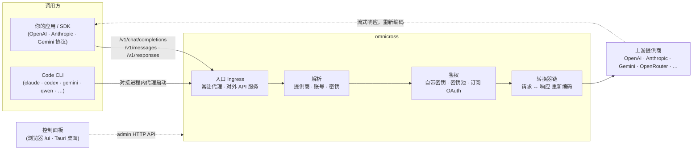

# omnicross

<div align="center">

[](https://opensource.org/licenses/MIT) [](https://nodejs.org/) [](https://www.typescriptlang.org/) [](https://www.npmjs.com/package/@omnicross/core)

[English](../README.md) · **简体中文** · [繁體中文](README.zh-Hant.md) · [日本語](README.ja.md) · [한국어](README.ko.md) · [Français](README.fr.md) · [Deutsch](README.de.md) · [Italiano](README.it.md) · [Español (España)](README.es-ES.md) · [Español (Latinoamérica)](README.es-419.md) · [Português (Brasil)](README.pt-BR.md) · [Português (Portugal)](README.pt-PT.md) · [Nederlands](README.nl.md) · [Dansk](README.da.md) · [Svenska](README.sv.md) · [Norsk bokmål](README.nb.md) · [Suomi](README.fi.md) · [Polski](README.pl.md) · [Čeština](README.cs.md) · [Magyar](README.hu.md) · [Română](README.ro.md) · [Български](README.bg.md) · [Русский](README.ru.md) · [Українська](README.uk.md) · [Ελληνικά](README.el.md) · [Türkçe](README.tr.md) · [العربية](README.ar.md) · [ไทย](README.th.md) · [Tiếng Việt](README.vi.md) · [Bahasa Indonesia](README.id.md) · [Bahasa Melayu](README.ms.md)

**通用 LLM 服务内核 —— 在一套 API 背后路由、转换并代理任意提供商。**

</div>

---

**omnicross 让你用一套订阅或密钥，喂饱所有 AI 应用和编程 CLI。**

把 Claude Code、Codex、Gemini CLI —— 或任何走 OpenAI / Anthropic / Gemini 接口的应用 —— 指向 omnicross，它就把每个请求路由到你选定的提供商和模型。你能做的事：

- 直接用 **Claude / ChatGPT / Gemini 的订阅登录**来跑，省掉按量计费的 API Key；
- 把多个 API Key 组成**密钥池**，自动轮换、失败自动切换；
- 让一个只会说某一种接口的工具，照样调用说别家接口的模型 —— omnicross 实时帮你把请求和响应互转。

这些全在一个桌面应用的图形界面里搞定，不用手改一堆配置文件。

它有几种使用形态：

- **🖥️ 桌面应用** —— 一个原生的 Tauri v2 窗口（`apps/desktop`），呈现完整的控制面板 GUI，并替你内置并管理守护进程（托盘、开机自启、daemon 生命周期）。**大多数人使用 omnicross 的主要方式** —— 无需终端、无需 npm、无需 CORS 配置。
- **🌐 在浏览器中** —— 不想装原生应用？`omnicross ui` 启动守护进程并在浏览器中打开同一套 GUI（由守护进程自己在 `/ui` 托管 —— 同源，零额外配置），可视化管理提供商、密钥、账号与 Code CLI 启动。
- **🚀 作为 headless 守护进程** —— `omnicross` 命令行/守护进程：一个纯 Node 进程，自带本地 HTTP API、管理面板，以及用于管理密钥 / 提供商 / OAuth 登录 / 启动 Code CLI 的命令行。适合服务器与终端优先的工作流；它也是桌面应用与浏览器控制面板背后的引擎。
- **📦 作为依赖包** —— `npm install @omnicross/core`，把服务内核直接嵌入任何 Node 项目。

服务内核本身是纯 Node —— 不绑定任何框架；UI 是普通的 Web 应用，桌面外壳只是覆在其上的一层轻量 Tauri 壳。

## 🏗️ 架构

一个入站请求从**入口（ingress）**进入（常驻的进程内代理，或独立的对外 API 服务），被解析到一个**提供商 + 身份**，经**转换器链**转换后代理转发到**上游**——随后响应沿同一条链流回，并重新编码成调用方的协议格式。



| 构件 | 位置 |
| --- | --- |
| 控制面板前端（Vite + React） | `@omnicross/ui`（`packages/ui` —— 只发布构建产物 `dist/`） |
| 桌面外壳（Tauri v2） | `apps/desktop` |
| 独立运行时（HTTP API · 面板 · 命令行 · 在 `/ui` 托管 UI） | `@omnicross/daemon` |
| 入口 · 派发 · 转换器 · 代理 | `@omnicross/core` |
| 订阅 OAuth + 鉴权策略 | `@omnicross/subscriptions` |
| 共享契约类型 + 提供商预设 | `@omnicross/contracts` |
| Code CLI 启动（proxy-env + 进程监管） | `@omnicross/cli-launcher` |

## ✨ 特性

- **控制面板 GUI** —— 基于守护进程本地 admin API 的 React 图形界面：以可视化方式管理提供商、密钥与订阅账号，而不必手改配置文件。提供原生的 Tauri v2 桌面应用（日常使用的主要入口 —— 托盘、开机自启、内置守护进程、无 Electron），也可一条命令（`omnicross ui`）在浏览器中使用。
- **任意协议互转** —— 接收 OpenAI / Anthropic / Gemini 形态的请求，并打到一个说**不同**协议的提供商；转换器管线会同时转换请求与流式响应。
- **自带密钥 + 多密钥池** —— 绑定你自己的提供商密钥，或为每个提供商配置多密钥池，按权重轮询，并在 `429 / 529 / 401 / 403` 时自动故障切换。
- **订阅即提供商** —— 通过 OAuth 用 Claude / ChatGPT（Codex）/ Gemini 订阅来驱动请求，或用 OpenCodeGo bearer key，而不必使用按量计费的 API Key。
- **提供商预设** —— 内置一份精选的提供商端点 / 模板目录（OpenAI、Anthropic、Gemini、DeepSeek、OpenRouter、Groq、Mistral 等众多提供商），一条命令即可映射成一行配置。
- **流式原生代理** —— 常驻的进程内代理在格式匹配时逐字节透传 SSE 流，不匹配时则重新编码。
- **Code CLI 启动器** —— 让 `claude` / `codex` / `gemini` / `qwen` / `copilot` / `opencode` 对接本地代理，从而使一个 CLI 会话能跑在你配置的**任意**提供商或订阅上。
- **宿主无关 & 类型完备** —— 纯 Node + TypeScript，契约类型作为独立的轻量包发布，与任何宿主应用零耦合。

## 📦 仓库布局

这是一个单 workspace 的 monorepo：可发布的包在 `packages/`，可运行的应用在 `apps/`。npm 包名保留 `@omnicross/` 作用域；目录名去掉 `omnicross-` 前缀。

| 应用 | 是什么 |
| --- | --- |
| `apps/desktop` | **omnicross-desktop** —— 原生 Tauri v2 桌面应用：把 `@omnicross/ui` 前端包装成原生窗口，并内置并管理守护进程（托盘、开机自启、daemon 生命周期）。详见 [`apps/desktop/README.md`](../apps/desktop/README.md)。 |

已发布的包：

| 包 | npm | 是什么 |
| --- | --- | --- |
| `packages/contracts` | [`@omnicross/contracts`](https://www.npmjs.com/package/@omnicross/contracts) | 轻量契约类型 + 运行时值辅助函数（LLM 配置、completion/chat 类型、提供商预设、thinking 配置、用量、订阅/账号 token 类型）。通过子路径引入（`@omnicross/contracts/llm-config`、`/provider-presets` 等）。 |
| `packages/core` | [`@omnicross/core`](https://www.npmjs.com/package/@omnicross/core) | 服务内核 —— 提供商派发、completion 管线、转换器、提供商代理，以及对外 API 层。 |
| `packages/subscriptions` | [`@omnicross/subscriptions`](https://www.npmjs.com/package/@omnicross/subscriptions) | 订阅即提供商的鉴权策略、OAuth 流程（Claude / Codex / Gemini），以及 OpenCodeGo 场景派发器。 |
| `packages/cli-launcher` | [`@omnicross/cli-launcher`](https://www.npmjs.com/package/@omnicross/cli-launcher) | `ProcessSupervisor` 子进程生命周期机制 + 各 CLI 的 proxy-env 启动配置构建器。 |
| `packages/daemon` | [`@omnicross/daemon`](https://www.npmjs.com/package/@omnicross/daemon) | `@omnicross/core` 的纯 Node 宿主，带管理 HTTP API + 面板、`omnicross` 命令行，并在 `/ui` 同源托管控制面板。 |
| `packages/ui` | [`@omnicross/ui`](https://www.npmjs.com/package/@omnicross/ui) | 控制面板前端（Vite + React）。只发布构建产物 `dist/`（纯静态资源、零运行时依赖）；守护进程在 `/ui` 托管它，Tauri 外壳包装它。 |

## 🚀 快速开始

### 方式一 —— 桌面应用（多数用户推荐）

从 [最新 release](https://github.com/Dumoedss/omnicross/releases/latest) 下载对应系统的安装包并运行：

- **Windows** —— `*-setup.exe`（NSIS）或 `*.msi`
- **macOS** —— `*.dmg`（universal —— Apple Silicon + Intel）
- **Linux** —— `*.AppImage`、`*.deb` 或 `*.rpm`

应用会替你内置并管理一切 —— 守护进程**以及**一份私有的 Node 运行时 —— 所以无需再装任何东西。下载、运行安装包、打开即可。

> 想自己构建？见 [`apps/desktop/README.md`](../apps/desktop/README.md)（`npm run build:app`，需要 Rust）。

### 方式二 —— 浏览器中的控制面板

不想装应用？一条命令 —— 守护进程自己托管同一套 UI（与 admin API 同源 —— 无 CORS、无需 `.env`）：

```bash
npm install -g @omnicross/daemon
omnicross ui --config ./omnicross.config.json   # 启动守护进程 + 打开 http://127.0.0.1:8766/ui/
```

加 `--no-open` 可跳过自动打开浏览器。前端开发流程见 [`packages/ui/README.md`](../packages/ui/README.md)。

### 方式三 —— headless 守护进程

应用能做的一切（以及更多）都可以在终端完成：

```bash
npm install -g @omnicross/daemon
```

```bash
# 用一个配置文件启动守护进程（自带密钥服务）
omnicross start --config ./omnicross.config.json

# 把一个精选提供商预设 + 你的密钥映射进配置
omnicross providers presets --config ./omnicross.config.json
omnicross providers add openai --key $OPENAI_API_KEY --config ./omnicross.config.json

# 为你的客户端铸造一个本地 API Key（只显示一次）
omnicross keys add my-app --config ./omnicross.config.json

# 通过浏览器 OAuth 登录订阅（claude | codex | gemini）
omnicross login claude --config ./omnicross.config.json

# 让一个 Code CLI 对接进程内代理，跑在任意已配置的提供商上
omnicross launch claude --provider openai --model gpt-4o --config ./omnicross.config.json
```

运行 `omnicross --help` 查看完整命令列表。

### 方式四 —— 作为依赖包

```bash
npm install @omnicross/core @omnicross/contracts
```

```ts
import type { LLMProvider } from '@omnicross/contracts/llm-config';
// 按需从 @omnicross/core 引入服务内核的各个部件

// 把服务内核接入你自己的 Node 应用：提供一个 provider-config 源 + 密钥存储，
// 然后让入站请求穿过代理。
```

> 用子路径引入可以保持依赖图收敛，例如
> `@omnicross/contracts/provider-presets`、`@omnicross/core/provider-proxy`。

## 🛠️ 开发

```bash
git clone https://github.com/Dumoedss/omnicross.git
cd omnicross
npm install          # 为 @omnicross/* 建立 workspace 软链 + 安装外部依赖
npm run typecheck    # 每个包 tsc --noEmit
npm test             # vitest（测试通过别名直接跑 src）
npm run build        # 每个包 tsup → dist/（ESM + CJS + .d.ts）
```

测试与类型检查会通过别名把 `@omnicross/*` 解析到包的**源码**，因此无需预先构建。`npm run build` 会为每个包产出用于发布的 `dist/`。

开发控制面板时，仓库根目录的 `npm run dev` 就是一键开发环境：首次运行会生成 gitignore 的 `omnicross.dev.config.json`，然后同时启动 daemon（`127.0.0.1:8766`）和 UI 的 Vite 开发服务器（`http://localhost:1430`），Ctrl+C 一并停止。开发服务器会在服务端把 `/admin/*` 代理转发给 daemon，浏览器始终同源 —— daemon 按设计不发 CORS 头。前端本身是 workspace 里的 `@omnicross/ui` 包 —— `npm run build -w @omnicross/ui` 刷新守护进程托管的 `dist/`。原生窗口（需要 Rust）：`npm run dev:app` 运行 `tauri dev`，`npm run build:app` 打包发布版可执行文件 + 安装包，**daemon 运行时与一份私有 Node 二进制都已内置**（产物在 `apps/desktop/src-tauri/target/release/` 下；目标机器无需安装任何东西 —— 详见 [`apps/desktop/README.md`](../apps/desktop/README.md)）。

## 📄 许可证

[MIT](../LICENSE) 

`@omnicross/core` 等包中的部分代码改编自第三方作品，受其各自许可证约束 —— 详见各包内的 `NOTICE` 文件。
