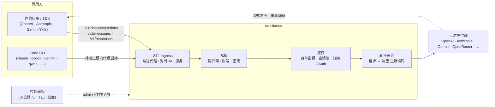

# omnicross

<div align="center">

[](https://opensource.org/licenses/MIT) [](https://nodejs.org/) [](https://www.typescriptlang.org/) [](https://www.npmjs.com/package/@omnicross/core)

[English](../README.md) · **简体中文** · [繁體中文](README.zh-Hant.md) · [日本語](README.ja.md) · [한국어](README.ko.md) · [Français](README.fr.md) · [Deutsch](README.de.md) · [Italiano](README.it.md) · [Español (España)](README.es-ES.md) · [Español (Latinoamérica)](README.es-419.md) · [Português (Brasil)](README.pt-BR.md) · [Português (Portugal)](README.pt-PT.md) · [Nederlands](README.nl.md) · [Dansk](README.da.md) · [Svenska](README.sv.md) · [Norsk bokmål](README.nb.md) · [Suomi](README.fi.md) · [Polski](README.pl.md) · [Čeština](README.cs.md) · [Magyar](README.hu.md) · [Română](README.ro.md) · [Български](README.bg.md) · [Русский](README.ru.md) · [Українська](README.uk.md) · [Ελληνικά](README.el.md) · [Türkçe](README.tr.md) · [العربية](README.ar.md) · [ไทย](README.th.md) · [Tiếng Việt](README.vi.md) · [Bahasa Indonesia](README.id.md) · [Bahasa Melayu](README.ms.md)

</div>

---

<a id="intro"></a>

## 简介

**omnicross 是跑在你自己电脑上的 AI 网关 —— 让任意工具用上任意模型，不管两边说的是不是同一种协议。**

工具和模型 API 各说各的协议，本来是死绑定的：Claude Code 只认 Anthropic，Codex 只认 OpenAI Responses。omnicross 站在中间做实时翻译，于是绑定被解开 —— 在 Claude Code 里用 GPT、在 Codex 里用 Claude 或 Gemini，都只是下拉框里换一个选项的事。

它能做的事：

- **协议互转** —— 四种协议两两互通，请求与流式响应实时转换，工具侧零改动：

  ```mermaid
  flowchart LR
      subgraph tools["工具侧（说什么协议由工具决定）"]
          direction TB
          T1["Claude Code<br/>Anthropic Messages"]
          T2["Codex<br/>OpenAI Responses"]
          T3["Gemini CLI / Qwen CLI"]
      end

      OX(["omnicross<br/>实时协议转换"])

      subgraph models["模型侧（说什么协议由上游决定）"]
          direction TB
          M1["Anthropic Messages<br/>Claude · GLM …"]
          M2["OpenAI Responses<br/>GPT · OpenRouter …"]
          M3["OpenAI Completion<br/>DeepSeek · Kimi …"]
          M4["Gemini<br/>Gemini · Vertex AI"]
      end

      T1 --> OX
      T2 --> OX
      T3 --> OX
      OX --> M1
      OX --> M2
      OX --> M3
      OX --> M4
  ```

除了拆掉协议绑定，它还负责：

- **订阅当 API 用** —— 用 Claude / ChatGPT（Codex）/ Gemini 等订阅登录来驱动请求，省掉按量计费的 API Key；
- **密钥池化** —— 把多个 API Key 组成池，按权重轮换，`429 / 529 / 401 / 403` 自动故障切换；
- **统一治理** —— 一套本地访问密钥体系管住所有客户端：端点权限、并发上限、成本上限、限流、模型黑白名单、用量统计。

<details>
<summary><b>📋 支持的上游一览</b>（提供商预设 · 订阅账号 · 搜索提供方 —— 点击展开）</summary>

**提供商预设（自带 API Key）** —— 「添加提供商」时可一键套用的模板，已预填端点与协议格式。不在表里的服务也能用：手动填 API 地址即可，只要它兼容其中一种协议。

| 协议 | 预设 |
| --- | --- |
| OpenAI Chat | OpenAI · DeepSeek · OpenRouter · Groq · Mistral · Cerebras · Together AI · Perplexity · SiliconFlow · Synthetic · Ollama（本地）· Cline · Grok · Kimi (Moonshot) · MiniMax · MiniMax Token Plan · 智谱 GLM · z.ai · 阿里云百炼 · 百度千帆 · 腾讯云混元 · 火山方舟 · 快手 KwaiKAT · 小米 MiMo · 摩尔线程 |
| OpenAI Responses | OpenAI (Responses API) · OpenRouter (Responses API) |
| Anthropic Messages | Anthropic · MiniMax · 腾讯云混元 (Token Plan) · 小米 MiMo (Anthropic) · Umans AI Coding Plan |
| Gemini | Google Gemini · Google Gemini (Vertex AI) |
| Azure | Azure OpenAI |

**订阅账号（用订阅登录，不用 API Key）**

| 订阅 | 接入方式 |
| --- | --- |
| Claude（Pro / Max） | 浏览器 OAuth |
| Codex（ChatGPT Plus / Pro） | 浏览器 OAuth |
| Gemini | 浏览器 OAuth |
| Antigravity | 浏览器 OAuth（独立 Google 账号） |
| Kimi Code | 凭据授权 |
| Grok（SuperGrok） | 凭据授权 |
| GitHub Copilot | 凭据授权 |
| OpenCodeGo | Bearer Key |

**搜索提供方**（给 Codex / OpenAI Responses / Anthropic 三种协议前端提供联网搜索）

| 提供方 | 需要配置 |
| --- | --- |
| Bing (HTTP) · DuckDuckGo (HTTP) | 免密钥，开箱可用 |
| Jina | 可免密钥；配密钥提升限额 |
| Tavily · Zhipu · Z.AI | 需要 API 密钥 |
| SearXNG | 自托管，需填实例主机 |

</details>

它有三种使用形态（后两种适合服务器 / 终端用户）：

- **🖥️ 桌面应用** —— 原生 Tauri v2 窗口，内置并管理守护进程（托盘、开机自启）。**推荐大多数用户**。
- **🌐 浏览器** —— `omnicross ui` 一条命令，守护进程自己在浏览器里打开同一套控制面板。
- **🚀 命令行守护进程** —— `omnicross` CLI：本地 HTTP API + 管理面板 + 全套命令。

服务内核是纯 Node；UI 是普通 Web 应用，桌面壳只是覆在其上的轻量 Tauri 层。架构图与仓库布局见文末[技术部分](#arch)。

<a id="screenshots"></a>

## 界面截图

<table>
<tr>
<td width="50%" align="center">
<b>总览</b><br/>
<a href="screenshots/overview.png"></a>
</td>
<td width="50%" align="center">
<b>仪表板</b><br/>
<a href="screenshots/dashboard.png"></a>
</td>
</tr>
</table>

<details>
<summary><b>查看更多界面</b></summary>

<table>
<tr>
<td width="50%" align="center">
<b>上游与路由</b><br/>
<a href="screenshots/upstreams.png"></a>
</td>
<td width="50%" align="center">
<b>下游与路由</b><br/>
<a href="screenshots/routes.png"></a>
</td>
</tr>
<tr>
<td width="50%" align="center">
<b>访问密钥</b><br/>
<a href="screenshots/access-keys.png"></a>
</td>
<td width="50%" align="center">
<b>集成（Code CLI）</b><br/>
<a href="screenshots/integrations.png"></a>
</td>
</tr>
</table>

</details>

<a id="toc"></a>

## 目录

**上手**

- [安装](#install) —— 桌面应用 / 浏览器 / 命令行
- [快速上手：5 分钟跑通第一个请求](#quickstart)

**使用指南**
- [界面总览](#usage-overview)
- [上游：Provider（自带 API Key）](#usage-provider)
- [上游：订阅账号](#usage-account)
- [下游与路由](#usage-routes)
- [访问密钥](#usage-keys)
- [网关](#usage-gateway)
- [集成：把编程 CLI 接进来](#usage-cli)
- [搜索](#usage-search)
- [图像生成](#usage-images)
- [ChatGPT 网页后端](#usage-chatgpt)
- [用量与活动](#usage-usage)
- [设置](#usage-settings)

**技术部分**

- [架构](#arch) · [仓库布局](#layout) · [命令行速查](#cli) · [开发与发布](#develop) · [许可证](#license)

<a id="install"></a>

## 安装

<details open>
<summary><b>方式一：桌面应用（推荐）</b></summary>

从 [最新 Release](https://github.com/Dumoedss/omnicross/releases/latest) 下载对应系统的安装包并运行：

- **Windows** —— `*-setup.exe`（NSIS）或 `*.msi`
- **macOS** —— `*.dmg`（universal，Apple Silicon + Intel 通用）
- **Linux** —— `*.AppImage` / `*.deb` / `*.rpm`

应用内置并管理一切 —— 守护进程**和**一个私有 Node 运行时 —— 目标机器上什么都不用预装。下载、安装、打开即可。

> 想自行构建？见 [`apps/desktop/README.md`](../apps/desktop/README.md)（`npm run build:app`，需要 Rust）。

</details>

<details>
<summary><b>方式二：浏览器控制面板</b></summary>

不想装原生应用？一条命令 —— 守护进程自己在 `/ui` 托管同一套界面（与管理 API 同源，无需任何 CORS / 环境变量配置）：

```bash
npm install -g @omnicross/daemon
omnicross ui --config ./omnicross.config.json   # 启动守护进程并打开 http://127.0.0.1:8766/ui/
```

加 `--no-open` 可跳过自动打开浏览器。

</details>

<details>
<summary><b>方式三：命令行守护进程（headless）</b></summary>

```bash
npm install -g @omnicross/daemon
```

应用里能做的一切（以及更多）都可以从终端完成 —— 常用命令见文末[命令行速查](#cli)，完整列表 `omnicross --help`。

</details>

<a id="quickstart"></a>

## 快速上手：5 分钟跑通第一个请求

整条链路是：**客户端 →（访问密钥）→ 网关 →（直连上游 或 下游路由）→ 上游**。前三步必做，第 4 步按情况二选一，最后接入客户端。

1. **打开控制面板** —— 启动桌面应用（或在终端运行 `omnicross ui` 打开浏览器控制面板）。

2. **添加一个上游** —— 进入「上游与路由 → 上游资源」：
   - 用 API Key：点「添加提供商」，从预设目录选一个（OpenAI、DeepSeek、OpenRouter……）或手动填写，粘贴你的 Key，配好模型；
   - 或用订阅：「添加账号」选 Claude / Codex / Gemini，浏览器 OAuth 登录。

3. **启用网关** —— 进入「网关」，打开「启用对外服务器」。默认监听 `http://127.0.0.1:8765`。

4. **直用上游，还是配下游路由？** —— 看你的客户端和上游是否「天生匹配」：

   **情况 A：同协议直用 —— 不用配路由。**
   客户端和上游说同一种协议、模型名也对得上时适用，例如 Codex + OpenAI (Responses) 上游、Claude Code + Anthropic 上游。两种用法：
   - **Codex / Claude Code**：到「集成」页启动终端时，「路由目标」直接选「**上游 · <Provider>**」—— 列表里只会出现与该 CLI 同协议的上游，选中即用；或点「启用」做一键集成，日常敲 `codex` / `claude` 即走该上游。
   - **通用 SDK / 其他客户端**：在第 5 步创建密钥后，于「访问密钥」列表把该密钥的「**直连上游**」绑到这个 Provider —— 请求逐字透传，不经过任何路由。Claude / Kimi 的订阅账号也可以作为直连目标。

   **情况 B：需要转换 / 映射 / 池化 —— 配一条下游路由。**
   以下任一条件成立就走这条：**协议不一致**（要跨协议互转）；**模型名对不上**（客户端写死模型名，如 Claude Code 固定发 `claude-*`）；**要按账号池调度**（多订阅账号轮换，尤其 Codex 订阅）；**要按密钥分流**（不同密钥走不同上游）。进入「上游与路由 → 下游与路由」，点「添加路由」，四个关键字段：
   - **端点** —— 客户端说哪种协议就选哪个：Claude Code → `Anthropic Messages`；Codex → `OpenAI Responses`；一般 OpenAI SDK → `OpenAI Chat`；Gemini CLI → `Gemini`。
   - **上游目标** —— 选第 2 步添加的 Provider 或订阅账号。**跨协议就是在这里发生的**：端点选 `Anthropic Messages`、目标选一个 OpenAI 上游，Claude Code 就跑在 GPT 上了。
   - **密钥范围** —— 先用「全部密钥」，等需要按密钥分流时再改。
   - **模型映射** —— 先用「透传」（客户端报什么模型名就往上游发什么）。若客户端写死了模型名，就改成「映射」，把 `*` 映射到上游的真实模型。

5. **创建访问密钥** —— 进入「网关 → 访问密钥」，点「创建密钥」，复制 `sk-omnicross-…`（之后也可随时在列表中查看）。勾选的**端点权限**要覆盖你客户端用的协议端点（情况 B 即第 4 步所选端点）；情况 A 走直连上游的话，顺手把「直连上游」绑到目标 Provider。

6. **接入客户端**：

   **① 一键集成（最省事，推荐 Codex / Claude Code 用户）**

   跳到「集成」页，给 Codex 或 Claude Code 点「启用」—— 密钥和配置文件都替你写好，第 5 步都可以跳过。之后日常敲 `codex` / `claude` 就自动走 omnicross，不用设任何环境变量；启动终端时的「路由目标」可选「上游 ·」直用（情况 A）或「路由 ·」锁定某条下游路由（情况 B）。详见[集成一节](#usage-cli)。

   **② 环境变量（适合通用 SDK / 应用）**

   > 情况 A 用户先确认第 5 步已把密钥「直连上游」绑好；情况 B 用户靠第 4 步的路由派发。

   ```bash
   # OpenAI 系客户端 / SDK（base_url 带 /v1）
   export OPENAI_BASE_URL=http://127.0.0.1:8765/v1
   export OPENAI_API_KEY=sk-omnicross-xxxxxxxx

   # Anthropic 系客户端（Claude Code 等，base_url 用根地址）
   export ANTHROPIC_BASE_URL=http://127.0.0.1:8765
   export ANTHROPIC_API_KEY=sk-omnicross-xxxxxxxx
   ```

   **③ 手动改 Codex 配置（`~/.codex/config.toml`）**

   想自己掌控配置、不让 omnicross 改文件时用这种。在 `~/.codex/config.toml`（Windows：`%USERPROFILE%\.codex\config.toml`）里加：

   ```toml
   model_provider = "omnicross"

   [model_providers.omnicross]
   name = "Omnicross Local Gateway"
   base_url = "http://127.0.0.1:8765/v1"
   wire_api = "responses"
   supports_websockets = false
   env_key = "OMNICROSS_API_KEY"
   http_headers = { "X-OpenAI-Actor-Authorization" = "omnicross" }
   ```

   然后在启动 Codex 的同一个终端会话里提供密钥（别把明文密钥写进 `config.toml`）：

   ```bash
   export OMNICROSS_API_KEY=sk-omnicross-xxxxxxxx   # PowerShell：$env:OMNICROSS_API_KEY = "sk-omnicross-xxxxxxxx"
   codex
   ```

   密钥需要 `responses` 权限（要用图像生成再加 `images`）。`env_key` 与 `[model_providers.omnicross.auth]` 不要同时配置 —— 后者是一键集成用的 auth helper 写法。

跑通了。接下来按需细调：多条路由怎么分流、密钥限什么、CLI 怎么接 —— 见下方使用指南。

> 💡 **排障**：返回 `503 … has no downstream route for this key` = 走的是路由派发，但第 4 步情况 B 的路由没配、没启用，或端点跟客户端对不上（情况 A 请检查密钥是否漏绑「直连上游」）；返回 `403` = 第 5 步密钥缺少该端点权限。

> 📷 **截图待补充**：快速上手各步界面（`screenshots/quickstart-*.png`）

<a id="usage"></a>

## 使用指南

<a id="usage-overview"></a>

<details>
<summary><b>界面总览</b></summary>

控制面板左侧导航分三组：

| 分组 | 页面 | 用途 |
| --- | --- | --- |
| 运行 | 总览 · 仪表板 · 网关 · 路由活动 | 看当前状态、用量统计、网关控制、每请求归因 |
| 配置 | 搜索 · 图像 · 上游与路由 · 访问密钥 · 集成 · ChatGPT 网页 | 所有配置面 |
| 系统 | 设置 | 网络代理、限额调度、模型价格、关于 |

「网关」页内的「访问密钥」标签与「访问密钥」导航项指向同一处；「上游与路由」页内含「上游资源」「下游与路由」两个标签。

> 📷 **截图待补充**：控制面板整体导航（`screenshots/overview-nav.png`）

</details>

<a id="usage-provider"></a>

<details>
<summary><b>上游：Provider（自带 API Key）</b></summary>

路径：**上游与路由 → 上游资源**。

一个 Provider = 一家 BYO-Key 提供商（OpenAI、Anthropic、DeepSeek、OpenRouter、Groq、Mistral……或任何 OpenAI 兼容端点）：

- **添加** —— 「添加提供商」从内置预设目录挑模板（端点、协议格式已预填），或完全手动：名称、API 地址、API Key（可用 `$ENV_VAR` 引用环境变量）、模型列表；「测试 API Key」可即时验证。
- **模型** —— 手动维护，或用模型发现自动拉取上游目录。
- **密钥池** —— 每个提供商可配多把 Key 组成池：按权重轮询、会话粘滞（保提示词缓存）、`429 / 529 / 401 / 403` 自动切换下一把。
- **进阶** —— 每提供商可调并发上限、请求转换器（Transformer）、编码计划（Coding Plan）端点等。

命令行等价操作：`omnicross providers presets` / `omnicross providers add openai --key $KEY`。

> 📷 **截图待补充**：添加 Provider（`screenshots/upstreams-provider-add.png`）

</details>

<a id="usage-account"></a>

<details>
<summary><b>上游：订阅账号</b></summary>

路径：**上游与路由 → 上游资源 → 账号**。

订阅即提供商 —— 用你的订阅登录来跑请求，而不是按量 API Key。支持：

- **Claude** · **Codex（ChatGPT）** · **Gemini** · **Antigravity** —— 浏览器 OAuth 登录（`omnicross login claude` 同效）；
- **Kimi Code** · **Grok（SuperGrok）** · **GitHub Copilot** · **OpenCodeGo** —— 按各自方式粘贴凭据 / 授权。

账号添加后，每个账号有自己的详情页：

| 标签 | 内容 |
| --- | --- |
| 概览 / 路由 | 基本信息、经过它的路由与用量 |
| 限额 | 订阅额度窗口观察（5 小时 / 7 天等） |
| 调度 | 是否参与调度、优先级、分组 |
| 网络 / 诊断 | 出口代理、指纹、健康诊断 |

**账号池**视图汇总所有账号的可调度 / 异常状态与额度水位，供调度器自动挑选；也可以在下游路由里把某个账号 / 分组钉死给某条路由。

</details>

<a id="usage-routes"></a>

<details>
<summary><b>下游与路由</b></summary>

路径：**上游与路由 → 下游与路由**。

一条**下游路由**决定「持有某类访问密钥的客户端请求 → 打到哪个上游资源」。这是 omnicross 的路由核心，字段一览：

| 字段 | 说明 |
| --- | --- |
| 端点 | OpenAI Chat · OpenAI Responses · Anthropic Messages · Gemini（四类协议入口） |
| 上游目标 | 某个 Provider · 某个订阅账号 · 账号分组 · 整个账号池 |
| 密钥范围 | 「全部密钥可进」或「仅指定密钥可进」（限定了密钥的路由优先于开放路由） |
| 模型映射 | 透传（客户端模型名直通上游）或映射表（客户端名 → 上游模型，支持 `*` 通配与思考档位默认值） |
| 优先级 / 回退 | 数字越小越优先；`next` = 服务不了就让位下一条，`fail` = 严格模式直接报错 |
| 后台模型 | 面向 Codex / Gemini 后台任务的模型 |

**典型玩法**：

- Codex 终端走 DeepSeek：建一条 Responses 端点路由，上游目标选 DeepSeek Provider，模型映射把 `codex` / `mini` 映到 DeepSeek 模型；
- 不同密钥不同上游：两条路由同一端点、密钥范围各选一把密钥 —— 多终端并发各走各的上游；
- 订阅分组灰度：目标选「账号分组」，主号优先、备用号回退。

同页还有**聊天 → 代码路由**：让 Agent / 代码模式的会话使用聊天类提供商。

> 📷 **截图待补充**：下游路由编辑（`screenshots/upstreams-routes.png`）

</details>

<a id="usage-keys"></a>

<details>
<summary><b>访问密钥</b></summary>

路径：**网关 → 访问密钥**。

访问密钥是**发给客户端的**本地 Bearer 令牌（`sk-omnicross-…` 前缀），客户端拿它请求网关，路由、限额、计量都挂在密钥上：

- **创建与查看** —— 创建时完整密钥只展示一次；之后列表里随时可点眼睛重新查看。
- **端点权限** —— 精确到端点：chat / responses / messages / gemini / images 多选授权。
- **直连上游** —— 把密钥绑到某个 Provider（请求逐字透传）或 claude / kimi 订阅账号（同格式中继），跳过下游路由。
- **并发上限** —— 每密钥排队上限，超出排队等待。
- **密钥策略** —— 过期时间（固定 / 首次使用后 N 天激活）、日 / 周 / 总成本上限、请求限流、模型黑白名单。
- **用于集成** —— 一键把某把密钥绑给 Codex / Claude Code 集成（见[集成一节](#usage-cli)）。
- **删除** —— 只有一个「删除」，且是**软删除**：密钥立即失效，但行与用量记录保留；已删除的行可再「永久删除」彻底清理。
- **兑换码** —— 可发行把额度充给某密钥的兑换码，客户端用密钥自助兑换。

</details>

<a id="usage-gateway"></a>

<details>
<summary><b>网关</b></summary>

路径：**网关**。

- **启用对外服务器** —— 打开后网关开始接收请求，默认 `http://127.0.0.1:8765`。端点路径即各家标准路径：`/v1/chat/completions`、`/v1/responses`、`/v1/messages`、`/v1/images/generations`、Gemini `generateContent`。
- **允许局域网访问** —— 把监听从回环扩到网卡（手机 / 局域网设备可用）。⚠️ 会把网关暴露给同网络设备，且订阅路由会消耗你的订阅额度 —— 非受信网络请保持关闭。
- **概览** —— 运行状态、当前队列（进行中 / 等待）、路由覆盖（每把密钥能进哪些端点）。
- **实时流量 / 活动** —— 实时请求、审计与归因（见[用量与活动](#usage-usage)）。

</details>

<a id="usage-cli"></a>

<details>
<summary><b>集成：把编程 CLI 接进来</b></summary>

路径：**集成**（Code CLI 页）。

**持久集成** —— 「启用」后 omnicross 直接改写 CLI 的配置文件（`~/.codex/config.toml` / `~/.claude/settings.json`），把它指向本地回环网关并自动创建一把托管密钥：

- 日常 `codex` / `claude` 命令从此固定走 omnicross，无需手动设环境变量；
- 配置漂移可「修复」，不用了可「移除」（自动还原原始配置）；
- 「轮换密钥」给集成换新托管密钥；
- 密钥列表里对任意密钥点「用于 Codex / Claude」= 换绑你自己的密钥（换绑后原托管密钥保留在列表，可手动删除）。

**启动终端** —— 每张 CLI 卡片（claude / codex / gemini / qwen / copilot / opencode，另有 grok / openclaw / hermes / pi 可安装管理）可检测安装、一键安装，点「启动」在守护进程主机上开一个新终端运行该 CLI，启动对话框里选：

- **路由目标** —— `自动`（默认租约，第一个启用的 Provider）· `上游`（任选一个 Provider 走代理租约）· `路由`（锁定某条下游路由启动，多终端同时走不同上游）· `密钥`（以某把访问密钥身份进入网关）；
- **工作目录**（可选）。

**版本检测与升级** —— 卡片显示当前版本（`--version` 实测），并与 npm registry 最新版比对：有新版时显示 `当前 → 最新` 并高亮「升级」按钮；点「升级」在守护进程主机上重装最新版（Hermes 重跑其官方安装脚本；仅 Windows 提供）。刷新页面即重新检测。

运行中的会话列在卡片下方，可随时停止。

**Codex 会话迁移** —— 「Codex 会话」面板扫描某项目目录下的 Codex 会话，把选中会话的 provider 元数据从任意提供商迁到任意提供商（JSONL 与 `state_5.sqlite` 同步更新，留有备份）；详见 [`codex-session-provider-switch.md`](codex-session-provider-switch.md)。

**手动设置** —— 页面底部保留了复制粘贴的环境变量参考，适合不想改配置文件的场景。

> 📷 **截图待补充**：集成页 + 启动对话框（`screenshots/codecli-launch.png`）

</details>

<a id="usage-search"></a>

<details>
<summary><b>搜索</b></summary>

路径：**搜索**。

给三种协议前端提供网页搜索能力：

- **前端模式** —— 每个协议前端独立选择由谁执行搜索：

  | 前端 | 说明 | 默认 |
  | --- | --- | --- |
  | Codex（`/v1/alpha/search`） | Codex CLI 的搜索路由 | 关闭 |
  | Responses（`web_search`） | OpenAI Responses 的内置搜索工具 | 原生 |
  | Anthropic（`web_search_*`） | Anthropic Messages 的服务端搜索工具 | 原生 |

  三种模式：**原生**（交给上游自己执行）· **托管**（由 omnicross 用你配置的搜索提供方执行）· **关闭**（返回结构化的「能力不支持」，而不是 404）。
  想让不自带搜索的上游（比如大多数第三方 OpenAI 兼容端点）也能联网，就把对应前端切成「托管」。

- **搜索提供方** —— 配置搜索服务商凭据、多提供方回退顺序、网络出口。
- **诊断** —— 提供方连通性与执行诊断。

部分提供方配置需重启守护进程后生效，页面会有提示。

</details>

<a id="usage-images"></a>

<details>
<summary><b>图像生成</b></summary>

路径：**图像**。

- **启用 Images 端点** —— 默认关闭；启用后持有 `images` 权限的密钥可调 `/v1/images/generations`。
- **账号选择** —— 选择用哪个订阅账号池 / 分组的图像资格。
- **已配置 vs 实际状态** —— 「已配置」只是开关；「实际状态」由所选账号的新鲜证据驱动（订阅是否真有图像资格），也可发起一次在线验证。

</details>

<a id="usage-chatgpt"></a>

<details>
<summary><b>ChatGPT 网页后端</b></summary>

路径：**ChatGPT 网页**。

把你的 ChatGPT 网页会话（含 Pro）经专用浏览器宿主变成 Codex 的模型后端 —— 向导式三步：

1. 在 platform.openai.com 创建隧道（Tunnel）与 API 密钥；
2. 把连接值粘贴进本页；
3. 在 ChatGPT 网页里创建连接器。

完成后即可在 Codex 中以 ChatGPT 网页身份跑模型。页面含首启隧道就绪检测与步骤指引。

</details>

<a id="usage-usage"></a>

<details>
<summary><b>用量与活动</b></summary>

- **仪表板**（用量统计）—— 按计费周期查看用量与成本，支持按提供商 / 密钥筛选，含周期边界台账。
- **路由活动** —— 每个请求实际使用的凭据（订阅账号池与 BYO Key 汇聚在同一时间线）、实时流量、审计查询。
  隐私边界：会话标识只保留哈希；不采集提示词、请求头、令牌或密钥明文。
- **模型价格** —— 模型单价表，供成本核算（设置内）。

</details>

<a id="usage-settings"></a>

<details>
<summary><b>设置</b></summary>

路径：**设置**。

- **网络与代理** —— 上游出口代理（所有出站请求可走指定代理）；
- **限额调度** —— 订阅额度窗口的后台采集调度；
- **模型价格** —— 单价表维护；
- **关于** —— 版本与运行时信息。

</details>

---

<a id="arch"></a>

## 技术部分

<details>
<summary><b>架构</b></summary>

一个入站请求从**入口（ingress）**进入（常驻的进程内代理，或独立的对外 API 服务），被解析到一个**提供商 + 身份**，经**转换器链**转换后代理转发到**上游**——随后响应沿同一条链流回，并重新编码成调用方的协议格式。


```mermaid
flowchart LR
    subgraph clients["调用方"]
        APP["你的应用 / SDK<br/>(OpenAI · Anthropic · Gemini 协议)"]
        CLI["Code CLI<br/>(claude · codex · gemini · qwen · …)"]
    end

    subgraph omnicross["omnicross"]
        direction TB
        ING["入口 Ingress<br/>常驻代理 · 对外 API 服务"]
        RES["解析<br/>提供商 · 账号 · 密钥"]
        AUTH["鉴权<br/>自带密钥 · 密钥池 · 订阅 OAuth"]
        TX["转换器链<br/>请求 ↔ 响应 重新编码"]
    end

    UP["上游提供商<br/>OpenAI · Anthropic · Gemini · OpenRouter · …"]

    APP -->|"/v1/chat/completions<br/>/v1/messages · /v1/responses"| ING
    CLI -->|对接进程内代理启动| ING
    ING --> RES --> AUTH --> TX --> UP
    UP -.->|流式响应，重新编码| APP

    GUI["控制面板<br/>(浏览器 /ui · Tauri 桌面)"] -.->|admin HTTP API| omnicross
```

</details>

<a id="layout"></a>

<details>
<summary><b>仓库布局</b></summary>

单一 workspace monorepo：`packages/` 发布包，`apps/` 可运行应用。npm 包名保留 `@omnicross/` 作用域；目录名去掉 `omnicross-` 前缀。

| App | 说明 |
| --- | --- |
| `apps/desktop` | **omnicross-desktop** —— 原生 Tauri v2 桌面应用：承载 `@omnicross/ui` 前端并内置管理守护进程（托盘、自启、生命周期）。见 [`apps/desktop/README.md`](../apps/desktop/README.md)。 |

| 包 | npm | 说明 |
| --- | --- | --- |
| `packages/contracts` | [`@omnicross/contracts`](https://www.npmjs.com/package/@omnicross/contracts) | 轻依赖契约类型 + 运行时值（LLM 配置、补全/对话类型、提供商预设、思考配置、用量、订阅/账号令牌类型）。经子路径消费（`@omnicross/contracts/llm-config`、`/provider-presets`…）。 |
| `packages/core` | [`@omnicross/core`](https://www.npmjs.com/package/@omnicross/core) | 服务内核 —— 提供商派发、补全管线、转换器、提供商代理、对外 API 面。 |
| `packages/subscriptions` | [`@omnicross/subscriptions`](https://www.npmjs.com/package/@omnicross/subscriptions) | 订阅即提供商鉴权策略、OAuth 流程（Claude / Codex / Gemini）、OpenCodeGo 场景派发。 |
| `packages/cli-launcher` | [`@omnicross/cli-launcher`](https://www.npmjs.com/package/@omnicross/cli-launcher) | `ProcessSupervisor` 子进程生命周期 + 各 CLI 的 proxy-env 启动配置构建器。 |
| `packages/daemon` | [`@omnicross/daemon`](https://www.npmjs.com/package/@omnicross/daemon) | `@omnicross/core` 的纯 Node 嵌入器：admin HTTP API + 面板、`omnicross` CLI、`/ui` 同源托管控制面板。 |
| `packages/ui` | [`@omnicross/ui`](https://www.npmjs.com/package/@omnicross/ui) | 控制面板前端（Vite + React）。只发布构建产物 `dist/`；daemon 在 `/ui` 托管，Tauri 壳包装。 |

</details>

<a id="cli"></a>

<details>
<summary><b>命令行速查</b></summary>

```bash
# 启动守护进程（BYO-Key 模式）
omnicross start --config ./omnicross.config.json

# 浏览器控制面板
omnicross ui --config ./omnicross.config.json

# 预设目录 / 添加提供商
omnicross providers presets --config ./omnicross.config.json
omnicross providers add openai --key $OPENAI_API_KEY --config ./omnicross.config.json

# 签发本地访问密钥（完整密钥只展示一次）
omnicross keys add my-app --config ./omnicross.config.json

# 订阅 OAuth 登录（claude | codex | gemini；Antigravity 用独立账号）
omnicross login claude --config ./omnicross.config.json

# 对着进程内代理启动 Code CLI，任选已配置的提供商/模型
omnicross launch claude --provider openai --model gpt-4o --config ./omnicross.config.json
```

完整命令列表：`omnicross --help`。Antigravity 的模型发现、额度调度与诊断见 [`antigravity-subscription.md`](antigravity-subscription.md)。

</details>

<a id="develop"></a>

<details>
<summary><b>开发与发布</b></summary>

```bash
git clone https://github.com/Dumoedss/omnicross.git
cd omnicross
npm install          # workspace 符号链接 + 外部依赖
npm run typecheck    # 各包 tsc --noEmit
npm test             # vitest（经别名直接跑 src，无需先构建）
npm run build        # 各包 tsup → dist/（ESM + CJS + .d.ts）
```

测试与类型检查经别名把 `@omnicross/*` 解析到包**源码**，无需预先构建；`npm run build` 产出各包可发布的 `dist/`。

- **控制面板开发** —— 仓库根 `npm run dev` 一条命令：首跑在 `~/.omnicross-dev/` 生成 `omnicross.dev.config.json`（守护进程把 config 所在目录当应用数据根，不能位于 git 检出内，故不放仓库根；旧的仓库根配置会自动迁移过去），守护进程跑在 `127.0.0.1:8766`，UI Vite 开发服务器跑在 `http://localhost:1430`（Ctrl+C 同停）。开发服务器在服务端把 `/admin/*` 代理给守护进程，浏览器始终同源 —— 守护进程按设计不发 CORS 头。
- **原生窗口**（需 Rust）—— `npm run dev:app` 跑 `tauri dev`；`npm run build:app` 打包发布可执行文件与安装器，内置守护进程运行时**和私有 Node 二进制**（输出在 `apps/desktop/src-tauri/target/release/`）。
- **发布** —— 维护者须先做一次全包同步版本再打 tag；发布工作流会拒绝不完整的版本提升，并在所有桌面目标构建成功后才发布六个 `@omnicross/*` 包。见 [`releasing.md`](releasing.md)。

</details>

<a id="license"></a>

<details>
<summary><b>许可证</b></summary>

[MIT](../LICENSE)

`@omnicross/core` 等包中部分代码改编自第三方作品并遵循其各自许可证 —— 详见各包内的 `NOTICE` 文件。

</details>
