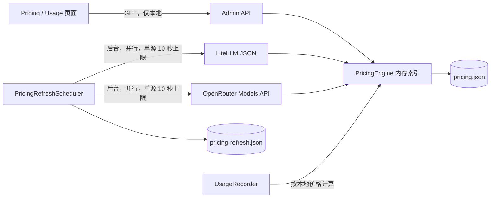

# 模块：模型价格与成本估算

## 职责与边界

价格模块负责维护按 `(providerId, modelId)` 索引的每百万 Token 美元价格、计算请求成本、保护用户手工价格，并向管理 API 和 Pricing 页面提供本地价格表。

它不负责：

- 供应商账单对账；计算结果是根据响应 Token 用量与本地价格表得到的估算值。
- OpenRouter 的按请求、图片、联网搜索或内部推理等非普通输入/输出 Token 费用。
- 把 OpenRouter 的聚合路由价格解释成 Anthropic、OpenAI 等厂商直连官方价格。
- 在请求热路径同步访问远程价格源。

## 设计原则

- 页面和请求热路径只读取内存或本地持久缓存，远程目录刷新不得阻塞服务启动或页面首屏。
- 远程更新应在后台执行，使用有限超时、请求合并、来源隔离和失败后保留旧缓存。
- 自动价格源必须保留来源身份和优先级，不能覆盖用户手工维护的价格。
- 新模型缺价时明确标记为 `unpriced`，不得借用旧模型或相似名称的价格进行猜测。
- 聚合路由价格与厂商直连价格必须使用不同的供应商键，避免混淆实际计费主体。

## Omnicross 当前设计



### 启动与缓存

- `JsonPricingStore` 将规范化价格行持久化在配置文件同目录的 `pricing.json`；页面打开和请求成本计算只读取该本地表/内存索引。
- `PricingRefreshScheduler.start()` 立即发起不等待的后台检查，并使用 `unref()` 的一小时间隔定时器继续检查。
- `pricing-refresh.json` 持久化 `lastAttemptAt`、`lastSuccessAt`、错误和各来源结果。成功时间不足 24 小时时，重启后的 scheduler 不重复下载。
- 单源部分成功会保留并应用健康来源的数据，但不推进完整成功时间；失败来源在下一次每小时检查时重试。即使 HTTP 与 JSON 结构合法，只要解析后没有任何可用价格行，也按来源失败处理，避免空目录错误地占用 24 小时成功 TTL。
- 远程刷新失败不会删除或清空 `pricing.json`；离线时继续使用最后成功的持久价格表。
- 手工“Fetch latest”和后台任务通过 `PricingEngine.refreshInFlight` 合并，同一进程最多同时向每个来源发出一个请求。

这形成 stale-while-revalidate：本地数据立即可用，网络只更新下一版缓存，不进入页面首屏或模型请求的关键路径。

### 来源与优先级

| 优先级 | 来源 | 写入范围 | 覆盖规则 |
|---|---|---|---|
| 1 | `user` | 任意 `(providerId, modelId)` | 永不被自动刷新覆盖；LiteLLM 变化进入冲突确认 |
| 2 | `litellm` | LiteLLM 声明的供应商/模型 | 主要自动价格源，可更新非用户行 |
| 3 | `openrouter` | 仅 `providerId=openrouter`，模型 ID 保留 `author/slug` | 只新增或更新 `openrouter`/`builtin` 行，不覆盖 LiteLLM 或用户行 |
| 4 | `builtin` | 宿主将来可随包提供的回退行 | 可被任一自动源更新；当前 daemon 不主动种子化 |

OpenRouter 是补充源而不是唯一依赖，理由如下：

- OpenRouter `/api/v1/models` 很适合发现已上架的新聚合模型，字段 `pricing.prompt`、`completion`、`input_cache_read`、`input_cache_write` 均为每 Token 美元字符串，模块统一乘以 `1_000_000`。
- OpenRouter 文档将模型价格描述为通过其路由使用该模型的价格结构，不能据此覆盖厂商直连价格。
- OpenRouter 还有 `request`、`image`、`web_search`、`internal_reasoning` 等计费字段；现有 `PricingEntry` 和 usage telemetry 无法准确归集它们，所以解析器明确不映射这些字段，而不是把单位混入 Token 价格。
- 任一远程源失败时，另一个健康源仍可独立更新；两者都失败时保留本地缓存并返回可诊断错误。

OpenRouter Models API 字段依据其官方文档：<https://openrouter.ai/docs/guides/overview/models>。2026-08-03 对公开端点的只读验证返回 337 个模型，其中包含缓存读写价格字段和刚上架的模型；数量是运行时快照，不作为代码常量。

## 对外接口

### Contracts

- `PricingEntry`：每百万 Token 的输入、输出、缓存读、缓存写价格及来源元数据。
- `PricingSource`：`builtin | litellm | openrouter | user`。
- `PricingFetchResult`：合并后的 applied/conflicts，并包含每个远程源的独立结果。
- `DEFAULT_LITELLM_PRICING_URL`、`DEFAULT_OPENROUTER_PRICING_URL`：默认远程目录。

### Core

- `PricingEngine.getAll()`：从内存索引返回完整本地表。
- `PricingEngine.getEntry(providerId, modelId)`：按精确键、通配供应商、模型名依次查找。
- `PricingEngine.calculateCost(...)`：计算输入、输出和缓存 Token 的估算成本。
- `PricingEngine.upsertManual(...)`：写入受保护的用户价格。
- `PricingEngine.fetchLatestFromSource()`：并行刷新两个来源、合并并持久化，支持并发合并和部分成功。
- `PricingEngine.resolveConflicts(...)`：应用 LiteLLM 与用户行之间的逐行覆盖/跳过决策。

### Daemon 与管理 API

- `GET /admin/api/pricing`：只返回本地表，不发起阻塞式网络请求。
- `PUT /admin/api/pricing`、`DELETE /admin/api/pricing`：手工维护。
- `POST /admin/api/pricing/fetch-latest`：显式等待一次刷新，响应包含 `sources[]` 的逐来源状态。
- `POST /admin/api/pricing/resolve-conflicts`：无服务端临时会话的冲突决策。
- `PricingRefreshScheduler`：resident daemon 启动时负责后台刷新；短生命周期的 `launch` 不启动它。

## 内部核心逻辑

成本公式为：

```text
costUsd = (
  inputTokens × inputPricePer1m +
  outputTokens × outputPricePer1m +
  cacheReadTokens × (cacheReadPricePer1m ?? inputPricePer1m) +
  cacheCreationTokens × (cacheWritePricePer1m ?? inputPricePer1m)
) / 1_000_000
```

缓存节省只在明确存在且低于输入价格的缓存读价格时计算；缺价模型成本为 0，并由 usage DTO 的 `unpriced` 标志交给 UI 标识。

LiteLLM 解析器映射 `vertex_ai/google → gemini`、`bedrock → anthropic`、`azure → openai`。OpenRouter 解析器不去掉 `author/` 前缀，避免聚合路由价格与直连模型键碰撞。

## 依赖关系

- `@omnicross/contracts/pricing-types`：跨包价格 DTO 和默认源 URL。
- `@omnicross/core`：价格引擎、成本公式和 `PricingStore` 端口。
- `@omnicross/daemon`：JSON 持久化、后台 scheduler 和管理 API。
- `@omnicross/ui`：本地表管理、冲突交互和来源展示。
- 外部运行时仅使用标准 `fetch`；没有新增 npm 依赖。

## 使用示例

```ts
const engine = new PricingEngine(store, logger);

// 热路径只查本地缓存。
const estimate = await engine.calculateCost('openrouter', 'anthropic/claude-opus-5-fast', {
  inputTokens: 1_000,
  outputTokens: 500,
  cacheReadTokens: 2_000,
  cacheCreationTokens: 0,
  reasoningTokens: 0,
});

// resident daemon 在后台执行；调用者不等待网络。
pricingRefreshScheduler.start();
```

## 已知限制与注意事项

- 新安装且从未成功联网时没有内置完整价格快照，模型会保持 `unpriced`；这是比猜测价格更安全的离线降级。后续可在发布流程增加经审计的小型 builtin 种子表。
- `pricing.json` 的批量更新会同步重写完整 JSON 文件；当前规模为数百到数千行，若目录显著扩大可迁移到 SQLite 或原子分片。
- OpenRouter 模型价格代表其聚合路由，不等于某个具体上游 endpoint 的报价；按 endpoint 精确核算需要扩展主键和 usage attribution。
- 手工显式刷新仍会等待网络，但两个来源并行且分别限制为 10 秒；页面普通 GET 和 daemon 启动不等待。
- UI 当前不会展示 OpenRouter 未映射的固定请求/图片/搜索费用，因此相关模型的估算可能低于最终账单；不能把 `request` 等不同单位字段强行换算为 Token 价。
