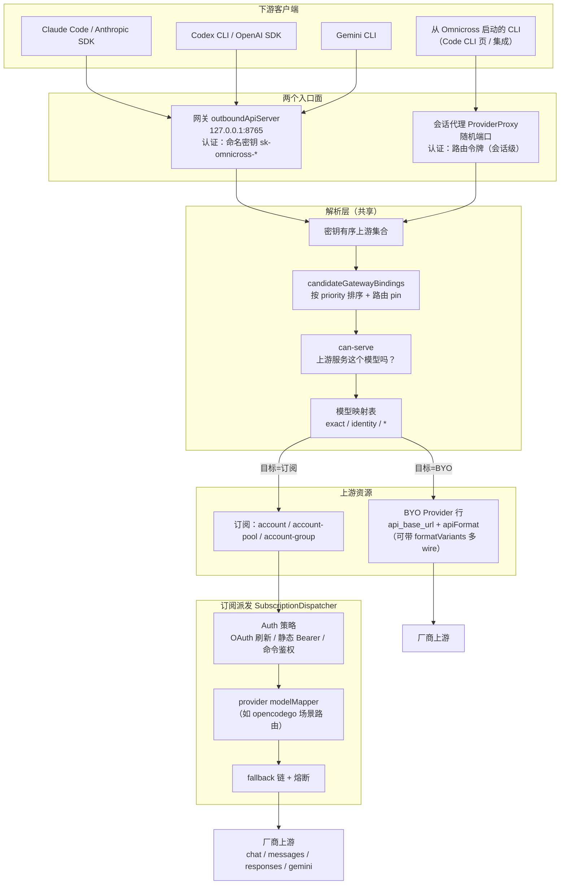
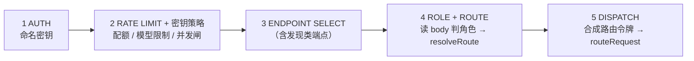
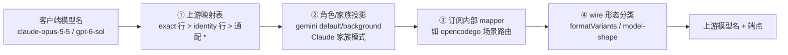
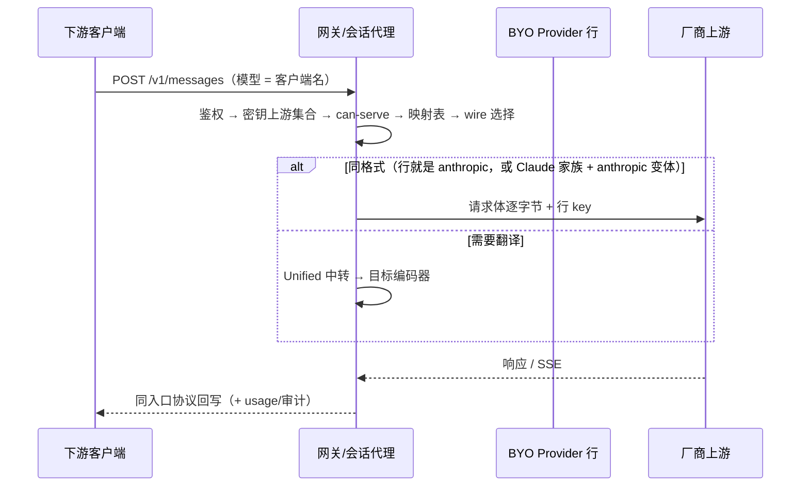
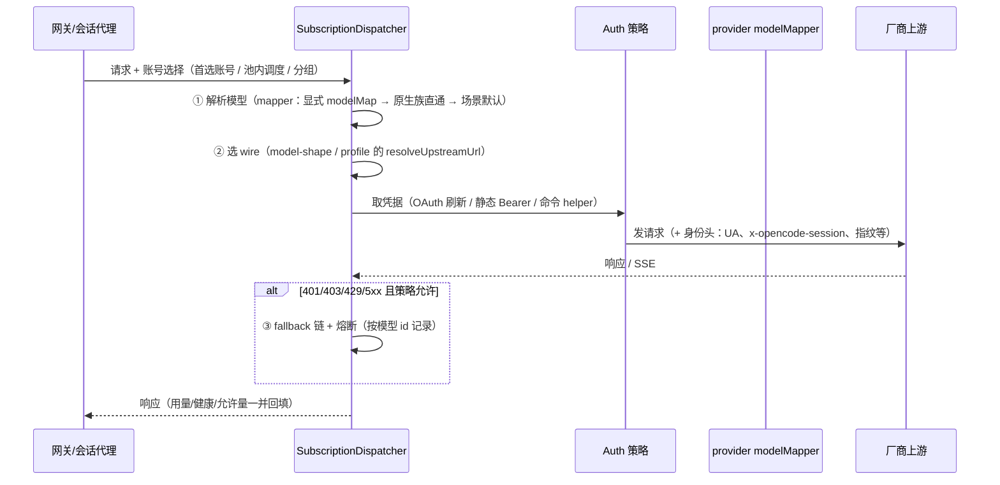
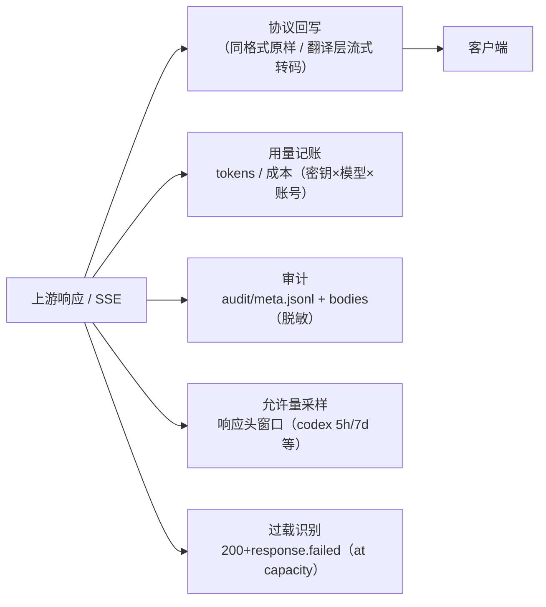

# 请求路径全景（下游客户端 ↔ 上游资源）

> 状态：2026-09-30 快照。事实来源为代码（`packages/core/src/outbound-api`、
> `packages/core/src/provider-proxy`、`packages/subscriptions`、
> `packages/daemon/src/admin`）。与 `docs/design/upstream-routing-model.md`
> （路由模型权威设计）配套阅读：本文描述**请求实际怎么流**，该文描述**为什么这样设计**。
>
> 术语：**下游** = 调用 Omnicross 的客户端（Claude Code / Codex CLI / 任意 SDK）；
> **上游** = Omnicross 转发到的真实服务（BYO Provider 行、订阅账号/分组/池）。

---

## 0. 一句话模型

一次请求要回答四个问题，各由**一个**组件回答，顺序固定：

| # | 问题 | 回答者 | 位置 |
| --- | --- | --- | --- |
| 1 | 你是谁、能不能进 | 密钥鉴权 | 网关：命名密钥；会话代理：路由令牌 |
| 2 | 这次用哪个上游 | 密钥的有序上游集合（顺序=优先级，can-serve 失败让位下一位） | 密钥行 `upstreamBinding` |
| 3 | 模型名怎么翻译 | 该上游的映射表（+ 该上游类型的内在规则） | `server.upstreamModelMappings[<上游键>]` |
| 4 | 协议怎么变 | 自动：入口端点 × 目标 wire | `formatVariants` / transformer 链 |

---

## 1. 总览图

**关键分层事实**：网关与会话代理**不是两套逻辑**。网关完成鉴权/限额后，会合成一个会话内路由令牌并把请求交给**同一个** `routeRequest`（`outboundApiRouter.ts` 第 5 阶段），因此解析、映射、转换、订阅派发只有一份实现。两者的差异仅在"令牌从哪来、生命周期多长"。

---

## 2. 入口面 A：网关（`outboundApiServer`，默认 127.0.0.1:8765）

固定流水线（`handleOutboundRequest`，顺序即代码顺序）：

### 2.1 第 1–2 阶段：鉴权与节流

- 认证 = 命名密钥（`sk-omnicross-*`）。**客户端密钥一律持有全部端点权限**——访问哪个端点由 URL 决定，不由密钥决定（`effectivePermissionsForRow`；`integration` 内部托管键保留持久化范围）。
- 逐密钥可选：请求速率窗口、配额（USD）、模型限制、并发上限（超限 429）。
- 允许量（allowance）：订阅账号的 5h/周/月窗口达到阈值时**降级或暂停**该账号参与调度（`AccountAllowanceScheduling`）；被暂停的账号在候选解析阶段就被排除。

### 2.2 第 3 阶段：发现类端点（不进入路由）

| 路径 | 用途 | 关键行为 |
| --- | --- | --- |
| `GET /v1/models` | 模型发现 | Anthropic/OpenAI 两种信封（`anthropic.modelsShape` 或按密钥自动）；列出该密钥**可见**的名字 |
| `GET /v1/codex-model-catalog` | Codex 原生目录 | 托管 Codex 集成的 `model_catalog_url` 指向它；`modelNaming.realNames` 开时给**真实上游模型**，关时给 `{models:[]}`（与内置目录合并即无操作） |
| `GET /api/oauth/usage` | Claude 用量代理 | 纯缓存读（`anthropic.proxyOauthUsage`），绝不触发上游调用 |

`realNames` 模式（`modelNaming`）下，`/v1/models` 与 Codex 目录**只列按名可路由的 id**（passthrough 目录、通配映射的目标目录、通配目标自身；exact 映射的目标不列——客户端直呼其名路由不通）。

### 2.3 第 4–5 阶段：解析与派发

1. 读请求体判**角色**（用户消息 / 后台任务；后台角色走 Gemini 角色键或 haiku 档）。
2. `resolveRoute` 用 `candidateGatewayBindings`（密钥可见、端点匹配、按 priority 排序、`x-omnicross-binding-id` 可锁单条路由）逐条尝试 **can-serve**，失败且 `fallback:'next'` 则让位下一位；全部失败时若有 legacy 直连上游则走直连中继。
3. 命中的路由给出**上游模型名**（见 §4）与目标类型，然后合成路由令牌、转发进共享 `routeRequest`。

---

## 3. 入口面 B：会话代理（`ProviderProxy`）

从应用内启动的 CLI（Code CLI 页、集成启动、key-scoped 启动）拿到的是**随机会话端口 + 路由令牌**，不是命名密钥。

- 令牌由 `addRoute(RouteContext)` 铸出，进程内有效；CLI 的 `ANTHROPIC_BASE_URL` / `OPENAI_BASE_URL` 等指向该会话端口。
- 路由上下文携带：上游类型（provider/account/account-pool/account-group）、模型或映射、认证模式（`byo` 复用 provider 行的 key；`subscription` 走订阅授权与刷新）。
- **key-scoped 启动**（`--key-id`）不是会话令牌：它把命名密钥的路由动态装进 CLI 的 config/env，语义与网关一致。
- 请求进入会话代理后，除鉴权外**完全复用** §4–§6 的解析/映射/转换链路。

---

## 4. 模型名要经过的四层（最容易误解的部分）

客户端发出的名字**不是**上游最终看到的名字。四层依次作用：

### ① 上游映射表（`server.upstreamModelMappings[<上游键>]`）

- 键 = `providerId`（BYO）或 `sub:<providerId>`（订阅）。
- 行 = `{ source, target, effort? }`；`source` 支持 exact 与 `*`（**exact 恒优先于通配**）。
- **identity 行**：上游"声明"的模型（BYO = 启用的 `modelConfigs` ∪ `models` 减去被禁用的；订阅 = 目录）会自动派生 `模型 → 同名` 行——**声明过的模型 verbatim 直发**，只有未声明的名字落到 `*` 行。这解释了"我配了 `* → X` 为什么没生效"：目标模型在声明集合内，identity 行赢了。
- **禁用模型**：UI 关闭模型写的是 `modelConfigs[].enabled=false`；派生的声明集合**会排除它**（`declaredUpstreamModels`），于是请求回落到 `*` 行。
- 显式空表 `[]` = 透传（不派生 identity 行）；`upstreamModelMappingForce` 可按上游强制只用存储行。

### ② 角色/家族投影

- Gemini 端点：映射表的 `default` / `background` 两个**角色键**投影为角色模型（不参与名字匹配）。
- Claude 订阅：家族模式匹配（`claude-opus-*` 等），版本漂移免疫。

### ③ 订阅内部 mapper（各订阅类型自己的规则）

- opencodego（`SubscriptionProviderRegistry.modelMapper`）：先看账号显式 `modelMap`；再看**原生模型族直通**（`glm-* / kimi-* / minimax-* / mimo-* / qwen* / deepseek-*` 原样发送）；否则按 `ScenarioRouter` 关键词选场景（`complex`/`think`/`long_context`/`fast`/`default`）取默认模型。场景模型的 `status:"rate-limited"`/弃用由上游决定成败。
- copilot：按模型决定 wire（Claude 系 → messages、Gemini 系 → generateContent、其余 → chat）。
- 其他订阅：各自目录 + 家族规则。

### ④ wire 形态分类（决定"发到哪个端点"，见 §5）

---

## 5. wire（端点形态）选择

同一上游可能只接受固定形态的请求。两种机制：

1. **`formatVariants`（BYO 多 wire 行）**：行声明 `{ anthropic, openai-response }` 的**基址**，主格式是 chat。
   - **按解析后的模型选**：Claude 家族（`claude-*` / `anthropic/…`）→ anthropic 变体，**逐字节 verbatim**；其它模型（通常是映射的产物，如 `deepseek/…`）→ **主 wire**，走统一中转翻译。
   - 依据：多 wire 厂商（commandcode 等）只在对应端点接受对应家族模型。
2. **订阅 wire 分类器**（`model-shape.ts`）：opencodego 的 GO/zen 半区按模型前缀选 `chat` / `anthropic` / `responses` / `gemini` 四端点之一。

路径拼接：目标根若以版本段结尾（`/v1`），入站路径的**所有**前导版本段都会被剥掉——客户端 base 带 `/v1` 造成的 `/v1/v1/messages` 折叠为单一 `/v1/messages`。

---

## 6. 变换矩阵（入口协议 × 目标协议）

| 入口 \ 目标 | anthropic | chat | responses | gemini |
| --- | --- | --- | --- | --- |
| **messages** | **verbatim**（同格式快路径，保留 server-tool 字段） | 翻译（统一中转） | 翻译 | 翻译 |
| **chat** | 翻译 | verbatim | 翻译 | 翻译 |
| **responses** | 翻译 | 翻译 | verbatim | 翻译 |
| **gemini** | 翻译 | 翻译 | 翻译 | verbatim |

- **同格式快路径**：目标形态 == 入口形态时，不经过统一中转，请求体逐字节转发、只换鉴权；响应原样回传。
- **统一中转**：其余组合经 Unified 中间表示 + transformer 链（`anthropic` / `openai` / `openai-response` / `gemini` 编码器）。
- 已知缺口：chat 入口 → 部分非 Claude 订阅组合未全部打通（随订阅桥扩展补齐）。

---

## 7. 上游执行：两类目标

### 7.1 BYO Provider 行

### 7.2 订阅（account / pool / group）

订阅目标**永远经内部 `SubscriptionDispatcher` 中转**（与路由无关，D4）：

订阅特有的横切关注点：账号健康与 401 标记、429/529 故障转移、按模型的熔断、允许量窗口（会被请求头顺带刷新）、指纹/身份头注入。

---

## 8. 回程与可观测

- 用量：`usage/` 按天分片 + 永久 rollup；密钥维度终身累计。
- 审计：`audit/audit-<日期>/meta.jsonl`（含 `model`/`provider`/状态/密钥/会话键）+ 分段脱敏的 bodies。**model 记的是解析后的上游模型名**。
- 允许量：订阅账号的窗口百分比由各 provider 的 collector 轮询（或响应头顺带刷新）；窗口到达阈值 → 调度降级/暂停。
- 过载：Codex 的 `at capacity` 是 **200 内的 SSE `response.failed`**，不是状态码；只标注不重试（账号无关）。

---

## 9. 特殊路径与遗留

| 路径 | 语义 |
| --- | --- |
| **直连 tier**（未迁移密钥的 legacy 行为） | 密钥携带 legacy `boundUpstream` 时逐字节中继到该 provider；Anthropic-Messages 请求会按 `formatVariants` 选变体目标 |
| **路由 pin** `x-omnicross-binding-id` | 把候选集合收敛为单条路由（调试/复现） |
| **图像**（`/v1/images/*`、hosted image generation） | 独立策略段 `images`；能力基于新鲜证据；运行时解析只信 `apiKeyId` |
| **搜索** | 两种前端：`native`（逐字节中继，上游自己执行）与 `managed`（本地执行 + 自己合成输出）；Codex 原生搜索走专门路由 |
| **voucher / `POST /redeem`** | 自助兑换密钥（独立段，默认关） |
| **Codex 集成配置** | 托管 `[model_providers.omnicross]` 块 + `model_catalog_url`；外部 `model_catalog_json` 在安装时被注释掉（卸载还原） |

---

## 10. 排查速查

| 现象 | 先看 |
| --- | --- |
| 用了非预期的模型 | 上游映射表的 **identity 行**是否命中（模型在声明集合内）；再看该订阅的内部 mapper |
| `must be called via ...` 类 400 | wire 选择：解析后的模型家族 vs 目标端点；路径是否出现 `v1/v1` |
| 配额充足却 429 | 上游**细分窗口**（如 opencodego 的 monthly）——账号页额度条；`audit` 响应体的错误码 |
| 客户端看不到想要的模型名 | `modelNaming.realNames` 开关；`/v1/models`/Codex 目录只列按名可路由的 id |
| 请求打到哪条路由 | 审计的 `provider`/`model`/`sessionKey` + `x-omnicross-binding-id` pin 复现 |
