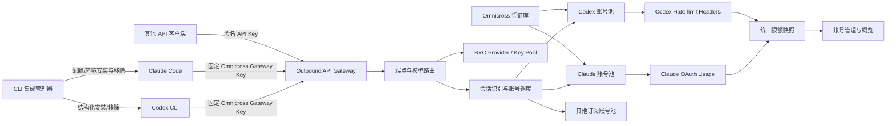

# Omnicross 账号、CLI 接入与控制台信息架构调整计划

> 状态：P0–P5 主体已实施并通过全仓验证（2026-08-04）
> 范围：订阅账号、Codex / Claude Code 接入、上游限额、API Gateway、控制台导航与页面重组
> 本文同时记录目标方案、当前落地范围与后续阶段。

---

## 1. 结论先行

建议进行一次**以账号管理和本地网关为中心的信息架构调整**。

本轮改造的核心不是“换一套 UI”，而是先修正三个产品模型：

1. **客户端不再登录上游账号。** Codex / Claude Code 只连接 Omnicross 的本地 API Gateway，持有一个受限的 Omnicross 接入密钥；上游 OAuth、刷新、账号选择和故障切换全部留在 Omnicross。
2. **账号页从“创建账号”改成“管理账号”。** 新建/导入变成按钮触发的向导或弹窗，一级页面用于搜索、筛选、比较限额、控制调度、诊断和批量管理。
3. **运行状态、访问控制、路由和低频设置分开。** 当前 API Service 页面同时承担服务状态、密钥、队列、代理、Webhook、审计、计费、指纹、兑换码和端点路由，职责过多；需要拆成 Gateway 的日常操作页与 Settings 的低频配置标签页。

优先级上，必须先修复 Codex Responses 的会话粘性和移除原生凭证回写，再做限额与 UI。否则新的账号页只是把现有正确性问题展示得更漂亮。

---

## 2. 已核实的现状

### 2.1 Omnicross 已有的能力

账号底层并非从零开始，已有能力包括：

- Claude、Codex、Gemini、OpenCodeGo 多账号存储与 OAuth / 手动录入；
- 账号优先级、LRU 选择、1 小时会话亲和；
- 429 / 529 冷却、临时不可用、永久阻断与后台健康探测；
- 端点绑定指定账号，账号不可调度时回退账号池；
- 账号级代理、支持模型白名单或模型映射、客户端指纹状态；
- 刷新、重命名、删除、设置活动账号与最后使用时间；
- 对外 `/v1/messages`、`/v1/responses` 等端点，以及强制命名 API Key 鉴权。

主要依据：

- 调度器：`packages/subscriptions/src/scheduler/SubscriptionAccountSelector.ts`
- 账号健康：`packages/core/src/pipeline/SubscriptionAccountHealth.ts`
- 端点账号绑定：`packages/core/src/outbound-api/types.ts`、`routeResolver.ts`
- 账号管理 API：`packages/daemon/src/admin/accountsWrite.ts`、`adminApi.ts`
- 脱敏账号 DTO：`packages/contracts/src/account-tokens-types.ts`
- 当前账号 UI：`packages/ui/src/features/accounts/AccountList.tsx`

因此本轮不应重写账号池，而应补齐缺失语义、协议一致性、限额采集和管理界面。

### 2.2 必须先修的 Codex 会话粘性缺口

`/v1/messages` 会从 system 与首条 user 消息生成稳定会话键，并传入账号选择器：

- `packages/core/src/provider-proxy/matchText.ts`
- `packages/core/src/provider-proxy/ingress/anthropicSubscriptionPlan.ts`

但 `/v1/responses` 当前调用 `auth.applyHeaders()` 时只传递模型和优先账号，没有 `sessionKey`：

- `packages/core/src/provider-proxy/ingress/openaiResponsesIngress.ts`

这意味着多 Codex 账号时，无会话键的请求会按优先级 + LRU 重新选择，连续对话可能跨账号。Codex 客户端会发送 `session-id`、`thread-id` 请求头，并在 body 中发送 `prompt_cache_key = session_id`；Omnicross 需要按以下兼容字段识别会话：

1. `session-id` / `session_id` 请求头；
2. `x-session-id` 请求头；
3. body 的 `session_id`；
4. body 的 `conversation_id`；
5. body 的 `prompt_cache_key`。

Omnicross 需要实现同类提取，并增加无显式 ID 时的稳定内容指纹回退。若仍无法识别，会话正确性应优先于负载均衡：同一接入键临时固定到一个账号，而不是每次请求轮换。

### 2.3 当前原生凭证同步为何应退出主流程

当前 `external-cli-store.ts` 会在用户“导入现有 CLI 登录”后创建 `.omnicross-managed` 标记，并在刷新令牌轮换后回写：

- `~/.codex/auth.json`
- `~/.claude/.credentials.json`

它已有标记校验、原文件备份、合并写入和原子替换等保护，但根本问题仍存在：**Omnicross 与原生 CLI 共享的是同一组会轮换的 OAuth 凭证**。如果不回写，Omnicross 刷新后可能使原生 CLI 的刷新令牌失效；如果回写，又会改变正在运行的 CLI 所依赖的账号状态。

所以应取消“共享原生 OAuth 凭证”这条产品路径，而不是继续加强同步：

- Omnicross 使用自己的 OAuth 登录和凭证库；
- 原生 CLI 只使用 Omnicross Gateway Key；
- 不再常规读取、接管或回写原生 OAuth 文件；
- 旧的导入能力降级为有明确风险提示的一次性迁移工具，最终移除。

### 2.4 当前 UI 的结构性问题

当前导航是无分组的 7 个平级入口：Providers、API Service、Accounts、Code CLI、Usage、Pricing、Settings（`App.tsx` + `NavRail.tsx`）。其中：

- Accounts 按 provider 渲染多张卡片，每张卡片底部始终展示创建方式与授权按钮；创建流程占据一级视线；
- 已有的优先级、代理、模型支持等管理能力藏在逐行展开区里，缺少全局搜索、筛选、排序、分组和批量动作；
- API Service 单页顺序铺开服务状态、队列、密钥、请求队列、代理、Webhook、审计、计费、指纹、兑换码和路由；
- Settings 只有语言、开机启动、最小化和托盘行为；
- Usage 展示的是 Omnicross 本地请求量、Token 和成本，不是上游订阅账号限额；
- Pricing 作为单独一级页面，使用频率与导航权重不匹配；
- Data Migration 被放在 Provider 管理页底部，与 Provider 职责无关。

用户感受到的“乱”和“不直观”主要来自职责混放与操作频率未分层，并不只是样式问题。

---

## 3. 产品与信息架构取舍

### 3.1 采用的原则

- 账号管理页以工具栏和账号列表为主体，新建账号只占一个按钮；
- 平台、分组、状态、关键词筛选，以及列表/移动卡片响应式布局；
- 在账号行直接比较健康状态、用量窗口和重置时间；
- 测试账号、查看错误历史、刷新限额、批量操作等管理动作；
- 低频系统配置收进 Settings 的二级标签；
- 客户端使用固定 relay API Key，服务器在请求时选择上游账号；
- Codex 从响应头捕获主/次限额窗口；Claude 主动查询 OAuth usage 接口。

### 3.2 明确不采用

- 不使用承载全部功能的超大页面组件；Omnicross 按 feature、hook、adapter 和小组件拆分；
- 不把品牌设置、用户管理等运营后台能力搬进本地桌面应用；
- 不把所有低频功能强行塞进 Settings。服务启停、端点 URL、访问键、路由和实时流量仍是 Gateway 的日常操作；
- 不把“账号订阅限额”与“本地 API Key 花费额度”混为一个概念；
- 不依赖硬编码“主窗口就是 5 小时、次窗口就是一周”，应保存上游返回的窗口时长并据此显示。

结论：采用以管理任务为中心的信息层级，同时保持组件边界清晰，并严格控制本地桌面应用的功能范围。

---

## 4. 目标系统边界



关键边界：

- CLI 永远拿不到上游 access token、refresh token、ChatGPT account id；
- Gateway Key 只鉴权本地/局域网 Omnicross 服务，不代表某个上游账号；
- 切换活动账号、账号池重排或刷新 OAuth，不要求客户端 `/logout` / `/login`；
- 同一会话由服务器保持账号亲和；客户端账号状态不参与调度；
- API 客户端默认没有“上游账号检测”，但仍有 Omnicross Gateway Key 鉴权、权限与限流。

---

## 5. CLI 一键接入方案

### 5.1 Codex：依次写入 TOML 与 API Key 凭证

Codex 的持久接入必须使用其标准 API Key 认证链路。安装时先更新
`config.toml`，再写入同一 Codex home 下的 `auth.json`：

```toml
model_provider = "omnicross"
preferred_auth_method = "apikey"
disable_response_storage = true

[model_providers.omnicross]
name = "Omnicross Local Gateway"
base_url = "http://127.0.0.1:8765/v1"
wire_api = "responses"
requires_openai_auth = true
supports_websockets = false
```

```json
{
  "auth_mode": "apikey",
  "OPENAI_API_KEY": "<omnicross-gateway-key>"
}
```

该值只能是 Omnicross 本地 Gateway Key，绝不能是上游 OAuth 或 API
凭证。adapter 在安装前加密保存两份文件的原始内容与哈希；状态检查、修复、
密钥轮换和移除同时覆盖两份文件。任何一份发生用户修改时都报告配置漂移，
不得静默覆盖。

### 5.2 不能使用简单字符串追加

“一键启用/移除”必须是配置事务：

1. 检测 Codex home、当前 TOML 与 `auth.json`；
2. 解析 TOML，并展示两份文件中将修改的逻辑键；
3. 加密保存原值与文件哈希到 Omnicross 自己的 integration state；
4. 使用保留注释与未知键的结构化编辑器修改 TOML；
5. 先原子替换 TOML，再原子替换 `auth.json`；任一步失败都回滚两份文件；
6. 重新解析并执行 `codex` 配置自检；
7. 卸载时仅恢复 Omnicross 曾接管且未被用户再次修改的键；遇到冲突先显示 diff，不静默覆盖。

需要支持：

- `预览变更`
- `一键启用`
- `重新修复`
- `恢复原配置`
- `复制手动配置`
- 状态：未安装 / 已启用 / 配置漂移 / 服务不可达 / 密钥缺失

### 5.3 Claude Code

Claude Code 使用独立 adapter，管理 `ANTHROPIC_BASE_URL` 与 `ANTHROPIC_AUTH_TOKEN`，不触碰 `.claude/.credentials.json`。优先顺序：

1. 使用 Claude Code 支持的用户配置 `env` 区域进行可逆结构化更新；
2. 不能可靠更新时，提供系统用户环境变量模式；
3. 保留 Omnicross 内置启动器的进程级注入作为“临时运行”，但它不再是唯一方式。

Claude 与 Codex 在 UI 上使用同一套安装状态、预览、修复、移除交互，但由各自 adapter 生成配置。

### 5.4 Gateway Key 设计

不要直接复用面向外部用户分发的普通 API Key。增加 `integration` 类型的命名 Key：

- 用途固定为本机 CLI 集成；
- 默认只允许 loopback 来源；
- 可限制到 `/v1/messages` 或 `/v1/responses`；
- 不绑定上游账号；
- 支持轮换、撤销和最后使用时间；
- Gateway Key 以 Codex 要求的格式写入 `auth.json`，原始用户凭证快照只以加密形式保存在 integration state；
- LAN 模式切换时重新检查本地集成配置并警告。

现有 `OutboundApiServer` 已具备命名 Key 强制鉴权，可在其上增加 Key 类型与 scope，无需新建第二套 API 服务。

---

## 6. 会话与账号调度修复

### 6.1 统一会话标识

新增协议无关的 `deriveGatewaySessionKey()`，返回来源与散列后的键：

```ts
type SessionKeySource =
  | 'session-header'
  | 'body-session-id'
  | 'prompt-cache-key'
  | 'content-fingerprint'
  | 'api-key-fallback';

type DerivedSessionKey = {
  key: string;
  source: SessionKeySource;
};
```

Codex Responses 提取顺序：

1. `session-id` / `session_id` / `x-session-id` 请求头；
2. `session_id` / `conversation_id` / `prompt_cache_key` body 字段；
3. Responses `input` 中稳定的 developer/system + 首条 user 内容指纹；
4. 无锚点时使用 `apiKeyId + endpoint` 的保守亲和键。

Claude Messages 保留现有内容指纹，同时优先采用显式 session 元数据。任何原始会话 ID 都只在内存中散列使用，不进入日志、审计或管理 API。

### 6.2 调度语义拆分

账号目前的 `status`、`health`、`isActive` 容易被 UI 理解成同一个概念。目标模型应明确区分：

- `credentialStatus`：凭证是否存在、是否过期、能否刷新；
- `healthStatus`：健康、限流、过载、临时错误、阻断；
- `enabled`：用户是否允许调度；
- `schedulable`：由 enabled + credential + health + model support 推导；
- `defaultAccount`：仅用于单账号/无池回退和兼容旧数据，不代表每次请求都会使用；
- `priority`：池内优先级；
- `poolIds` / tags：账号分组与路由选择范围。

UI 不再把“活动账号”展示成一个会误导用户的总开关，建议改名为“默认回退账号”，并在迁移完成后评估是否彻底移除顶层活动镜像。

### 6.3 会话切换与故障切换

- 正常请求：同一会话在 TTL 内固定账号；
- 账号 401 且可刷新：刷新原账号并重试，不重新选账号；
- 账号被明确阻断或无凭证：驱逐亲和，选择新账号并记录诊断事件；
- 429 / 529：是否允许同一会话故障转移做成 provider 策略，默认允许但记录“会话换号”；
- 用户手动禁用账号：驱逐该账号全部亲和映射；
- 端点绑定账号：绑定优先；不可调度时按配置决定“回退账号池”或“直接失败”，不能隐式固定为一种行为。

---

## 7. 账号限额设计

### 7.1 限额不是本地 Usage

需要保留三类不同数据，UI 不混用：

| 数据 | 含义 | 主要位置 |
|---|---|---|
| Account Allowance | 上游订阅账号 5 小时/周窗口 | Accounts、Overview |
| Request Usage | Omnicross 记录的请求数与 Token | Usage |
| Spend / Pricing | 按价格表估算的成本和本地 Key 预算 | Usage → Costs / Settings → Billing |

### 7.2 统一 DTO

建议在 contracts 增加：

```ts
type AllowanceWindow = {
  id: string;
  label: string;
  scope: 'all' | 'model-family';
  modelFamily?: string;
  usedPercent: number | null;
  windowMinutes?: number;
  resetsAt?: string;
  remainingSeconds?: number;
  state: 'fresh' | 'stale' | 'unavailable' | 'unsupported';
};

type AccountAllowanceSnapshot = {
  providerId: SubscriptionProviderId;
  accountId: string;
  source: 'oauth-usage-api' | 'response-headers';
  observedAt: string;
  expiresAt?: string;
  windows: AllowanceWindow[];
  lastErrorCode?: string;
};
```

DTO 只包含比例、窗口和状态，不包含任何响应头原值、Token 或账号敏感字段。

### 7.3 Claude Code 账号

使用账号自己的 Bearer Token 请求 Anthropic OAuth usage 接口，并解析：

- `five_hour`
- `seven_day`
- `seven_day_sonnet`（UI 名称必须按真实模型范围显示，不沿用容易误导的 “Opus” 命名）

实现约束：

- 5 分钟缓存，账号维度请求合并；
- 页面载入先返回缓存，用户可手动刷新；
- 多账号用 `allSettled`，单账号错误不影响整页；
- setup-token 或不支持的认证方式显示“不支持”，不是 0%；
- 401 先走原账号刷新互斥，再重试一次；
- 查询请求遵守账号级代理与客户端指纹策略；
- 不把 usage 查询计入业务请求用量。

### 7.4 Codex 账号

从真实上游响应捕获并规范化：

- `x-codex-primary-used-percent`
- `x-codex-primary-reset-after-seconds`
- `x-codex-primary-window-minutes`
- `x-codex-secondary-used-percent`
- `x-codex-secondary-reset-after-seconds`
- `x-codex-secondary-window-minutes`
- `x-codex-primary-over-secondary-limit-percent`

Codex 限额通常可显示为主窗口（常见为 5 小时）和次窗口（常见为一周），但标签必须优先使用 `window-minutes` 推导，避免协议变化后仍硬编码。

Codex 没有稳定、免费的主动 usage 查询时，不为“刷新限额”伪造一次模型请求：

- 有快照：显示进度和观测时间；
- 从未请求过：显示“完成一次请求后可见”；
- 快照过旧：显示旧数据和 stale 标记；
- 响应缺少限额头：保留上次快照，不覆盖成 0。

### 7.5 限额与调度联动

第一阶段只展示，不自动改变调度，避免数据不完整时误停账号。第二阶段再增加可选策略：

- 某窗口超过阈值后降低优先级；
- 接近 100% 时暂停调度至 reset；
- 所有账号额度不足时明确返回 429/402 风格诊断；
- 每次自动决策必须在账号诊断记录中可解释。

---

## 8. 账号管理能力清单

### 8.1 一级账号页必须提供

- 全局账号总数、可调度数、限流数、过期数、接近额度上限数；
- Provider、分组、健康、凭证、调度状态筛选；
- 按名称、账号标识、标签搜索；
- 按优先级、最近使用、额度、重置时间排序；
- 桌面表格 + 窄屏卡片；
- 行内显示 Provider、名称、调度状态、5 小时/周限额、健康、最近使用；
- 行动作：启用/停用、刷新凭证、刷新限额、测试、编辑、更多；
- 批量启用/停用、调整分组、删除；
- “添加账号”作为右上角主按钮，打开二级向导。

### 8.2 账号详情抽屉/独立页

建议分为：

1. 概览：身份、订阅、凭证有效期、健康、最后使用；
2. 限额：所有窗口、重置时间、采集来源、最后更新时间；
3. 调度：enabled、优先级、分组、支持模型、端点绑定情况；
4. 网络：账号级代理、指纹状态；
5. 诊断：连接测试、最近错误、刷新历史、会话换号事件；
6. 危险操作：重新授权、移除账号。

原始 Token 永不返回前端；手动 Token 编辑只允许覆盖，不允许读取或复制旧值。

### 8.3 创建账号向导

入口保持一个“添加账号”按钮：

1. 选择 Provider；
2. 选择 OAuth / setup-token / 手动方式（按 Provider 能力过滤）；
3. 完成授权；
4. 可选设置名称、分组、优先级、代理；
5. 成功后进入详情页。

不再在每个 Provider 一级卡片底部长期展示授权控件。外部 CLI 凭证导入不再作为普通创建方式。

### 8.4 建议补齐的管理能力

P1 必需：

- 显式启用/停用调度；
- 搜索、筛选、排序；
- 账号限额；
- 账号连接测试；
- 最近错误与刷新结果；
- 分组/池；
- 批量启停和删除。

P2 可选：

- 定时健康测试；
- 限额阈值自动降权/停用；
- 更细的统计区间；
- 导出脱敏诊断包。

---

## 9. 新的信息架构

建议保留左侧主导航，但从“功能组件列表”改成“用户任务列表”。一级导航：

| 一级入口 | 主要职责 | 二级内容 |
|---|---|---|
| Overview | 系统是否可用、是否需要处理 | 服务状态、账号健康、额度告警、近期流量、快速修复 |
| Accounts | 管理订阅账号池 | 列表、详情、分组、新建向导 |
| Providers | 管理 BYO 上游与模型 | Provider 列表、Key Pool、模型测试 |
| Gateway | 管理客户端如何接入与路由 | Status、Access Keys、Routes、Live Traffic |
| Usage | 查看请求与成本 | Requests、Models、API Keys、Costs、Audit |
| Integrations | 安装/移除 CLI 接入 | Codex、Claude Code、其他客户端 |
| Settings | 低频全局配置 | General、Network、Proxy、Notifications、Security、Data、Advanced |

导航仍可用图标 rail，但展开态应显示分组与名称；移动端使用底部/抽屉导航。页面状态建议引入轻量路由，让账号详情、筛选条件和标签可以深链接并在刷新后保留，而不是继续完全依赖 `App.tsx` 的本地 `activePage`。

### 9.1 Overview

新增真正的概览页，而不是让 Usage 兼任 Dashboard：

- Gateway 运行状态、地址、版本；
- 可调度账号 / 异常账号；
- 接近限额和即将过期账号；
- 今日请求、错误率、成本；
- Codex / Claude Code 集成状态；
- 只展示可操作异常，点击进入对应页面。

### 9.2 Gateway

把当前 API Service 拆成 4 个标签：

- **Status**：服务启停、loopback/LAN 状态、端点 URL、复制命令、当前队列；
- **Access Keys**：普通 Key、Integration Key、权限、限流、预算、兑换码（启用时）；
- **Routes**：四类端点的模型映射、订阅/BYO、绑定账号、回退策略；
- **Live Traffic**：实时并发、等待队列、最近错误入口。

### 9.3 Settings

从 API Service 和其他页面迁入低频配置：

- General：语言、开机启动、最小化、托盘；
- Network：监听端口、LAN、管理员访问保护；
- Proxy：全局代理与连通性测试；
- Notifications：Webhook 与通知测试；
- Security：客户端指纹、敏感数据策略；
- Data：审计保存、迁移、导入导出、清理策略；
- Billing：定价表、计费发布与服务倍率；
- Advanced：请求队列高级参数、探测周期等。

定价页不再占一级导航；迁入 Usage → Costs（日常查看）和 Settings → Billing（编辑价格）。Data Migration 从 Provider 页移除。

### 9.4 Integrations

当前 Code CLI 页从“启动会话 + 手动环境变量示例”升级为接入管理页：

- 每个客户端一张状态卡：已检测版本、当前配置、Gateway 连通性；
- 一键启用、预览、修复、移除；
- “临时启动”作为次级动作；
- 显示安全模式/兼容模式；
- 显示配置漂移，而不是假定写文件成功即安装成功；
- 配置完成后执行一个不产生模型费用的认证/health 检查；真实模型端到端测试由用户显式触发。

---

## 10. 模块与 API 调整

### 10.1 Contracts

修改 `packages/contracts`：

- 增加 `AccountAllowanceSnapshot` / `AllowanceWindow`；
- 账号 DTO 增加 `enabled`、推导后的 `schedulable`、分组摘要、allowance；
- 将 credential、health、scheduler 三类状态分开；
- 增加 Integration Status / Plan / Apply Result；
- 所有错误使用稳定 code，UI 自己国际化，不从服务端传拼接后的英文提示。

### 10.2 Core / Subscriptions

- 抽出跨协议 `deriveGatewaySessionKey()`；
- Responses 账号认证传入 `sessionKey`；
- 账号选择结果进入请求上下文，响应捕获可准确归属 accountId；
- 增加 Codex 限额响应头 tap；
- 增加显式 enabled gating 与“绑定失败是否回退”策略；
- 为会话换号、刷新失败和限额采集产生脱敏诊断事件。

### 10.3 Daemon

新增建议模块：

```text
packages/daemon/src/
  allowance/
    AccountAllowanceService.ts
    ClaudeAllowanceCollector.ts
    CodexAllowanceStore.ts
  integrations/
    IntegrationManager.ts
    CodexConfigAdapter.ts
    ClaudeCodeConfigAdapter.ts
    IntegrationSecretStore.ts
  admin/
    accountAllowanceApi.ts
    integrationsApi.ts
```

建议 API：

- `GET /admin/api/accounts?provider=&status=&query=&group=`
- `PATCH /admin/api/accounts/:provider/:id`（label、enabled、priority、group 等）
- `POST /admin/api/accounts/:provider/:id/test`
- `GET /admin/api/accounts/:provider/:id/events`
- `GET /admin/api/accounts/allowances`
- `POST /admin/api/accounts/allowances/refresh`
- `GET /admin/api/integrations`
- `POST /admin/api/integrations/:client/plan`
- `POST /admin/api/integrations/:client/apply`
- `POST /admin/api/integrations/:client/remove`
- `POST /admin/api/integrations/:client/repair`

`plan` 必须只返回脱敏 diff；兼容模式中的明文 Gateway Key 不回传给普通状态接口。

### 10.4 UI

避免再次形成大页面，建议按以下边界拆分：

```text
features/accounts/
  AccountsPage.tsx
  AccountToolbar.tsx
  AccountTable.tsx
  AccountCard.tsx
  AccountDetailsDrawer.tsx
  AddAccountWizard.tsx
  tabs/{Overview,Allowance,Scheduling,Network,Diagnostics}Tab.tsx

features/gateway/
  GatewayPage.tsx
  tabs/{Status,AccessKeys,Routes,LiveTraffic}Tab.tsx

features/integrations/
  IntegrationsPage.tsx
  IntegrationCard.tsx
  ConfigDiffDialog.tsx
```

列表查询、筛选、突变和轮询放入 hooks；daemon adapter 负责 wire DTO；组件不直接拼 URL 或解释后端错误文本。

---

## 11. 迁移路线

### P0：正确性与止损

目标：先消除继续会话跨账号和原生凭证被改写的问题。

- 为 Responses 增加统一会话键并钉住多轮同账号测试；
- 无会话 ID 时采用保守亲和，而不是逐请求 LRU；
- 停止 `resyncExternal()` 写回原生 Codex / Claude 凭证；
- 新建账号入口默认只提供 Omnicross 自有 OAuth / 手动录入；
- 旧 marker 与 backup 只检测和提示，不自动删除或恢复；提供显式迁移向导；
- 增加“任何刷新不得写 `auth.json` / `.credentials.json`”回归测试。

### P1：Gateway Key 与 CLI 集成管理

- 增加受限 Integration Key 与只输出 Token 的跨平台 helper；
- 实现 Codex TOML plan/apply/remove/repair；
- 实现 Claude Code adapter；
- CLI 直连持久 Outbound API Server，不再依赖仅对内置启动会话有效的临时 route token；
- 新 Integrations 页面先落地，旧 Code CLI 保留临时启动入口；
- 验证普通 `codex` / `claude` 启动不再要求切换原生登录。

### P2：限额采集与会话诊断

- Claude 5 小时/7 天/模型专项额度；
- Codex 主/次窗口响应头捕获；
- 缓存、stale、unsupported、错误状态；
- 账号测试与最近诊断事件；
- 暂不启用自动限额调度。

### P3：账号管理页重构

- 新工具栏、表格/卡片、状态摘要；
- 创建向导移入二级 UI；
- 详情抽屉与限额标签；
- enabled、分组、批量操作；
- 旧 Provider 卡片页面删除。

### P4：Gateway 与 Settings 重组

- API Service 拆成 Gateway 标签；
- 低频项迁入 Settings；
- Pricing 与 Data Migration 归位；
- 保留旧页面 ID 的一次性导航映射，避免升级后落到空白页。

### P5：Overview、导航与可选自动化

- 新 Overview；
- 轻量路由与深链接；
- 限额阈值调度、定时测试等 P2 能力按实际需要开启；
- 清理旧 i18n key、旧 adapter 和外部凭证同步代码。

不建议把全部工作合成一个大 PR。P0/P1 可以独立验证产品正确性，P2/P3 提供账号价值，P4/P5 再完成整体体验。

---

## 12. 数据迁移与兼容

### 12.1 账号数据

- 旧账号默认 `enabled = true`；
- 旧 `isActive` 指针映射为 `defaultAccount`；
- `priority`、`supportedModels`、proxy、health 行为原样保留；
- group 缺失时进入 provider 默认组；
- allowance 初始为 unavailable，不伪造 0%；
- schema migration 必须幂等，并能读取上一个版本。

### 12.2 原生凭证同步遗留物

升级时检测：

- `.omnicross-managed`
- `.omnicross-backup`

只在 Integrations / Migration UI 中提示：

- “已停止共享原生凭证”；
- 可查看将恢复的文件 diff；
- 用户显式确认后才从 backup 恢复；
- backup 与当前文件都已被修改时禁止自动覆盖，提供手动说明；
- marker 删除与文件恢复是两个独立动作。

### 12.3 Codex TOML 卸载

integration state 保存安装前相关键值与安装后哈希。卸载规则：

- 文件未漂移：恢复原值并移除 Omnicross provider 表；
- 非相关位置漂移：保留用户修改，仍可自动恢复 Omnicross 键；
- Omnicross 管理的键被用户修改：停止并展示三方 diff；
- 没有备份：只删除能够证明由 Omnicross 创建的字段。

---

## 13. 验收标准

### 13.1 账号与会话

- 两个 Codex 账号同时启用时，同一会话连续 20 个 turn 始终使用同一账号；
- 新会话能按优先级/LRU 分布到其他账号；
- 账号进入 429 冷却后，新会话不再选择它；旧会话若换号有可见诊断记录；
- 端点绑定账号的“失败/回退”行为符合显式配置；
- 切换 Omnicross 默认账号不要求 Codex / Claude Code `/logout`、`/login`。

### 13.2 凭证与集成

- 正常授权、刷新、切换账号全程不修改 `~/.codex/auth.json` 和 `~/.claude/.credentials.json`；
- Codex 配置启用后，普通终端直接运行 `codex` 可连接 Omnicross；命令安全模式无需重开终端；
- `requires_openai_auth = false`，客户端不出现 ChatGPT 登录要求；
- 一键移除恢复用户原有 TOML 配置和 Claude Code 设置；
- 配置漂移时不静默覆盖；
- Gateway Key 撤销后客户端立即鉴权失败，但上游 OAuth 不受影响；
- 前端/API/日志中不出现上游 access token、refresh token 或完整 Gateway Key。

### 13.3 限额

- Claude 显示 5 小时、7 天与服务端实际返回的模型专项窗口；
- Codex 显示 primary / secondary 的使用比例、窗口长度与重置时间；
- 无数据、过期、不支持、采集失败四种状态可区分；
- 多账号刷新时单账号失败不阻断其他账号；
- Codex 缺少新响应头时不会把旧快照清零。

### 13.4 UI

- 账号页首屏以账号列表和筛选为主体，不出现常驻大段创建表单；
- 用户在两次点击内完成：停用账号、查看额度、测试账号、进入编辑；
- API Gateway 页面任一标签只承担一个明确任务；
- 低频设置不再占据 Gateway 首屏；
- 桌面与窄屏都能完成核心账号管理；
- 页面刷新后保留当前页面、标签和账号详情上下文。

---

## 14. 测试计划

### 单元测试

- Responses / Messages 会话 ID 提取与内容指纹稳定性；
- 调度器 enabled、health、model support、priority、sticky、eviction；
- Codex 限额响应头解析、缺头和异常值；
- Claude usage DTO 解析与缓存；
- TOML / JSON 配置 plan、apply、remove、冲突检测、注释保留；
- Integration Key scope 与 loopback 限制；
- 账号 DTO 永不包含秘密。

### 集成测试

- 持久 Gateway + 两账号 + Codex 多轮会话；
- Claude 多轮会话与账号冷却切换；
- OAuth 刷新期间原生凭证文件 hash 不变；
- Codex TOML 从空文件、复杂文件、重复表、注释和用户 profile 安装/卸载；
- daemon 重启后 Integration Key、配置状态和限额缓存行为；
- admin API 多账号部分失败。

### UI 测试

- 搜索/筛选/排序/批量选择；
- AddAccountWizard 全流程；
- 限额 fresh/stale/unavailable/unsupported 视觉状态；
- ConfigDiffDialog 与漂移冲突；
- Gateway 各标签职责与移动端布局。

### 手工验收

1. 两个 Codex 账号登录 Omnicross；
2. 一键启用 Codex 集成；
3. 在新终端直接运行 `codex`，建立并继续同一会话；
4. 在 Omnicross 中切换默认账号、调整优先级，原会话不被无故换号；
5. 新建会话验证池调度；
6. 对一个账号制造冷却，验证新会话避让与诊断；
7. 验证限额展示；
8. 一键移除并确认原 TOML 恢复；
9. 全程比较 Codex / Claude 原生凭证文件 hash，必须不变。

当前环境的浏览器运行时没有可用实例，自动化与静态布局检查已经完成，但发布前仍需补一次桌面宽屏、320–375 px 窄屏和 Tauri 实机截图回归。

---

## 15. 风险与决策点

### 已建议确定

- 不再把原生 CLI OAuth 文件当作同步目标；
- 上游账号与客户端 Gateway Key 解耦；
- Codex Responses 会话粘性是 P0，不等待 UI 重构；
- 限额先展示、后联动调度；
- UI 采用管理任务优先的层级，并保持组件小而清晰；
- Pricing 不再作为一级导航；
- 创建账号移入二级向导。
- 绑定账号不可用时默认失败，只有用户显式选择才回退账号池。

### 实施前需产品确认

1. Codex 首次安装向导是否展示明文 TOML 兼容模式；建议默认隐藏在“高级”，优先命令安全模式，旧版 Codex 自动回退环境变量模式；
2. Gateway 是否必须支持 LAN。若支持，兼容模式必须强制额外警告并限制 Key 来源；
3. 账号分组第一版只做标签筛选，还是直接参与路由池；建议先做可参与路由的 pool，避免之后二次迁移；
4. 是否保留“一次性只读导入外部 CLI 登录”。建议仅保留一个版本作为迁移入口，然后删除。

---

## 16. 推荐的首批开发任务

第一批只做能够闭环验证核心方向的内容：

1. Responses 会话键提取、传递和多轮测试；
2. 禁止原生凭证回写及相应迁移提示；
3. Integration Key、token helper 与 Codex TOML plan/apply/remove；
4. 一个最小 Integrations 页面；
5. Codex 两账号、多轮、切换默认账号的端到端验收；
6. 再开始 Claude/Codex 限额和账号页重构。

完成这六项后，就能先证明最关键的用户结果：**配置一次后，Codex 客户端不再关心当前登录了哪个上游账号，Omnicross 可以在服务端安全管理与调度账号。**

---

## 17. 2026-08-03—04 实施结果与后续范围

### 17.1 本轮已完成

- **P0 正确性与止损：** Responses 已统一提取 `thread-id` / `session-id` / body 会话标识与稳定内容指纹，并把同一派生键用于首次选择和 401 重试。原生 Codex / Claude OAuth 文件只在用户显式执行“检测可用性”或“复制导入”时读取；账号列表、请求期惰性刷新、401 恢复和后台刷新均只使用 Omnicross 自有加密凭证，不再比较、导入或写回当前原生 CLI 登录，也不再创建管理标记。
- **P1 持久 CLI 集成：** 新增 Codex / Claude 的 status、plan、install、repair、remove、rotate 管理链路及管理 API、CLI、控制台入口。Codex 使用 TOML provider + command auth，不把 Gateway Key 写入 TOML；Claude 仅写 `settings.json` 的本地网关环境变量，不触碰 `.credentials.json`。
- **Gateway Key 最小权限：** 集成密钥单独标记为 `integration`，只允许字面量 HTTP 回环地址和 `responses` / `messages`，不信任转发头；状态、原配置快照和共享密钥均加密保存，卸载支持精确恢复并拒绝覆盖漂移文件。
- **P2 上游限额与可选调度：** Claude 主动采集 5 小时、7 天、7 天 Sonnet 窗口并在策略启用时后台保活；Codex 被动采集实际所选账号的响应头。脱敏快照采用有界、原子写入的 `allowance-cache.json` 持久化，daemon 重启后恢复并正确投影 stale；缺失、空文件和损坏文件不会阻止服务启动。提供按账号查询、批量查询、刷新、健康诊断和额度决策诊断 API，并区分 fresh、stale、unavailable、unsupported。限额调度默认关闭；启用后可按阈值降权或暂停账号，所有候选均暂停时返回结构化 429，不回退到已暂停账号。
- **P3 账号管理工作台：** 一级页面以搜索、筛选、排序、汇总、账号表格和移动端卡片为主体；OAuth、手动添加与原生只读导入移入二级弹窗。补齐启停、分组、标签、批量操作、连接测试、详情抽屉、诊断历史，以及管理员停用、健康暂停、限额暂停、限额降权等真实调度状态。
- **P4 Gateway 与 Settings 收束：** Gateway 只保留 Status、Routes、Access Keys、Live Traffic 四个任务标签；Network、Security & Privacy、Data、Notifications、Advanced、Billing、Pricing 归入 Settings。网络/代理、请求队列策略、审计、客户端指纹、额度采集调度和 Data Migration 均只有一个配置入口；队列和近期错误只显示真实数据或明确的不可用状态，不再伪造遥测。旧 Gateway / Settings 标签 hash 继续一次性重定向到新的规范标签。
- **P5 全局信息架构：** 新增基于 `/server`、`/status`、`/keys`、`/accounts`、`/accounts/allowances`、`/dashboard`、`/integrations`、`/audit`、`/health` 的真实请求路径 Overview；每个数据源独立超时和降级，未知数据不会显示成健康或零。导航按“运行 / 配置 / 系统”分组，桌面使用分组 rail，移动端使用四个高频入口与可访问的 More 面板；Pricing 降为 Settings 子页。hash 路由支持刷新恢复、前进后退、未知路径回退、旧路径重定向，以及账号搜索、筛选、排序、详情账号和详情标签深链接。
- **绑定账号失败策略：** 端点绑定账号现在默认并迁移为 `strict`。账号未知、停用、不健康、模型不兼容、额度暂停、令牌为空或存储不可用时，默认返回脱敏的结构化 503/429；只有用户在端点编辑器中显式选择 `pool` 才回退账号池，额度暂停时保留 `Retry-After`。
- **P5 清理：** 删除运行期外部凭证自动恢复、旧 marker/回写 adapter 和失效的外部分歧告警类型/i18n 文案；保留显式只读复制导入及“托管账号共享凭证”告警。开发态 Vite 同源代理同时覆盖 `/admin` 与 `/health`，Overview 可读取 daemon 版本而不改变生产/Tauri 行为。
- **Pricing 缓存与新模型补充：** 价格页和热路径只读本地持久缓存；daemon 启动后按 stale-while-revalidate 后台并行刷新 LiteLLM 主目录与 OpenRouter 补充目录，单源 10 秒上限、完整成功 24 小时 TTL、部分失败每小时重试。缺失、损坏、空缓存、示例元数据和合法但零可用行的远端目录都不会被误判为有效模型；写入采用原子替换并保留旧健康缓存。价格表采用本地分页、固定操作列和旧缓存元数据过滤。OpenRouter 行只用于 `providerId=openrouter` 的聚合路由价格，不覆盖厂商直连价格或用户编辑。

### 17.2 已完成的自动验证

- `npm run typecheck`：contracts、core、subscriptions、cli-launcher、daemon、ui 全部通过；
- `npm test`：215 个测试文件通过，1926 个测试通过，1 个既有测试跳过；
- `npm run build`：全部 workspace 构建成功；
- 构建产物 `packages/daemon/dist/cli.js --help` 可直接启动并列出完整 integrations 命令；
- Codex TOML 已通过隔离 `CODEX_HOME` 的真实 Codex 配置解析检查；集成状态加密、漂移保护、密钥轮换、回环与端点权限均有聚焦测试；
- 新增真实 daemon + 本地 mock upstream 的双 Codex 账号 20 轮 Responses 会话测试，以及 Claude 多轮故障切换测试：同一会话切换默认账号后仍保持粘性，新会话可分流，原生凭证文件的 hash、mtime、size 全程不变；
- allowance 持久化/诊断、绑定账号严格失败与显式池回退、外部凭证隔离、Gateway/Settings 标签、Overview、hash 深链接、移动导航和 `/health` 代理均有聚焦回归；最终 UI 子集为 21 个文件、116 项测试通过；
- `packages/daemon/dist/cli.js --help` 可启动并列出完整 integrations 命令；桌面端最终工作树 `cargo check` 通过。

### 17.3 仍需真实环境或后续性能迭代

- 使用两个真实、可计费的 Codex 订阅账号做人工多轮上游验收仍需用户显式提供/选择凭证和模型；本轮没有读取用户主目录凭证，也没有发起付费请求，已用双账号、真实 daemon 和本地 mock upstream 完成确定性端到端覆盖；
- 当前环境的浏览器运行时没有可用实例，因此未能执行真实宽屏/320–375 px 截图和交互回归；移动 More 面板已通过静态几何约束、无障碍结构、UI 测试与生产构建验证，发布前仍建议补一次 Tauri/浏览器实机走查；
- UI 当前生产包仍有单 chunk 超过 500 kB 的 Vite 告警，后续可按页面动态 import 拆包；
- 桌面完整安装包构建会重复装载约 206 MB daemon/Node runtime 并进行 SOLID LZMA 压缩，适合发布流水线；日常验证应优先使用 `cargo check` 和 `tauri build --no-bundle`。
