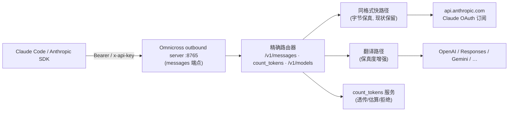

# Omnicross Claude/Anthropic 接口完整性需求（Claude Code 兼容网关）

> 状态：Draft / Ready for technical review
>
> 日期：2026-08-29
>
> 目标版本：Omnicross 下一可用版本（审查基线为工作区 `0.1.10`，最近发布 `0.1.9`）
>
> 受众：`@omnicross/core` outbound-api 与 transformer 维护者、`@omnicross/subscriptions` 维护者、daemon 与测试维护者
>
> 规范词：本文中的"必须 / MUST""应该 / SHOULD""可以 / MAY"具有需求约束含义。
>
> 依据：审查文档《[omnicross-claude-api-audit.md](omnicross-claude-api-audit.md)》发现清单 F-1…F-15；官方契约见 Anthropic [LLM gateway protocol reference](https://code.claude.com/docs/en/llm-gateway-protocol)。

---

## 1. 摘要

本需求要让 Omnicross 的 Anthropic Messages 端点从"能翻译 `/v1/messages` 的深度中转"升级为**完整的 Anthropic 兼容网关**，对齐 Anthropic 官方对 `ANTHROPIC_BASE_URL` 网关的契约：

1. **端点面补全**：修复 `/v1/messages/count_tokens` 被误执行为完整生成的 P0 缺陷，并实现 count_tokens 的三种服务策略（上游透传 / 本地估算 / 干净拒绝）；`/v1/models` 提供 Anthropic 形状并广告客户端别名；可选代理 `/api/hello` 探活。
2. **协议保真**：本地错误 Anthropic 化（含能力拒收恢复兼容）；`anthropic-version` 逐字转发；合成 SSE 补齐 ping 心跳、真实 `message_start` usage、官方错误事件形状、完整 stop_reason 映射。
3. **翻译路径不静默降级**：`top_p/top_k/stop_sequences/metadata` 显式处理；`document`（PDF）等被丢弃的内容块要么转换、要么明确报错，绝不无声吞掉。
4. **桥接一致性**：Codex 过载可见性接入 `/v1/messages`→Codex 桥。

同格式（Anthropic→Anthropic）路径已达标的行为（逐字节透传、SSE 原样、上游错误 verbatim、beta 合并无白名单）是既有护城河，**本需求不得造成任何回退**。



完成后：Claude Code 与 Anthropic SDK 客户端把 `ANTHROPIC_BASE_URL` 指向 Omnicross 时，上下文统计不再误烧推理、错误可被 SDK 类型化解析、模型发现能列出可用别名、长推理流不再被字节看门狗误断、PDF 附件不再无声丢失。

---

## 2. 背景与现状

### 2.1 已有能力（审查确认，须保留）

- `POST /v1/messages` 流式 + 非流式（含 SSE→JSON 聚合适配），模型种（fable/opus/sonnet/haiku）路由与响应 model 回写客户端原名。
- 同格式路径：请求体逐字节透传（仅改 model）、SSE 原样转发（ping/未知事件天然透传）、上游错误 verbatim + 真实状态码。
- Claude 订阅 OAuth 上游（官方 CLI client id、PKCE、platform.claude.com token 端点、401 刷新重试、at-rest 加密）。
- 健康机：429 严格按 `anthropic-ratelimit-unified-reset` 冷却、529 过载冷却、多账号粘性轮换。
- 限额体系：5h/7d 窗口采集（`/api/oauth/usage`）、缓存、调度策略（默认关）、admin API。
- 双认证头（Bearer/x-api-key）接纳；客户端凭证剥除不出网；`anthropic-beta` 合并基线（无白名单，注入 `oauth-2025-04-20` 等）。

### 2.2 审查发现的缺口（详见审查文档 §6）

| 编号 | 缺口 | 级别 |
|---|---|---|
| F-1 | `count_tokens` 及一切 `/v1/messages/*` 子资源被当作完整生成执行（烧额度 + 错误形状） | **P0** |
| F-2 | 本地错误非 Anthropic 形状，破坏 SDK 解析与 CC 能力拒收恢复 | P1 |
| F-3 | `/v1/models` 仅 OpenAI 形状、广告上游名而非客户端别名、无 display_name | P1 |
| F-4 | 翻译路径静默丢弃 `top_p/top_k/stop_sequences/metadata` 与 `document`/`redacted_thinking`/`search_result`/`container_upload` 块（**PDF 数据丢失**） | P1 |
| F-5 | 合成 SSE：`message_start` usage 置零、不合成 ping（300s 字节看门狗误中断风险）、带内 error 事件用旧形状 | P1 |
| F-6 | BYO 同格式 `anthropic-version` 固定 `2025-01-10`，未逐字转发（官方值 `2023-06-01`） | P1 |
| F-7 | stop_reason 映射不全（`content_filter→stop_sequence` 错位；无 refusal/pause_turn） | P1 |
| F-8 | Codex 过载可见性未接入 messages→Codex 桥 | P1 |
| F-9 | `/api/oauth/usage` 未在出站面代理（CC `/usage` 无数据） | P2 |
| F-10~15 | 上游错误 body 类型不解析、tool_result 图片占位、engineOrigin 占位等 | P2 |

### 2.3 官方契约要点（本需求的"为什么"）

- count_tokens 是官方网关契约中**唯一可选端点**，且"缺失时 Claude Code 回退为通过推理 usage 统计上下文"——**干净失败是安全设计**，被误执行才是缺陷。
- 错误体必须原样/按 Anthropic 形状转发：CC 的能力拒收恢复（thinking、签名、中途 system 消息、cache_control 被上游拒绝时自动降级重试）**按错误措辞匹配**。
- ping 与 300 秒字节看门狗：官方要求网关在静默间隙**自己合成 ping**（当上游不发时）。
- `anthropic-version`/`anthropic-beta` 逐字转发、禁白名单；beta 头与请求体字段成对，剥一半会硬 400。
- `/v1/models` 发现：`GET /v1/models?limit=1000`，3s 超时，任何重定向即失败，读 `data[].id`/`display_name`，客户端只保留 id 含 `claude`/`anthropic` 的条目。

---

## 3. 产品目标与非目标

### 3.1 目标

- Claude Code（含最新版本的 beta 头/体字段配对）与 Anthropic SDK 对 Omnicross 的可感知行为与直连 `api.anthropic.com` 一致或严格更好。
- count_tokens 永不触发上游推理，除非显式配置为透传模式。
- 所有本地生成的错误都是合法的 Anthropic 错误体；CC 的能力拒收恢复可工作。
- 翻译路径上的任何请求字段/内容块：**要么映射、要么显式拒绝（带稳定错误码）、要么记入审计告警**——三选一，禁止静默丢弃。
- `/v1/models` 在 Anthropic 协议下返回 Anthropic 形状，且广告 messages 端点实际可路由的客户端别名。
- 长推理静默期不再触发 CC 字节看门狗误断。
- 不回归现有四个文本入口（chat/responses/messages/gemini）的 golden 行为与 boot-smoke。

### 3.2 非目标

- 不实现 `/v1/messages/batches`、Files API、citations、MCP connector、server-side 工具的跨 wire 执行（CC 不依赖；列为远期）。
- 不在翻译路径伪造 Anthropic 独有能力（prompt caching 断点、服务端工具执行）；跨 wire 时按目标协议语义映射，映射不了就报错。
- 不把 Omnicross 出站 key 变成 Anthropic 凭证；上游订阅 token 边界维持现状。
- 不承诺 Claude Code 的 fast-mode 检查、WebFetch 域名安全检查经 Omnicross（官方：直连 `api.anthropic.com`，与网关无关）。
- 不在本期实现 resident 代理的 `x-api-key` token 源（launcher 约定自洽）。

---

## 4. 核心设计原则

1. **verbatim 优先。** 能透传就透传；必须改写时（model 回写、usage 观察）保持逐行框架保真——现状已做到，任何新功能不得引入整流缓冲。
2. **不静默降级。** 官方契约的箴言同样适用于字段级：丢一个 `stop_sequences` 与丢一个透明通道一样是欺骗。映射不了就 400/422 带稳定错误码。
3. **错误即协议。** 对 Anthropic 客户端，错误体形状和成功体形状同等重要（SDK 类型化解析 + CC 措辞匹配恢复）。
4. **能力先于广告。** `/v1/models` 只广告当前 key 实际可路由的别名；count_tokens 只在所选策略真能兑现时返回 200。
5. **心跳是正确性的一部分。** 合成路径的 ping 不是装饰，是 CC 字节看门狗的存活信号。
6. **同格式零改动原则。** F-2/F-6 等修复落在"本地生成"与"合成"环节；同格式路径除路由精确化外字节不变。
7. **上游模型记账与客户端别名分离。** 现状（记账用上游真实模型、响应回写客户端名）保持。

---

## 5. 需求规格

### R1 端点路由精确化（修复 F-1，P0）

**必须**收紧两处匹配（outbound `selectEndpoint` 与 resident `isAnthropicMessagesRequest`，二者保持一致是既有不变量）：

- `POST /v1/messages`（含尾斜杠、含 `?beta=true` 等查询串）→ messages 端点。
- `POST /v1/messages/count_tokens` → 新 count_tokens 处理器（R2）。
- 其余 `/v1/messages/*` 子路径（如 `/v1/messages/batches`）→ **Anthropic 形状 404**（`not_found_error`），不得落入生成执行。
- 双拼路径折叠（`/v1/messages/v1/messages`）行为保留，但折叠必须发生在子路径判别**之前**且只折叠精确的双拼模式。
- 匹配函数必须**可枚举测试**：对 `/v1/messages`、`/v1/messages/`、`/v1/messages?beta=true`、`/v1/messages/count_tokens`、`/v1/messages/batches`、`/v1/messagesfoo`（不得匹配）等用例钉住。

**止血优先级**：本条的"子路径 404"部分可单独先行发布（不等 R2），立即消除烧额度行为。

### R2 `POST /v1/messages/count_tokens`（修复 F-1，P0）

三种策略，按路由所选上游能力自动决定，**必须**可配置覆盖：

| 策略 | 条件 | 行为 |
|---|---|---|
| `passthrough` | 所选上游是 Anthropic wire（Claude 订阅或 BYO anthropic 格式） | 请求体（去 `stream`、去 `max_tokens`、`model` 改写后）转发上游 `POST /v1/messages/count_tokens`，响应 verbatim 返回 `{"input_tokens":N}`；上游失败按 R3 映射错误 |
| `estimate` | 翻译路径（OpenAI/Responses/Gemini 上游） | **本地估算**：对 system+messages+tools 按目标协议 tokenizer/启发式估算输入 token，返回 `{"input_tokens":N}`；**不得**调用上游推理 |
| `reject` | 显式配置或无 tokenizer 可用 | Anthropic 形状 404/501（CC 将按官方语义回退为推理 usage 统计——这是安全路径） |

约束：

- count_tokens 请求中的 `cache_control`、`thinking`、`tools` 必须参与计数（透传策略天然满足；估算策略至少按字符近似 + 工具 schema 计入）。
- 估算策略的误差**必须**在响应头 `x-omnicross-count-estimate: true` 标记，且**不得**进入 usage 记账（非真实消费）。
- count_tokens 不经过并发门的推理槽位（免费端点，独立小限额防滥用）。

### R3 本地错误 Anthropic 化（修复 F-2，P1）

对所有**本地生成**的错误（鉴权、限流、并发、无路由、allowance 耗尽、模型未配置、管道失败），Anthropic 协议端点上**必须**返回：

```json
{"type":"error","error":{"type":"authentication_error","message":"…"}}
```

映射表（**必须**实现并测试）：

| 场景 | HTTP | `error.type` |
|---|---|---|
| 出站 key 缺失/无效/过期 | 401 | `authentication_error` |
| loopback 限制、端点未授权 | 403 | `permission_error` |
| JSON 解析失败、非法参数 | 400 | `invalid_request_error` |
| 模型未配置/kind 未映射 | 404/503 | `not_found_error` / `api_error` |
| 限流、并发门、allowance 耗尽 | 429 | `rate_limit_error`（保留现有 `Retry-After`） |
| 管道/上游协议失败 | 502 | `api_error` |
| 无可用路由/订阅停用 | 503 | `api_error`（或 `overloaded_error` 语义时用之） |
| 客户端取消 | 499/400 | `request_cancelled` 语义（`api_error` + 说明） |

- **上游错误继续 verbatim 透传，禁止包信封**（官方：CC 按措辞匹配做能力拒收恢复；现状正确，保持）。
- 翻译路径上从 OpenAI 错误体合成 Anthropic 错误时，`error.message` **必须**保留上游原文措辞（恢复匹配依赖），`error.type` 按状态映射。
- OpenAI/其他协议端点的错误形状**不变**（本需求只影响 Anthropic 协议端点）。

### R4 `GET /v1/models` Anthropic 形态与别名广告（修复 F-3，P1）

- Anthropic 协议语境（按出站 key 的端点授权或请求 `Accept`/路径特征判定；**至少**当 key 授权含 messages 端点时）**必须**支持返回 Anthropic 形状：

```json
{
  "data": [{"id": "claude-sonnet-5", "type": "model", "display_name": "Sonnet 5 (via deepseek-v3)", "created_at": "…"}],
  "first_id": "…", "has_more": false, "last_id": "…"
}
```

- **广告内容**（能力先于广告）：messages 端点 `modelMap` 已配置的各 kind（fable/opus/sonnet/haiku）展开出的**客户端可见名**——至少含 kind 基名（`claude-opus-5` 式目录名或用户配置的别名），`display_name` 可标注实际上游（如 `(via deepseek-v3)`）。**不得**广告未配置的 kind。
- `GET /v1/models?limit=1000` **不得**重定向（官方：任何重定向即失败）；3 秒内响应。
- OpenAI 形状保留给仅授权 chat/responses 的 key；**可以**对同一 key 按端点授权返回并集（两形状分字段不冲突时优先 Anthropic 形状）。
- 变更必须同步 `SUBSCRIPTION_MODEL_CATALOG` 与 UI 镜像的钉测（既有约定）。

### R5 头部保真（修复 F-6，P1）

- BYO 同格式路径：`anthropic-version` **必须**改为"调用方提供了就逐字转发；没提供默认 `2023-06-01`"。固定 `2025-01-10` 的行为删除。
- Claude 订阅路径现状（调用方/指纹可透传，缺省补 `2023-06-01`）**保持**。
- `anthropic-beta`：现状合并策略（基线 + 调用方旗标去重追加、无白名单）**保持并补测试钉住**——官方禁止白名单，且 `oauth-2025-04-20` 对订阅上游必要。
- 翻译路径不转发 beta 的现状可接受，但**必须**在文档与审计里声明"跨 wire 时 beta 所 gate 的能力（context_management、files 等）不可用"。

### R6 合成 SSE 保真（修复 F-5/F-7，P1）

针对 `AnthropicOpenAIToAnthropicStream`（翻译路径）：

1. **ping 心跳**：流打开即启动 15-30 秒（可配，默认 **20s**）心跳计时器，静默间隙发送 `event: ping\ndata: {"type":"ping"}`；任何上游 chunk 到达即重置计时；流结束/错误必须清计时器（防泄漏）。**不得**在已有数据流动时插发。
2. **`message_start` usage**：上游首个携带 prompt/usage 信息的事件到达时**必须**回填真实 `input_tokens`（OpenAI chunk 的 `usage.prompt_tokens` 在 include_options 开启时首 chunk 即有；确不可得时保持 0 但**必须**在 `message_delta` 给出累计值——现状已给，保持）。
3. **带内 error 事件形状**：改为官方 `{"type":"error","error":{"type":"overloaded_error"|"api_error","message":<上游原文>}}`。
4. **stop_reason 映射**：`content_filter → refusal`（并保留告警计数）；映射表补 `refusal`、`pause_turn` 占位（当前上游不产，形状先行）；`length→max_tokens`、`tool_calls→tool_use`、`stop→end_turn` 保持。
5. 计时器与逐事件状态机必须有"流悬挂"清理测试（客户端断开、上游 half-open）。

### R7 翻译路径字段与内容块显式处理（修复 F-4，P1）

对 `transformAnthropicRequestToUnified` 未处理面，逐项**三选一**（映射 / 拒绝 / 告警）：

| 输入 | 要求 |
|---|---|
| `stop_sequences` | **必须映射**（OpenAI `stop`；Responses/Gemini 对应字段） |
| `metadata.user_id` | **应该映射**（目标协议等价字段；无则进审计字段） |
| `top_p` | **必须映射**（各协议均有） |
| `top_k` | 有对应则映射（Gemini 有）；无对应的**必须**记审计告警 `dropped_field`（不再静默） |
| `document`（PDF） | **必须**至少支持 base64 PDF → 文本抽取（现成 PDF 文本层解析，无依赖则轻量引入并沙箱化）；无文本层的扫描件**应该**按页转图（目标协议支持图片时）或返回 400 `document_not_supported_on_route`。**禁止静默丢弃** |
| `redacted_thinking` | 保留占位透传（维持 thinking 块顺序完整性），记 `dropped_field` 告警 |
| `search_result` / `container_upload` | 现阶段 400 `unsupported_content_block`（显式拒绝），错误信息指出当前路由不支持 |
| `tool_result` 内图片 | 维持占位（wire 限制），**应该**在 Responses 上游支持图片后升级；占位文案保持可识别 |

- 所有 `dropped_field`/`unsupported_content_block` 告警进入审计轨迹（字段名级别，**不得**记录内容值——与现有 redact 策略一致）。
- 同格式路径不受本条影响（本就透传）。

### R8 Codex 过载可见性接入 messages 桥（修复 F-8，P1）

- `/v1/messages`→Codex 订阅的 `relayResponse` **必须**传入与 `/v1/responses` 相同的 `onSseEvent` 观察者，接入 `ServerOverloadCounter` 与健康机（"at capacity" 200+SSE `response.failed` → 行标记 + 趋势计数 + 不重试语义，与 Codex 侧既有修复一致）。
- 新子路径若涉及构建产物（memory 注：core 新子路径必须在 tsup.config 注册）需检查注册。

### R9（可选，SHOULD）`GET /api/oauth/usage` 出站面代理（F-9）

- 当出站 key 绑定 Claude 订阅路由时，**可以**在 outbound server 暴露 `GET /api/oauth/usage`：返回该 key 当前活跃/绑定账号的 5h/7d 限额快照（复用 allowance 采集与缓存，**不得**触发即时上游刷新风暴——遵循现有 5 分钟缓存）。
- 需 `anthropic-beta: oauth-2025-04-20` 头存在与否均可用；未绑定 Claude 订阅 → Anthropic 形状 404。
- 该端点**不进入**推理并发门；响应脱敏（无账号标识、无 token）。

### R10（可选，MAY）`HEAD /api/hello` 探活

- 返回 200 空体（官方：连接预热，可安全拒绝——实现了更友好）。免鉴权（与 `/health` 同级）。

### R11 杂项修正（P2 顺手项）

- usage 事件 `engineOrigin` 停用 `'codex-ingress'` 占位，改 `'anthropic-messages-ingress'`（或等价），涉及报表口径的迁移说明。
- 上游 Anthropic 错误 **body 类型**解析（`overloaded_error` 等进健康机日志字段，不改变现有冷却判定）；SSE 带内 `event:error`（Anthropic 上游）**应该**触发与 529 等价的过载冷却。

---

## 6. 错误协议（汇总）

Anthropic 协议端点所有本地错误统一形状（R3）；新增稳定错误码（`error.code` 可选字段，兼容官方形状）：

| HTTP | 场景 | `error.type` | 备注 |
|---|---|---|---|
| 400 | 请求体/参数非法 | `invalid_request_error` | |
| 400 | 内容块当前路由不支持（R7） | `invalid_request_error` | message 指明块类型与路由 |
| 401 | 出站 key 无效 | `authentication_error` | |
| 403 | loopback/端点未授权 | `permission_error` | |
| 404 | 未知路径/子资源（R1） | `not_found_error` | CC count_tokens 回退安全 |
| 404 | count_tokens 估算不可用（R2 reject） | `not_found_error` | 同上 |
| 429 | 限流/并发/allowance | `rate_limit_error` | 保留 `Retry-After` |
| 499 | 客户端取消 | `api_error` | 语义标注 |
| 502 | 管道失败/上游协议变化 | `api_error` | 上游原文保留在 message |
| 503 | 无路由/订阅停用 | `api_error` | |

---

## 7. 安全与隐私

- count_tokens 的 passthrough 策略**必须**走既有凭证注入（不得让客户端 key 触达上游）；估算策略零上游调用。
- PDF 文本抽取在尺寸/页数/时间预算内执行（防压缩炸弹；上限对齐官方 32MB/600 页精神的可配子集）。
- `dropped_field` 审计只记字段名，不记值（沿用现有 auditRedact 策略）。
- `/v1/models` 的 `display_name` 不得泄漏内部 provider key、账号邮箱或 token。
- R9 的 usage 代理响应脱敏：无账号 ID、无 token、无请求级明细。
- 心跳计时器、路由表等不得引入新的无界内存。

---

## 8. 性能与并发

- count_tokens 估算路径纯本地、无锁、O(请求体大小)；passthrough 路径复用上游 fetch 管线但走独立小并发门（默认并发 ≫ 推理门，另行限速）。
- ping 心跳实现不得为每流常驻 timer 轮询——单 interval 驱动多流或惰性检查。
- R7 的 PDF 抽取在请求关键路径上设置时间预算（默认 2s），超时降级为 400 `document_not_supported_on_route`（显式，非静默）。
- 所有新处理器维持流式/无整体缓冲原则（ping 合成不得引入缓冲）。

---

## 9. 可观测性

- 新增计数：`count_tokens_requests{strategy=passthrough|estimate|reject}`、`models_list_requests{shape=anthropic|openai}`、`synth_ping_emitted`、`dropped_field{field}`、`unsupported_content_block{type}`、`stop_reason_content_filter`、`messages_codex_overload_detected`。
- 修正：usage 事件 engineOrigin（R11）。
- 审计轨迹新增字段：count_tokens 策略与（估算时）`estimated:true`；错误映射后的 `error.type`。
- `omnicross doctor claude`（**应该**）：检查路由配置、count_tokens 策略、models 形状、心跳配置——零额度消耗，只做本地校验与（可选 `--live`）一次最小 count_tokens。

---

## 10. 配置需求

```json
{
  "outboundApiServer": {
    "anthropic": {
      "countTokens": { "mode": "auto", "estimateBudgetMs": 2000 },
      "modelsShape": "auto",
      "heartbeatIntervalMs": 20000,
      "proxyOauthUsage": false,
      "apiHello": true
    }
  }
}
```

- `countTokens.mode`: `auto`（默认，按上游 wire 自动选 passthrough/estimate）| `passthrough` | `estimate` | `reject`。
- 所有字段缺省即现状语义（除被本需求改变为正确行为的部分）；配置热重载不中断在途流。

---

## 11. 兼容性与测试矩阵

### 11.1 路由与端点

| 用例 | 必测结果 |
|---|---|
| `POST /v1/messages?beta=true` | 正常生成（回归） |
| `POST /v1/messages/count_tokens`（三种策略） | 不触发上游推理（mock 上游断言零调用，passthrough 例外且打到正确 URL） |
| `POST /v1/messages/batches` | Anthropic 形状 404，上游零调用 |
| `/v1/messagesfoo` POST | 不匹配 messages 端点 |
| `GET /v1/models?limit=1000` | Anthropic 形状；广告且仅广告已配置 kind；无重定向；<3s |
| `HEAD /api/hello`（若实现） | 200 |

### 11.2 错误协议

| 用例 | 必测结果 |
|---|---|
| 无效 key / 限流 / 无路由 | Anthropic SDK 类型化解析成功（`APIError` 子类正确） |
| 上游 400 错误（同格式） | body 字节等价透传（回归钉住） |
| 上游拒绝 thinking 字段（翻译路径合成错误） | message 保留上游原文措辞 |

### 11.3 流式保真

| 用例 | 必测结果 |
|---|---|
| 翻译路径上游静默 >心跳间隔 | 客户端收到合成 ping；字节流无其他改动 |
| 翻译路径上游首 chunk 带 usage | `message_start.input_tokens` 为真实值 |
| 带内错误 | 官方 error 事件形状 |
| `content_filter` | `stop_reason: "refusal"` |
| 同格式 ping/未知事件 | 原样透传（回归钉住） |

### 11.4 字段与内容块

| 用例 | 必测结果 |
|---|---|
| `stop_sequences`/`top_p`（翻译路径） | 到达上游请求体 |
| `top_k`（无对应协议） | 审计 `dropped_field` 告警 |
| PDF document 块（翻译路径） | 文本进入上游；不可解析时显式 400 |
| `search_result` 块 | 显式 400 |
| 同格式以上全部 | 字节透传不变（回归） |

### 11.5 客户端矩阵

- Claude Code（当前稳定版）指向 `http://127.0.0.1:8765`：会话、上下文百分比显示（依赖 count_tokens 回退/实现）、`/model` 列表（发现开启时）、长思考任务不中断。
- `@anthropic-ai/sdk`（TS）：`messages.create` 流式/非流式、`countTokens`、`models.list`、错误类型化。
- 现有四入口 boot-smoke 与既有 vitest 全绿（回归门槛）。

---

## 12. 验收标准

- **AC-01**：`POST /v1/messages/count_tokens` 在任何策略下都不触发上游 `/v1/messages` 生成；`auto` 模式对 Anthropic 上游透传返回正确 `input_tokens`，对翻译上游本地估算。
- **AC-02**：`POST /v1/messages/batches` 及任意未支持子资源返回 Anthropic 形状 404，上游零调用。
- **AC-03**：全部本地错误可被 `@anthropic-ai/sdk` 类型化解析；上游错误体透传字节不变（回归测试钉住）。
- **AC-04**：`GET /v1/models` 对授权 messages 的 key 返回 Anthropic 形状，条目与已配置 kind 一一对应，无重定向。
- **AC-05**：BYO 同格式路径 `anthropic-version` 逐字透传调用方值；缺省 `2023-06-01`。
- **AC-06**：翻译路径静默期按配置间隔收到合成 ping；有数据流动时不插发；流结束无计时器泄漏（测试断言）。
- **AC-07**：翻译路径 `message_start` 携带真实 `input_tokens`（上游首 chunk 可得时）。
- **AC-08**：`stop_sequences`/`top_p` 经翻译路径到达上游；`top_k` 丢弃产生审计告警。
- **AC-09**：PDF document 块经翻译路径内容到达上游（文本抽取）或显式 400；绝无静默丢失。
- **AC-10**：`content_filter` → `stop_reason: "refusal"`；带内错误为官方形状。
- **AC-11**：messages→Codex 桥的 "at capacity" 进入过载计数与健康机。
- **AC-12**：现有四端点 golden 行为、boot-smoke、typecheck、lint 全绿。
- **AC-13**（若实现 R9）：CC `/usage` 类查询经 outbound 面返回绑定账号限额快照，无凭证泄漏。
- **AC-14**：Claude Code 实机 e2e：完整会话（含工具调用、思考、图片）+ 上下文百分比正常 + 一次长思考（>90s 静默）不中断。

---

## 13. 建议交付切片

### Change A：止血与路由（P0，可独立先行发布）

- R1 全部（精确路由 + 子资源 Anthropic 404）。
- R2 的 `reject` 兜底（默认策略先行 = 对翻译路径 reject、Anthropic 上游 passthrough）。
- R3 错误形状（本地错误 Anthropic 化）。
- 退出条件：count_tokens/batches 零上游调用；错误 SDK 可解析；既有测试全绿。

### Change B：协议保真（P1）

- R2 `estimate` 策略与 `auto` 装配；R4 models Anthropic 形态；R5 头部；R6 合成 SSE（ping/usage/error/stop_reason）。
- 退出条件：11.2/11.3 矩阵通过；CC 实机上下文显示与长思考不中断。

### Change C：翻译路径字段/内容块 + 桥接（P1）

- R7 字段与内容块显式处理（含 PDF 抽取）；R8 过载可见性；R11 杂项。
- 退出条件：11.4 矩阵通过；审计告警可见。

### Change D（可选）：体验增强

- R9 `/api/oauth/usage` 代理；R10 `/api/hello`；doctor 命令。
- 退出条件：全部 AC 完成后，才可宣称"完整 Anthropic 兼容网关"。

---

## 14. 风险与待决问题

| 风险/问题 | 决策要求 |
|---|---|
| count_tokens 估算精度 | 明确"估算"边界（响应头标记）；CC 回退语义兜底，不追求 tiktoken 级精度 |
| CC 对 count_tokens 返回 Message 形状的既有依赖 | 无——当前行为是缺陷；修复后 CC 走官方回退或正常计数 |
| `/v1/models` 双形状并存 | 设计评审定判定规则（key 端点授权 vs 路径/Accept）；默认 Anthropic 形状优先 |
| PDF 文本抽取引入依赖 | 评估零依赖/轻依赖方案；超预算显式 400；沙箱化 |
| ping 计时器在多流下的实现 | 单 interval 或惰性检查；悬挂流清理有测试 |
| `anthropic-version: 2025-01-10` 移除是否影响依赖它的第三方上游 | 该值非官方；逐字透传 + 官方缺省覆盖面更广；release note 标注 |
| R9 代理 usage 的刷新风暴 | 复用 5 分钟缓存；不因出站查询触发上游刷新 |
| engineOrigin 变更影响报表 | 迁移说明进 release note |

---

## 15. Anthropic 官方资料与实现对照

以下资料访问于 2026-08-29。Anthropic 的产品行为会变化，实现前应再次核对。

| 官方资料 | 本需求使用的事实 |
|---|---|
| [LLM gateway protocol reference](https://code.claude.com/docs/en/llm-gateway-protocol) | 端点必须性、`?beta=true` 路径匹配、头部逐字转发禁白名单、ping 与 300s 字节看门狗、错误体透传与能力拒收恢复、models 发现规则、`/api/hello` 可拒绝 |
| [Gateway connect](https://code.claude.com/docs/en/llm-gateway-connect) | 客户端接入与凭证变量 |
| [Authentication](https://code.claude.com/docs/en/authentication) / [Env vars](https://code.claude.com/docs/en/env-vars) | Bearer/x-api-key 映射、apiKeyHelper 双头、订阅 OAuth 与 beta 能力标记机制 |
| [Messages API](https://platform.claude.com/docs/en/api/messages) | 请求体字段、thinking 签名块往返、错误形状 |
| [Streaming](https://platform.claude.com/docs/en/build-with-claude/streaming) | SSE 事件全集、message_start/delta usage 语义、ping、未知事件容忍 |
| [Token counting](https://platform.claude.com/docs/en/build-with-claude/token-counting) | count_tokens 端点、`{"input_tokens":N}` 形状、独立 RPM |
| [Models list](https://platform.claude.com/docs/en/api/models-list) | Anthropic 列表形状（data/first_id/has_more/last_id） |
| [Beta headers](https://platform.claude.com/docs/en/api/beta-headers) | beta 开放集合、头+体字段配对 |
| [Rate limits](https://platform.claude.com/docs/en/api/rate-limits) / [Errors](https://platform.claude.com/docs/en/api/errors) | 429 头族、retry-after、错误类型枚举 |
| [Model config](https://code.claude.com/docs/en/model-config) | 别名、`[1m]`、背景模型、未知模型名仍发 adaptive thinking |

社区观察项（机制官方确认、具体字符串未见于官方文档，实现时不做白名单依赖）：`claude-code-20250219`、`oauth-2025-04-20`、`fine-grained-tool-streaming-2025-05-14`、`/api/oauth/usage`。

### 15.1 必须保留的边界声明

官方文档描述的是 Anthropic 的公开 API 与 Claude Code 产品行为。它可以作为 Omnicross 对外兼容协议的依据，但不能证明：

- Claude 订阅私有接口（`/api/oauth/usage` 等）稳定或允许第三方长期模拟——Omnicross 已按"适配器隔离 + 失败保旧快照"处理，维持。
- 对齐官方网关契约后任意版本的 Claude Code 都自动启用全部功能（模型发现默认关、细粒度工具流默认关经自定义 base URL）。
- Omnicross 的承诺应限定为：在用户主动配置、当前账户具备能力、当前上游协议可用的前提下，提供行为与官方一致的本地 Anthropic 兼容端点。
