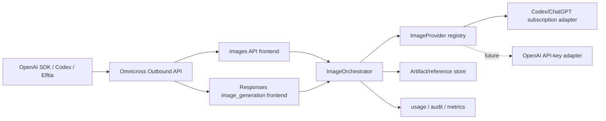

# Omnicross 完整生图能力需求（OpenAI 兼容 + Codex/ChatGPT 订阅上游）

> 状态：Draft / Ready for technical review
>
> 日期：2026-08-29
>
> 目标版本：Omnicross 下一可用版本（基线实测为 `0.1.12`）
>
> 受众：`@omnicross/core`、`@omnicross/subscriptions`、daemon、Codex 集成与测试维护者
>
> 规范词：本文中的“必须 / MUST”“应该 / SHOULD”“可以 / MAY”具有需求约束含义。

---

## 0. Session B 执行契约

本节是可直接交给独立开发 session 的启动合同；后文的完整需求用于实现细节，本节负责限定本 Change 的边界和并行所有权。

### 0.1 身份与前置条件

| 项目 | 固定值 |
|---|---|
| Rasen Change | `codex-hosted-tools-and-images` |
| 开发分支 | `feat/codex-hosted-tools-and-images` |
| 建议 worktree | `omnicross--codex-hosted-tools-and-images` |
| 集成基线 | 共享 operation dispatch / registry PR 合并后的最新 `origin/main` SHA |

启动前必须确认共享前置 PR 已合并。Session 必须先 `git fetch origin main`，记录 `git rev-parse origin/main` 为 `BASE_SHA`，确认分支和路径不存在，再从该 SHA 创建 worktree 与开发分支。它必须与 Core session 使用同一个 `BASE_SHA`；不得从 Core 分支、未合并前置提交或陈旧本地 `main` 派生。

### 0.2 本 session 的范围

必须完成：

- 稳定的 `ImageProvider`、`ImageOrchestrator`、capability、错误、usage、取消与安全资源引用契约。
- Codex/ChatGPT 订阅上游的隔离 adapter；私有 wire 不得泄漏到 core 公共契约。
- `POST /v1/images/generations` 与 `POST /v1/images/edits`，包括 JSON/multipart、生成/编辑/mask、多参考图、流式 partial image 与 OpenAI 兼容错误。
- 独立 `images` 权限、配置、路由、daemon/UI wiring；Responses key 不得自动获得 Images API 权限。
- 图片输入校验、大小/像素/MIME/压缩炸弹限制、受控临时文件、artifact/reference 生命周期和脱敏审计。
- Responses `image_generation` 的执行 adapter、`image_generation_call`/partial event 映射与多轮图片引用；非流式成功结果保持 Base64 `result` 语义。
- `gpt-image-2` 能力发现及真实上游不支持、额度、审核、超时和协议漂移的可诊断失败。

明确排除：

- `/responses/compact`、Native Responses Core Profile、header/SSE 通用保真和账号 state affinity 的实现。
- standalone web search；Change 名中的 hosted tools 在本期只指 `image_generation`。
- Responses WebSocket、Files 通用 API、stored/background Responses 附属方法。
- 对 Codex/ChatGPT 订阅额度、计费或未公开私有协议稳定性的虚假承诺。

### 0.3 文件所有权与并行约束

本 session 拥有：

- 图片领域 contracts 与 `packages/core/src/image-generation/**`
- `packages/subscriptions` 中的生图 adapter 与 fixture
- Images 的 outbound permission/config/router、daemon/UI wiring 与迁移
- multipart、artifact/reference、图片安全限制与对应测试
- 自包含的 Responses `image_generation` execution contribution

本 session 不得修改 `packages/core/src/openai-operation/**`，也不得直接修改 Core session 拥有的 `openaiResponsesIngress.ts` 或 `providerProxyShared.ts`。它应导出：

- `images.generate` handler/registration contribution
- `images.edit` handler/registration contribution
- 可由最终 integrator 注入 Native Responses 路径的 `image_generation` execution contribution

最终 integrator 只负责建立 app-session registry、注册 A/B contributions，并在一个小型 composition 变更中把 hosted-image contribution 注入 Responses ingress；不得把任一业务实现搬回共享 classifier 或 bootstrap。

### 0.4 交付与验收

完成前至少应具备：

- Images generate/edit 的 SDK contract tests，multipart/mask/透明背景/partial stream/取消/安全限制测试。
- Responses `image_generation_call.result`、partial event、多轮 reference 与 unsupported capability 测试。
- subscriptions adapter 的脱敏 fixtures；不得把 token、Cookie、图片 Base64 或完整敏感 prompt 写入日志与快照。
- Core/subscriptions/daemon/UI 的直接相关 typecheck、测试与构建检查。
- 一份记录 `BASE_SHA`、能力矩阵和全部 integration contributions 的 handoff。

## 1. 摘要

本需求要让 Omnicross 从“只能代理文本 Responses”升级为一个完整的生图网关，同时提供两套 OpenAI 兼容入口：

1. **Image API**：`POST /v1/images/generations` 与 `POST /v1/images/edits`，直接使用 `gpt-image-2` 模型语义。
2. **Responses API 托管工具**：`POST /v1/responses` 中的 `tools: [{ "type": "image_generation" }]`，由 GPT-5.x 主模型调用生图工具，并返回原生 `image_generation_call`。

二者必须共用一个内部 `ImageProvider` / `ImageOrchestrator`，不能分别维护两套上游协议。第一上游是用户已登录的 Codex/ChatGPT 订阅能力；未来可以增加官方 OpenAI API Key 或其他图片 Provider，但不能把任何 ChatGPT 私有协议泄漏为 core 的公共契约。



完成后，普通 OpenAI SDK、curl、Elftia 和具备相应宿主能力的 Codex 均可通过 `http://127.0.0.1:8765/v1` 生成、编辑和流式接收图片，不需要 CLI 脚本兜底。

---

## 2. 背景与现状

### 2.1 已有能力

- Omnicross 已支持 `POST /v1/responses`，并能使用 Codex 等订阅账户作为 Provider。
- 当前模型面可见 GPT-5.x 主模型，如 `gpt-5.6-luna`、`gpt-5.6-terra`、`gpt-5.6-sol`。
- 现有 outbound API 已有鉴权、路由、订阅账户、并发、审计和 usage 接缝，生图必须复用这些基础设施。

### 2.2 当前缺口

实测基线中：

- `POST /v1/images/generations` 返回 `Unsupported: POST /v1/images/generations`。
- 没有 `POST /v1/images/edits`。
- 模型列表不包含 `gpt-image-2`。
- `/v1/responses` 尚未完成 `image_generation` 托管工具的请求识别、上游执行、结果归一化与流式事件适配。
- 没有多轮图片编辑所需的图片引用生命周期。
- 仅增加一个 HTTP 路由也不足以保证 Codex 自动暴露 `$imagegen`；模型能力声明、工具能力发现和 Codex 宿主本身仍需单独验收。

### 2.3 为什么需要两套入口

OpenAI 官方把生图分为两个使用面：

| 使用面 | 调用模型 | 适合场景 |
|---|---|---|
| Image API | 直接指定 `gpt-image-2` | 单次生成、单次编辑、批量图片、传统 OpenAI SDK |
| Responses API | 指定支持工具的 GPT-5.x 主模型，并声明 `image_generation` | 对话式生成、多轮编辑、图片和其他工具混合编排 |

两者不是同一路径的别名。Omnicross 必须对外保持这一区别，对内再汇聚到统一 Provider。

---

## 3. 产品目标与非目标

### 3.1 目标

- 对 OpenAI GPT Image 的核心请求、响应、错误与 SSE 事件保持兼容。
- 支持文生图、参考图编辑、多参考图、mask 局部编辑、透明背景和多轮编辑。
- 支持非流式最终图与 0–3 张流式局部预览图。
- 通过用户已有的 Codex/ChatGPT 订阅身份调用上游生图能力。
- 保持图片二进制、订阅令牌和用户提示词的安全边界。
- 能准确发现并公开“当前账户、上游和模型到底支持什么”。
- 上游私有协议变化时快速失败、易于诊断，不污染公共协议层。
- 不回归现有 Chat、Responses、Anthropic Messages 和 Gemini 请求。

### 3.2 非目标

- 不声称 ChatGPT/Codex 订阅等同于 OpenAI Platform API 额度或计费。
- 不保证 OpenAI 未公开的订阅上游协议长期稳定。
- 不在本次实现 DALL·E 2/3 的历史专属行为；遇到这些模型必须返回明确的不支持错误。
- 不实现 DALL·E 2 专属的 `POST /v1/images/variations`；GPT Image 的同类需求统一走 edits。
- 不把 `/v1/batches` 纳入首个 GA；内部 Provider 契约应允许后续增加图片批处理而无需重写协议层。
- 不把 Codex CLI 调用作为主路径或静默兜底。
- 不在 core 中实现图片画廊、图像编辑器或 Elftia UI；这些属于消费方产品层。
- 不伪造 `usage`、成本、审核结果、透明通道或局部预览。

---

## 4. 核心设计原则

1. **一个 Adapter、两个协议面。** Image API 与 Responses 工具必须共享请求归一化、Provider、错误映射、产物存储和 usage 记录。
2. **能力先于路由。** 只有上游明确支持的能力才可对外广告；不支持时返回 `unsupported_capability`。
3. **协议保真。** 同格式且上游原生支持时优先透传；需要桥接时使用显式映射，保留未知字段供审计但不能盲目转发敏感字段。
4. **不静默降级。** `transparent` 不能悄悄变成白底，`high` 不能悄悄变成 `low`，`n: 4` 不能只返回一张。
5. **二进制有界。** Base64 会增加约三分之一体积；所有解析、缓存、日志和响应路径必须设置尺寸与数量上限。
6. **订阅协议隔离。** `UpstreamImageProvider` 是稳定边界，ChatGPT/Codex 私有字段只能存在于 subscriptions adapter 内。
7. **先验证再广告。** 不能因为模型名叫 `gpt-image-2` 就推断当前账户有权限。

---

## 5. 总体组件与职责

### 5.1 推荐包归属

| 组件 | 建议归属 | 职责 |
|---|---|---|
| 图片公共类型、能力类型、稳定错误码 | `@omnicross/contracts` | 不依赖具体上游的 wire-neutral 契约 |
| Image API 路由、Responses 工具识别、归一化、SSE、错误映射 | `@omnicross/core` | 对外协议与编排机制 |
| Codex/ChatGPT 订阅生图 adapter | `@omnicross/subscriptions` | 登录身份、私有上游请求、刷新、上游错误解释 |
| 配置、临时产物后端、管理 API、doctor 命令 | daemon / host | 宿主策略与持久化实现 |
| Elftia 作品落盘、画廊、编辑 UI | Elftia | 产品行为，不进入 Omnicross core |

### 5.2 稳定 Provider 接缝

实现应提供等价于下列语义的端口；具体 TypeScript 命名可在设计阶段调整：

```ts
interface ImageProvider {
  readonly id: string
  getCapabilities(ctx: ImageProviderContext): Promise<ImageCapabilities>
  generate(request: NormalizedImageGenerateRequest, ctx: ImageProviderContext): ImageJob
  edit(request: NormalizedImageEditRequest, ctx: ImageProviderContext): ImageJob
}

interface ImageJob {
  events: AsyncIterable<ImageProviderEvent>
  cancel(reason?: string): Promise<void>
}
```

`ImageProviderEvent` 至少覆盖：

- `accepted`：上游已接受、可能产生额度消耗。
- `partial_image`：一张可独立解码的局部预览，而不是字节 delta。
- `completed`：最终图片、实际输出属性、上游引用、可用 usage。
- `failed`：稳定错误分类与已脱敏诊断。

### 5.3 能力模型

能力对象至少包含：

```ts
interface ImageCapabilities {
  available: boolean
  reason?: string
  models: string[]
  generate: boolean
  edit: boolean
  maskEdit: boolean
  maxInputImages: number
  maxOutputImages: number
  streaming: boolean
  maxPartialImages: number
  transparentBackground: boolean
  flexibleSizes: boolean
  outputFormats: Array<'png' | 'jpeg' | 'webp'>
  responsesTool: boolean
  multiTurnEdit: boolean
  supportsFileId: boolean
  supportsImageUrl: boolean
}
```

能力可来自静态 adapter 声明、登录账户 entitlement 和上游返回。最终能力取交集；任何未知值按“不支持”处理。

---

## 6. Image API：生成图片

### 6.1 路由

```http
POST /v1/images/generations
Content-Type: application/json
Authorization: Bearer <omnicross-outbound-key>
```

### 6.2 请求字段

| 字段 | 要求 |
|---|---|
| `prompt` | 必填字符串；GPT Image 兼容上限 32,000 字符；空白字符串返回 400 |
| `model` | 接受 `gpt-image-2` 与配置的明确别名；省略时使用 Omnicross 配置的默认图片模型并在文档中声明这一兼容差异 |
| `n` | `1..10`，默认 1；上游不足时只可显式 fan-out 或拒绝，不能少返回 |
| `quality` | `low \| medium \| high \| auto`，默认 `auto` |
| `size` | `auto` 或合法的 `WIDTHxHEIGHT` |
| `background` | `transparent \| opaque \| auto`，默认 `auto` |
| `output_format` | `png \| jpeg \| webp`，默认 `png` |
| `output_compression` | `0..100`；只允许 JPEG/WebP |
| `moderation` | `auto \| low`；上游不能兑现调用方指定值时必须拒绝 |
| `stream` | boolean，默认 `false` |
| `partial_images` | `0..3`；仅在流式模式生效 |
| `user` | 可选稳定终端用户标识；日志中只保留不可逆摘要 |

### 6.3 `gpt-image-2` 尺寸规则

Omnicross 必须在触发上游之前校验：

- 两条边均为 16 的倍数。
- 长短边比例不超过 `3:1`。
- 最长边不超过 3840 px。
- 总像素不少于 655,360，且不超过 8,294,400。
- 超过 3,686,400 总像素的输出属于实验范围；应在能力或响应诊断中标记，但不必默认禁止。

常用值包括 `1024x1024`、`1536x1024`、`1024x1536`、`2048x2048`、`2048x1152`、`3840x2160` 与 `2160x3840`。

### 6.4 参数组合约束

- `background: "transparent"` 只允许 `png` 或 `webp`；JPEG 必须在路由层返回 400。
- 如果当前订阅上游不支持透明背景，必须返回 `unsupported_capability`，不能合成纯色背景冒充。
- `output_compression` 对 PNG 无效时必须拒绝或明确忽略并返回 warning；GA 默认采用拒绝，减少客户端误判。
- `partial_images > 0` 且 `stream != true` 返回 400。
- `n > 1` 的 fan-out 必须受专用并发门、额度预算和取消信号控制。

### 6.5 非流式响应

```json
{
  "created": 1787961600,
  "data": [
    {
      "b64_json": "<base64 image>"
    }
  ],
  "usage": {
    "total_tokens": 100,
    "input_tokens": 50,
    "output_tokens": 50,
    "input_tokens_details": {
      "text_tokens": 10,
      "image_tokens": 40
    }
  }
}
```

要求：

- GPT Image 输出使用 `data[].b64_json`，不返回临时公网 URL。
- `data.length` 必须等于 `n`。
- 仅当上游提供可信 usage 时返回 `usage`；未知时省略，禁止填 0。
- 允许返回 OpenAI 兼容的 `revised_prompt`，但不能自行捏造。

### 6.6 流式响应

响应使用 `text/event-stream`，至少包含：

```text
event: image_generation.partial_image
data: {"type":"image_generation.partial_image","b64_json":"...","partial_image_index":0}

event: image_generation.completed
data: {"type":"image_generation.completed","b64_json":"...","usage":{...}}
```

- `partial_image_index` 从 0 开始。
- 每个 `b64_json` 都必须是可独立渲染的完整图片。
- 即使请求了 1–3 张 partial，上游更快完成时也可能少发；最终 `completed` 不得缺失。
- 客户端断开连接必须触发 `ImageJob.cancel()`。

---

## 7. Image API：编辑图片

### 7.1 路由与输入格式

```http
POST /v1/images/edits
```

GA 必须支持：

1. `multipart/form-data`：一个或多个 `image[]` 二进制文件，可选 `mask`。
2. `application/json`：`images` 数组中的 `image_url` 或 `file_id` 引用，可选 `mask` 引用。

如果当前 Omnicross 尚无 Files API，必须提供最小的图片资产存储端口；在该端口完成前，`file_id` 不能被广告为已支持。

### 7.2 编辑能力

- 单图整体编辑。
- 多参考图合成或风格参考。
- mask 局部编辑。
- 与生成接口一致的 `n`、`quality`、`size`、`background`、`output_format`、`output_compression`、`stream`、`partial_images`。
- `gpt-image-2` 对输入图片固定采用高保真处理；不要暴露一个实际无法改变的 `input_fidelity` 开关。

### 7.3 输入限制

- 最多接受 16 张参考图；上游能力更低时按最终 capability 限制并明确报错。
- 每张输入和 mask 均小于 50 MB；Omnicross 可配置更低的安全上限。
- 必须通过文件签名检测真实 MIME，不可信任扩展名或 `Content-Type`。
- mask 与待编辑图片必须格式、尺寸一致，并包含 alpha 通道。
- 必须拒绝像素炸弹、异常维度、损坏文件和超出解码预算的图片。
- `image_url` 必须经过 SSRF 防护：禁止 loopback、私网、链路本地、元数据地址、非 HTTP(S) 协议与跨安全边界重定向。

### 7.4 流式事件

编辑流采用：

```text
event: image_edit.partial_image
data: {"type":"image_edit.partial_image","b64_json":"...","partial_image_index":0}

event: image_edit.completed
data: {"type":"image_edit.completed","b64_json":"...","usage":{...}}
```

非流式响应与 `/v1/images/generations` 使用相同的 `ImagesResponse` 形态。

---

## 8. Responses API：`image_generation` 托管工具

### 8.1 请求语义

Responses 请求中的 `model` 是负责理解对话和决定工具调用的 GPT-5.x 主模型，不是直接图片模型：

```json
{
  "model": "gpt-5.6",
  "input": "画一张透明背景的二次元角色立绘",
  "tools": [
    {
      "type": "image_generation",
      "size": "1024x1536",
      "quality": "high",
      "background": "transparent",
      "output_format": "png",
      "action": "generate"
    }
  ],
  "tool_choice": {
    "type": "image_generation"
  }
}
```

Omnicross 必须：

- 识别 `tools[].type == "image_generation"`，并保留同一 Responses 请求中的其他工具。
- 支持 `tool_choice: "auto"`、通用 required 语义以及 `{"type":"image_generation"}` 强制调用。
- 支持工具参数 `size`、`quality`、`output_format`、`output_compression`、`background`、`partial_images` 与 `action`。
- `action` 支持 `auto \| generate \| edit`；没有图片上下文却强制 `edit` 时返回用户可修正错误。
- 主模型不选择生图时，正常返回文本或其他工具结果，不能强行插入图片。

### 8.2 输出语义

成功结果必须出现在 `response.output[]` 中：

```json
{
  "id": "ig_123",
  "type": "image_generation_call",
  "status": "completed",
  "revised_prompt": "...",
  "result": "<base64 image>"
}
```

要求：

- `result` 是最终图片 Base64。
- `id` 在其引用生命周期内稳定，可用于后续编辑。
- `revised_prompt` 仅在主模型或上游确实返回时提供。
- 一次 Response 可以同时包含消息、推理项、其他工具项和一个或多个 `image_generation_call`；不能假设图片项永远位于 `output[0]`。
- 工具失败必须进入 Responses 兼容错误路径，不能返回 `status: completed` 加空结果。

### 8.3 多轮编辑

必须支持两种方式：

1. 使用上一轮 `response.id` 作为 `previous_response_id`。
2. 在新输入中引用上一轮 `image_generation_call.id`。

内部可以保存上游 image ID，也可以保存受控的本地产物引用，但对外 ID 必须与实际图片一一对应。引用过期时返回 `image_reference_expired`，不能把编辑请求退化为全新生成。

`previous_response_id` 的对话状态、图片引用和主模型路由必须绑定到同一租户/出站 key；任何跨 key 引用返回 404，避免本地多用户之间读取图片。

### 8.4 流式事件

Responses SSE 至少支持官方事件：

```json
{
  "type": "response.image_generation_call.partial_image",
  "output_index": 0,
  "item_id": "ig_123",
  "sequence_number": 0,
  "partial_image_index": 0,
  "partial_image_b64": "..."
}
```

事件还可包含实际使用的 `background`、`output_format`、`quality` 和 `size`。最终图片位于 `response.completed` 携带的 `response.output[].result`。

Omnicross 必须保持 `sequence_number` 单调递增，并在客户端取消时停止继续向连接写入 Base64。

---

## 9. 图片输入、Files 与产物引用

### 9.1 Responses 图片输入

Responses 编辑需要接受：

- 完整 HTTP(S) URL。
- Base64 data URL。
- Omnicross 可解析的 `file_id`。

三种形式最终归一为只读 `ImageAssetRef`；主模型层和 subscriptions adapter 不应关心文件最初来自哪种载体。

### 9.2 最小 Files 支撑面

若实现 `file_id`，至少需要：

- 上传图片并获得不可猜测 ID。
- 按租户读取图片内容。
- 删除图片。
- TTL 清理、总量上限和原子落盘。
- MIME、大小、维度与哈希元数据。

不要求本次实现完整 OpenAI Files 产品；若路由名与 OpenAI Files API 相同，必须明确列出已支持的子集。

### 9.3 产物生命周期

- API 直接返回的最终图不要求永久存储。
- 支持多轮编辑时，必须保存“外部 call ID → 上游引用或本地安全产物”的映射。
- 默认引用 TTL 建议为 24 小时，并允许宿主配置；能力响应必须返回实际 TTL。
- 清理任务不得删除仍被活跃 Response 引用的产物。
- 临时文件名必须随机，权限最小化，进程异常退出后可在下次启动清扫。
- 图片 Base64、提示词和原图默认不得进入普通日志、trace 或遥测。

---

## 10. 上游订阅适配

### 10.1 认证边界

OpenAI 官方明确区分：

- **Sign in with ChatGPT**：使用 ChatGPT/Codex 订阅与 workspace 权限。
- **API key**：使用 OpenAI Platform 的按量计费、项目限制与数据控制。

Omnicross 本次的订阅生图属于第一类上游适配，不是把订阅“变成官方 API Key”。因此：

- 入站 `Authorization` 只用于 Omnicross 调用方鉴权。
- 上游订阅 token 由现有 credential store 注入，绝不能使用调用方传入的 key 直接替代。
- token 刷新、账号选择和 workspace 归属必须复用 subscriptions 现有机制。
- 日志、错误、响应头和管理 API 不得返回 access token、refresh token、Cookie 或完整账号标识。

### 10.2 私有协议适配要求

- 上游请求构造、响应解析和错误识别只存在于 `@omnicross/subscriptions`。
- 使用 golden-wire fixture 固定已知成功响应；fixture 必须移除令牌、Cookie、账号 ID、原图与完整提示词。
- 未识别字段可记录字段名或 shape 哈希，不得记录值。
- 上游 schema 改变导致关键字段缺失时返回 `upstream_protocol_changed`，不能把 HTML、空字符串或错误页当作图片。
- 如果上游只支持 Responses 风格生图，Image API 通过 orchestrator 桥接到该能力，而不是复制一套请求代码。
- 上游不支持的公开参数必须由 capability 层拒绝；不允许 adapter 自行猜测默认值。

### 10.3 账号与额度

- 生图使用独立并发门，默认每个订阅账号最多 1 个活跃图片任务；允许配置但不能绕过上游限制。
- 排队超时与生成超时分开统计。官方文档提示复杂生图可能耗时约 2 分钟，默认生成 timeout 不应沿用短文本请求值。
- 订阅 usage limit 必须映射为 `subscription_usage_limit_reached`，并尽可能提供脱敏后的重置时间或 `Retry-After`。
- 不把订阅消耗换算成官方 API 美元成本。
- 图片请求重试可能重复消耗额度；只有“确认上游尚未接受”、上游提供幂等键或错误明确可安全重试时才自动重试。

---

## 11. 能力发现与模型声明

### 11.1 标准模型面

当图片能力可用时，`GET /v1/models` 应包含：

```json
{
  "id": "gpt-image-2",
  "object": "model",
  "owned_by": "omnicross"
}
```

可以同时暴露固定 snapshot `gpt-image-2-2026-04-21`，但 alias 必须解析到实际支持版本，不能仅为了列表好看而添加。

### 11.2 Omnicross 扩展能力面

管理 API 应提供一份比 `/v1/models` 更精确的只读结果，例如：

```json
{
  "available": true,
  "provider": "codex-subscription",
  "models": ["gpt-image-2"],
  "endpoints": {
    "generations": true,
    "edits": true,
    "responsesTool": true
  },
  "features": {
    "streaming": true,
    "transparentBackground": true,
    "maxInputImages": 16,
    "maxPartialImages": 3,
    "referenceTtlSeconds": 86400
  }
}
```

该接口不得触发生图来探测能力。真实付费/额度探测只能由显式 doctor 命令或人工验收触发。

### 11.3 Codex 内置 ImageGen

官方 Codex 文档说明 `$imagegen` 是 Codex 宿主提供的技能，内置生图使用 `gpt-image-2`。因此 Omnicross 的验收必须分三层：

1. 原始 HTTP/SDK 能通过 `/v1/images/*`。
2. 原始 Responses 请求能通过 `image_generation` 并返回 `image_generation_call`。
3. 当前 Codex 版本在配置 Omnicross custom provider 后，确实向 Omnicross发送该工具请求并能保存产物。

第 1、2 层通过不代表第 3 层自动通过。Codex 的技能安装、宿主工具目录、模型 catalog 与 capability metadata 不完全由 Omnicross HTTP 服务控制。若第 3 层失败，应报告“Codex 宿主未暴露/未选择工具”，不能回退到脚本并宣称内置 ImageGen 已可用。

Codex custom provider 应配置 `wire_api = "responses"` 并把 `base_url` 指向 Omnicross。截止本文日期，官方 custom provider 文档没有公开 `supports_image_generation` 之类的配置字段；不要自行发明一个客户端不会识别的开关来替代真实集成测试。

---

## 12. 错误协议

### 12.1 统一形态

```json
{
  "error": {
    "message": "The current upstream account does not support transparent backgrounds.",
    "type": "image_generation_error",
    "param": "background",
    "code": "unsupported_capability"
  }
}
```

### 12.2 稳定错误码

| HTTP | `error.code` | 场景 | 自动重试 |
|---|---|---|---|
| 400 | `invalid_image_request` | 字段、组合、尺寸或引用格式错误 | 否 |
| 400 | `unsupported_model` | 请求 DALL·E 或未知图片模型 | 否 |
| 400/422 | `unsupported_capability` | 上游不能兑现透明、编辑、流式等能力 | 否 |
| 401 | `invalid_api_key` | Omnicross 入站 key 无效 | 否 |
| 401/503 | `upstream_auth_required` | 订阅过期、被撤销或需重新登录 | 刷新成功后最多一次 |
| 404 | `image_reference_not_found` | 不存在或跨租户的图片引用 | 否 |
| 410 | `image_reference_expired` | 引用已过 TTL | 否 |
| 413 | `image_too_large` | 文件、像素或总请求超限 | 否 |
| 415 | `unsupported_image_type` | MIME/编码不支持 | 否 |
| 422 | `moderation_blocked` | 输入或输出被审核阻断 | 否 |
| 429 | `upstream_rate_limited` | 请求速率过高 | 遵循 `Retry-After` |
| 429 | `subscription_usage_limit_reached` | 订阅生图额度耗尽 | 等待额度恢复 |
| 499/400 | `request_cancelled` | 客户端主动取消 | 否 |
| 502 | `upstream_protocol_changed` | 上游响应 shape 不再可识别 | 否 |
| 502/503 | `image_generation_failed` | 上游临时失败 | 仅安全条件下 |
| 504 | `image_generation_timeout` | 生成超时 | 默认不自动重试 |

OpenAI 图片审核错误可能使用 `error.type = "image_generation_user_error"`、`error.code = "moderation_blocked"`，并附可选的 `moderation_details`。Omnicross 应在上游确实提供时保留 `moderation_stage` 与粗粒度 `categories`，不得编造内部分类分数。

### 12.3 请求追踪

- 每个请求生成 Omnicross request ID，并通过响应头返回。
- 若上游有 request ID，只记录脱敏关联，不覆盖 Omnicross ID。
- 错误日志记录 endpoint、provider、参数枚举、图片数量/字节数/尺寸、耗时和稳定错误码；不记录图片与完整 prompt。

---

## 13. 安全、审核与隐私

- 订阅凭证继续使用现有 at-rest 加密和最小暴露策略。
- `GET` 管理接口、HTML dashboard、diagnostic bundle 与异常堆栈必须通过 secret-scan。
- Base64、data URL、原图、mask 与生成结果默认属于敏感数据。
- 输入 URL 下载必须执行 DNS 重绑定防护、重定向复检、下载上限与超时。
- 图片解码在有资源限制的执行路径完成；防止压缩炸弹和超大维度分配。
- 临时产物不能落到 workspace、Git 仓库或用户可预测路径。
- 内容审核以真实上游结果为准；`moderation: low` 不是“关闭审核”。
- 用户界面或使用文档应提醒：真人肖像需要适当授权，生产级文字排版应人工复核。
- Omnicross 必须单独记录自己的本地保留策略；不能把 OpenAI Platform 的 API 数据控制文档直接套用到 ChatGPT 订阅会话。

---

## 14. 性能、并发与可靠性

### 14.1 并发

- 图片任务使用独立 queue/gate，不占满普通文本请求槽位。
- 队列按订阅账号和调用方 key 做公平调度。
- `n` fan-out 属于同一个父任务；取消父任务应取消所有未完成子任务。
- 达到队列上限返回 429/503 与可重试提示，不能无限排队。

### 14.2 内存与传输

- 非流式 4K Base64 响应可能很大；实现不能在多个层级重复复制同一字符串。
- SSE 写入必须尊重 backpressure。
- 解析 multipart 时应流式落到受控临时文件，不能整包无界读入内存。
- 缓存按总字节、单租户字节、条目数和 TTL 四个维度限制。

### 14.3 幂等与重试

- Omnicross 可支持可选 `Idempotency-Key`，在短 TTL 内去重完全相同的已接受任务。
- 只有网络连接在上游接受前失败时可透明重试。
- 429 遵循 `Retry-After`；没有该头时采用带 jitter 的指数退避和有限次数。
- 审核、参数错误、额度耗尽、协议变化和生成超时默认不自动重试。

---

## 15. 可观测性

### 15.1 指标

至少记录：

- 请求数、成功数、失败数、取消数。
- endpoint、provider、model、action、quality、size bucket、format、streaming。
- queue wait、首张 partial 延迟、最终图延迟、总时长。
- 输入图片数量/总字节、输出图片数量/总字节。
- error code、retry count、auth refresh count。
- 引用缓存命中/过期/清理数。

默认不记录 prompt 文本、图片哈希以外的内容指纹、Base64 或账号身份。

### 15.2 诊断命令

增加等价的 `omnicross doctor images`：

- 默认只检查路由、登录状态、静态 capability、临时目录与配置，不产生额度消耗。
- `--live` 才允许发起一张低质量小图，并在执行前明确提示会消耗订阅额度。
- 输出只展示成功/失败、耗时、格式、尺寸、字节数与 request ID；不打印图片 Base64。

---

## 16. 配置需求

建议提供下列等价配置；最终字段名由设计评审确定：

```json
{
  "images": {
    "enabled": true,
    "defaultModel": "gpt-image-2",
    "provider": "codex-subscription",
    "maxConcurrentJobsPerAccount": 1,
    "maxQueuedJobs": 20,
    "queueTimeoutMs": 120000,
    "generationTimeoutMs": 180000,
    "maxInputBytes": 52428800,
    "referenceTtlMs": 86400000,
    "allowRemoteImageUrls": false
  }
}
```

- 新安装在 capability 未验证前可以保持 `images.enabled = false`。
- 配置热重载不得中断已接受任务；新任务使用新配置。
- 修改 provider、存储根或 URL 下载策略必须进入审计记录。

---

## 17. 兼容性与测试矩阵

### 17.1 协议测试

| 用例 | 非流式 | 流式 | 必测结果 |
|---|---:|---:|---|
| 文生图 PNG | ✅ | ✅ | Base64 解码后 PNG signature 正确 |
| JPEG/WebP | ✅ | ✅ | MIME 与文件签名一致 |
| 透明背景 PNG/WebP | ✅ | ✅ | 文件存在 alpha 通道；不支持时明确拒绝 |
| 自定义合法尺寸 | ✅ | ✅ | 实际尺寸与请求/响应声明一致 |
| 非法尺寸与参数组合 | ✅ | — | 上游调用计数为 0 |
| `n > 1` | ✅ | 视上游能力 | 返回数量精确等于 `n` |
| 单图编辑 | ✅ | ✅ | 参考图进入真实上游路径 |
| 多参考图 | ✅ | ✅ | 顺序与角色不丢失 |
| mask 编辑 | ✅ | ✅ | alpha、尺寸、格式校验生效 |
| Responses 自动工具选择 | ✅ | ✅ | 可返回文本或 `image_generation_call` |
| Responses 强制工具选择 | ✅ | ✅ | 必须出现图片调用或结构化错误 |
| `action: edit` 无图片 | ✅ | — | 用户可修正错误 |
| `previous_response_id` 编辑 | ✅ | ✅ | 使用上一张图，不重新随机生成 |
| call ID 引用编辑 | ✅ | ✅ | 租户隔离与 TTL 正确 |

### 17.2 客户端测试

- curl。
- OpenAI JavaScript SDK 当前稳定版。
- OpenAI Python SDK 当前稳定版。
- Elftia 的图片消费路径。
- Codex custom provider + 显式 `$imagegen`。

### 17.3 安全与回归测试

- 伪造 MIME、截断图片、像素炸弹、超大 multipart、恶意 URL、重定向到私网。
- 订阅 token、Cookie、Base64、prompt 哨兵的全响应/日志 secret-scan。
- 客户端中途断开后，上游任务收到取消或被安全回收。
- 现有四种文本入口 golden-wire 与 boot-smoke 全部不变。
- 上游返回 HTML、JSON 错误页、空图片、坏 Base64 时不能返回 200 completed。

---

## 18. 验收标准

- **AC-01**：`POST /v1/images/generations` 使用 `gpt-image-2` 能返回至少一张可解码图片。
- **AC-02**：`POST /v1/images/edits` 支持单图、多图和 mask，输入校验在上游调用前完成。
- **AC-03**：透明 PNG/WebP 的 alpha 通道经机器检查通过；无法兑现时返回 `unsupported_capability`。
- **AC-04**：Image API streaming 事件名、字段和最终完成事件与官方协议一致。
- **AC-05**：Responses 工具返回 `output[].type = "image_generation_call"`，最终 Base64 位于 `result`。
- **AC-06**：Responses partial 使用 `response.image_generation_call.partial_image`，最终图出现在 `response.completed`。
- **AC-07**：`tool_choice` 与 `action` 的 generate/edit/auto 行为均有集成测试。
- **AC-08**：`previous_response_id` 和 call ID 两种多轮编辑都可用，且跨 key 引用失败。
- **AC-09**：`GET /v1/models` 与管理 capability 不会广告当前账户无法使用的能力。
- **AC-10**：订阅过期、额度耗尽、审核阻断、上游协议变化均有不同稳定错误码。
- **AC-11**：日志、管理 API、SSE 错误和 diagnostic bundle 中没有订阅凭证或图片 Base64。
- **AC-12**：取消、超时、并发限制和缓存清理都有确定行为与测试。
- **AC-13**：OpenAI JS/Python SDK 均通过最小生成与编辑 smoke test。
- **AC-14**：当前 Codex 版本通过 Omnicross Responses 路径完成一次显式 `$imagegen`；若宿主不提供工具，发布说明必须诚实标记为未支持。
- **AC-15**：现有文本端点测试、类型检查、lint 与 daemon boot-smoke 全绿。

---

## 19. 建议交付切片

### Change A：图片 Provider 基座

- contracts、capability、registry、orchestrator、错误码。
- Codex/ChatGPT subscription adapter 的最小非流式生成。
- 产物安全与 usage/audit 接缝。

退出条件：内部 API 能生成一张图片；尚不对外广告完整能力。

### Change B：Image API 完整面

- `/v1/images/generations`。
- `/v1/images/edits`，含 multipart、JSON 引用、mask、多图。
- 透明背景、自定义尺寸、`n`、格式与 SSE。

退出条件：JS/Python SDK 与协议矩阵通过。

### Change C：Responses 工具与多轮状态

- `image_generation`、`tool_choice`、`action`。
- `image_generation_call`、partial SSE。
- `previous_response_id`、call ID 与 artifact/reference store。

退出条件：原始 Responses 请求完整通过。

### Change D：Codex 集成与生产加固

- 模型/工具 capability、`/v1/models`、admin capability、doctor。
- Codex `$imagegen` live e2e。
- SSRF、资源预算、取消、并发、secret-scan、故障注入。

退出条件：全部 AC 完成，才能宣称“Omnicross 完整支持生图”。

这些 change 可以分支并行开发，但 A 的 contracts 和事件模型必须先冻结；B、C 共用 A，D 最后做系统验收。

---

## 20. 风险与待决问题

| 风险/问题 | 决策要求 |
|---|---|
| ChatGPT/Codex 订阅上游不是公开稳定 API | 必须隔离 adapter、维护脱敏 golden-wire、遇变化 fail closed |
| 当前账户是否拥有 `gpt-image-2` 与透明背景 entitlement | capability 必须按账户解析；不能按模型名猜测 |
| Codex 是否会向 custom provider 发出内置 ImageGen 工具调用 | 用当前 Codex 版本做 Gate C live e2e；HTTP 兼容不能代替宿主验收 |
| `n > 1` 上游是否原生支持 | 支持受控 fan-out，或明确拒绝；不可少返回 |
| Files API 是否已有可复用实现 | 设计阶段先决定复用宿主 port 还是实现最小子集 |
| 上游不返回 usage | 省略 usage，并记录 `usageUnavailable=true`；不得填 0 |
| 流式 partial 是否真实可用 | capability 为 false 时拒绝 `partial_images > 0`；不能用最终图重复伪造 partial |
| 图片缓存会占用大量磁盘 | 字节/租户/数量/TTL 四重上限与启动清理 |
| 自动重试重复消耗订阅额度 | 接受后不自动重试，除非上游有幂等保证 |

---

## 21. OpenAI 官方资料与实现对照

以下资料访问于 2026-08-29。OpenAI 的模型、限制与产品行为会变化，实现前应再次核对。

| 官方资料 | 本需求使用的事实 |
|---|---|
| [Image generation guide](https://developers.openai.com/api/docs/guides/image-generation) | Image API 与 Responses 的选择、生成/编辑、流式、透明背景、尺寸、格式、限制与审核 |
| [Responses Image Generation Tool](https://developers.openai.com/api/docs/guides/tools-image-generation) | `image_generation`、`tool_choice`、工具选项、`image_generation_call`、多轮编辑与 revised prompt |
| [GPT Image 2 model](https://developers.openai.com/api/docs/models/gpt-image-2) | 模型 ID、当前 snapshot、text+image 输入、image 输出、generation/edit/inpainting 能力 |
| [Create image API reference](https://developers.openai.com/api/reference/resources/images/methods/generate) | `/v1/images/generations` 参数、Base64、1–10 张、流式与尺寸约束 |
| [Create image edit API reference](https://developers.openai.com/api/reference/resources/images/methods/edit) | `/v1/images/edits`、multipart/JSON 引用、mask 与编辑流 |
| [Create a Response](https://developers.openai.com/api/reference/resources/responses/methods/create) | Responses 请求、tools、tool choice、stream 与 conversation 字段 |
| [Responses streaming event: partial image](https://developers.openai.com/api/reference/resources/responses/streaming-events#response.image_generation_call.partial_image) | `response.image_generation_call.partial_image` 事件字段 |
| [Files API](https://developers.openai.com/api/reference/resources/files) | `file_id` 图片引用的标准资源面 |
| [Error codes](https://developers.openai.com/api/docs/guides/error-codes) | 401/429/5xx、`Retry-After` 与有限重试原则 |
| [Rate limits](https://developers.openai.com/api/docs/guides/rate-limits) | 按限制节流、指数退避与响应头处理 |
| [Data controls in the OpenAI platform](https://developers.openai.com/api/docs/guides/your-data) | 官方 API 数据保留/地域能力的参考边界；不能直接代替订阅会话政策 |
| [Codex authentication](https://learn.chatgpt.com/docs/auth) | ChatGPT 订阅登录与 API Key 登录是不同访问、计费和数据控制路径 |
| [Codex image generation](https://learn.chatgpt.com/docs/image-generation) | `$imagegen`、内置 `gpt-image-2`、订阅 usage，以及大批量建议使用 API Key |
| [Codex custom model providers](https://learn.chatgpt.com/docs/config-file/config-advanced#custom-model-providers) | custom provider 的 base URL、Responses wire 与认证配置背景 |
| [Codex pricing](https://learn.chatgpt.com/docs/pricing) | ChatGPT/Codex 计划、共享 usage 与 API Key 计费边界 |

### 21.1 必须保留的边界声明

OpenAI 官方文档描述的是 OpenAI 的公开 API 与 Codex 产品行为。它可以作为 Omnicross 对外兼容协议的依据，但不能证明：

- ChatGPT/Codex 私有订阅接口稳定或允许任意第三方长期模拟。
- 订阅额度与 API 额度、价格、限流或保留政策相同。
- 只实现 `/v1/responses` 的 JSON 形态就会让任意 Codex 版本自动启用 `$imagegen`。

Omnicross 的承诺应限定为：在用户主动配置、当前账户具备 entitlement、当前上游协议可用的前提下，由独立 adapter 把订阅生图能力映射为稳定的 OpenAI-compatible 本地接口。
