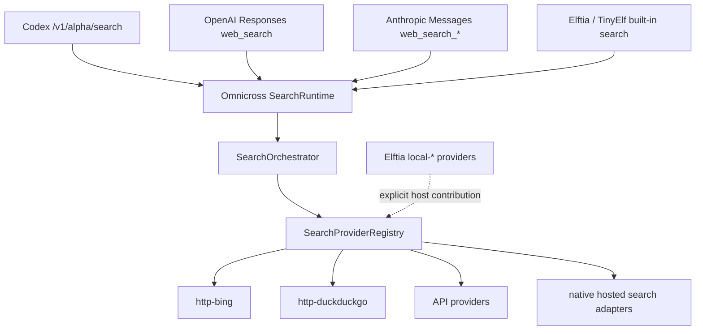

# Omnicross 搜索运行时抽取计划

> 状态：Draft / 已锁定核心边界，待进入变更提案与实现
>
> 日期：2026-09-01
>
> 受众：Omnicross contracts/core/daemon、Elftia desktop/agent-engine、协议适配与测试维护者
>
> 文档性质：架构与迁移计划；本文不包含任何应用代码实现

---

## 1. 摘要

当前搜索能力的所有权是倒置的：Omnicross 已经拥有公共搜索类型、内置工具执行端口和多种 LLM 协议适配能力，但真正的搜索编排、Provider 注册表、HTTP 搜索实现和传输仍主要位于 Elftia。结果是 Omnicross 对外暴露搜索协议时仍依赖宿主提供搜索后端，Elftia 也无法像使用 Omnicross 的 LLM Provider 一样使用统一的搜索运行时。

本计划把通用搜索运行时抽取到 Omnicross：公共契约、搜索编排、Provider 注册表、无密钥 HTTP 搜索、可靠的 API Provider、网页读取能力及协议前端均由 Omnicross 持有。Elftia 只保留产品配置、密钥/UI 集成以及依赖 Electron/浏览器环境的 `local-*` Provider，并通过显式 host contribution 接口注册给 Omnicross。

锁定的所有权边界如下：

- `local-google`、`local-bing`、`local-baidu`、`local-duckduckgo` 等 `local-*` Provider **必须留在 Elftia**。
- `local-*` 必须通过通用的 host contribution 接缝显式注册，不成为 Omnicross 的内置实现，也不允许 Omnicross core 依赖 Elftia 或 Electron。
- HTTP Bing、HTTP DuckDuckGo、Tavily、Jina、SearXNG、Zhipu/Z.AI 等通用 Provider、Provider 注册表和搜索编排迁移到 Omnicross。
- Codex、OpenAI Responses、Anthropic Messages 和 Elftia/TinyElf 的搜索入口共享同一个 Omnicross `SearchRuntime`，不各自维护搜索 fallback 和结果归一化逻辑。
- 迁移必须跨越两个独立发布阶段：第一阶段只在 Omnicross 增加并验证新实现，**不修改 Elftia**；第二阶段才在 Elftia 删除旧实现并接入已发布、已验证的 Omnicross 能力。



## 2. 目标与非目标

### 2.1 目标

- 让 Omnicross 成为通用搜索能力的唯一运行时所有者，而不是只定义一个由宿主实现的端口。
- 让不同外部协议共享 Provider 选择、fallback、超时、取消、结果归一化、错误和诊断语义。
- 将 HTTP Bing 与 HTTP DuckDuckGo 作为无需 API Key 的内置搜索 Provider，允许 Omnicross 独立提供基础搜索能力。
- 迁移可脱离 Elftia/Electron 运行的 API Provider 和 Jina Reader。
- 为 Elftia 保留显式、可测试、无反向依赖的 `local-*` 扩展点。
- 将用户密钥、Provider 启停和首选顺序作为运行时配置注入，而不是编译期耦合。
- 为搜索协议兼容性提供独立的 capability discovery、健康检查和 live doctor。
- 迁移后删除 Elftia 中已由 Omnicross 持有的重复实现，避免双份逻辑继续漂移。
- 让第一阶段的风险和回滚完全限制在 Omnicross 仓库与版本中，不让未成熟实现影响 Elftia。

### 2.2 非目标

- 本计划不把 Electron、BrowserWindow、用户浏览器状态或本地搜索抓取代码迁入 Omnicross。
- 不在第一阶段把 Grok 的提示词模拟搜索当作可信搜索 Provider；其 URL 可能由模型生成，必须先重做可信来源模型。
- 不在第一阶段启用目前有实现但刻意未注册的 Claude 搜索 Provider；应先明确它属于上游原生托管搜索还是普通 API Provider。
- 不保证无密钥 HTML 搜索永久稳定；反爬、页面结构和区域策略均可能变化。
- 不把所有 LLM 原生 hosted search 强行转换成 Omnicross 本地执行。原生上游搜索透传与 Omnicross 托管搜索是两个明确模式。
- 不在本文中实现路由、Provider、配置迁移或 UI 变更。

## 3. 当前架构与依赖倒置

### 3.1 Omnicross 已有能力

| 位置 | 当前职责 |
|---|---|
| `packages/contracts/src/websearch-types.ts` | Provider-neutral 搜索结果、配置、选项及 Jina Reader 类型 |
| `packages/core/src/ports/web-search-backend.ts` | core 调用宿主搜索服务的 `WebSearchBackend` 端口 |
| `packages/core/src/completion/BuiltinToolExecutor.ts` | 执行内置 `web_search` / `web_fetch`，同时持有一份 fallback 顺序 |
| `packages/core/src/completion/NativeSearchInjector.ts` | 为 OpenAI、Anthropic、Google、xAI、OpenRouter 构造上游原生搜索参数 |
| `packages/core/src/completion/builtin-web-fetch.ts` | 内置网页获取与内容处理逻辑 |

### 3.2 Elftia 当前持有的通用能力

| 位置 | 当前职责 | 目标归属 |
|---|---|---|
| `packages/shared/src/contracts/runtime/websearch-types.ts` | 重新导出 Omnicross 搜索契约 | 删除或仅保留临时兼容出口 |
| `packages/shared/src/contracts/runtime/web-search-orchestration.ts` | 搜索编排相关契约 | Omnicross contracts |
| `packages/desktop/app/main/services/capabilities/search/WebSearchService.ts` | 面向宿主的搜索服务 | 由 Omnicross runtime 替代，Elftia 留薄适配层 |
| `packages/desktop/app/main/services/capabilities/search/WebSearchOrchestrator.ts` | Provider 选择、fallback、调用编排 | Omnicross core |
| `packages/desktop/app/main/services/capabilities/search/registry/` | Provider 注册与发现 | Omnicross core |
| `packages/desktop/app/main/services/capabilities/search/providers/` | HTTP/API/local Provider 实现 | 通用实现迁移；`local-*` 保留 |
| `packages/agent-engine/src/engine/tinyelf/tools/webFetchSearch.ts` | TinyElf 搜索工具路径 | 改为消费 Omnicross runtime |
| `packages/agent-engine/src/engine/tinyelf/tools/webFetchHttp.ts` | HTTP 搜索/获取辅助实现 | 通用部分迁移或删除 |
| `packages/agent-engine/src/engine/tinyelf/tools/nodeWebFetchTransport.ts` | Node 搜索传输 | Omnicross transport |
| `packages/agent-engine/src/engine/tinyelf/tools/HttpOnlyWebSearchService.ts` | HTTP-only 搜索服务 | 由 Omnicross 内置 HTTP Provider 替代 |

Elftia 的 `websearch-types.ts` 已经只重新导出 Omnicross 契约，这表明类型抽取已经完成一半。真正的问题是行为所有权仍留在 Elftia，导致 Omnicross core 的 `WebSearchBackend` 实际上是对宿主能力的反向依赖。

### 3.3 当前风险

- fallback 顺序可能分别存在于 Elftia orchestrator、TinyElf 工具和 Omnicross `BuiltinToolExecutor`，行为容易漂移。
- daemon 无 Elftia 宿主时不能独立执行免费 HTTP 搜索。
- 协议路由存在但搜索运行时缺失时，会出现类似 `/v1/alpha/search` 被路由到未实现端点的 404。
- Provider 配置、执行和协议适配混在不同仓库，难以做统一能力发现和诊断。
- Elftia 既是宿主又是通用基础设施所有者，阻碍其他 Omnicross consumer 使用搜索。

## 4. 目标架构

目标架构分为四层：协议前端、运行时编排、Provider、宿主贡献。

```text
┌────────────────────────── Protocol frontends ──────────────────────────┐
│ Codex search route │ Responses hosted tool │ Anthropic Messages │ SDK │
└─────────────────────────────────┬───────────────────────────────────────┘
                                  │ normalized SearchRequest
                         ┌────────▼────────┐
                         │  SearchRuntime  │
                         │ capability/policy
                         └────────┬────────┘
                                  │
                    ┌─────────────▼─────────────┐
                    │    SearchOrchestrator     │
                    │ select/fallback/timeout   │
                    └─────────────┬─────────────┘
                                  │
                    ┌─────────────▼─────────────┐
                    │ SearchProviderRegistry    │
                    └─────┬────────┬────────┬───┘
                          │        │        │
                ┌─────────▼─┐ ┌────▼────┐ ┌─▼──────────────────┐
                │ HTTP free │ │ API/key │ │ native hosted mode │
                │ Bing/DDG  │ │ providers│ │ adapters/passthru │
                └───────────┘ └─────────┘ └────────────────────┘
                          ▲
                          │ explicit registration, never import
                ┌─────────┴──────────────────────────────┐
                │ Elftia host contributions: local-*    │
                └────────────────────────────────────────┘
```

核心约束是依赖只能向下：协议前端依赖 runtime，runtime 依赖稳定 Provider 契约；Elftia 可以向 runtime 注册贡献，但 Omnicross 不得 import Elftia 类型或实现。

## 5. 所有权矩阵

| 能力 | Omnicross contracts | Omnicross core | Omnicross daemon | Elftia |
|---|---:|---:|---:|---:|
| 公共请求/结果/错误/能力类型 | 主责 | 消费 | 消费 | 消费 |
| Provider 接口与 contribution 描述 | 主责 | 消费 | 消费 | 实现/消费 |
| Provider registry 与生命周期 | 约束 | 主责 | 组装 | 注册 host contribution |
| 搜索 orchestrator 与 fallback policy | 约束 | 主责 | 配置 | 提供用户策略 |
| HTTP Bing / HTTP DuckDuckGo | 类型 | 主责 | 启用 | 消费 |
| Tavily/Jina/SearXNG/Zhipu/Z.AI 等 | 类型 | 主责 | 注入配置/秘密 | UI 与秘密来源 |
| Jina Reader / 通用 URL reader | 类型 | 主责 | 暴露能力 | 消费 |
| Codex/Responses/Anthropic 协议入口 | wire 类型 | 转换/执行 | HTTP 路由与 SSE | 消费 |
| `local-*` Provider | 通用贡献契约 | 仅接受注册 | 不内置 | 唯一实现所有者 |
| Electron/browser session | 无 | 无 | 无 | 主责 |
| Provider 设置与账户 UI | 配置契约 | 无产品 UI | 可提供管理 API | 主责 |
| health/live doctor | 结果契约 | Provider 自检 | 聚合/输出 | 展示/触发 |

## 6. Omnicross 分层职责

### 6.1 `@omnicross/contracts`

应收敛并稳定以下纯契约，不依赖 Node、Electron、HTTP 库或具体上游 SDK：

- `SearchRequest`、`SearchOptions`、`SearchResult`、`SearchResponse`。
- `SearchProviderId`。内置 ID 与宿主扩展 ID 不应依赖不断扩大封闭 union；建议保留已知 ID 的自动补全，同时允许 namespaced/custom string。
- `SearchProviderCapabilities`：是否需要密钥、是否支持地区/语言/时间范围、最大结果数、网页读取及取消。
- `SearchProvider`：`search`、可选 `readUrl`、可选轻量 `healthCheck`。
- `SearchProviderContribution`：Provider 实例、稳定 ID、来源、优先级建议和能力声明。
- 稳定错误分类：配置缺失、认证失败、限流、超时、上游不可用、解析失败、被取消、策略拒绝。
- 诊断结果类型；不得在结果中包含 API Key、Cookie 或原始敏感请求头。

现有 `WebSearchBackend` 可在兼容期保留，但最终应由完整的 `SearchRuntime` API 取代。Provider 类型不能继续用 `id.startsWith('local-')` 推导安全属性或执行环境；类型、来源和能力必须显式声明。

### 6.2 `@omnicross/core`

core 负责：

- `SearchProviderRegistry` 的注册、冲突检测、查询与生命周期管理。
- `SearchOrchestrator` 的 Provider 选择、显式/自动模式、fallback、超时和取消传播。
- `SearchRuntime` 作为协议前端和产品宿主的唯一高层入口。
- HTTP Bing、HTTP DuckDuckGo 及可靠 API Provider 的实现。
- 统一搜索结果归一化、数量限制、URL 校验、错误映射与可观测事件。
- Jina Reader 与通用网页读取能力的清晰分工，避免 `web_fetch` 和 Provider reader 重复。
- 上游 native hosted search 的能力识别与协议构造，但保持其与 Omnicross 托管执行模式可区分。

fallback policy 只能在 orchestrator 中定义一次。`BuiltinToolExecutor` 不再维护自己的 Provider 顺序，只提交请求和可选策略覆盖。

### 6.3 Omnicross daemon

daemon 负责组装而非拥有业务算法：

- 从配置/秘密来源实例化内置 Provider。
- 接受已授权宿主贡献并注册到 runtime。
- 暴露协议路由、鉴权、请求限制、SSE/非流式响应和稳定错误。
- 提供 capability discovery、Provider 列表、健康检查与 live doctor 入口。
- 对可自定义 `apiHost` 的 Provider 执行管理员级策略校验。
- 记录 Provider ID、耗时、fallback 次数和错误分类；不记录密钥、Cookie 或默认完整查询正文。

## 7. `local-*` 显式 host contribution

### 7.1 锁定原则

`local-*` 是 Elftia 的宿主能力，而不是 Omnicross Provider。它们可能依赖 Electron、BrowserWindow、用户登录态、地区设置或浏览器级反爬处理，这些依赖不应进入通用 runtime。

Elftia 在启动/会话初始化阶段构造 Provider，然后显式贡献给 Omnicross：

```ts
// 仅用于说明契约形状，不是本计划中的实现代码。
interface SearchProviderContribution {
  id: string;
  source: 'host';
  provider: SearchProvider;
  capabilities: SearchProviderCapabilities;
}

searchRuntime.registerContribution(contribution, hostRegistrationContext);
```

### 7.2 注册规则

- 注册是显式的；发现 `local-*` 命名不得自动加载模块。
- contribution ID 必须唯一。默认禁止覆盖 Omnicross 内置 Provider；只有管理员策略显式允许时才可替换。
- Elftia 负责 Provider 的创建与释放；runtime 负责调用期间的超时、取消和结果归一化。
- contribution 必须申报来源与能力，不能通过 ID 前缀推断。
- 宿主 Provider 的失败进入统一错误分类，但内部 Electron/browser 错误不原样泄漏到公共 API。
- 未连接 Elftia 时，Omnicross 必须仍能使用 HTTP/API Provider 正常工作。
- daemon 若跨进程运行，贡献接口需要一个受鉴权的 RPC/bridge adapter；不得把不可序列化的 Electron 对象穿过 wire。

### 7.3 进程模型

应支持两种组合，但对 core 暴露同一 registry 语义：

1. **同进程嵌入**：Elftia 直接注册实现 `SearchProvider` 的对象。
2. **跨进程 daemon**：Elftia 注册一个代理描述，daemon 通过受控 IPC/RPC 调用宿主；断连时自动注销或标记 unhealthy。

第一轮迁移可先使用 Elftia 当前部署形态所需的一种，但契约不得堵死另一种。

## 8. 共享协议前端与 tool call 语义

### 8.1 统一执行模型

所有协议先归一化为 runtime 请求，再将结果适配回协议：

```text
wire request
  -> protocol-specific validation
  -> SearchRuntime request
  -> provider execution / fallback
  -> normalized result + provenance
  -> protocol-specific response/events
```

这与图片生成的结构类似：多个外部协议面可以共用同一个内部 orchestrator/provider，但不能仅靠“注入一个 tool 声明”完成服务端搜索。工具声明负责让模型发起调用；Omnicross 还必须接收 tool call、执行 `SearchRuntime`、回填 tool result，并继续模型回合或输出对应托管工具事件。

### 8.2 Codex 搜索入口

- 为 Codex 当前期望的搜索协议提供明确路由（当前观察到的入口为 `/v1/alpha/search`），避免 web 代理误路由到未实现处理器。
- 在实现前以实际 Codex 请求/响应录制确定 wire schema；`alpha` 路由不能被当作长期稳定公共契约。
- 路由只做验证、鉴权和协议转换，搜索策略交由共享 runtime。

### 8.3 OpenAI Responses

- 区分“上游原生 hosted `web_search` 透传”和“Omnicross 托管工具循环”。
- 上游原生支持且策略允许时，可由 `NativeSearchInjector` 构造工具参数并保真转发。
- 需要使用 Omnicross Provider 时，由 Omnicross 托管执行 tool call，并产生兼容的调用、结果及流式事件。
- 不得把普通 function tool 的客户端执行语义伪装成已由上游完成的 hosted search。

### 8.4 Anthropic Messages

- Anthropic `/v1/messages` 可以携带 tool 定义，也存在特定版本的 server tool / web search 语义；具体 `type` 与事件字段必须由协议 adapter 版本化管理。
- 上游原生 Claude 搜索可选择透传；Omnicross 自定义 Provider 则需要由网关闭合 tool-use/tool-result 循环。
- “可以注入 tool”不等于“Anthropic 会调用 Omnicross 自定义 HTTP 搜索接口”。执行责任必须在模式和 capability 中显式表达。
- OpenAI Responses 与 Anthropic Messages 最终都调用同一个 `SearchRuntime`，仅 wire 事件不同。

### 8.5 Elftia/TinyElf

- TinyElf 内置 `web_search` / `web_fetch` 改为 runtime consumer。
- Elftia 可以指定首选 Provider、允许的 fallback 集合及是否允许查询发送到外部 Provider。
- Elftia 不再复制 HTTP Provider、registry 或 fallback 算法。

## 9. Provider 分类与迁移判断

| Provider/能力 | 决策 | 说明 |
|---|---|---|
| HTTP Bing | 迁入 Omnicross | 免费垂直切片；需要独立 parser fixture 与反爬诊断 |
| HTTP DuckDuckGo | 迁入 Omnicross | 免费垂直切片；与 Bing 使用相同 transport 契约 |
| Tavily | 迁入 Omnicross | 标准 API Provider |
| Jina Search / Reader | 迁入 Omnicross | 搜索与阅读能力需明确拆分 |
| SearXNG | 迁入 Omnicross | 自定义 host 与 Basic Auth 需安全策略 |
| Zhipu / Z.AI | 迁入 Omnicross | 合并共享逻辑，保留服务差异 |
| Exa / Bocha 等稳定 API Provider | 经契约核对后迁入 | 逐个补齐 fixture、错误映射和 live doctor |
| Grok prompt-search | 暂不注册 | 可能生成不可验证 URL，需重构为可信来源模式 |
| Claude 搜索实现 | 暂不注册 | 先归类为 native hosted adapter 或普通 Provider |
| `local-*` | 留在 Elftia | 作为显式 host contribution 注册 |

## 10. 分阶段迁移计划

迁移分成两个具有独立发布、验收和回滚边界的大阶段：

```text
第一阶段：Omnicross-only extraction
Elftia 保持原样 ──冻结行为基线──▶ Omnicross 新实现──测试/doctor/发布
                                              │
                                              ▼ 验收门
第二阶段：Elftia cutover
Elftia 旧实现 ──可回退切换──▶ Omnicross SearchRuntime ──稳定后删除旧代码
```

第一阶段不是直接从 Elftia 做破坏性“移动”，而是以已确认的 Elftia 行为为基线，在 Omnicross 中复制后重构或重新实现。第一阶段期间不得修改 Elftia 的源码、配置、依赖或运行路径。只有 Omnicross 独立验收并发布可锁定版本后，才进入第二阶段。

这个顺序提供项目级故障隔离：第一阶段出现问题时，只需回滚 Omnicross 自身变更或版本，不会改变 Elftia 当前可用行为。代价是两个仓库会短期持有重复实现，因此必须记录 Elftia 基线 commit、建立行为对照矩阵，并避免在第一阶段无记录地继续演化旧实现。

### 第一阶段：只构建和验证 Omnicross

### 阶段 0：冻结基线与契约清单

- 记录 Elftia 当前 Provider 列表、启停规则、默认顺序、错误和配置字段。
- 记录用于抽取的 Elftia commit/hash 和文件清单；Elftia 只作为只读参考，不产生任何提交或工作区修改。
- 为现有 HTTP Bing/DDG 响应建立脱敏 fixture，不依赖 live 页面作为唯一回归证据。
- 捕获 Codex、Responses、Anthropic 当前搜索 wire 行为；不依据接口名称猜 schema。
- 标记重复 fallback 逻辑和所有 `WebSearchService` consumer。

退出条件：当前行为可被测试描述，所有秘密与用户查询均未写入 fixture。

### 阶段 1：收敛 contracts

- 参考 Elftia orchestration 契约，在 `@omnicross/contracts` 中建立目标契约；第一阶段不修改 Elftia 的 import 或重导出。
- 引入开放扩展的 Provider ID、capabilities、稳定错误和 contribution 契约。
- 为 Omnicross 内部旧 `WebSearchProviderId` / `WebSearchBackend` 提供有限兼容层。
- 删除通过 `local-*` 前缀推断 Provider 类型的核心决策。

退出条件：Omnicross 可编译并完整测试新契约；Elftia 工作树和产物与阶段开始前一致。

### 阶段 2：抽取免费 HTTP 垂直切片

- 将通用 transport、HTTP Bing、HTTP DuckDuckGo 和解析器迁入 Omnicross。
- 明确默认 User-Agent、重定向、压缩、响应体上限、超时、代理和取消语义。
- 优先使用已有依赖；如环境兼容性需要，可将 `impit` 作为可选 transport，并以 `undici` 为明确 fallback，而不是隐式改变行为。
- daemon 暴露 capability 与 doctor，但协议前端先不全面切流。

退出条件：无 Elftia/Electron 的 Omnicross 测试进程可完成 fixture 测试，并能在允许网络时通过至少一个 live provider doctor。

### 阶段 3：迁移 orchestrator 与 registry

- 抽取 `SearchProviderRegistry`、`SearchOrchestrator` 和统一 fallback policy。
- 让 Omnicross `BuiltinToolExecutor` 改接 `SearchRuntime`；Elftia `HttpOnlyWebSearchService` 及其调用方保持不变。
- 增加显式策略：首选 Provider、允许集合、fallback 是否启用、最大尝试数和查询外发策略。
- 在 Omnicross 内保留兼容 adapter，使其现有 consumer 可逐步迁移。

退出条件：fallback 顺序只有一个实现；同一请求不会被 consumer 和 runtime 双重 fallback。

### 阶段 4：迁移可靠 API Provider

- 按 Tavily、Jina、SearXNG、Zhipu/Z.AI，再到其他稳定 Provider 的顺序在 Omnicross 中建立等价实现。
- 每个 Provider 同时迁移配置 schema、错误映射、fixture、doctor 和秘密脱敏规则。
- Grok 与 Claude 暂不注册，直到分别解决可信来源和模式归类问题。

退出条件：Omnicross 的 Provider 通过离线 fixture、契约、失败注入和可选 live doctor；Elftia 仍使用自己的旧实现。

### 阶段 5：接入 Omnicross 协议前端并发布

- 实现并验证 Codex 搜索路由。
- 将 Responses hosted/native 与 Omnicross-managed 两种执行模式接入 runtime。
- 将 Anthropic Messages native passthrough 与 managed tool loop 接入 runtime。
- 补齐非流式、流式、中断、超时、上游错误和无可用 Provider 测试。
- 形成 Elftia 旧实现与 Omnicross 新实现的行为对照报告，覆盖请求、结果、错误、fallback 与取消。
- 发布一个可被 Elftia 精确锁定的 Omnicross 版本；在此之前不得开始 Elftia cutover。

退出条件：Omnicross 自身协议前端产生一致的搜索结果语义、Provider provenance 和稳定错误；所有离线门禁通过，允许网络的环境中 live doctor 通过；Elftia 仓库保持零修改。

### 第一阶段总验收门

只有同时满足以下条件才能进入第二阶段：

- Elftia 自阶段 0 起没有因本计划产生代码、配置或依赖变更。
- Omnicross 在独立进程中无需 Elftia/Electron 即可执行免费 HTTP 搜索和已纳入的 API Provider。
- Omnicross 的 contracts、registry、orchestrator、Provider、协议前端和 doctor 均有自动化证据。
- 对照测试没有未解释的语义差异；允许的差异已写入迁移说明。
- Omnicross 已形成可精确锁定和独立回滚的发布版本。
- 已定义第二阶段 Elftia 的 feature flag/adapter 回退路径，但尚未启用或提交到 Elftia。

### 第二阶段：Elftia 接入与旧实现移除

### 阶段 6：Elftia 先接入、暂不删除旧实现

- 在独立 Elftia change 中升级并精确锁定已验收的 Omnicross 版本。
- 增加薄 runtime adapter，让 Elftia/TinyElf 内置 `web_search` / `web_fetch` 可通过 feature flag 改用 Omnicross。
- 默认先保持旧路径可回退；在测试环境和受控发布中切到 Omnicross。
- 比较结果结构、错误、取消、设置映射和 UI 行为；真实敏感查询不得双发。
- 此阶段只做接入，不删除旧 Provider/orchestrator，以保证可以通过 Elftia 自身配置快速回切。

退出条件：Elftia 的单元、集成和端到端测试通过，受控运行稳定，回退开关已实际演练。

### 阶段 7：注册 `local-*` contribution

- 将 Elftia `LocalSearchProvider` 系列适配为贡献契约。
- 根据实际部署形态实现同进程注册或受控 IPC/RPC bridge。
- 覆盖注册、冲突、断连、取消、注销和宿主退出测试。
- 确认无 Elftia 时 Omnicross 不广告这些 Provider。
- 在 contribution 稳定前保留原 `local-*` 调用路径作为回退。

退出条件：`local-*` 仍由 Elftia 独占实现，但所有目标 consumer 可通过同一个 runtime 使用它们，并已验证回退路径。

### 阶段 8：稳定后清理 Elftia 通用实现

- 删除已经由 Omnicross 接管的 registry、orchestrator、HTTP/API Provider 和 transport。
- 删除重复类型定义/重导出；若公共 import 路径仍被外部消费，则先标记 deprecated 再移除。
- 保留设置/UI、秘密来源、薄 runtime adapter 和 `local-*` 实现。
- 删除旧路径前需经过约定的稳定观察期；删除动作单独提交，便于审阅和回滚。

退出条件：Elftia 中不存在通用搜索 Provider 的第二份实现。

## 11. 安全与隐私

### 11.1 搜索结果是不可信输入

- 标题、摘要、URL 和抓取正文均视为不可信数据，不能成为系统指令。
- 结果进入模型上下文时应带明确来源边界，防止网页 prompt injection 冒充工具或系统消息。
- 对 HTML、Markdown、控制字符、超长字段和异常编码设置规范化及上限。
- provenance 至少包含 Provider 与最终 URL；不能伪造引用，也不能把模型生成 URL 标为已检索来源。

### 11.2 SSRF 与自定义 `apiHost`

- `apiHost` 是管理员级配置，不应由普通请求任意覆盖。
- 默认拒绝 loopback、link-local、私网、云元数据地址和非 HTTP(S) scheme；必要的内网 SearXNG 必须通过显式 allowlist 开启。
- 重定向后的每一跳均需重新校验目标，DNS 解析结果也必须应用策略。
- Basic Auth、API Key、代理凭据不得进入日志、错误响应或诊断详情。

### 11.3 fallback 导致的查询泄漏

- fallback 可能把同一查询依次发送给多个外部服务，属于额外数据披露，不能被当作纯可靠性细节。
- 策略必须允许禁用跨 Provider fallback、限制允许集合及最大尝试数。
- 敏感模式下默认单 Provider；UI/API 应说明 fallback 的数据影响。
- 日志默认记录查询哈希或 request ID，不记录完整查询；调试正文需要显式、短期和脱敏开关。

### 11.4 反爬与解析漂移

- HTTP Bing/DDG 的 HTML 与防护可能随时变化；空结果必须区别于 parser failure。
- 使用版本化 fixture、结构健康指标和 live doctor 组合判断，不自动用另一家 Provider 掩盖持续解析故障。
- transport 差异必须可观察。若使用可选 `impit` 与 `undici` fallback，应报告实际 transport 和失败阶段。
- 不加入规避验证码、绕过访问控制或冒用用户凭据的隐式行为。

## 12. 测试与 live doctor

### 12.1 单元与 fixture 测试

- 每个 Provider：请求构造、成功解析、空结果、错误状态、限流、超时、取消、畸形响应。
- HTTP Provider：保存脱敏 HTML fixture，覆盖正常布局、缺字段、结构漂移和编码。
- orchestrator：显式 Provider、自动选择、禁用、fallback、最大尝试、取消传播、查询隐私策略。
- registry：重复 ID、内置覆盖、贡献注册/注销、宿主断连和 capability 查询。
- URL reader：重定向、体积限制、内容类型、SSRF 和不安全 scheme。

### 12.2 协议契约测试

- Codex 搜索路由的请求/响应 golden fixtures。
- Responses 非流式与 SSE tool-call/result 事件序列。
- Anthropic Messages tool-use/tool-result 与 server-tool 透传事件序列。
- Elftia/TinyElf 的兼容行为和错误显示。
- native passthrough 与 Omnicross-managed 模式不得在 wire 上混淆。

### 12.3 live doctor

live doctor 是可选联网诊断，不替代确定性测试：

- 逐 Provider 检查配置完整性、DNS/TLS、认证、响应结构和最小可验证结果。
- 输出 `healthy`、`degraded`、`unconfigured`、`blocked`、`failed` 及结构化原因。
- 使用固定、低敏感度查询；不打印完整响应或秘密。
- 免费 HTML Provider 应单独报告反爬、验证码、区域阻断和 parser drift。
- CI 默认运行 fixture；live doctor 只在显式环境和速率限制下运行。

## 13. 文件迁移与删除地图

以下是实现阶段的预期地图，具体目标文件名可在 change design 中细化。“迁入”必须解释为第一阶段在 Omnicross 建立实现、第二阶段验证接入后再从 Elftia 删除，不能在第一阶段直接移动或修改 Elftia 文件。

| Elftia 来源 | Omnicross 目标/处理 |
|---|---|
| `packages/shared/src/contracts/runtime/websearch-types.ts` | 契约已在 Omnicross；迁移期兼容重导出，最终删除 |
| `packages/shared/src/contracts/runtime/web-search-orchestration.ts` | 移到 `packages/contracts/src/` 对应搜索契约模块 |
| `.../search/WebSearchOrchestrator.ts` | 移到 `packages/core/src/search/` |
| `.../search/registry/` | 移到 `packages/core/src/search/registry/` |
| `.../search/providers/` 中 HTTP Bing/DDG | 移到 `packages/core/src/search/providers/` |
| `.../search/providers/` 中可靠 API Provider | 分批移到 Omnicross Provider 目录 |
| `.../search/providers/LocalSearchProvider.ts` 及 `local-*` | **保留在 Elftia**，增加 host contribution adapter |
| `.../tinyelf/tools/nodeWebFetchTransport.ts` | 通用 transport 移入 Omnicross；Elftia 删除重复实现 |
| `.../tinyelf/tools/HttpOnlyWebSearchService.ts` | consumer 迁到 runtime 后删除 |
| `.../tinyelf/tools/webFetchSearch.ts` | 保留工具表面或薄 adapter，执行改走 runtime |
| `.../tinyelf/tools/webFetchHttp.ts` | 与 Omnicross reader/transport 合并后删除重复部分 |
| Omnicross `web-search-backend.ts` | 兼容期保留，最终由 `SearchRuntime` port/API 收敛 |
| Omnicross `BuiltinToolExecutor.ts` fallback | 删除本地顺序，委托 orchestrator |

迁移文件时必须保留 git 历史可读性，优先“移动后小改”；不得顺手覆盖 Elftia `LocalSearchProvider.ts` 中现有用户修改。

## 14. 验收标准

满足以下条件后，抽取才算完成：

- Omnicross 在不启动 Elftia/Electron 的情况下，能通过 HTTP Bing 或 HTTP DuckDuckGo 执行搜索。
- 所有公共搜索类型和 orchestration 契约由 `@omnicross/contracts` 提供。
- Provider registry、fallback 和错误归一化在 Omnicross 只有一份实现。
- Tavily、Jina、SearXNG、Zhipu/Z.AI 等已选可靠 Provider 的执行代码不再存在于 Elftia。
- `local-*` 的实现仍只存在于 Elftia，并通过显式 contribution 使用；Omnicross 无 Elftia import。
- Codex、Responses、Anthropic Messages 和 Elftia/TinyElf 均可使用共享 runtime。
- native hosted passthrough 与 Omnicross-managed tool loop 可发现、可配置、可测试。
- SSRF、重定向、响应体限制、秘密脱敏和 fallback 查询披露策略均有自动化测试。
- fixture 测试稳定，live doctor 能区分未配置、网络故障、认证失败、反爬和 parser drift。
- 迁移期间无搜索功能静默降级，旧路径有明确弃用或删除时间点。
- Omnicross-only 第一阶段完成时，Elftia 没有任何由本计划导致的修改，并可继续独立运行原搜索实现。
- Elftia 第二阶段先完成可回退接入和稳定观察，再以独立提交删除旧实现。

## 15. 回滚策略

- 第一阶段只改变 Omnicross：失败时回滚 Omnicross commit/发布版本即可，Elftia 无需任何操作。
- 第二阶段才改变 Elftia，并使用兼容 adapter 和 feature flag 独立切流，避免接入时立即删除旧路径。
- 先对比双路径的结果结构与错误分类，再将 Omnicross runtime 设为默认；双跑仅用于非敏感测试查询，不能把真实查询重复发送给外部 Provider。
- Provider 级回滚只切换执行所有者，不回退公共契约。
- 协议前端可分别关闭 managed search 并保留明确的 `unsupported_capability`，不得把未实现路由继续暴露为 404。
- Elftia 通用实现只在 Omnicross 发布通过验收、Elftia 完成接入验证并经过约定稳定观察期后删除。
- `local-*` contribution 出现问题时，可仅禁用贡献注册并回退 Elftia 原调用路径，不影响 Omnicross 内置/API Provider。

## 16. 实施前仍需验证的事项

- Codex `/v1/alpha/search` 的实际 wire schema、鉴权、流式行为及版本稳定性。
- 当前 OpenAI Responses 和 Anthropic Messages adapter 中，哪些事件可原样透传，哪些需要 managed loop 合成。
- Elftia 与 daemon 的实际进程边界，以决定 `local-*` 首版使用对象注册还是 IPC/RPC proxy。
- HTTP Bing/DDG 的许可、请求频率、区域行为及 parser fixture 覆盖范围。
- `web_fetch`、Jina Reader 和通用 URL reader 最终是一套能力的不同策略，还是两个有明确边界的接口。
- Provider ID 的兼容方案，尤其是新增 `http-bing` / `http-duckduckgo` 后与现有 `local-bing` / `local-duckduckgo` 的配置迁移。

这些事项不会改变已经锁定的所有权原则：通用搜索运行时属于 Omnicross，`local-*` 属于 Elftia，并通过显式 host contribution 接入。

---

本文只保存已讨论的架构决策和迁移计划，不包含应用实现。后续应先基于本文建立独立 change proposal/design/spec/tasks，再按阶段实施和验收。
